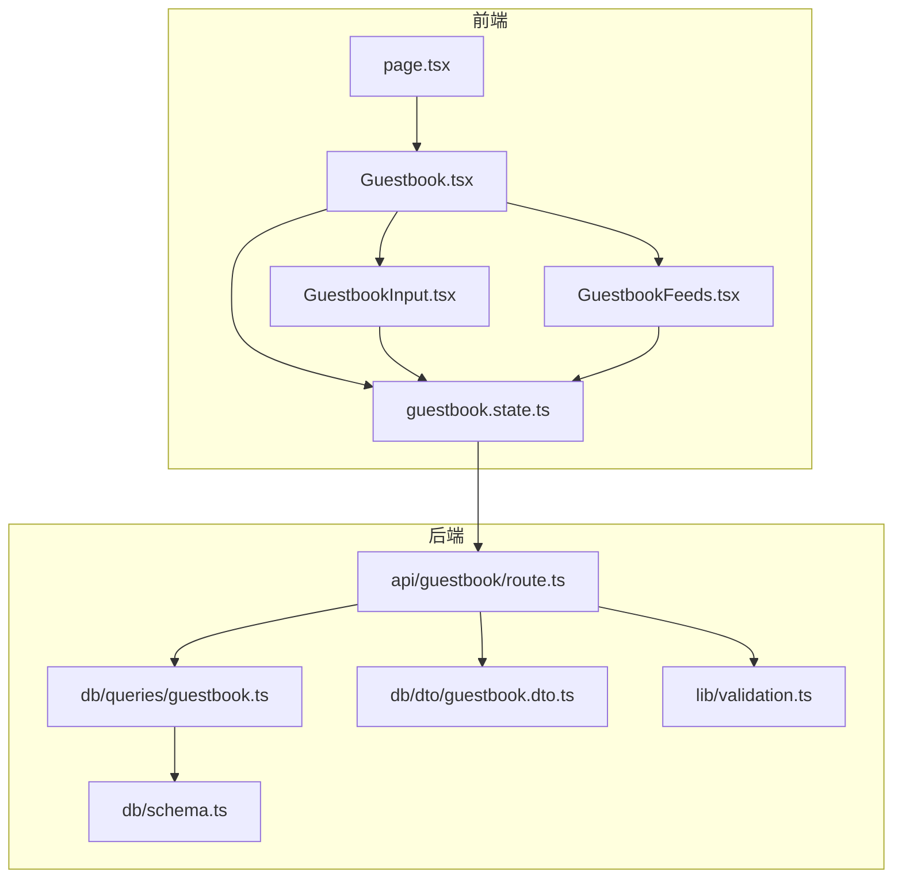
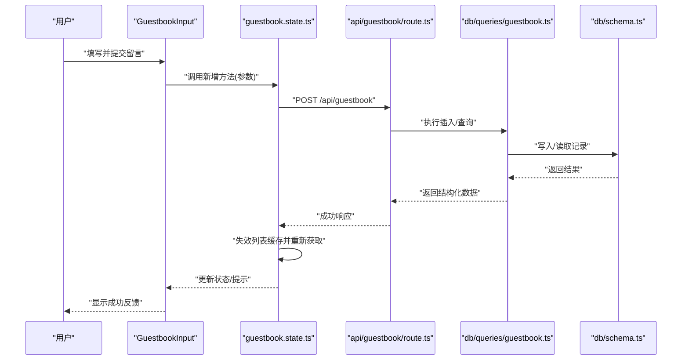
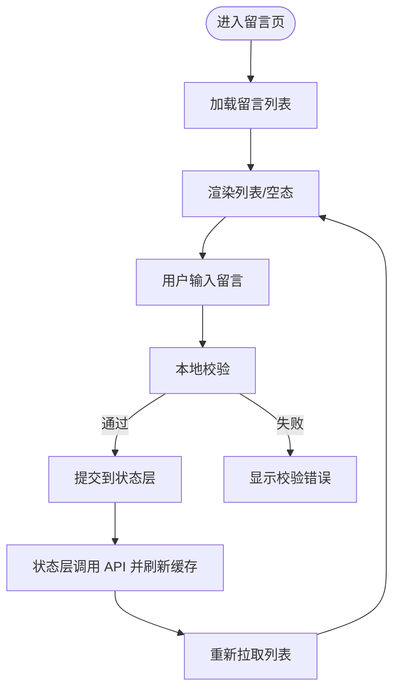
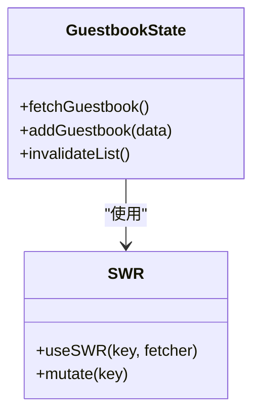
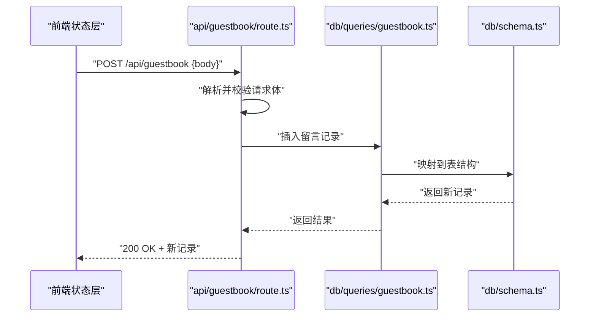
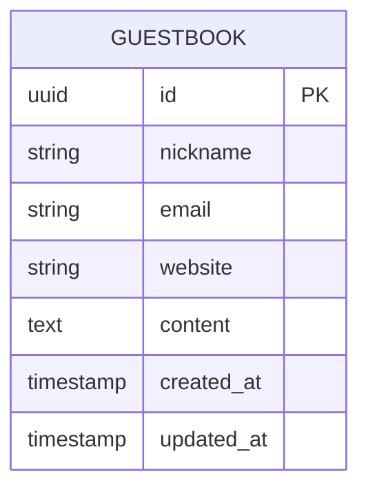
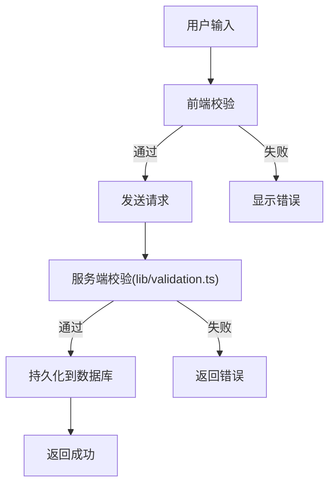
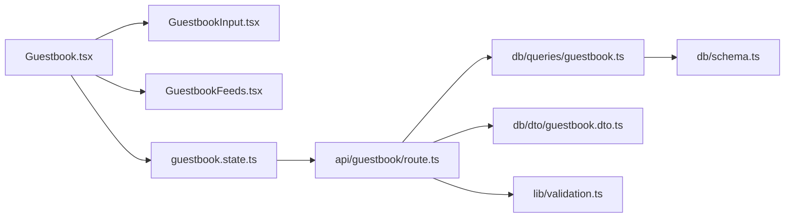

# 访客留言簿功能

<cite>
**本文引用的文件**   
- [app/(main)/guestbook/page.tsx](file://app/(main)/guestbook/page.tsx)
- [app/(main)/guestbook/Guestbook.tsx](file://app/(main)/guestbook/Guestbook.tsx)
- [app/(main)/guestbook/GuestbookInput.tsx](file://app/(main)/guestbook/GuestbookInput.tsx)
- [app/(main)/guestbook/GuestbookFeeds.tsx](file://app/(main)/guestbook/GuestbookFeeds.tsx)
- [app/(main)/guestbook/guestbook.state.ts](file://app/(main)/guestbook/guestbook.state.ts)
- [app/api/guestbook/route.ts](file://app/api/guestbook/route.ts)
- [db/schema.ts](file://db/schema.ts)
- [db/queries/guestbook.ts](file://db/queries/guestbook.ts)
- [db/dto/guestbook.dto.ts](file://db/dto/guestbook.dto.ts)
- [lib/validation.ts](file://lib/validation.ts)
</cite>

## 目录
1. [简介](#简介)
2. [项目结构](#项目结构)
3. [核心组件](#核心组件)
4. [架构总览](#架构总览)
5. [详细组件分析](#详细组件分析)
6. [依赖关系分析](#依赖关系分析)
7. [性能考虑](#性能考虑)
8. [故障排查指南](#故障排查指南)
9. [结论](#结论)
10. [附录](#附录)

## 简介
本技术文档围绕 cali.so 的“访客留言簿”功能，系统性梳理前端组件、状态管理、API 接口与数据库操作，解释用户输入验证、数据持久化、错误处理与用户体验优化策略。文档同时提供代码级流程图与时序图，帮助读者快速理解从用户交互到数据落库的完整链路，并给出扩展与优化的最佳实践建议。

## 项目结构
留言簿功能采用 Next.js App Router 组织：
- 页面路由：app/(main)/guestbook/page.tsx
- 前端组件：Guestbook.tsx、GuestbookInput.tsx、GuestbookFeeds.tsx
- 状态管理：guestbook.state.ts（基于 SWR 的状态与缓存）
- API 路由：app/api/guestbook/route.ts
- 数据库层：db/schema.ts、db/queries/guestbook.ts、db/dto/guestbook.dto.ts
- 校验工具：lib/validation.ts

图表来源
- [app/(main)/guestbook/page.tsx](file://app/(main)/guestbook/page.tsx)
- [app/(main)/guestbook/Guestbook.tsx](file://app/(main)/guestbook/Guestbook.tsx)
- [app/(main)/guestbook/GuestbookInput.tsx](file://app/(main)/guestbook/GuestbookInput.tsx)
- [app/(main)/guestbook/GuestbookFeeds.tsx](file://app/(main)/guestbook/GuestbookFeeds.tsx)
- [app/(main)/guestbook/guestbook.state.ts](file://app/(main)/guestbook/guestbook.state.ts)
- [app/api/guestbook/route.ts](file://app/api/guestbook/route.ts)
- [db/queries/guestbook.ts](file://db/queries/guestbook.ts)
- [db/schema.ts](file://db/schema.ts)
- [db/dto/guestbook.dto.ts](file://db/dto/guestbook.dto.ts)
- [lib/validation.ts](file://lib/validation.ts)

章节来源
- [app/(main)/guestbook/page.tsx](file://app/(main)/guestbook/page.tsx)
- [app/(main)/guestbook/Guestbook.tsx](file://app/(main)/guestbook/Guestbook.tsx)
- [app/(main)/guestbook/GuestbookInput.tsx](file://app/(main)/guestbook/GuestbookInput.tsx)
- [app/(main)/guestbook/GuestbookFeeds.tsx](file://app/(main)/guestbook/GuestbookFeeds.tsx)
- [app/(main)/guestbook/guestbook.state.ts](file://app/(main)/guestbook/guestbook.state.ts)
- [app/api/guestbook/route.ts](file://app/api/guestbook/route.ts)
- [db/schema.ts](file://db/schema.ts)
- [db/queries/guestbook.ts](file://db/queries/guestbook.ts)
- [db/dto/guestbook.dto.ts](file://db/dto/guestbook.dto.ts)
- [lib/validation.ts](file://lib/validation.ts)

## 核心组件
- Guestbook：页面容器，组合输入与列表，驱动整体交互流程。
- GuestbookInput：负责用户输入表单、本地校验与提交触发。
- GuestbookFeeds：负责渲染留言列表、分页加载与空态展示。
- guestbook.state.ts：封装留言数据的获取、新增与缓存刷新逻辑，统一调用 API。

章节来源
- [app/(main)/guestbook/Guestbook.tsx](file://app/(main)/guestbook/Guestbook.tsx)
- [app/(main)/guestbook/GuestbookInput.tsx](file://app/(main)/guestbook/GuestbookInput.tsx)
- [app/(main)/guestbook/GuestbookFeeds.tsx](file://app/(main)/guestbook/GuestbookFeeds.tsx)
- [app/(main)/guestbook/guestbook.state.ts](file://app/(main)/guestbook/guestbook.state.ts)

## 架构总览
整体数据流遵循“前端组件 -> 状态层 -> API 路由 -> 查询层 -> 数据库模型”的分层设计。状态层使用 SWR 进行数据获取与缓存，提交成功后通过 invalidate 触发列表刷新，保证 UI 一致性。

图表来源
- [app/(main)/guestbook/GuestbookInput.tsx](file://app/(main)/guestbook/GuestbookInput.tsx)
- [app/(main)/guestbook/guestbook.state.ts](file://app/(main)/guestbook/guestbook.state.ts)
- [app/api/guestbook/route.ts](file://app/api/guestbook/route.ts)
- [db/queries/guestbook.ts](file://db/queries/guestbook.ts)
- [db/schema.ts](file://db/schema.ts)

## 详细组件分析

### 前端组件与交互
- GuestbookInput
  - 职责：收集用户输入、本地校验、禁用重复提交、触发提交动作。
  - 交互要点：提交前进行非空与长度等基础校验；提交中禁用按钮并显示加载态；提交后清空或保留部分字段以支持连续留言。
- GuestbookFeeds
  - 职责：拉取并渲染留言列表，处理空态与加载中状态。
  - 交互要点：根据状态层提供的数据渲染卡片；必要时支持分页或滚动加载。
- Guestbook
  - 职责：编排输入与列表，传递状态与方法，统一错误提示与布局。

图表来源
- [app/(main)/guestbook/Guestbook.tsx](file://app/(main)/guestbook/Guestbook.tsx)
- [app/(main)/guestbook/GuestbookInput.tsx](file://app/(main)/guestbook/GuestbookInput.tsx)
- [app/(main)/guestbook/GuestbookFeeds.tsx](file://app/(main)/guestbook/GuestbookFeeds.tsx)
- [app/(main)/guestbook/guestbook.state.ts](file://app/(main)/guestbook/guestbook.state.ts)

章节来源
- [app/(main)/guestbook/Guestbook.tsx](file://app/(main)/guestbook/Guestbook.tsx)
- [app/(main)/guestbook/GuestbookInput.tsx](file://app/(main)/guestbook/GuestbookInput.tsx)
- [app/(main)/guestbook/GuestbookFeeds.tsx](file://app/(main)/guestbook/GuestbookFeeds.tsx)

### 状态管理（SWR）
- 数据获取：通过 SWR key 获取留言列表，默认按时间倒序。
- 新增留言：提交成功后，使列表 key 失效并重新请求，确保 UI 即时更新。
- 错误处理：捕获网络与业务错误，向用户展示友好提示。
- 缓存策略：合理设置 SWR 配置，避免频繁请求，提升体验。

图表来源
- [app/(main)/guestbook/guestbook.state.ts](file://app/(main)/guestbook/guestbook.state.ts)

章节来源
- [app/(main)/guestbook/guestbook.state.ts](file://app/(main)/guestbook/guestbook.state.ts)

### API 接口设计
- 端点：POST /api/guestbook
- 请求体：包含留言内容、可选昵称/邮箱/链接等字段（具体以 DTO 定义为准）。
- 响应：成功返回新增记录；失败返回错误信息。
- 鉴权与限流：可按需接入鉴权与速率限制（当前实现以业务需求为准）。

图表来源
- [app/api/guestbook/route.ts](file://app/api/guestbook/route.ts)
- [db/queries/guestbook.ts](file://db/queries/guestbook.ts)
- [db/schema.ts](file://db/schema.ts)

章节来源
- [app/api/guestbook/route.ts](file://app/api/guestbook/route.ts)

### 数据库模型与查询
- 模型：在 db/schema.ts 中定义留言表结构（字段、类型、约束）。
- 查询：在 db/queries/guestbook.ts 中封装增删改查，对外暴露函数供 API 调用。
- DTO：在 db/dto/guestbook.dto.ts 中定义入参/出参结构，用于前后端契约与类型安全。

图表来源
- [db/schema.ts](file://db/schema.ts)

章节来源
- [db/schema.ts](file://db/schema.ts)
- [db/queries/guestbook.ts](file://db/queries/guestbook.ts)
- [db/dto/guestbook.dto.ts](file://db/dto/guestbook.dto.ts)

### 用户输入验证与错误处理
- 前端校验：在 GuestbookInput 中进行必填、长度、格式等校验，减少无效请求。
- 服务端校验：在 API 路由中使用 lib/validation.ts 对请求体进行二次校验，保障数据安全。
- 错误处理：统一捕获异常，返回标准化错误响应；前端展示可理解的错误消息。

图表来源
- [app/(main)/guestbook/GuestbookInput.tsx](file://app/(main)/guestbook/GuestbookInput.tsx)
- [app/api/guestbook/route.ts](file://app/api/guestbook/route.ts)
- [lib/validation.ts](file://lib/validation.ts)

章节来源
- [app/(main)/guestbook/GuestbookInput.tsx](file://app/(main)/guestbook/GuestbookInput.tsx)
- [app/api/guestbook/route.ts](file://app/api/guestbook/route.ts)
- [lib/validation.ts](file://lib/validation.ts)

## 依赖关系分析
- 组件耦合：Guestbook 聚合 GuestbookInput 与 GuestbookFeeds，并通过状态层解耦数据访问。
- 状态与 API：状态层集中管理 SWR 生命周期，避免在各组件内重复请求逻辑。
- API 与数据库：API 仅做协议转换与校验，数据库操作下沉至查询层，保持职责清晰。

图表来源
- [app/(main)/guestbook/Guestbook.tsx](file://app/(main)/guestbook/Guestbook.tsx)
- [app/(main)/guestbook/GuestbookInput.tsx](file://app/(main)/guestbook/GuestbookInput.tsx)
- [app/(main)/guestbook/GuestbookFeeds.tsx](file://app/(main)/guestbook/GuestbookFeeds.tsx)
- [app/(main)/guestbook/guestbook.state.ts](file://app/(main)/guestbook/guestbook.state.ts)
- [app/api/guestbook/route.ts](file://app/api/guestbook/route.ts)
- [db/queries/guestbook.ts](file://db/queries/guestbook.ts)
- [db/schema.ts](file://db/schema.ts)
- [db/dto/guestbook.dto.ts](file://db/dto/guestbook.dto.ts)
- [lib/validation.ts](file://lib/validation.ts)

章节来源
- [app/(main)/guestbook/Guestbook.tsx](file://app/(main)/guestbook/Guestbook.tsx)
- [app/(main)/guestbook/guestbook.state.ts](file://app/(main)/guestbook/guestbook.state.ts)
- [app/api/guestbook/route.ts](file://app/api/guestbook/route.ts)
- [db/queries/guestbook.ts](file://db/queries/guestbook.ts)
- [db/schema.ts](file://db/schema.ts)
- [db/dto/guestbook.dto.ts](file://db/dto/guestbook.dto.ts)
- [lib/validation.ts](file://lib/validation.ts)

## 性能考虑
- 列表缓存：利用 SWR 的缓存与去重机制，避免重复请求。
- 增量更新：提交成功后主动失效列表缓存并重新拉取，减少全量刷新成本。
- 懒加载与分页：当留言较多时，采用分页或虚拟列表降低首屏压力。
- 资源优化：图片与静态资源按需加载，减少不必要的样式与脚本体积。

[本节为通用性能建议，不直接分析具体文件]

## 故障排查指南
- 提交无响应
  - 检查浏览器控制台网络面板是否发出 POST 请求。
  - 确认 API 路由是否正确接收并返回 2xx 状态码。
- 提交失败
  - 查看服务端日志与错误响应，定位是校验失败还是数据库异常。
  - 核对 DTO 字段与数据库 schema 的一致性。
- 列表不更新
  - 确认状态层是否在成功后触发了列表 key 的失效与重新获取。
  - 检查 SWR 配置是否被覆盖导致缓存行为异常。

章节来源
- [app/api/guestbook/route.ts](file://app/api/guestbook/route.ts)
- [app/(main)/guestbook/guestbook.state.ts](file://app/(main)/guestbook/guestbook.state.ts)

## 结论
留言簿功能通过清晰的组件分层与状态管理，结合稳健的 API 与数据库抽象，实现了良好的可扩展性与可维护性。建议在后续迭代中引入分页、富文本与反垃圾策略，并完善监控与告警以提升稳定性与用户体验。

[本节为总结性内容，不直接分析具体文件]

## 附录

### 如何添加新留言（步骤说明）
- 在 GuestbookInput 中完成输入与本地校验。
- 调用状态层的“新增留言”方法，传入 DTO 定义的字段。
- 状态层发起 POST 请求，成功后失效列表缓存并重新拉取。
- 列表组件自动渲染最新留言。

章节来源
- [app/(main)/guestbook/GuestbookInput.tsx](file://app/(main)/guestbook/GuestbookInput.tsx)
- [app/(main)/guestbook/guestbook.state.ts](file://app/(main)/guestbook/guestbook.state.ts)
- [app/api/guestbook/route.ts](file://app/api/guestbook/route.ts)

### 如何显示留言列表（步骤说明）
- 状态层使用 SWR 拉取列表数据。
- GuestbookFeeds 消费数据并渲染，处理加载中与空态。
- 如需分页，可在状态层增加分页参数并在 API 层透传。

章节来源
- [app/(main)/guestbook/GuestbookFeeds.tsx](file://app/(main)/guestbook/GuestbookFeeds.tsx)
- [app/(main)/guestbook/guestbook.state.ts](file://app/(main)/guestbook/guestbook.state.ts)

### 自定义样式与扩展建议
- 样式：在组件内使用 Tailwind 类名或 CSS Modules 进行局部定制。
- 扩展：
  - 增加头像与社交链接展示。
  - 引入富文本编辑器与 Markdown 渲染。
  - 增加审核与屏蔽机制。
  - 接入评论回复与点赞功能。

[本节为通用扩展建议，不直接分析具体文件]