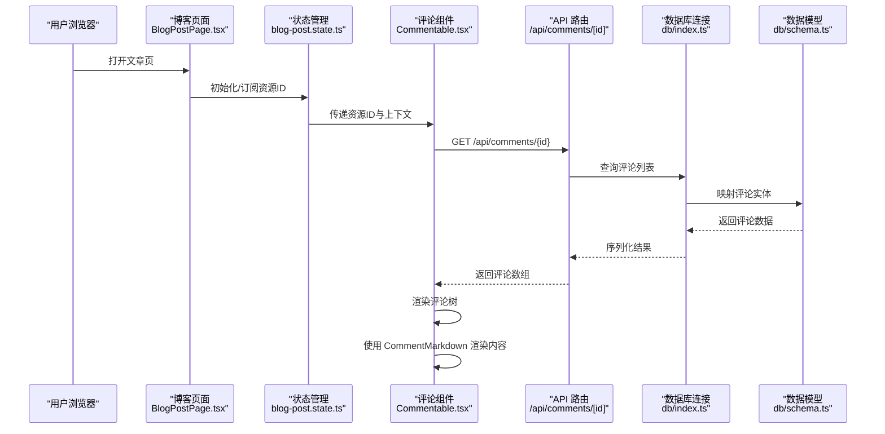
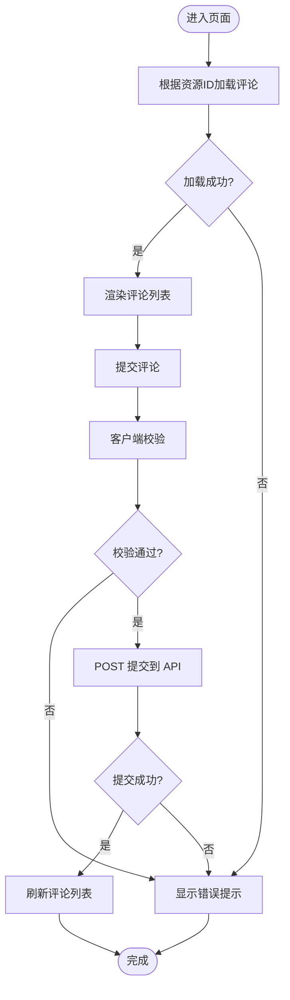
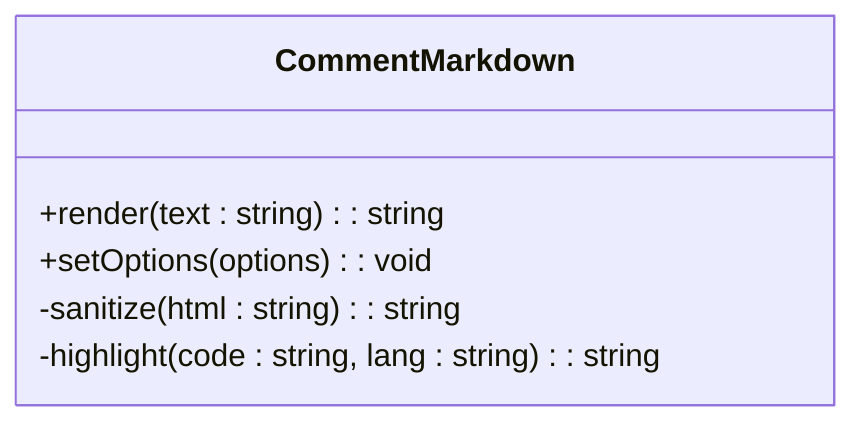
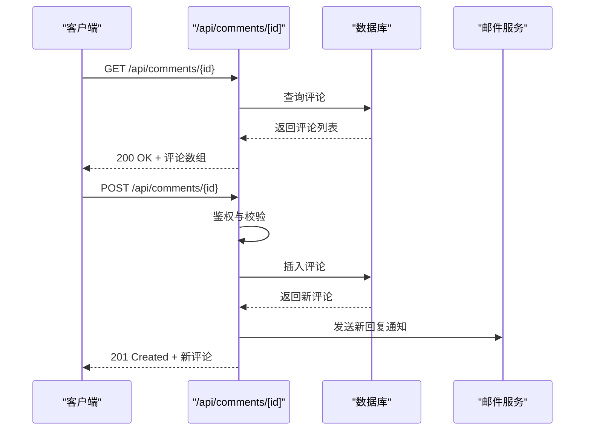
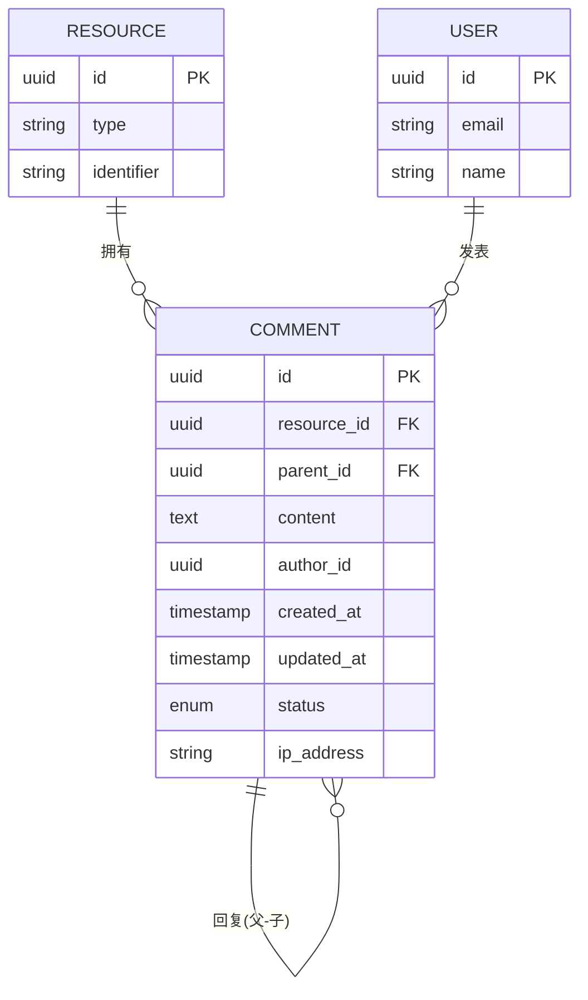
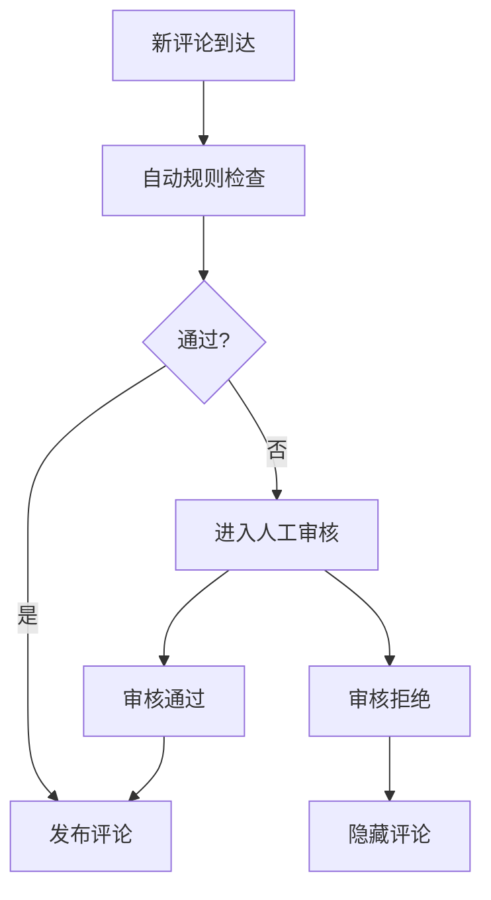
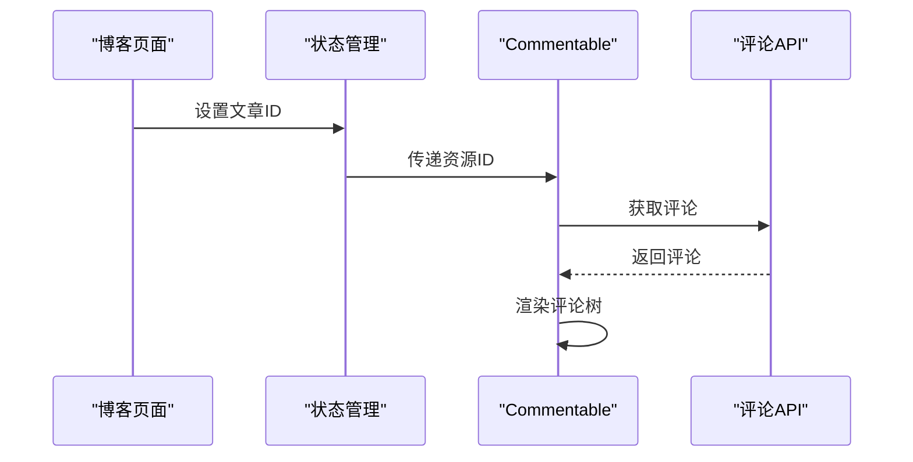
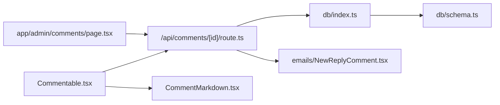

# 评论系统

<cite>
**本文引用的文件**
- [Commentable.tsx](file://components/Commentable.tsx)
- [CommentMarkdown.tsx](file://components/CommentMarkdown.tsx)
- [route.ts](file://app/api/comments/[id]/route.ts)
- [comment.dto.ts](file://db/dto/comment.dto.ts)
- [schema.ts](file://db/schema.ts)
- [index.ts](file://db/index.ts)
- [NewReplyComment.tsx](file://emails/NewReplyComment.tsx)
- [comments/page.tsx](file://app/admin/comments/page.tsx)
- [blog-post.state.ts](file://app/(main)/blog/blog-post.state.ts)
- [BlogPostPage.tsx](file://app/(main)/blog/BlogPostPage.tsx)
</cite>

## 目录
1. [简介](#简介)
2. [项目结构](#项目结构)
3. [核心组件](#核心组件)
4. [架构总览](#架构总览)
5. [详细组件分析](#详细组件分析)
6. [依赖关系分析](#依赖关系分析)
7. [性能考虑](#性能考虑)
8. [故障排查指南](#故障排查指南)
9. [结论](#结论)
10. [附录](#附录)

## 简介
本文件为 cali.so 评论系统的全面功能文档，覆盖以下关键主题：
- 可评论组件 Commentable 的实现原理与使用方式
- Markdown 渲染器 CommentMarkdown 的配置与集成
- 评论 API 的 RESTful 设计、请求响应格式与错误处理
- 评论数据模型、权限控制与安全策略
- 嵌套评论、实时刷新与缓存策略
- 审核流程、垃圾信息过滤与性能优化方案
- 在博客文章或其他内容中嵌入评论的具体集成示例

## 项目结构
评论系统涉及前端组件、API 路由、数据库模型与管理后台等模块。整体组织如下：
- 前端组件层：Commentable（评论容器）、CommentMarkdown（评论 Markdown 渲染）
- API 层：/api/comments/[id] 提供按资源 ID 获取评论的能力
- 数据层：Drizzle schema 与 DTO 定义评论数据结构，数据库连接封装
- 管理后台：admin/comments 页面用于审核与运维
- 邮件通知：新回复时触发邮件模板
- 业务集成：博客页面通过状态管理与组件组合加载评论

```mermaid
graph TB
subgraph "前端"
Cmp["Commentable.tsx"]
MD["CommentMarkdown.tsx"]
BlogState["blog-post.state.ts"]
BlogPage["BlogPostPage.tsx"]
end
subgraph "API"
API["/api/comments/[id]/route.ts"]
end
subgraph "数据"
Schema["db/schema.ts"]
DTO["db/dto/comment.dto.ts"]
DBConn["db/index.ts"]
end
subgraph "管理后台"
Admin["app/admin/comments/page.tsx"]
end
subgraph "通知"
Email["emails/NewReplyComment.tsx"]
end
BlogPage --> BlogState
BlogState --> Cmp
Cmp --> API
API --> DBConn
DBConn --> Schema
Cmp --> MD
Admin --> API
API --> Email
```

图表来源
- [Commentable.tsx](file://components/Commentable.tsx)
- [CommentMarkdown.tsx](file://components/CommentMarkdown.tsx)
- [route.ts](file://app/api/comments/[id]/route.ts)
- [schema.ts](file://db/schema.ts)
- [comment.dto.ts](file://db/dto/comment.dto.ts)
- [index.ts](file://db/index.ts)
- [comments/page.tsx](file://app/admin/comments/page.tsx)
- [NewReplyComment.tsx](file://emails/NewReplyComment.tsx)
- [blog-post.state.ts](file://app/(main)/blog/blog-post.state.ts)
- [BlogPostPage.tsx](file://app/(main)/blog/BlogPostPage.tsx)

章节来源
- [Commentable.tsx](file://components/Commentable.tsx)
- [CommentMarkdown.tsx](file://components/CommentMarkdown.tsx)
- [route.ts](file://app/api/comments/[id]/route.ts)
- [schema.ts](file://db/schema.ts)
- [comment.dto.ts](file://db/dto/comment.dto.ts)
- [index.ts](file://db/index.ts)
- [comments/page.tsx](file://app/admin/comments/page.tsx)
- [NewReplyComment.tsx](file://emails/NewReplyComment.tsx)
- [blog-post.state.ts](file://app/(main)/blog/blog-post.state.ts)
- [BlogPostPage.tsx](file://app/(main)/blog/BlogPostPage.tsx)

## 核心组件
- Commentable：负责评论列表展示、提交入口、分页与交互；通常包裹在目标内容（如博客文章）下方，并通过 API 按资源 ID 拉取评论。
- CommentMarkdown：将评论文本以 Markdown 渲染为 HTML，并注入到评论项中，支持代码高亮、链接、图片等常见语法。

章节来源
- [Commentable.tsx](file://components/Commentable.tsx)
- [CommentMarkdown.tsx](file://components/CommentMarkdown.tsx)

## 架构总览
评论系统采用前后端分离的 RESTful 风格：
- 前端通过 /api/comments/[id] 获取指定资源的评论集合
- 后端读取数据库中的评论记录，返回结构化数据
- 管理后台可对评论进行查看与操作
- 当有新回复时，发送邮件通知



图表来源
- [BlogPostPage.tsx](file://app/(main)/blog/BlogPostPage.tsx)
- [blog-post.state.ts](file://app/(main)/blog/blog-post.state.ts)
- [Commentable.tsx](file://components/Commentable.tsx)
- [route.ts](file://app/api/comments/[id]/route.ts)
- [index.ts](file://db/index.ts)
- [schema.ts](file://db/schema.ts)

## 详细组件分析

### 可评论组件 Commentable
职责与行为
- 接收资源标识（如文章 slug），作为 API 路径参数
- 发起请求获取评论列表，维护本地状态（加载中、错误、分页）
- 支持评论提交、删除、点赞等交互（具体能力取决于实现）
- 将每条评论的内容交由 CommentMarkdown 渲染

数据流与状态
- 初始加载：根据资源 ID 调用 API
- 提交后：乐观更新或重新拉取
- 错误处理：网络异常、权限不足、内容校验失败等



图表来源
- [Commentable.tsx](file://components/Commentable.tsx)
- [route.ts](file://app/api/comments/[id]/route.ts)

章节来源
- [Commentable.tsx](file://components/Commentable.tsx)

### Markdown 渲染器 CommentMarkdown
职责与行为
- 将评论文本解析为安全的 HTML
- 支持常用 Markdown 语法（标题、列表、链接、图片、代码块等）
- 可选启用代码高亮、防 XSS 过滤、外链安全属性等

配置要点
- 是否允许原始 HTML
- 白名单标签与属性
- 外部链接 rel 与 target 策略
- 图片懒加载与尺寸限制



图表来源
- [CommentMarkdown.tsx](file://components/CommentMarkdown.tsx)

章节来源
- [CommentMarkdown.tsx](file://components/CommentMarkdown.tsx)

### 评论 API 接口设计
RESTful 设计
- 资源定位：/api/comments/{id}，其中 id 为目标资源（如文章）的唯一标识
- 方法语义：
  - GET：获取该资源的评论列表（支持分页、排序、筛选）
  - POST：新增评论（需鉴权与内容校验）
  - PUT/PATCH：更新评论（仅作者或管理员）
  - DELETE：删除评论（仅作者或管理员）

请求与响应
- 请求头：Content-Type、Authorization（如需鉴权）
- 请求体：评论内容、父评论 ID（用于嵌套）、附件等
- 响应体：评论对象数组，包含 id、内容、作者、时间戳、父评论引用等字段

错误处理
- 400：请求参数不合法（如内容为空、长度超限）
- 401：未登录或令牌无效
- 403：无权限操作
- 404：资源不存在
- 429：频率限制
- 500：服务器内部错误



图表来源
- [route.ts](file://app/api/comments/[id]/route.ts)
- [index.ts](file://db/index.ts)
- [schema.ts](file://db/schema.ts)
- [NewReplyComment.tsx](file://emails/NewReplyComment.tsx)

章节来源
- [route.ts](file://app/api/comments/[id]/route.ts)

### 数据模型与存储
评论数据模型
- 主键：评论唯一标识
- 外键：关联资源 ID、父评论 ID（用于嵌套）
- 内容：评论正文（Markdown）
- 元数据：作者标识、创建/更新时间、审核状态、IP 地址等



图表来源
- [schema.ts](file://db/schema.ts)
- [comment.dto.ts](file://db/dto/comment.dto.ts)

章节来源
- [schema.ts](file://db/schema.ts)
- [comment.dto.ts](file://db/dto/comment.dto.ts)
- [index.ts](file://db/index.ts)

### 权限控制与安全策略
权限控制
- 匿名访问：仅允许阅读评论
- 已登录用户：可提交评论、编辑或删除自己的评论
- 管理员：可审核、置顶、删除任意评论

安全防护
- 输入校验：长度、字符集、富文本白名单
- 输出净化：防止 XSS，转义危险字符
- 速率限制：防止滥用与暴力提交
- 审计日志：记录敏感操作（删除、封禁）

章节来源
- [route.ts](file://app/api/comments/[id]/route.ts)
- [CommentMarkdown.tsx](file://components/CommentMarkdown.tsx)

### 审核与垃圾信息过滤
审核流程
- 默认待审：新评论进入审核队列
- 自动规则：关键词匹配、黑名单 IP、重复内容检测
- 人工审核：管理后台批量通过/拒绝/删除

管理后台
- 列表视图：按时间、状态、资源类型筛选
- 详情面板：查看评论上下文与作者信息
- 操作按钮：通过、拒绝、删除、标记垃圾



图表来源
- [comments/page.tsx](file://app/admin/comments/page.tsx)
- [route.ts](file://app/api/comments/[id]/route.ts)

章节来源
- [comments/page.tsx](file://app/admin/comments/page.tsx)
- [route.ts](file://app/api/comments/[id]/route.ts)

### 嵌套结构与实时刷新
嵌套结构
- 父子关系：通过 parent_id 构建评论树
- 深度限制：避免过深嵌套影响性能
- 折叠展开：默认折叠二级以下评论

实时刷新
- 轮询：定时拉取最新评论
- 事件驱动：WebSocket 或 Server-Sent Events（可选）
- 乐观更新：提交后立即在 UI 显示，失败回滚

章节来源
- [Commentable.tsx](file://components/Commentable.tsx)
- [route.ts](file://app/api/comments/[id]/route.ts)

### 缓存策略
- 浏览器缓存：对静态资源与评论列表设置合理 Cache-Control
- CDN 缓存：对只读评论列表进行边缘缓存
- 服务端缓存：Redis 缓存热点资源的评论，设置过期时间
- 增量更新：仅拉取变更部分，减少带宽与延迟

章节来源
- [route.ts](file://app/api/comments/[id]/route.ts)

### 集成示例：在博客文章中嵌入评论
步骤概览
- 在博客页面引入状态管理，绑定当前文章的唯一标识
- 在文章底部挂载 Commentable 组件，传入资源 ID
- 根据需要自定义样式与交互（如提交弹窗、表情选择）
- 使用 CommentMarkdown 渲染评论内容



图表来源
- [BlogPostPage.tsx](file://app/(main)/blog/BlogPostPage.tsx)
- [blog-post.state.ts](file://app/(main)/blog/blog-post.state.ts)
- [Commentable.tsx](file://components/Commentable.tsx)
- [route.ts](file://app/api/comments/[id]/route.ts)

章节来源
- [BlogPostPage.tsx](file://app/(main)/blog/BlogPostPage.tsx)
- [blog-post.state.ts](file://app/(main)/blog/blog-post.state.ts)
- [Commentable.tsx](file://components/Commentable.tsx)
- [route.ts](file://app/api/comments/[id]/route.ts)

## 依赖关系分析
- 组件依赖：Commentable 依赖 API 路由与 CommentMarkdown
- API 依赖：路由依赖数据库连接与数据模型
- 管理后台依赖：管理页面依赖 API 进行数据操作
- 通知依赖：新回复触发邮件模板



图表来源
- [Commentable.tsx](file://components/Commentable.tsx)
- [CommentMarkdown.tsx](file://components/CommentMarkdown.tsx)
- [route.ts](file://app/api/comments/[id]/route.ts)
- [index.ts](file://db/index.ts)
- [schema.ts](file://db/schema.ts)
- [comments/page.tsx](file://app/admin/comments/page.tsx)
- [NewReplyComment.tsx](file://emails/NewReplyComment.tsx)

章节来源
- [Commentable.tsx](file://components/Commentable.tsx)
- [CommentMarkdown.tsx](file://components/CommentMarkdown.tsx)
- [route.ts](file://app/api/comments/[id]/route.ts)
- [index.ts](file://db/index.ts)
- [schema.ts](file://db/schema.ts)
- [comments/page.tsx](file://app/admin/comments/page.tsx)
- [NewReplyComment.tsx](file://emails/NewReplyComment.tsx)

## 性能考虑
- 分页与懒加载：首屏仅加载少量评论，滚动加载更多
- 虚拟列表：长列表渲染时使用虚拟化技术
- 压缩传输：启用 Gzip/Brotli 压缩
- 缓存命中：提高缓存命中率，降低数据库压力
- 异步渲染：非关键路径异步执行，提升首屏速度

[本节为通用指导，无需特定文件来源]

## 故障排查指南
常见问题
- 评论无法加载：检查 API 路由是否正确、资源 ID 是否存在、网络与鉴权
- 提交失败：检查表单校验、速率限制、权限与数据库写入
- 渲染异常：检查 Markdown 配置、XSS 过滤、HTML 白名单
- 审核积压：检查自动规则与人工审核队列

定位建议
- 查看浏览器控制台与网络面板
- 检查服务端日志与错误追踪
- 验证数据库记录与索引
- 复现最小用例并逐步隔离问题

章节来源
- [route.ts](file://app/api/comments/[id]/route.ts)
- [CommentMarkdown.tsx](file://components/CommentMarkdown.tsx)

## 结论
本评论系统以 Commentable 为核心组件，结合 CommentMarkdown 渲染器与 RESTful API，实现了可扩展、可审核、可缓存的评论能力。通过清晰的数据模型与权限策略，系统在安全性与可用性之间取得平衡。建议在后续迭代中引入更完善的实时机制与反垃圾策略，进一步提升用户体验与运营效率。

[本节为总结性内容，无需特定文件来源]

## 附录
- 术语表
  - 资源 ID：被评论对象的唯一标识（如文章 slug）
  - 父评论 ID：用于构建嵌套结构的上级评论标识
  - 审核状态：评论的可见性与审批阶段
- 最佳实践
  - 始终对用户输入进行校验与净化
  - 为高频接口设置合理的缓存与限流
  - 为管理后台提供清晰的审核工作流
  - 为重要操作保留审计日志

[本节为补充信息，无需特定文件来源]