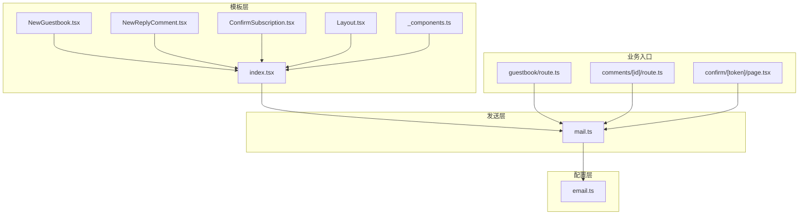
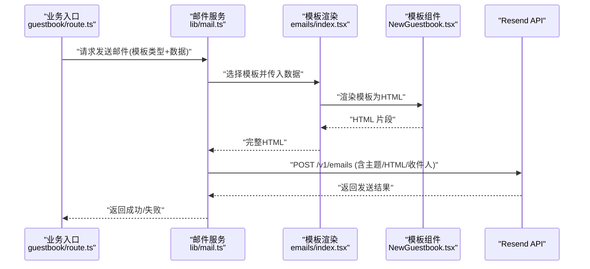
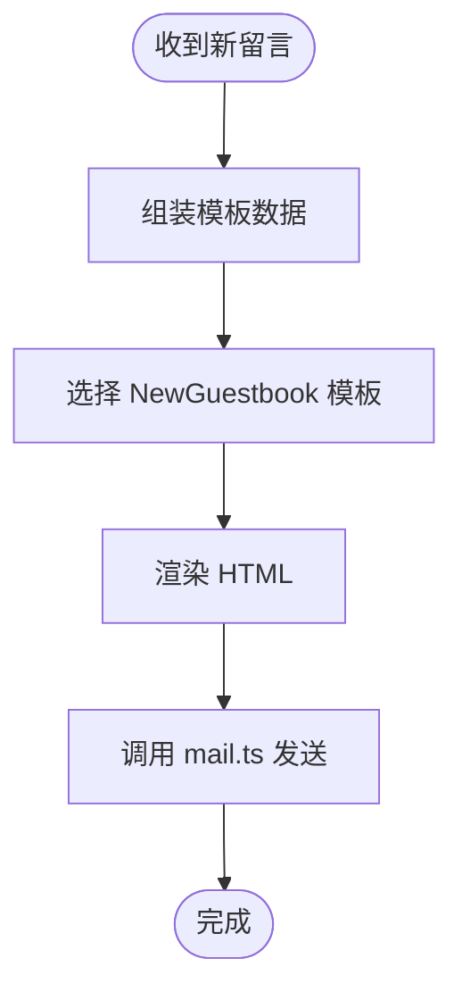
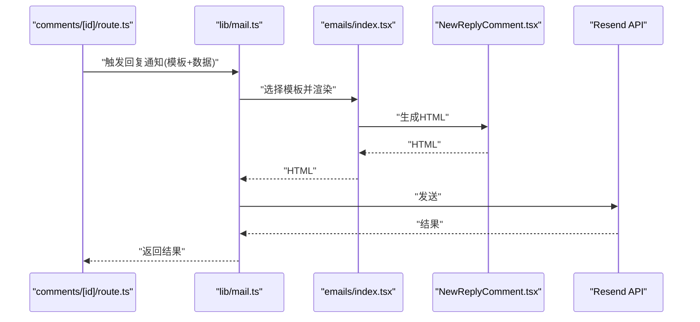
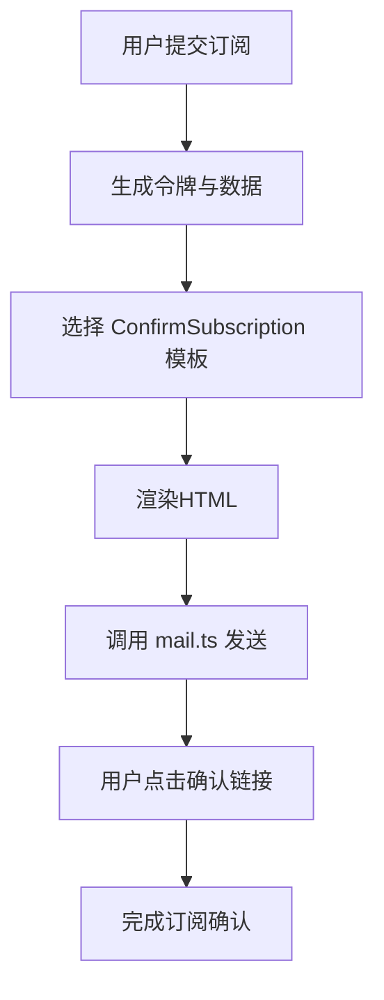
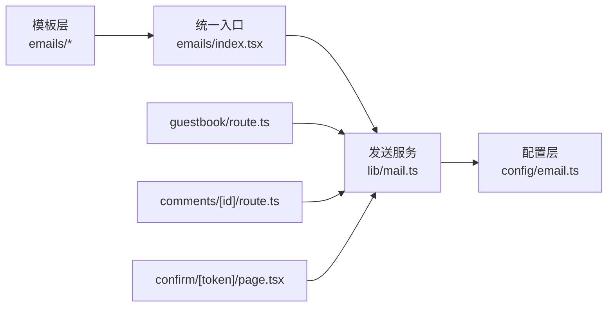

# 邮件通知系统

<cite>
**本文引用的文件**   
- [emails/index.tsx](file://emails/index.tsx)
- [emails/NewGuestbook.tsx](file://emails/NewGuestbook.tsx)
- [emails/NewReplyComment.tsx](file://emails/NewReplyComment.tsx)
- [emails/ConfirmSubscription.tsx](file://emails/ConfirmSubscription.tsx)
- [emails/Layout.tsx](file://emails/Layout.tsx)
- [emails/_components.ts](file://emails/_components.ts)
- [lib/mail.ts](file://lib/mail.ts)
- [config/email.ts](file://config/email.ts)
- [app/api/guestbook/route.ts](file://app/api/guestbook/route.ts)
- [app/api/comments/[id]/route.ts](file://app/api/comments/[id]/route.ts)
- [app/(main)/confirm/[token]/page.tsx](file://app/(main)/confirm/[token]/page.tsx)
</cite>

## 目录
1. [简介](#简介)
2. [项目结构](#项目结构)
3. [核心组件](#核心组件)
4. [架构总览](#架构总览)
5. [详细组件分析](#详细组件分析)
6. [依赖关系分析](#依赖关系分析)
7. [性能考虑](#性能考虑)
8. [故障排查指南](#故障排查指南)
9. [结论](#结论)
10. [附录](#附录)

## 简介
本文件为 cali.so 的邮件通知系统提供全面的功能文档，覆盖以下方面：
- 邮件模板设计与实现：NewGuestbook、NewReplyComment、ConfirmSubscription
- 邮件发送服务（Resend API）集成与配置
- 模板渲染引擎与异步处理机制
- 主题定制、HTML 模板开发、响应式设计与本地化支持
- 触发示例：如何触发不同类型邮件通知、自定义模板内容与发送选项
- 队列管理、失败重试与发送状态追踪
- 模板测试、性能优化与合规性检查建议

## 项目结构
邮件相关代码主要分布在以下目录与文件：
- 模板层：emails/*（React 组件形式的 HTML 模板）
- 发送层：lib/mail.ts（封装 Resend API 调用）
- 配置层：config/email.ts（环境变量与默认值）
- 业务入口：各 API 路由在合适时机触发邮件发送

图表来源
- [emails/index.tsx](file://emails/index.tsx)
- [emails/NewGuestbook.tsx](file://emails/NewGuestbook.tsx)
- [emails/NewReplyComment.tsx](file://emails/NewReplyComment.tsx)
- [emails/ConfirmSubscription.tsx](file://emails/ConfirmSubscription.tsx)
- [emails/Layout.tsx](file://emails/Layout.tsx)
- [emails/_components.ts](file://emails/_components.ts)
- [lib/mail.ts](file://lib/mail.ts)
- [config/email.ts](file://config/email.ts)
- [app/api/guestbook/route.ts](file://app/api/guestbook/route.ts)
- [app/api/comments/[id]/route.ts](file://app/api/comments/[id]/route.ts)
- [app/(main)/confirm/[token]/page.tsx](file://app/(main)/confirm/[token]/page.tsx)

章节来源
- [emails/index.tsx](file://emails/index.tsx)
- [emails/NewGuestbook.tsx](file://emails/NewGuestbook.tsx)
- [emails/NewReplyComment.tsx](file://emails/NewReplyComment.tsx)
- [emails/ConfirmSubscription.tsx](file://emails/ConfirmSubscription.tsx)
- [emails/Layout.tsx](file://emails/Layout.tsx)
- [emails/_components.ts](file://emails/_components.ts)
- [lib/mail.ts](file://lib/mail.ts)
- [config/email.ts](file://config/email.ts)
- [app/api/guestbook/route.ts](file://app/api/guestbook/route.ts)
- [app/api/comments/[id]/route.ts](file://app/api/comments/[id]/route.ts)
- [app/(main)/confirm/[token]/page.tsx](file://app/(main)/confirm/[token]/page.tsx)

## 核心组件
- 模板导出与统一入口：通过 emails/index.tsx 集中导出各模板组件，便于上层按类型选择并渲染。
- 布局与基础组件：emails/Layout.tsx 提供邮件整体布局；_components.ts 提供可复用的 UI 片段（如按钮、段落等）。
- 具体模板：
  - NewGuestbook.tsx：访客留言新增时通知管理员或相关人员。
  - NewReplyComment.tsx：评论回复时通知原评论者或作者。
  - ConfirmSubscription.tsx：订阅确认邮件，包含确认链接与说明。
- 发送服务：lib/mail.ts 封装 Resend API 调用，负责将渲染后的 HTML 文本与元数据发送至邮箱服务商。
- 配置：config/email.ts 定义发件人、收件人、域名、API Key 等关键配置项。

章节来源
- [emails/index.tsx](file://emails/index.tsx)
- [emails/Layout.tsx](file://emails/Layout.tsx)
- [emails/_components.ts](file://emails/_components.ts)
- [emails/NewGuestbook.tsx](file://emails/NewGuestbook.tsx)
- [emails/NewReplyComment.tsx](file://emails/NewReplyComment.tsx)
- [emails/ConfirmSubscription.tsx](file://emails/ConfirmSubscription.tsx)
- [lib/mail.ts](file://lib/mail.ts)
- [config/email.ts](file://config/email.ts)

## 架构总览
邮件系统采用“模板渲染 + 发送服务”的分层设计：
- 模板层：使用 React 组件描述邮件内容，支持响应式样式与局部复用。
- 渲染层：根据模板类型与上下文数据生成 HTML 字符串。
- 发送层：调用 Resend API 完成投递，返回发送结果供业务侧记录与追踪。
- 配置层：集中管理发件人、域名、密钥等敏感信息。

图表来源
- [app/api/guestbook/route.ts](file://app/api/guestbook/route.ts)
- [lib/mail.ts](file://lib/mail.ts)
- [emails/index.tsx](file://emails/index.tsx)
- [emails/NewGuestbook.tsx](file://emails/NewGuestbook.tsx)

## 详细组件分析

### 模板：NewGuestbook（新访客留言）
- 用途：当有新访客留言时，向管理员或指定邮箱发送通知。
- 输入数据：留言者昵称、联系方式（可选）、留言内容、时间戳等。
- 输出内容：标题、正文、操作链接（如查看留言详情）。
- 样式与布局：基于 Layout.tsx 与 _components.ts 中的通用元素构建，确保移动端可读性。
- 触发点：通常在创建留言成功后由 guestbook API 触发。

图表来源
- [emails/NewGuestbook.tsx](file://emails/NewGuestbook.tsx)
- [emails/index.tsx](file://emails/index.tsx)
- [lib/mail.ts](file://lib/mail.ts)
- [app/api/guestbook/route.ts](file://app/api/guestbook/route.ts)

章节来源
- [emails/NewGuestbook.tsx](file://emails/NewGuestbook.tsx)
- [emails/index.tsx](file://emails/index.tsx)
- [lib/mail.ts](file://lib/mail.ts)
- [app/api/guestbook/route.ts](file://app/api/guestbook/route.ts)

### 模板：NewReplyComment（新评论回复）
- 用途：当某条评论被回复时，通知原评论者或文章作者。
- 输入数据：被回复评论的作者、评论内容、回复内容、时间戳、文章链接等。
- 输出内容：提醒文案、跳转链接、引用原文摘要。
- 样式与布局：复用通用组件，保持与站点一致的视觉风格。
- 触发点：在评论回复接口中触发。

图表来源
- [emails/NewReplyComment.tsx](file://emails/NewReplyComment.tsx)
- [emails/index.tsx](file://emails/index.tsx)
- [lib/mail.ts](file://lib/mail.ts)
- [app/api/comments/[id]/route.ts](file://app/api/comments/[id]/route.ts)

章节来源
- [emails/NewReplyComment.tsx](file://emails/NewReplyComment.tsx)
- [emails/index.tsx](file://emails/index.tsx)
- [lib/mail.ts](file://lib/mail.ts)
- [app/api/comments/[id]/route.ts](file://app/api/comments/[id]/route.ts)

### 模板：ConfirmSubscription（订阅确认）
- 用途：用户订阅后发送确认邮件，内含唯一令牌与确认链接。
- 输入数据：用户邮箱、确认令牌、站点名称、帮助说明等。
- 输出内容：欢迎语、确认步骤、安全提示、取消订阅说明。
- 触发点：在订阅流程完成后，由确认页面或订阅接口触发。

图表来源
- [emails/ConfirmSubscription.tsx](file://emails/ConfirmSubscription.tsx)
- [emails/index.tsx](file://emails/index.tsx)
- [lib/mail.ts](file://lib/mail.ts)
- [app/(main)/confirm/[token]/page.tsx](file://app/(main)/confirm/[token]/page.tsx)

章节来源
- [emails/ConfirmSubscription.tsx](file://emails/ConfirmSubscription.tsx)
- [emails/index.tsx](file://emails/index.tsx)
- [lib/mail.ts](file://lib/mail.ts)
- [app/(main)/confirm/[token]/page.tsx](file://app/(main)/confirm/[token]/page.tsx)

### 模板渲染与导出
- 统一入口：emails/index.tsx 提供模板选择与渲染逻辑，接收模板类型与数据，返回 HTML。
- 布局与组件：Layout.tsx 提供邮件容器与全局样式；_components.ts 提供按钮、段落、列表等基础组件。
- 扩展方式：新增模板时，在 index.tsx 中添加映射，并在对应业务入口调用。

章节来源
- [emails/index.tsx](file://emails/index.tsx)
- [emails/Layout.tsx](file://emails/Layout.tsx)
- [emails/_components.ts](file://emails/_components.ts)

### 发送服务（Resend API）集成
- 职责：封装 HTTP 请求至 Resend API，处理认证、参数组装与错误码解析。
- 配置项：发件人地址、域名、API Key、默认主题前缀等，来自 config/email.ts。
- 返回值：发送结果对象，包含消息 ID、状态码、错误信息等，用于日志与追踪。

章节来源
- [lib/mail.ts](file://lib/mail.ts)
- [config/email.ts](file://config/email.ts)

## 依赖关系分析
- 模板层依赖布局与基础组件，统一通过 index.tsx 暴露。
- 发送层依赖配置层获取敏感信息与默认值。
- 业务入口仅依赖发送层，不直接感知模板细节，符合单一职责原则。

图表来源
- [emails/index.tsx](file://emails/index.tsx)
- [lib/mail.ts](file://lib/mail.ts)
- [config/email.ts](file://config/email.ts)
- [app/api/guestbook/route.ts](file://app/api/guestbook/route.ts)
- [app/api/comments/[id]/route.ts](file://app/api/comments/[id]/route.ts)
- [app/(main)/confirm/[token]/page.tsx](file://app/(main)/confirm/[token]/page.tsx)

章节来源
- [emails/index.tsx](file://emails/index.tsx)
- [lib/mail.ts](file://lib/mail.ts)
- [config/email.ts](file://config/email.ts)
- [app/api/guestbook/route.ts](file://app/api/guestbook/route.ts)
- [app/api/comments/[id]/route.ts](file://app/api/comments/[id]/route.ts)
- [app/(main)/confirm/[token]/page.tsx](file://app/(main)/confirm/[token]/page.tsx)

## 性能考虑
- 模板渲染：避免在模板中进行重型计算，尽量在业务层预处理数据。
- 网络请求：对 Resend API 的调用应设置合理超时与重试策略，避免阻塞主流程。
- 并发控制：在高流量场景下，限制并发发送数量，防止触发服务商限流。
- 缓存策略：对于静态资源（如图片），建议使用 CDN 并启用缓存头。
- 日志与监控：记录每次发送的关键指标（耗时、状态码、错误类型），便于定位瓶颈。

[本节为通用指导，无需源码引用]

## 故障排查指南
- 常见错误
  - 认证失败：检查 API Key 与域名配置是否正确。
  - 收件人无效：校验邮箱格式与白名单规则。
  - 模板渲染异常：核对模板所需字段是否齐全，避免空引用。
  - 网络超时：调整超时时间与重试次数，观察服务商状态页。
- 定位方法
  - 查看发送层返回的错误信息，结合业务日志定位问题链路。
  - 使用最小数据集复现模板渲染问题，逐步缩小范围。
  - 对比不同环境（开发/生产）的配置差异，排除配置污染。
- 恢复措施
  - 对失败任务进行幂等重试，避免重复发送。
  - 对不可恢复错误进行告警与人工介入。

章节来源
- [lib/mail.ts](file://lib/mail.ts)
- [config/email.ts](file://config/email.ts)

## 结论
本邮件通知系统以 React 模板为核心，配合统一的发送服务与集中配置，实现了可扩展、易维护的通知能力。通过清晰的职责划分与标准化的调用流程，能够快速接入新的通知类型，并具备良好的可观测性与可运维性。

[本节为总结，无需源码引用]

## 附录

### 使用示例与最佳实践
- 触发新访客留言通知
  - 在创建留言成功后，调用发送服务并传入 NewGuestbook 模板与数据。
  - 参考路径：[app/api/guestbook/route.ts](file://app/api/guestbook/route.ts)、[emails/NewGuestbook.tsx](file://emails/NewGuestbook.tsx)、[lib/mail.ts](file://lib/mail.ts)。
- 触发评论回复通知
  - 在保存回复后，调用发送服务并传入 NewReplyComment 模板与数据。
  - 参考路径：[app/api/comments/[id]/route.ts](file://app/api/comments/[id]/route.ts)、[emails/NewReplyComment.tsx](file://emails/NewReplyComment.tsx)、[lib/mail.ts](file://lib/mail.ts)。
- 触发订阅确认邮件
  - 在用户订阅后生成令牌并发送 ConfirmSubscription 模板。
  - 参考路径：[app/(main)/confirm/[token]/page.tsx](file://app/(main)/confirm/[token]/page.tsx)、[emails/ConfirmSubscription.tsx](file://emails/ConfirmSubscription.tsx)、[lib/mail.ts](file://lib/mail.ts)。
- 自定义模板内容
  - 在对应模板文件中添加字段与展示逻辑，并通过 index.tsx 的映射进行注册。
  - 参考路径：[emails/index.tsx](file://emails/index.tsx)、[emails/Layout.tsx](file://emails/Layout.tsx)、[emails/_components.ts](file://emails/_components.ts)。
- 配置发送选项
  - 在配置文件中设置发件人、域名、API Key 等，确保与 Resend 控制台一致。
  - 参考路径：[config/email.ts](file://config/email.ts)。

### 队列管理与失败重试
- 队列建议
  - 引入轻量队列（如内存队列或外部消息队列）对发送任务进行排队，降低瞬时压力。
  - 为每条任务分配唯一 ID，便于追踪与去重。
- 重试策略
  - 对临时性错误（如网络抖动、限流）实施指数退避重试。
  - 对永久性错误（如认证失败、收件人无效）立即终止并告警。
- 状态追踪
  - 记录发送开始时间、结束时间、状态码、错误信息、重试次数等。
  - 提供查询接口以便运营与排障。

[本节为通用指导，无需源码引用]

### 模板测试与验证
- 单元测试
  - 针对每个模板构造最小数据集，断言渲染结果包含必要字段与链接。
- 集成测试
  - 模拟 Resend API 响应，验证发送层在不同状态码下的行为。
- 可视化预览
  - 在开发环境提供模板预览页面，快速验证样式与布局。
- 兼容性检查
  - 使用主流邮件客户端（Gmail、Outlook、Apple Mail）进行真实投递测试。

[本节为通用指导，无需源码引用]

### 响应式设计与本地化
- 响应式
  - 使用弹性布局与相对单位，确保在手机端与小屏设备上的可读性。
  - 避免复杂表格布局，优先使用块级元素堆叠。
- 本地化
  - 将文案抽离到语言包，根据用户偏好或站点语言动态选择。
  - 模板中仅保留占位符，实际文案在业务层注入。

[本节为通用指导，无需源码引用]

### 合规性检查
- 隐私与同意
  - 明确告知用户邮件用途，并提供退订链接。
- 反垃圾邮件
  - 遵循服务商要求，避免高频发送与可疑内容。
- 数据安全
  - 不在邮件中传输敏感信息（如密码、完整身份证号）。
  - 使用 HTTPS 链接并确保令牌具备有效期与一次性使用特性。

[本节为通用指导，无需源码引用]