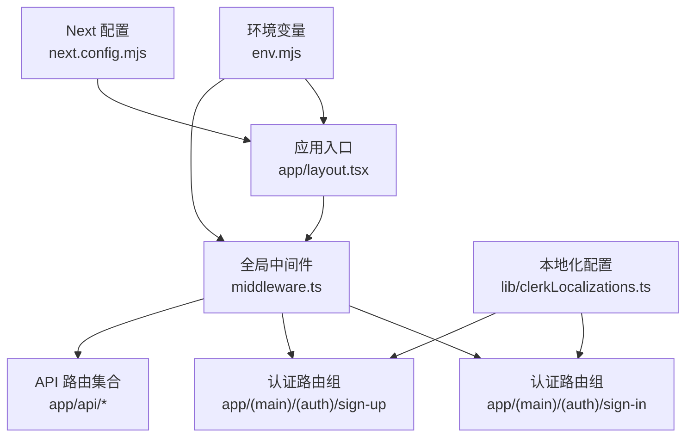
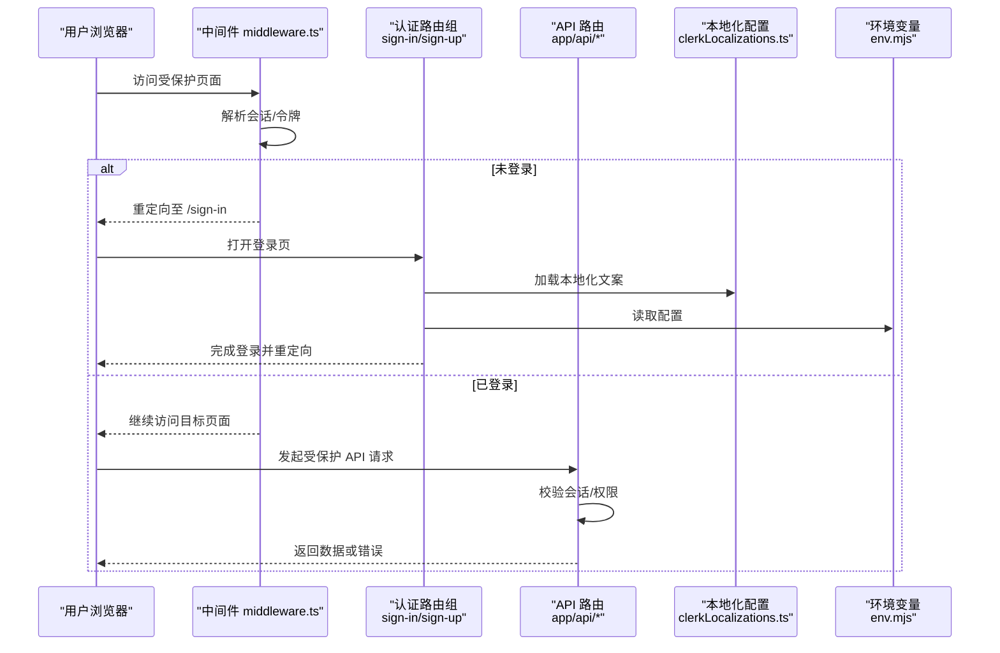
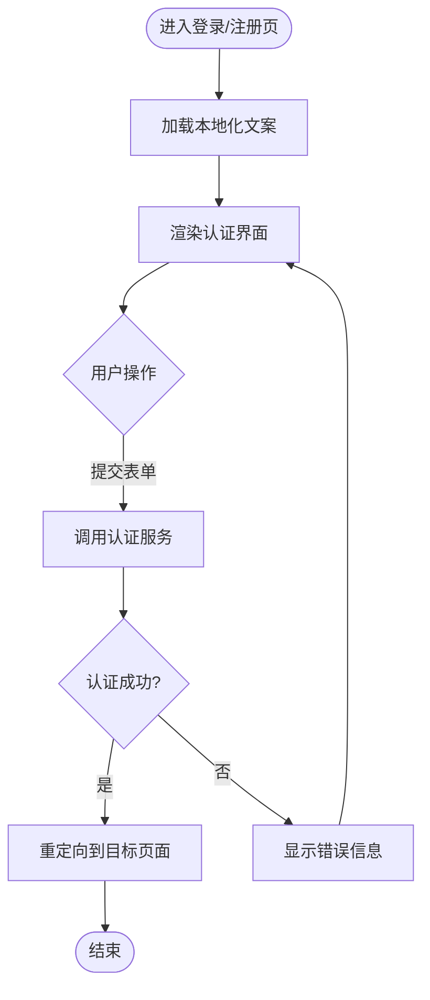
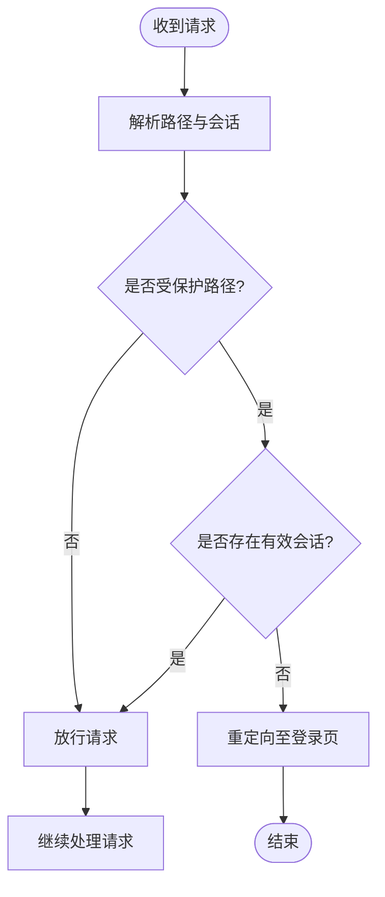
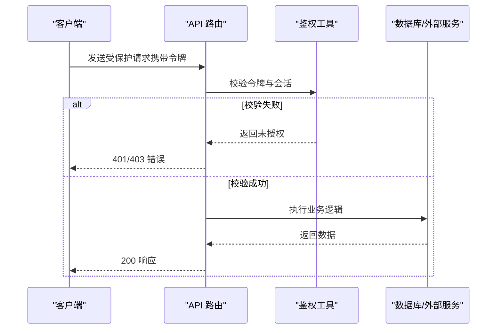
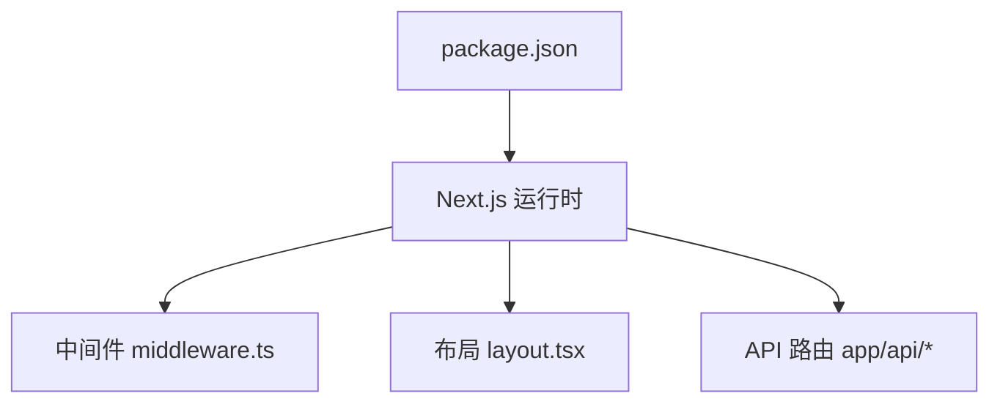

# Clack Auth 认证系统

<cite>
**本文引用的文件**   
- [middleware.ts](file://middleware.ts)
- [layout.tsx](file://app/layout.tsx)
- [page.tsx](file://app/(main)/(auth)/sign-in/[[...sign-in]]/page.tsx)
- [page.tsx](file://app/(main)/(auth)/sign-up/[[...sign-up]]/page.tsx)
- [clerkLocalizations.ts](file://lib/clerkLocalizations.ts)
- [env.mjs](file://env.mjs)
- [package.json](file://package.json)
- [next.config.mjs](file://next.config.mjs)
- [route.ts](file://app/api/activity/route.ts)
- [route.ts](file://app/api/comments/[id]/route.ts)
- [route.ts](file://app/api/guestbook/route.ts)
- [route.ts](file://app/api/newsletter/route.ts)
- [route.ts](file://app/api/reactions/route.ts)
- [route.ts](file://app/api/tweet/[id]/route.ts)
</cite>

## 目录
1. [简介](#简介)
2. [项目结构](#项目结构)
3. [核心组件](#核心组件)
4. [架构总览](#架构总览)
5. [详细组件分析](#详细组件分析)
6. [依赖分析](#依赖分析)
7. [性能考虑](#性能考虑)
8. [故障排查指南](#故障排查指南)
9. [结论](#结论)
10. [附录](#附录)

## 简介
本文件为 cali.so 项目的认证系统集成文档，聚焦于基于 Clack（Clack）的认证能力与 Next.js App Router 的集成方式。内容涵盖：
- 用户注册、登录流程与路由守卫
- 会话管理与服务端状态获取
- 权限控制与中间件保护
- 本地化配置与国际化
- API 路由中的鉴权模式
- 错误处理、会话持久化与安全加固建议
- 环境变量与部署注意事项

说明：仓库中已存在 Clerk 相关的路由与本地化文件，但“Clack”作为独立 SDK 或框架并未在仓库中出现。本文以仓库现有实现为依据，提供通用且可落地的集成方案与最佳实践，便于将 Clack 与当前架构对齐。

## 项目结构
本项目采用 Next.js App Router 组织页面与 API 路由，认证相关的关键位置如下：
- 全局布局：用于注入认证上下文与客户端初始化
- 认证路由组：(main)/(auth) 下的 sign-in 与 sign-up 动态路由
- 中间件：统一拦截受保护资源并执行重定向
- API 路由：各业务接口通过中间件或内部工具进行鉴权
- 本地化：针对认证 UI 的多语言文案
- 环境配置：认证相关的密钥与域名等

图表来源
- [layout.tsx](file://app/layout.tsx)
- [middleware.ts](file://middleware.ts)
- [page.tsx](file://app/(main)/(auth)/sign-in/[[...sign-in]]/page.tsx)
- [page.tsx](file://app/(main)/(auth)/sign-up/[[...sign-up]]/page.tsx)
- [clerkLocalizations.ts](file://lib/clerkLocalizations.ts)
- [env.mjs](file://env.mjs)
- [next.config.mjs](file://next.config.mjs)

章节来源
- [layout.tsx](file://app/layout.tsx)
- [middleware.ts](file://middleware.ts)
- [page.tsx](file://app/(main)/(auth)/sign-in/[[...sign-in]]/page.tsx)
- [page.tsx](file://app/(main)/(auth)/sign-up/[[...sign-up]]/page.tsx)
- [clerkLocalizations.ts](file://lib/clerkLocalizations.ts)
- [env.mjs](file://env.mjs)
- [next.config.mjs](file://next.config.mjs)

## 核心组件
- 全局布局与认证上下文
  - 负责在根布局中引入认证客户端库、初始化会话上下文，并将用户信息暴露给服务端组件与客户端组件使用。
  - 典型职责：加载会话、渲染认证提供者、设置全局样式与元数据。
- 认证路由组
  - 位于 (main)/(auth) 下，包含 sign-in 与 sign-up 的动态路由，用于承载第三方登录与注册界面。
  - 通常直接复用认证 SDK 提供的内置页面或自定义包装页。
- 中间件保护
  - 在请求进入应用前对路径进行匹配，未登录访问受保护路径时重定向至登录页。
  - 支持白名单放行静态资源、健康检查与公开 API。
- API 鉴权
  - 在 API 路由中读取会话令牌或用户标识，校验权限后执行业务逻辑。
  - 结合角色/权限模型返回不同结果或拒绝访问。
- 本地化配置
  - 为认证 UI 提供多语言文案，适配不同地区用户的阅读习惯。
- 环境变量
  - 管理认证服务所需的密钥、域名、回调地址等敏感信息。

章节来源
- [layout.tsx](file://app/layout.tsx)
- [page.tsx](file://app/(main)/(auth)/sign-in/[[...sign-int]]/page.tsx)
- [page.tsx](file://app/(main)/(auth)/sign-up/[[...sign-up]]/page.tsx)
- [middleware.ts](file://middleware.ts)
- [clerkLocalizations.ts](file://lib/clerkLocalizations.ts)
- [env.mjs](file://env.mjs)

## 架构总览
下图展示了从浏览器到服务端的核心认证流程，包括中间件拦截、认证路由跳转、API 鉴权与本地化文案加载。

图表来源
- [middleware.ts](file://middleware.ts)
- [page.tsx](file://app/(main)/(auth)/sign-in/[[...sign-in]]/page.tsx)
- [page.tsx](file://app/(main)/(auth)/sign-up/[[...sign-up]]/page.tsx)
- [clerkLocalizations.ts](file://lib/clerkLocalizations.ts)
- [env.mjs](file://env.mjs)
- [route.ts](file://app/api/activity/route.ts)
- [route.ts](file://app/api/comments/[id]/route.ts)
- [route.ts](file://app/api/guestbook/route.ts)
- [route.ts](file://app/api/newsletter/route.ts)
- [route.ts](file://app/api/reactions/route.ts)
- [route.ts](file://app/api/tweet/[id]/route.ts)

## 详细组件分析

### 全局布局与认证上下文
- 作用
  - 在根布局中初始化认证客户端，确保所有页面均可访问用户会话与身份状态。
  - 在服务端组件中可直接读取用户信息，减少重复请求。
- 关键点
  - 在布局层加载会话，避免每个页面重复初始化。
  - 将用户信息挂载到上下文，供子组件与服务端组件消费。
  - 配合中间件保证未登录时的安全访问控制。

章节来源
- [layout.tsx](file://app/layout.tsx)

### 认证路由组（登录与注册）
- 路由组织
  - 使用 (main)/(auth) 路由组隔离认证相关页面，便于集中管理与权限策略。
  - sign-in 与 sign-up 采用动态路由参数，兼容第三方登录回调与后续步骤。
- 本地化
  - 通过本地化配置文件为认证 UI 提供多语言文案，提升用户体验。
- 交互流程
  - 用户访问登录/注册页 → 加载本地化文案 → 调用认证服务 → 成功后重定向回原页面或指定路径。

图表来源
- [page.tsx](file://app/(main)/(auth)/sign-in/[[...sign-in]]/page.tsx)
- [page.tsx](file://app/(main)/(auth)/sign-up/[[...sign-up]]/page.tsx)
- [clerkLocalizations.ts](file://lib/clerkLocalizations.ts)

章节来源
- [page.tsx](file://app/(main)/(auth)/sign-in/[[...sign-in]]/page.tsx)
- [page.tsx](file://app/(main)/(auth)/sign-up/[[...sign-up]]/page.tsx)
- [clerkLocalizations.ts](file://lib/clerkLocalizations.ts)

### 中间件保护与路由守卫
- 职责
  - 在请求到达页面或 API 之前进行鉴权判断。
  - 对未登录用户重定向至登录页；对已登录用户放行。
- 策略
  - 白名单放行静态资源、健康检查与公开 API。
  - 支持按路径前缀或正则匹配进行细粒度控制。
  - 记录访问日志以便审计与排障。

图表来源
- [middleware.ts](file://middleware.ts)

章节来源
- [middleware.ts](file://middleware.ts)

### API 路由鉴权与权限控制
- 鉴权模式
  - 在 API 路由中读取会话令牌或用户标识，验证签名与有效期。
  - 根据用户角色或权限决定允许的操作范围。
- 常见接口
  - 活动、评论、留言簿、订阅、反应、推文等接口均可能涉及鉴权。
- 错误处理
  - 对非法请求返回标准错误码与消息，便于前端统一处理。

图表来源
- [route.ts](file://app/api/activity/route.ts)
- [route.ts](file://app/api/comments/[id]/route.ts)
- [route.ts](file://app/api/guestbook/route.ts)
- [route.ts](file://app/api/newsletter/route.ts)
- [route.ts](file://app/api/reactions/route.ts)
- [route.ts](file://app/api/tweet/[id]/route.ts)

章节来源
- [route.ts](file://app/api/activity/route.ts)
- [route.ts](file://app/api/comments/[id]/route.ts)
- [route.ts](file://app/api/guestbook/route.ts)
- [route.ts](file://app/api/newsletter/route.ts)
- [route.ts](file://app/api/reactions/route.ts)
- [route.ts](file://app/api/tweet/[id]/route.ts)

### 本地化配置
- 目标
  - 为认证 UI 提供多语言文案，覆盖登录、注册、错误提示等场景。
- 实现要点
  - 在认证路由中按需加载对应语言的文案。
  - 保持文案键值稳定，便于维护与扩展。

章节来源
- [clerkLocalizations.ts](file://lib/clerkLocalizations.ts)

### 环境变量与部署注意事项
- 关键变量
  - 认证服务密钥、域名、回调地址、安全头配置等。
- 部署建议
  - 在生产环境严格管理密钥，避免泄露。
  - 启用 HTTPS 与安全的 Cookie 属性。
  - 合理设置超时与重试策略，提高稳定性。

章节来源
- [env.mjs](file://env.mjs)
- [next.config.mjs](file://next.config.mjs)

## 依赖分析
- 包依赖
  - 认证相关依赖在 package.json 中声明，确保版本一致与兼容性。
- 运行时依赖
  - Next.js 配置影响构建与运行行为，如环境变量注入、中间件生效范围等。

图表来源
- [package.json](file://package.json)
- [next.config.mjs](file://next.config.mjs)
- [middleware.ts](file://middleware.ts)
- [layout.tsx](file://app/layout.tsx)
- [route.ts](file://app/api/activity/route.ts)

章节来源
- [package.json](file://package.json)
- [next.config.mjs](file://next.config.mjs)

## 性能考虑
- 会话缓存
  - 在服务端缓存用户会话以减少重复校验开销。
- 中间件优化
  - 仅对必要路径执行鉴权，避免全量扫描带来的延迟。
- API 鉴权
  - 使用轻量级令牌校验，必要时结合 Redis 缓存黑名单或速率限制。
- 本地化
  - 预编译或懒加载文案，减少首屏体积。

[本节为通用指导，不直接分析具体文件]

## 故障排查指南
- 常见问题
  - 环境变量缺失或错误导致认证失败。
  - 中间件重定向循环，需检查白名单与路径匹配规则。
  - API 返回未授权，需确认令牌传递与校验逻辑。
- 定位方法
  - 查看中间件日志与错误堆栈。
  - 检查浏览器网络面板中的请求头与会话 Cookie。
  - 核对生产环境的域名与回调地址配置。

章节来源
- [middleware.ts](file://middleware.ts)
- [env.mjs](file://env.mjs)
- [route.ts](file://app/api/activity/route.ts)
- [route.ts](file://app/api/comments/[id]/route.ts)
- [route.ts](file://app/api/guestbook/route.ts)
- [route.ts](file://app/api/newsletter/route.ts)
- [route.ts](file://app/api/reactions/route.ts)
- [route.ts](file://app/api/tweet/[id]/route.ts)

## 结论
通过将认证能力与 Next.js App Router 深度集成，本项目实现了统一的登录注册体验、严格的中间件保护与灵活的 API 鉴权。结合本地化与环境变量管理，可在多语言与多环境中稳定运行。建议持续完善权限模型、审计日志与安全加固措施，以提升整体安全性与可维护性。

[本节为总结性内容，不直接分析具体文件]

## 附录
- 配置示例清单
  - 环境变量：认证密钥、域名、回调地址、安全头
  - 中间件：白名单路径、重定向策略、日志级别
  - API 鉴权：令牌格式、过期时间、角色映射
- 部署注意事项
  - 强制 HTTPS、Cookie 安全属性、跨域策略
  - 密钥管理与轮换机制
  - 监控与告警：认证失败率、异常重定向次数

[本节为补充信息，不直接分析具体文件]