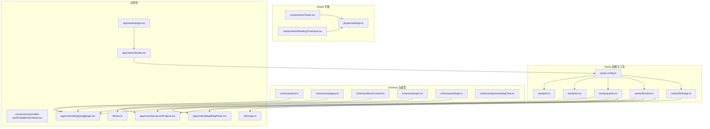
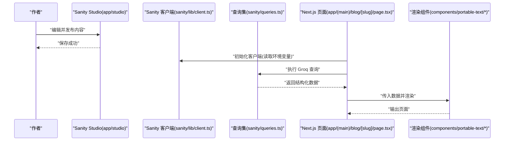
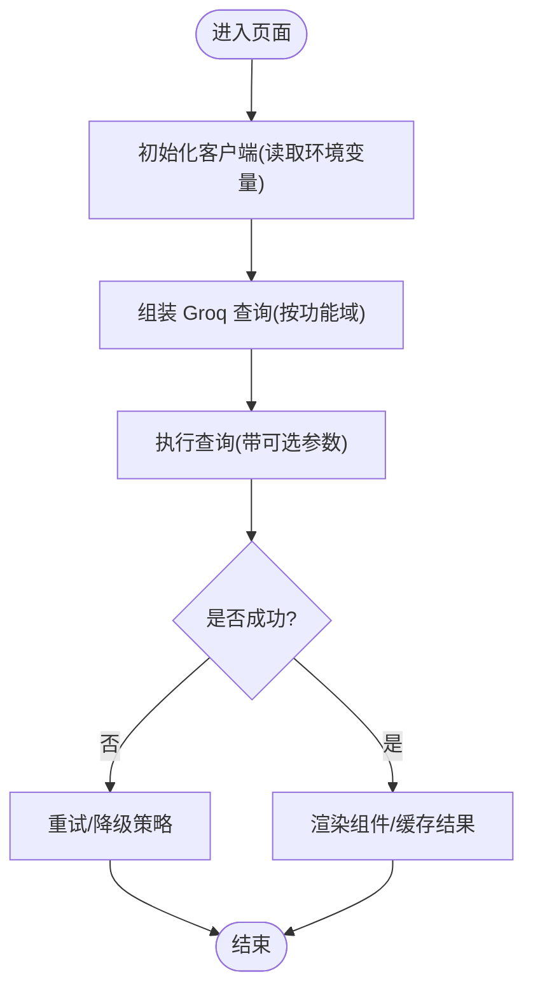
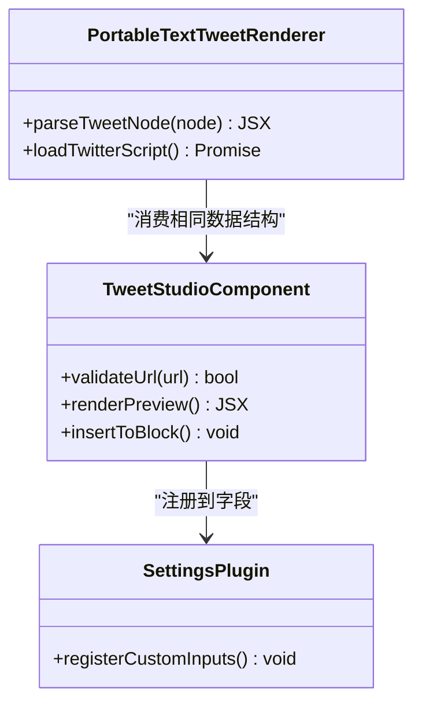
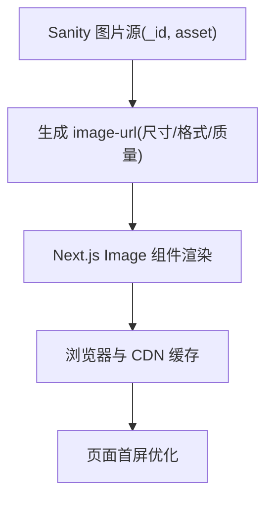
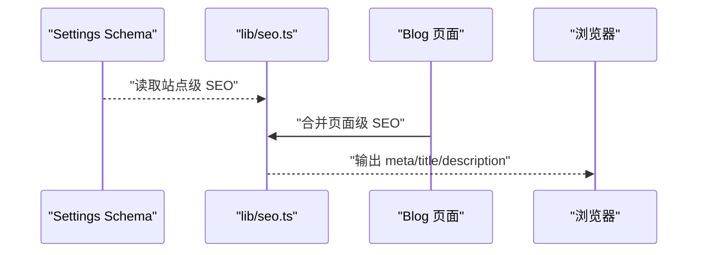
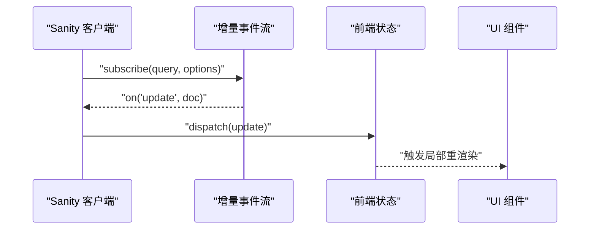
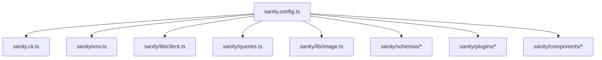

# Sanity CMS 集成

<cite>
**本文引用的文件**   
- [sanity.config.ts](file://sanity.config.ts)
- [sanity.cli.ts](file://sanity.cli.ts)
- [sanity/env.ts](file://sanity/env.ts)
- [sanity/queries.ts](file://sanity/queries.ts)
- [sanity/lib/client.ts](file://sanity/lib/client.ts)
- [sanity/lib/image.ts](file://sanity/lib/image.ts)
- [sanity/schemas/post.ts](file://sanity/schemas/post.ts)
- [sanity/schemas/category.ts](file://sanity/schemas/category.ts)
- [sanity/schemas/blockContent.ts](file://sanity/schemas/blockContent.ts)
- [sanity/schemas/project.ts](file://sanity/schemas/project.ts)
- [sanity/schemas/settings.ts](file://sanity/schemas/settings.ts)
- [sanity/schemas/types/readingTime.ts](file://sanity/schemas/types/readingTime.ts)
- [sanity/components/Tweet.tsx](file://sanity/components/Tweet.tsx)
- [sanity/components/ReadingTimeInput.tsx](file://sanity/components/ReadingTimeInput.tsx)
- [sanity/plugins/settings.ts](file://sanity/plugins/settings.ts)
- [app/studio/page.tsx](file://app/studio/page.tsx)
- [app/studio/Studio.tsx](file://app/studio/Studio.tsx)
- [components/portable-text/PortableTextTweet.tsx](file://components/portable-text/PortableTextTweet.tsx)
- [lib/image.ts](file://lib/image.ts)
- [lib/seo.ts](file://lib/seo.ts)
- [app/(main)/blog/[slug]/page.tsx](file://app/(main)/blog/[slug]/page.tsx)
- [app/(main)/blog/BlogPosts.tsx](file://app/(main)/blog/BlogPosts.tsx)
- [app/(main)/projects/Projects.tsx](file://app/(main)/projects/Projects.tsx)
</cite>

## 目录
1. [简介](#简介)
2. [项目结构](#项目结构)
3. [核心组件](#核心组件)
4. [架构总览](#架构总览)
5. [详细组件分析](#详细组件分析)
6. [依赖分析](#依赖分析)
7. [性能考虑](#性能考虑)
8. [故障排查指南](#故障排查指南)
9. [结论](#结论)
10. [附录](#附录)

## 简介
本文件面向 cali.so 项目的 Sanity CMS 集成，系统性说明以下内容：
- Sanity SDK 配置与使用：客户端初始化、查询构建、实时订阅
- 内容模型设计：博客文章、分类、设置等 schema 定义与关系
- 自定义组件开发：如 Tweet 组件的 Studio 与渲染端实现
- 图片处理优化：Sanity Image API 与 Next.js 集成策略
- SEO 元数据管理：站点级与页面级 SEO 配置
- 查询示例、缓存策略与性能优化技巧
- Sanity Studio 扩展开发、插件配置与部署流程
- 错误处理、重试机制与调试方法

## 项目结构
Sanity 相关代码主要位于 sanity 目录，并在 app/studio 下提供内嵌式 Studio 入口。前端通过 lib 与 components 中的工具与组件消费 Sanity 数据。



图表来源
- [sanity.config.ts](file://sanity.config.ts)
- [sanity/cli.ts](file://sanity.cli.ts)
- [sanity/env.ts](file://sanity/env.ts)
- [sanity/queries.ts](file://sanity/queries.ts)
- [sanity/lib/client.ts](file://sanity/lib/client.ts)
- [sanity/lib/image.ts](file://sanity/lib/image.ts)
- [sanity/schemas/post.ts](file://sanity/schemas/post.ts)
- [sanity/schemas/category.ts](file://sanity/schemas/category.ts)
- [sanity/schemas/blockContent.ts](file://sanity/schemas/blockContent.ts)
- [sanity/schemas/project.ts](file://sanity/schemas/project.ts)
- [sanity/schemas/settings.ts](file://sanity/schemas/settings.ts)
- [sanity/schemas/types/readingTime.ts](file://sanity/schemas/types/readingTime.ts)
- [sanity/components/Tweet.tsx](file://sanity/components/Tweet.tsx)
- [sanity/components/ReadingTimeInput.tsx](file://sanity/components/ReadingTimeInput.tsx)
- [sanity/plugins/settings.ts](file://sanity/plugins/settings.ts)
- [app/studio/page.tsx](file://app/studio/page.tsx)
- [app/studio/Studio.tsx](file://app/studio/Studio.tsx)
- [components/portable-text/PortableTextTweet.tsx](file://components/portable-text/PortableTextTweet.tsx)
- [lib/image.ts](file://lib/image.ts)
- [lib/seo.ts](file://lib/seo.ts)
- [app/(main)/blog/[slug]/page.tsx](file://app/(main)/blog/[slug]/page.tsx)
- [app/(main)/blog/BlogPosts.tsx](file://app/(main)/blog/BlogPosts.tsx)
- [app/(main)/projects/Projects.tsx](file://app/(main)/projects/Projects.tsx)

章节来源
- [sanity.config.ts](file://sanity.config.ts)
- [sanity/cli.ts](file://sanity.cli.ts)
- [sanity/env.ts](file://sanity/env.ts)
- [sanity/queries.ts](file://sanity/queries.ts)
- [sanity/lib/client.ts](file://sanity/lib/client.ts)
- [sanity/lib/image.ts](file://sanity/lib/image.ts)
- [sanity/schemas/post.ts](file://sanity/schemas/post.ts)
- [sanity/schemas/category.ts](file://sanity/schemas/category.ts)
- [sanity/schemas/blockContent.ts](file://sanity/schemas/blockContent.ts)
- [sanity/schemas/project.ts](file://sanity/schemas/project.ts)
- [sanity/schemas/settings.ts](file://sanity/schemas/settings.ts)
- [sanity/schemas/types/readingTime.ts](file://sanity/schemas/types/readingTime.ts)
- [sanity/components/Tweet.tsx](file://sanity/components/Tweet.tsx)
- [sanity/components/ReadingTimeInput.tsx](file://sanity/components/ReadingTimeInput.tsx)
- [sanity/plugins/settings.ts](file://sanity/plugins/settings.ts)
- [app/studio/page.tsx](file://app/studio/page.tsx)
- [app/studio/Studio.tsx](file://app/studio/Studio.tsx)
- [components/portable-text/PortableTextTweet.tsx](file://components/portable-text/PortableTextTweet.tsx)
- [lib/image.ts](file://lib/image.ts)
- [lib/seo.ts](file://lib/seo.ts)
- [app/(main)/blog/[slug]/page.tsx](file://app/(main)/blog/[slug]/page.tsx)
- [app/(main)/blog/BlogPosts.tsx](file://app/(main)/blog/BlogPosts.tsx)
- [app/(main)/projects/Projects.tsx](file://app/(main)/projects/Projects.tsx)

## 核心组件
- 客户端初始化：在统一位置创建并导出 Sanity 客户端实例，供服务端与客户端侧复用，支持读取环境变量（如 projectId、apiVersion、token）。
- 查询构建：集中维护常用 Groq 查询，便于复用与版本化；在服务端按需调用。
- 图片处理：封装 image-url 生成逻辑，结合 Next.js Image 组件进行尺寸裁剪、格式转换与懒加载。
- Schema 体系：定义 post、category、blockContent、project、settings 等文档类型，以及 readingTime 自定义类型。
- Studio 扩展：内置 Tweet 输入组件与阅读时长输入组件，并通过 settings 插件增强后台体验。
- 渲染端集成：在博客与项目页面中消费查询结果，结合 Portable Text 渲染器输出富文本内容。

章节来源
- [sanity/lib/client.ts](file://sanity/lib/client.ts)
- [sanity/queries.ts](file://sanity/queries.ts)
- [sanity/lib/image.ts](file://sanity/lib/image.ts)
- [sanity/schemas/post.ts](file://sanity/schemas/post.ts)
- [sanity/schemas/category.ts](file://sanity/schemas/category.ts)
- [sanity/schemas/blockContent.ts](file://sanity/schemas/blockContent.ts)
- [sanity/schemas/project.ts](file://sanity/schemas/project.ts)
- [sanity/schemas/settings.ts](file://sanity/schemas/settings.ts)
- [sanity/schemas/types/readingTime.ts](file://sanity/schemas/types/readingTime.ts)
- [sanity/components/Tweet.tsx](file://sanity/components/Tweet.tsx)
- [sanity/components/ReadingTimeInput.tsx](file://sanity/components/ReadingTimeInput.tsx)
- [sanity/plugins/settings.ts](file://sanity/plugins/settings.ts)
- [components/portable-text/PortableTextTweet.tsx](file://components/portable-text/PortableTextTweet.tsx)
- [lib/image.ts](file://lib/image.ts)
- [app/(main)/blog/[slug]/page.tsx](file://app/(main)/blog/[slug]/page.tsx)
- [app/(main)/blog/BlogPosts.tsx](file://app/(main)/blog/BlogPosts.tsx)
- [app/(main)/projects/Projects.tsx](file://app/(main)/projects/Projects.tsx)

## 架构总览
下图展示了从 Studio 到应用层的整体数据流：作者通过 Studio 编辑内容，Sanity 存储并返回结构化数据；Next.js 在服务端或客户端发起查询，获取数据后渲染页面。



图表来源
- [app/studio/page.tsx](file://app/studio/page.tsx)
- [app/studio/Studio.tsx](file://app/studio/Studio.tsx)
- [sanity/lib/client.ts](file://sanity/lib/client.ts)
- [sanity/queries.ts](file://sanity/queries.ts)
- [app/(main)/blog/[slug]/page.tsx](file://app/(main)/blog/[slug]/page.tsx)
- [components/portable-text/PortableTextTweet.tsx](file://components/portable-text/PortableTextTweet.tsx)

## 详细组件分析

### 客户端初始化与查询构建
- 客户端初始化
  - 统一导出客户端实例，读取环境变量（如 projectId、apiVersion、token），区分读写权限与预览模式。
  - 建议为服务端与客户端分别配置合适的 token 与超时参数。
- 查询构建
  - 将常用 Groq 查询集中在 queries.ts，按功能域拆分（如博客列表、单篇文章、项目列表）。
  - 在服务端页面函数中直接调用，避免重复拼装查询。



图表来源
- [sanity/lib/client.ts](file://sanity/lib/client.ts)
- [sanity/queries.ts](file://sanity/queries.ts)
- [app/(main)/blog/[slug]/page.tsx](file://app/(main)/blog/[slug]/page.tsx)

章节来源
- [sanity/lib/client.ts](file://sanity/lib/client.ts)
- [sanity/queries.ts](file://sanity/queries.ts)
- [app/(main)/blog/[slug]/page.tsx](file://app/(main)/blog/[slug]/page.tsx)

### 内容模型设计（Schema）
- 文档类型关系概览
  - post 关联 category 与 blockContent，包含 slug、标题、摘要、正文、封面图、阅读时长等字段。
  - project 用于展示项目信息，可包含链接、描述、标签等。
  - settings 作为全局站点配置（SEO、社交链接等）。
  - readingTime 为自定义类型，用于计算或录入阅读时长。
- 富文本块
  - blockContent 定义段落、图片、代码块、引用等块类型，配合 Portable Text 渲染器输出。

```mermaid
erDiagram
POST {
string _id PK
string title
string slug
text summary
array body
reference categoryRef FK
number reading_time
}
CATEGORY {
string _id PK
string name
string slug
}
BLOCK_CONTENT {
string _type
string markDefs
array children
}
PROJECT {
string _id PK
string title
string description
string url
}
SETTINGS {
string _id PK
object seo
object social
}
READING_TIME {
string _type
number value
}
POST ||--o{ BLOCK_CONTENT : "body 包含"
POST }o--|| CATEGORY : "categoryRef"
POST }o--|| READING_TIME : "reading_time"
SETTINGS ||--o{} POST : "站点级配置"
```

图表来源
- [sanity/schemas/post.ts](file://sanity/schemas/post.ts)
- [sanity/schemas/category.ts](file://sanity/schemas/category.ts)
- [sanity/schemas/blockContent.ts](file://sanity/schemas/blockContent.ts)
- [sanity/schemas/project.ts](file://sanity/schemas/project.ts)
- [sanity/schemas/settings.ts](file://sanity/schemas/settings.ts)
- [sanity/schemas/types/readingTime.ts](file://sanity/schemas/types/readingTime.ts)

章节来源
- [sanity/schemas/post.ts](file://sanity/schemas/post.ts)
- [sanity/schemas/category.ts](file://sanity/schemas/category.ts)
- [sanity/schemas/blockContent.ts](file://sanity/schemas/blockContent.ts)
- [sanity/schemas/project.ts](file://sanity/schemas/project.ts)
- [sanity/schemas/settings.ts](file://sanity/schemas/settings.ts)
- [sanity/schemas/types/readingTime.ts](file://sanity/schemas/types/readingTime.ts)

### 自定义组件开发（以 Tweet 为例）
- Studio 侧
  - 在 components/Tweet.tsx 中实现 Tweet 输入组件，提供 URL 校验、预览与便捷插入能力。
  - 在 plugins/settings.ts 中将 Tweet 组件注册到对应字段，提升编辑体验。
- 渲染侧
  - 在 components/portable-text/PortableTextTweet.tsx 中解析 Portable Text 中的 tweet 引用，动态加载 Twitter 嵌入脚本并渲染。



图表来源
- [sanity/components/Tweet.tsx](file://sanity/components/Tweet.tsx)
- [sanity/plugins/settings.ts](file://sanity/plugins/settings.ts)
- [components/portable-text/PortableTextTweet.tsx](file://components/portable-text/PortableTextTweet.tsx)

章节来源
- [sanity/components/Tweet.tsx](file://sanity/components/Tweet.tsx)
- [sanity/plugins/settings.ts](file://sanity/plugins/settings.ts)
- [components/portable-text/PortableTextTweet.tsx](file://components/portable-text/PortableTextTweet.tsx)

### 图片处理优化
- 后端生成图片 URL
  - 使用 sanity/lib/image.ts 封装 image-url 生成逻辑，基于 Sanity Image API 指定宽度、高度、质量、格式等参数。
- 前端渲染
  - 在 lib/image.ts 中结合 Next.js Image 组件，启用自动优化、占位图与懒加载。
- 最佳实践
  - 根据设备像素比选择合适尺寸；对缩略图与详情页使用不同尺寸；优先使用 WebP/AVIF 格式。



图表来源
- [sanity/lib/image.ts](file://sanity/lib/image.ts)
- [lib/image.ts](file://lib/image.ts)

章节来源
- [sanity/lib/image.ts](file://sanity/lib/image.ts)
- [lib/image.ts](file://lib/image.ts)

### SEO 元数据管理
- 站点级配置
  - 在 schemas/settings.ts 中定义 seo 与 social 对象，集中管理站点标题、描述、图标、社交链接等。
- 页面级元数据
  - 在 lib/seo.ts 中聚合站点与页面级 SEO 信息，供页面布局或路由层注入。
- 博客文章
  - 在 app/(main)/blog/[slug]/page.tsx 中根据文章数据覆盖默认 SEO 元数据。



图表来源
- [sanity/schemas/settings.ts](file://sanity/schemas/settings.ts)
- [lib/seo.ts](file://lib/seo.ts)
- [app/(main)/blog/[slug]/page.tsx](file://app/(main)/blog/[slug]/page.tsx)

章节来源
- [sanity/schemas/settings.ts](file://sanity/schemas/settings.ts)
- [lib/seo.ts](file://lib/seo.ts)
- [app/(main)/blog/[slug]/page.tsx](file://app/(main)/blog/[slug]/page.tsx)

### 实时订阅（增量更新）
- 订阅场景
  - 适用于需要即时更新的后台或协作场景（如评论、访客留言等）。
- 实现要点
  - 使用 Sanity 客户端的 subscribe 方法监听特定文档变化。
  - 在前端状态管理中处理增量事件，避免全量刷新。
  - 注意鉴权与速率限制，合理设置过滤条件与去重策略。



[本节为概念性说明，未直接分析具体文件]

## 依赖分析
Sanity 配置与 CLI 的关系如下：



图表来源
- [sanity.config.ts](file://sanity.config.ts)
- [sanity.cli.ts](file://sanity.cli.ts)
- [sanity/env.ts](file://sanity/env.ts)
- [sanity/lib/client.ts](file://sanity/lib/client.ts)
- [sanity/queries.ts](file://sanity/queries.ts)
- [sanity/lib/image.ts](file://sanity/lib/image.ts)
- [sanity/schemas/post.ts](file://sanity/schemas/post.ts)
- [sanity/schemas/category.ts](file://sanity/schemas/category.ts)
- [sanity/schemas/blockContent.ts](file://sanity/schemas/blockContent.ts)
- [sanity/schemas/project.ts](file://sanity/schemas/project.ts)
- [sanity/schemas/settings.ts](file://sanity/schemas/settings.ts)
- [sanity/plugins/settings.ts](file://sanity/plugins/settings.ts)
- [sanity/components/Tweet.tsx](file://sanity/components/Tweet.tsx)

章节来源
- [sanity.config.ts](file://sanity.config.ts)
- [sanity.cli.ts](file://sanity.cli.ts)
- [sanity/env.ts](file://sanity/env.ts)
- [sanity/lib/client.ts](file://sanity/lib/client.ts)
- [sanity/queries.ts](file://sanity/queries.ts)
- [sanity/lib/image.ts](file://sanity/lib/image.ts)
- [sanity/schemas/post.ts](file://sanity/schemas/post.ts)
- [sanity/schemas/category.ts](file://sanity/schemas/category.ts)
- [sanity/schemas/blockContent.ts](file://sanity/schemas/blockContent.ts)
- [sanity/schemas/project.ts](file://sanity/schemas/project.ts)
- [sanity/schemas/settings.ts](file://sanity/schemas/settings.ts)
- [sanity/plugins/settings.ts](file://sanity/plugins/settings.ts)
- [sanity/components/Tweet.tsx](file://sanity/components/Tweet.tsx)

## 性能考虑
- 查询优化
  - 仅请求必要字段，减少 payload 体积。
  - 使用索引字段（如 slug、_createdAt）提升检索效率。
- 缓存策略
  - 服务端渲染时利用框架缓存（如 Next.js 的 revalidate 或 ISR）。
  - 客户端侧对热点数据进行短期缓存（内存或持久化）。
- 图片优化
  - 使用多尺寸与自适应格式，降低带宽占用。
  - 启用占位图与渐进式加载，改善首屏体验。
- 渲染优化
  - 将重型第三方脚本（如 Twitter 嵌入）延迟加载或仅在可见时加载。
  - 合理使用 Suspense 与边界组件，避免阻塞主线程。

[本节提供通用指导，不直接分析具体文件]

## 故障排查指南
- 常见问题定位
  - 环境变量缺失：检查 projectId、apiVersion、token 是否正确注入。
  - 权限不足：确认读写 token 与 API 权限范围。
  - 网络异常：关注超时与重试策略，必要时增加退避算法。
- 调试方法
  - 在 Studio 中开启预览模式，验证发布内容与前端渲染一致性。
  - 在查询失败时打印 Groq 语句与返回错误码，逐步缩小问题范围。
- 重试与降级
  - 对关键接口实现指数退避重试。
  - 当外部服务不可用时，返回降级内容或空状态，保证用户体验。

章节来源
- [sanity/env.ts](file://sanity/env.ts)
- [sanity/lib/client.ts](file://sanity/lib/client.ts)
- [sanity/queries.ts](file://sanity/queries.ts)

## 结论
本项目通过统一的客户端与查询集、完善的 Schema 设计与 Studio 扩展，实现了高效的内容管理与渲染流程。结合图片优化、SEO 管理与合理的缓存策略，可在保证内容灵活性的同时获得良好的性能与用户体验。建议在后续迭代中持续完善实时订阅与错误恢复机制，进一步提升系统的健壮性与响应速度。

## 附录
- 快速开始
  - 安装依赖并配置环境变量。
  - 启动本地 Studio 与开发服务器。
  - 在 Studio 中创建与发布内容，访问页面查看效果。
- 参考路径
  - 客户端与查询：[sanity/lib/client.ts](file://sanity/lib/client.ts)、[sanity/queries.ts](file://sanity/queries.ts)
  - 图片处理：[sanity/lib/image.ts](file://sanity/lib/image.ts)、[lib/image.ts](file://lib/image.ts)
  - Schema 定义：[sanity/schemas/post.ts](file://sanity/schemas/post.ts)、[sanity/schemas/category.ts](file://sanity/schemas/category.ts)、[sanity/schemas/blockContent.ts](file://sanity/schemas/blockContent.ts)、[sanity/schemas/project.ts](file://sanity/schemas/project.ts)、[sanity/schemas/settings.ts](file://sanity/schemas/settings.ts)
  - Studio 扩展：[sanity/components/Tweet.tsx](file://sanity/components/Tweet.tsx)、[sanity/components/ReadingTimeInput.tsx](file://sanity/components/ReadingTimeInput.tsx)、[sanity/plugins/settings.ts](file://sanity/plugins/settings.ts)
  - 渲染集成：[components/portable-text/PortableTextTweet.tsx](file://components/portable-text/PortableTextTweet.tsx)、[app/(main)/blog/[slug]/page.tsx](file://app/(main)/blog/[slug]/page.tsx)、[app/(main)/blog/BlogPosts.tsx](file://app/(main)/blog/BlogPosts.tsx)、[app/(main)/projects/Projects.tsx](file://app/(main)/projects/Projects.tsx)