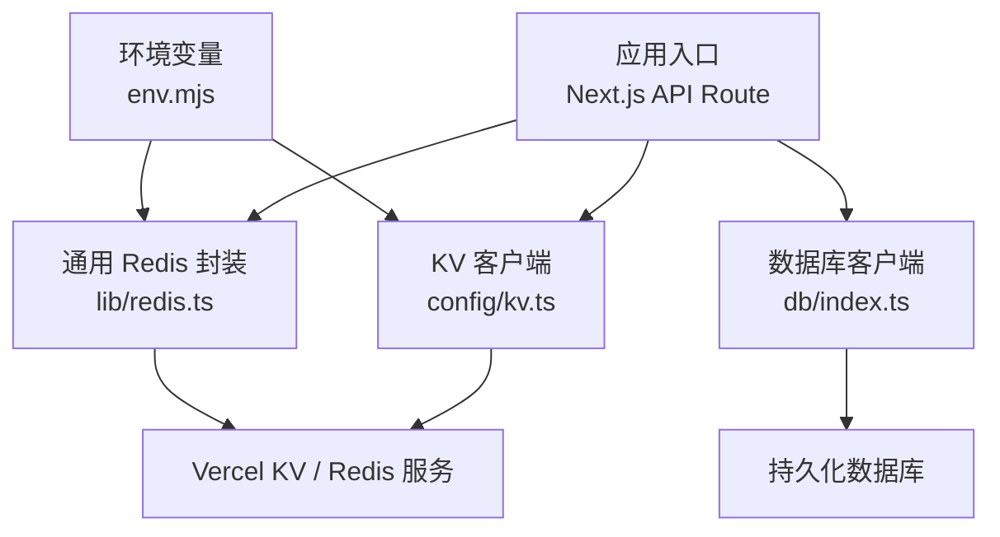
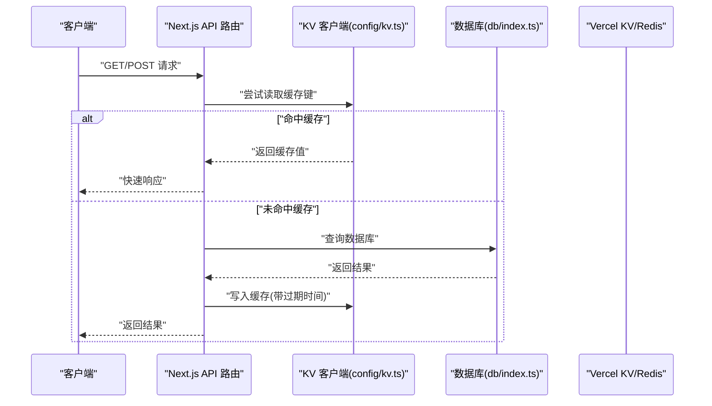
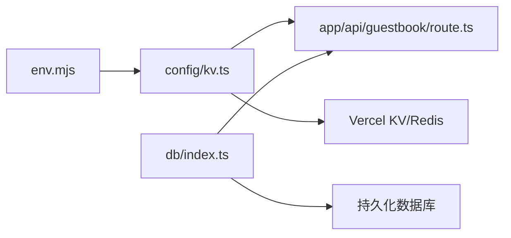

# Vercel KV 存储

<cite>
**本文引用的文件**   
- [config/kv.ts](file://config/kv.ts)
- [lib/redis.ts](file://lib/redis.ts)
- [app/api/guestbook/route.ts](file://app/api/guestbook/route.ts)
- [db/index.ts](file://db/index.ts)
- [env.mjs](file://env.mjs)
</cite>

## 目录
1. [简介](#简介)
2. [项目结构](#项目结构)
3. [核心组件](#核心组件)
4. [架构总览](#架构总览)
5. [详细组件分析](#详细组件分析)
6. [依赖关系分析](#依赖关系分析)
7. [性能考量](#性能考量)
8. [故障排查指南](#故障排查指南)
9. [结论](#结论)
10. [附录](#附录)

## 简介
本文件面向 cali.so 项目的 Vercel KV（Redis 兼容）存储集成，提供从配置、连接池管理到数据类型操作与事务处理的完整说明。文档同时覆盖缓存策略设计（热点数据缓存、分布式锁、会话存储）、序列化与过期时间设置、批量操作优化、监控与可观测性、故障恢复机制、与数据库的缓存同步与一致性保证、内存管理与清理策略，以及调试工具使用指导。

## 项目结构
本项目中与 KV/Redis 相关的代码主要分布在以下位置：
- 配置层：集中式 KV 客户端初始化与导出
- 业务层：API 路由中读写 KV 的实际用法
- 基础设施层：通用 Redis 客户端封装（如存在）
- 环境变量：KV 连接参数与环境开关

图表来源
- [config/kv.ts](file://config/kv.ts)
- [lib/redis.ts](file://lib/redis.ts)
- [app/api/guestbook/route.ts](file://app/api/guestbook/route.ts)
- [db/index.ts](file://db/index.ts)
- [env.mjs](file://env.mjs)

章节来源
- [config/kv.ts](file://config/kv.ts)
- [lib/redis.ts](file://lib/redis.ts)
- [app/api/guestbook/route.ts](file://app/api/guestbook/route.ts)
- [db/index.ts](file://db/index.ts)
- [env.mjs](file://env.mjs)

## 核心组件
- KV 客户端初始化与导出：在配置文件中创建并导出一个全局可用的 KV 实例，供各模块复用，避免重复建立连接。
- 通用 Redis 封装：若存在 lib/redis.ts，则用于统一连接参数、重试、超时、错误处理等横切关注点。
- API 路由中的 KV 使用：在 Next.js API 路由中直接调用 KV 进行读/写/删除/计数等操作，结合数据库完成读写分离或缓存加速。
- 环境变量：通过 env.mjs 注入 KV 连接地址、令牌、命名空间等关键参数。

章节来源
- [config/kv.ts](file://config/kv.ts)
- [lib/redis.ts](file://lib/redis.ts)
- [app/api/guestbook/route.ts](file://app/api/guestbook/route.ts)
- [env.mjs](file://env.mjs)

## 架构总览
下图展示了请求进入 API 后，如何协调 KV 与数据库，实现高性能读取与可靠写入。

图表来源
- [app/api/guestbook/route.ts](file://app/api/guestbook/route.ts)
- [config/kv.ts](file://config/kv.ts)
- [db/index.ts](file://db/index.ts)

## 详细组件分析

### 组件一：KV 客户端初始化与导出（config/kv.ts）
- 职责
  - 创建并导出单一 KV 实例，供全应用共享。
  - 暴露常用方法（get/set/delete/incr/hashes/lists/sets/zsets/keys/pipeline 等）。
  - 可选：封装命名空间前缀、默认过期时间、重试与超时策略。
- 连接池与并发
  - 单例模式减少连接开销；在高并发下由底层驱动维护连接池。
  - 建议为不同业务域划分命名空间，避免键冲突。
- 错误处理
  - 对网络异常、鉴权失败、限流等进行捕获与降级（例如回退至直连数据库）。
- 典型用法路径
  - 在 API 路由中导入并使用该实例进行缓存读写。

章节来源
- [config/kv.ts](file://config/kv.ts)

### 组件二：通用 Redis 封装（lib/redis.ts，如存在）
- 职责
  - 统一连接参数、TLS、集群、哨兵等高级特性。
  - 提供重试、熔断、超时、指标上报等横切能力。
- 与 config/kv.ts 的关系
  - 若 lib/redis.ts 存在，可作为底层驱动被 config/kv.ts 复用；否则 config/kv.ts 直接使用官方 SDK。
- 监控与可观测性
  - 记录慢查询、错误率、命中率等指标，便于后续优化。

章节来源
- [lib/redis.ts](file://lib/redis.ts)

### 组件三：API 路由中的 KV 使用（app/api/guestbook/route.ts）
- 职责
  - 在访客留言等场景中，优先从 KV 读取，未命中再查库并回填缓存。
  - 在写路径上，更新数据库后失效或更新相关缓存键，保证一致性。
- 事务与原子性
  - 使用 INCR/DECR 做计数器；使用 SETNX/EXPIRE 实现简单分布式锁。
  - 复杂场景可使用 MULTI/EXEC 或 Lua 脚本保证原子性。
- 示例流程（概念）
  - 读取：先查 KV，未命中则查 DB，回填 KV 并设置 TTL。
  - 写入：先写 DB，再删除或更新对应缓存键。

章节来源
- [app/api/guestbook/route.ts](file://app/api/guestbook/route.ts)

### 组件四：环境变量（env.mjs）
- 职责
  - 集中管理 KV 连接地址、令牌、命名空间、TTL 默认值、是否启用缓存等开关。
- 安全与部署
  - 敏感信息仅在生产环境注入；本地开发可通过 .env.local 覆盖。

章节来源
- [env.mjs](file://env.mjs)

## 依赖关系分析
- 耦合与内聚
  - config/kv.ts 作为 KV 访问的唯一入口，提升内聚度，降低散乱引入带来的不一致。
  - API 路由仅依赖 config/kv.ts 与 db/index.ts，职责清晰。
- 外部依赖
  - Vercel KV 或 Redis 服务端；网络稳定性与限流策略直接影响可用性。
- 潜在循环依赖
  - 确保 config/kv.ts 不反向依赖业务路由，避免循环引用。

图表来源
- [config/kv.ts](file://config/kv.ts)
- [app/api/guestbook/route.ts](file://app/api/guestbook/route.ts)
- [db/index.ts](file://db/index.ts)
- [env.mjs](file://env.mjs)

章节来源
- [config/kv.ts](file://config/kv.ts)
- [app/api/guestbook/route.ts](file://app/api/guestbook/route.ts)
- [db/index.ts](file://db/index.ts)
- [env.mjs](file://env.mjs)

## 性能考量
- 连接池与复用
  - 使用单例 KV 客户端，避免每次请求新建连接；合理设置最大连接数与空闲回收。
- 序列化与体积控制
  - 对象转 JSON 时剔除冗余字段；大对象考虑分片或压缩。
- 过期时间与缓存命中率
  - 根据数据变更频率设置合适的 TTL；热点数据适当延长，冷数据缩短。
- 批量操作
  - 使用 pipeline/mget/mset 等批量命令减少往返延迟。
- 索引与扫描
  - 避免 KEYS 命令；使用 SCAN 分页遍历，或在写入时维护二级索引键集合。
- 监控与告警
  - 统计命中率、P95/P99 延迟、错误率；对异常突增设置告警。

[本节为通用性能建议，无需特定文件来源]

## 故障排查指南
- 常见问题定位
  - 连接失败：检查环境变量、网络连通性与防火墙策略。
  - 权限不足：确认令牌与命名空间权限。
  - 限流/配额：查看平台控制台用量与速率限制。
  - 缓存穿透：为空值设置短 TTL 或使用布隆过滤器。
  - 缓存雪崩：为 TTL 增加随机抖动，避免集中过期。
- 日志与追踪
  - 在 KV 读写前后打点，记录 key、耗时、状态码与错误堆栈。
- 回退策略
  - 当 KV 不可用时，自动降级为直连数据库，保障基本可用。
- 一致性校验
  - 定期比对 KV 与数据库的关键指标（如计数），发现漂移及时修复。

章节来源
- [config/kv.ts](file://config/kv.ts)
- [app/api/guestbook/route.ts](file://app/api/guestbook/route.ts)

## 结论
通过将 KV 客户端集中配置与导出，并在 API 路由中采用“先缓存后数据库”的读取路径与“先数据库后失效缓存”的写入路径，可以在高并发场景下显著提升响应速度并降低数据库压力。配合合理的 TTL、批量操作、监控与回退策略，可在保证一致性的前提下获得更优的性能与可用性。

[本节为总结性内容，无需特定文件来源]

## 附录

### 缓存策略设计要点
- 热点数据缓存
  - 针对高频读取且变更不频繁的数据，设置较长 TTL，并结合版本号或时间戳键名避免脏读。
- 分布式锁
  - 基于 SETNX + EXPIRE 实现互斥；必要时使用 Lua 脚本保证原子性，防止死锁。
- 会话存储
  - 将用户会话以键值形式存储，设置合理 TTL，并在登出时主动删除。

[本节为概念性内容，无需特定文件来源]

### 数据模型与键设计
- 命名规范
  - 使用“模块:资源:标识”三段式命名，便于管理与批量清理。
- 过期策略
  - 按数据热度分层设置 TTL；对强一致要求高的数据采用短 TTL 或主动失效。
- 批量操作
  - 使用 pipeline 聚合多个命令，减少 RTT；注意单个管道大小与内存占用。

[本节为概念性内容，无需特定文件来源]

### 与数据库的缓存同步与一致性
- 写路径
  - 先写数据库，成功后再删除或更新缓存键；失败则回滚并记录错误。
- 读路径
  - 先读缓存，未命中再读数据库并回填缓存；空值也需设置短 TTL 防穿透。
- 补偿与巡检
  - 定时任务对比关键指标，发现不一致时触发重建或清理。

章节来源
- [app/api/guestbook/route.ts](file://app/api/guestbook/route.ts)
- [config/kv.ts](file://config/kv.ts)

### 内存管理与清理策略
- 内存水位
  - 监控 KV 内存使用率，超过阈值时触发淘汰或扩容。
- 清理策略
  - 基于命名空间前缀批量删除；对长期未访问的键设置较短 TTL。
- 容量规划
  - 预估峰值 QPS 与平均对象大小，评估所需容量与带宽。

[本节为概念性内容，无需特定文件来源]

### 缓存预热与启动流程
- 启动阶段
  - 在进程启动时异步预热关键热点键，避免首波流量冲击。
- 增量预热
  - 后台任务周期性拉取最新数据并写入 KV，保持热数据新鲜度。

[本节为概念性内容，无需特定文件来源]

### 调试工具与可观测性
- 本地调试
  - 使用 redis-cli 或图形化工具连接本地/远程 KV 实例，验证键值与 TTL。
- 指标采集
  - 采集命中率、延迟分布、错误率、QPS 等指标，接入监控系统。
- 链路追踪
  - 为每个请求分配 traceId，贯穿 API、KV、DB 三层，便于问题定位。

[本节为概念性内容，无需特定文件来源]