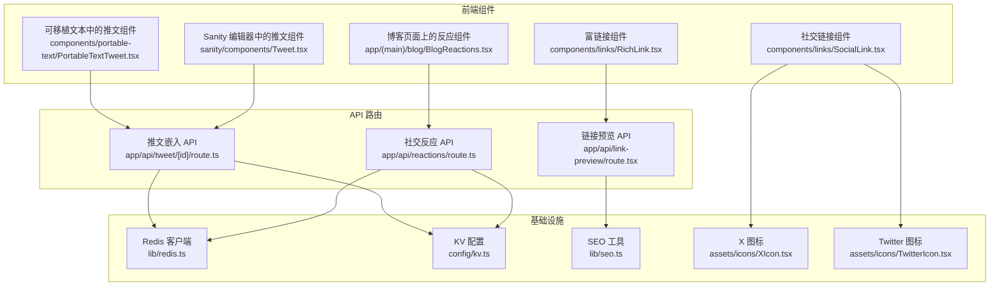
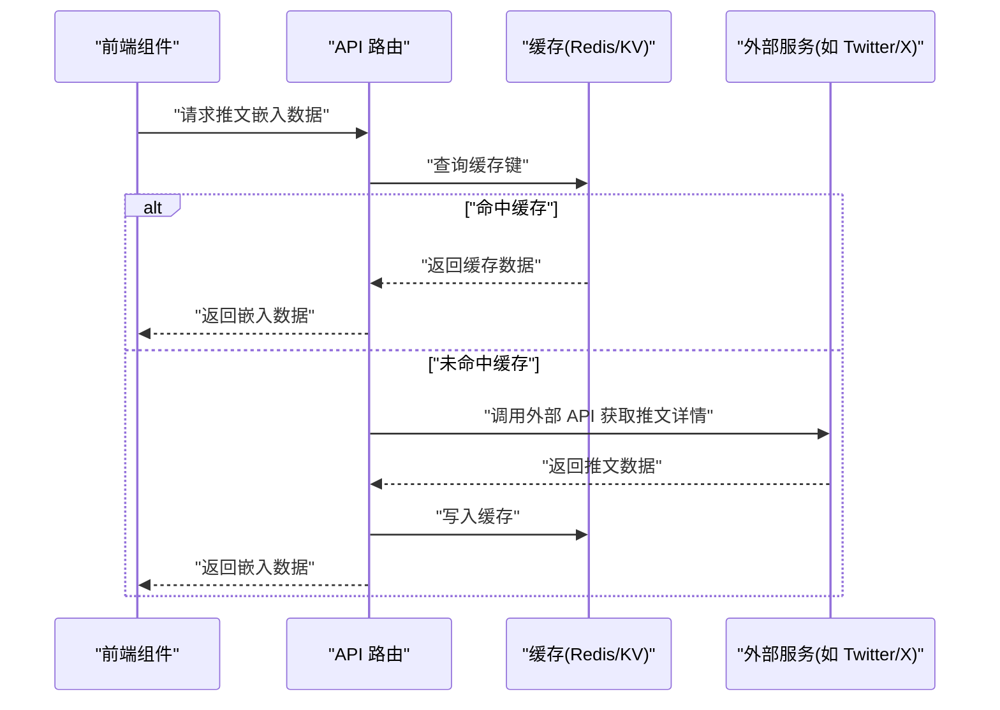
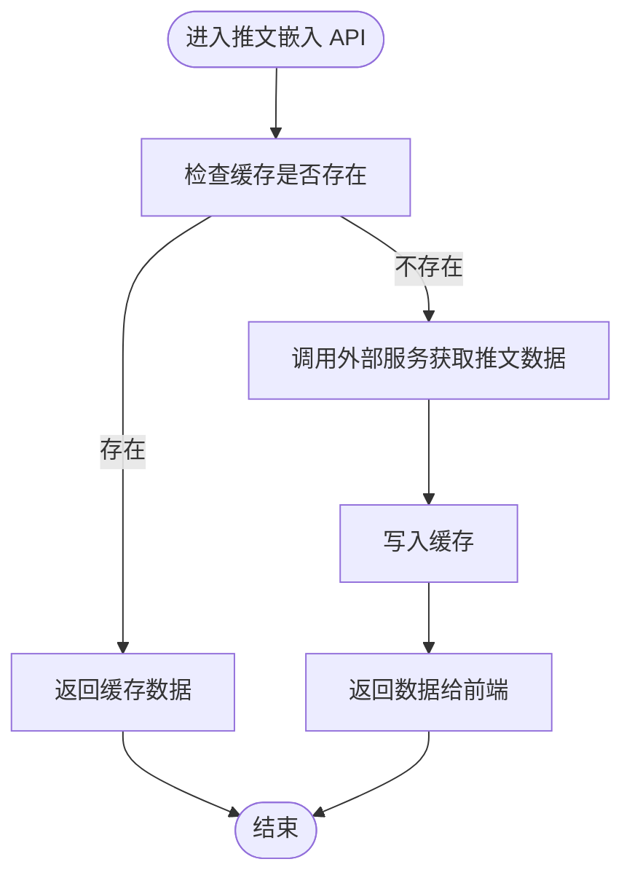
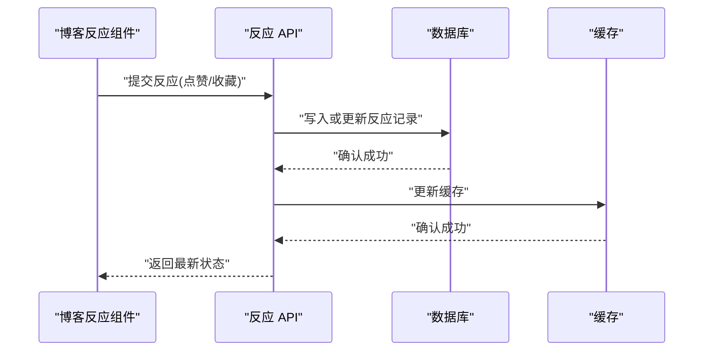
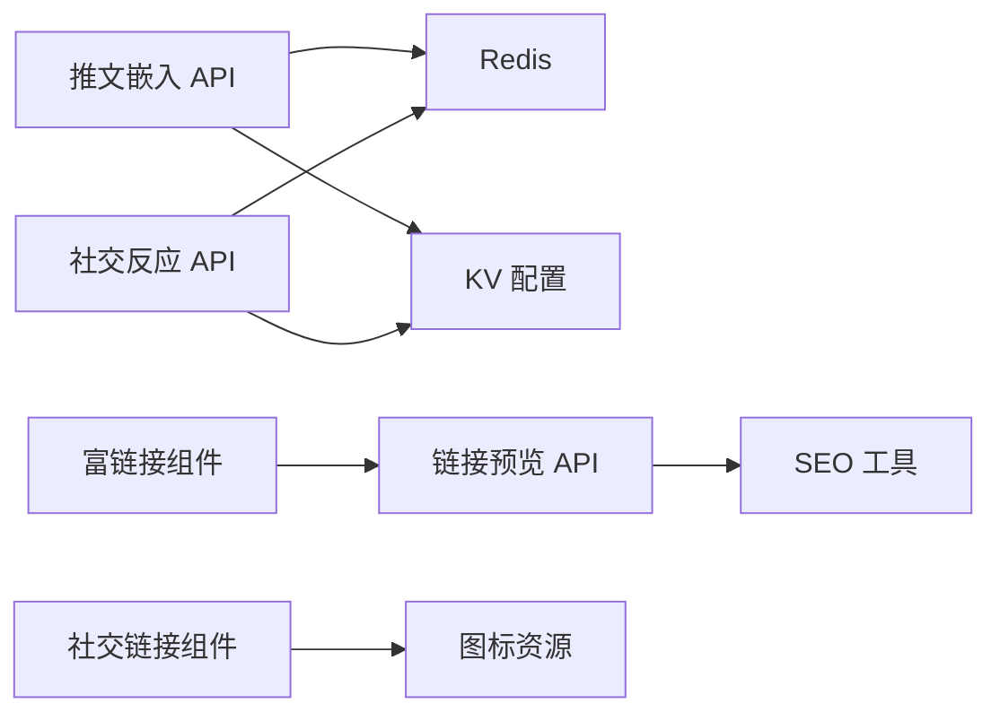
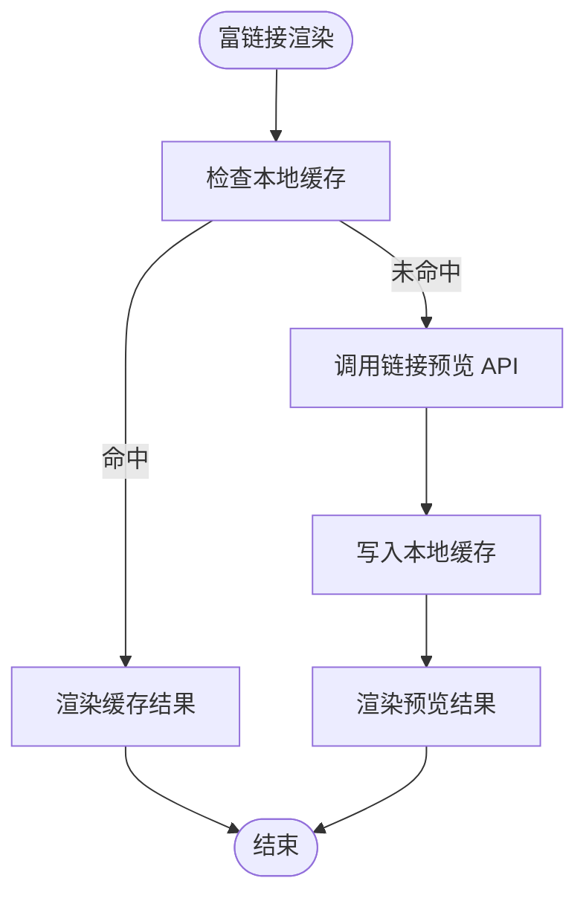

# 社交媒体集成

<cite>
**本文引用的文件**   
- [app/api/tweet/[id]/route.ts](file://app/api/tweet/[id]/route.ts)
- [components/portable-text/PortableTextTweet.tsx](file://components/portable-text/PortableTextTweet.tsx)
- [sanity/components/Tweet.tsx](file://sanity/components/Tweet.tsx)
- [app/api/reactions/route.ts](file://app/api/reactions/route.ts)
- [app/(main)/blog/BlogReactions.tsx](file://app/(main)/blog/BlogReactions.tsx)
- [lib/redis.ts](file://lib/redis.ts)
- [config/kv.ts](file://config/kv.ts)
- [app/api/link-preview/route.tsx](file://app/api/link-preview/route.tsx)
- [lib/seo.ts](file://lib/seo.ts)
- [components/links/RichLink.tsx](file://components/links/RichLink.tsx)
- [components/links/SocialLink.tsx](file://components/links/SocialLink.tsx)
- [assets/icons/XIcon.tsx](file://assets/icons/XIcon.tsx)
- [assets/icons/TwitterIcon.tsx](file://assets/icons/TwitterIcon.tsx)
</cite>

## 目录
1. [简介](#简介)
2. [项目结构](#项目结构)
3. [核心组件](#核心组件)
4. [架构总览](#架构总览)
5. [详细组件分析](#详细组件分析)
6. [依赖关系分析](#依赖关系分析)
7. [性能与缓存策略](#性能与缓存策略)
8. [限流、重试与降级](#限流重试与降级)
9. [富媒体预览与 SEO](#富媒体预览与-seo)
10. [故障排查指南](#故障排查指南)
11. [结论](#结论)

## 简介
本文件面向 cali.so 项目的社交媒体服务集成，重点覆盖以下能力：
- Twitter（X）推文嵌入与用户信息获取
- 社交分享入口与图标资源
- 社交反应系统（点赞、收藏等）的后端逻辑与前端交互
- OAuth 认证流程说明（概念性指导）
- API 限流处理与错误重试机制（通用方案）
- 数据缓存策略与性能优化技巧
- 社交媒体链接的富媒体预览、Open Graph 标签生成与 SEO 优化
- 第三方服务降级处理、备用方案与监控告警建议

## 项目结构
本项目采用 Next.js App Router 组织前后端代码。与社交媒体集成相关的核心位置如下：
- API 路由层：用于处理推文嵌入、社交反应、链接预览等后端逻辑
- 内容组件层：在博客文章或页面中渲染推文、社交分享按钮等
- 配置与工具层：Redis/KV 缓存、SEO 元数据、图标资源等

图表来源
- [app/api/tweet/[id]/route.ts](file://app/api/tweet/[id]/route.ts)
- [components/portable-text/PortableTextTweet.tsx](file://components/portable-text/PortableTextTweet.tsx)
- [sanity/components/Tweet.tsx](file://sanity/components/Tweet.tsx)
- [app/api/reactions/route.ts](file://app/api/reactions/route.ts)
- [app/(main)/blog/BlogReactions.tsx](file://app/(main)/blog/BlogReactions.tsx)
- [app/api/link-preview/route.tsx](file://app/api/link-preview/route.tsx)
- [lib/redis.ts](file://lib/redis.ts)
- [config/kv.ts](file://config/kv.ts)
- [lib/seo.ts](file://lib/seo.ts)
- [components/links/RichLink.tsx](file://components/links/RichLink.tsx)
- [components/links/SocialLink.tsx](file://components/links/SocialLink.tsx)
- [assets/icons/XIcon.tsx](file://assets/icons/XIcon.tsx)
- [assets/icons/TwitterIcon.tsx](file://assets/icons/TwitterIcon.tsx)

章节来源
- [app/api/tweet/[id]/route.ts](file://app/api/tweet/[id]/route.ts)
- [components/portable-text/PortableTextTweet.tsx](file://components/portable-text/PortableTextTweet.tsx)
- [sanity/components/Tweet.tsx](file://sanity/components/Tweet.tsx)
- [app/api/reactions/route.ts](file://app/api/reactions/route.ts)
- [app/(main)/blog/BlogReactions.tsx](file://app/(main)/blog/BlogReactions.tsx)
- [app/api/link-preview/route.tsx](file://app/api/link-preview/route.tsx)
- [lib/redis.ts](file://lib/redis.ts)
- [config/kv.ts](file://config/kv.ts)
- [lib/seo.ts](file://lib/seo.ts)
- [components/links/RichLink.tsx](file://components/links/RichLink.tsx)
- [components/links/SocialLink.tsx](file://components/links/SocialLink.tsx)
- [assets/icons/XIcon.tsx](file://assets/icons/XIcon.tsx)
- [assets/icons/TwitterIcon.tsx](file://assets/icons/TwitterIcon.tsx)

## 核心组件
- 推文嵌入 API：提供按推文 ID 获取嵌入所需数据的接口，供前端组件渲染内嵌卡片或 iframe。
- 可移植文本推文组件：在文章内容中解析并渲染推文，调用推文嵌入 API 获取数据。
- Sanity 推文组件：在内容管理系统中编辑和预览推文。
- 社交反应 API：统一处理点赞、收藏等互动行为，持久化到数据库并通过缓存加速读取。
- 博客反应组件：在文章详情页展示当前状态并提供交互操作。
- 链接预览 API：抓取目标链接的标题、描述、图片等信息，用于富媒体预览。
- SEO 工具：生成 Open Graph 标签与搜索引擎友好的元数据。
- 富链接与社交链接组件：在文章中以富链接形式展示外部链接，或在导航/侧边栏中展示社交平台入口。
- 图标资源：X 与 Twitter 图标用于社交分享按钮与链接标识。

章节来源
- [app/api/tweet/[id]/route.ts](file://app/api/tweet/[id]/route.ts)
- [components/portable-text/PortableTextTweet.tsx](file://components/portable-text/PortableTextTweet.tsx)
- [sanity/components/Tweet.tsx](file://sanity/components/Tweet.tsx)
- [app/api/reactions/route.ts](file://app/api/reactions/route.ts)
- [app/(main)/blog/BlogReactions.tsx](file://app/(main)/blog/BlogReactions.tsx)
- [app/api/link-preview/route.tsx](file://app/api/link-preview/route.tsx)
- [lib/seo.ts](file://lib/seo.ts)
- [components/links/RichLink.tsx](file://components/links/RichLink.tsx)
- [components/links/SocialLink.tsx](file://components/links/SocialLink.tsx)
- [assets/icons/XIcon.tsx](file://assets/icons/XIcon.tsx)
- [assets/icons/TwitterIcon.tsx](file://assets/icons/TwitterIcon.tsx)

## 架构总览
整体架构围绕“前端组件 -> API 路由 -> 外部服务/缓存”展开。推文嵌入与社交反应通过 API 路由聚合业务逻辑，结合 Redis/KV 缓存降低外部服务压力；链接预览与 SEO 工具负责提升社交分享体验与搜索可见性。

图表来源
- [app/api/tweet/[id]/route.ts](file://app/api/tweet/[id]/route.ts)
- [lib/redis.ts](file://lib/redis.ts)
- [config/kv.ts](file://config/kv.ts)

## 详细组件分析

### 推文嵌入与用户信息获取
- 推文嵌入 API 接收推文 ID，优先从缓存读取，未命中则调用外部服务获取数据并回写缓存。
- 前端组件在渲染时根据响应数据构建内嵌卡片或 iframe，确保在不同主题下显示一致。
- 用户信息获取通常由外部服务提供，若需要本地缓存，可通过相同缓存策略进行存储。

图表来源
- [app/api/tweet/[id]/route.ts](file://app/api/tweet/[id]/route.ts)
- [lib/redis.ts](file://lib/redis.ts)
- [config/kv.ts](file://config/kv.ts)

章节来源
- [app/api/tweet/[id]/route.ts](file://app/api/tweet/[id]/route.ts)
- [components/portable-text/PortableTextTweet.tsx](file://components/portable-text/PortableTextTweet.tsx)
- [sanity/components/Tweet.tsx](file://sanity/components/Tweet.tsx)

### 社交分享功能
- 社交分享入口通过社交链接组件与图标资源组合实现，支持跳转到 Twitter/X 等平台。
- 富链接组件可在文章内部以卡片形式展示外部链接，并可触发链接预览以提升可读性与点击率。

章节来源
- [components/links/SocialLink.tsx](file://components/links/SocialLink.tsx)
- [assets/icons/XIcon.tsx](file://assets/icons/XIcon.tsx)
- [assets/icons/TwitterIcon.tsx](file://assets/icons/TwitterIcon.tsx)
- [components/links/RichLink.tsx](file://components/links/RichLink.tsx)

### 社交反应系统（点赞、收藏等）
- 反应 API 统一处理不同反应类型，校验输入参数后更新数据库记录，并同步更新缓存以加速后续读取。
- 博客反应组件在页面加载时拉取当前用户的反应状态，并在用户交互时发起异步更新，避免整页刷新。

图表来源
- [app/api/reactions/route.ts](file://app/api/reactions/route.ts)
- [app/(main)/blog/BlogReactions.tsx](file://app/(main)/blog/BlogReactions.tsx)
- [lib/redis.ts](file://lib/redis.ts)
- [config/kv.ts](file://config/kv.ts)

章节来源
- [app/api/reactions/route.ts](file://app/api/reactions/route.ts)
- [app/(main)/blog/BlogReactions.tsx](file://app/(main)/blog/BlogReactions.tsx)

### OAuth 认证流程（概念性指导）
- 当需要访问受保护的 Twitter/X 资源时，应使用 OAuth 2.0 授权码流程或应用只读模式（取决于平台政策）。
- 典型步骤：注册应用并获取密钥 -> 引导用户授权 -> 交换授权码为访问令牌 -> 使用令牌调用受限 API。
- 安全建议：令牌仅在后端保存与使用，不暴露给前端；对敏感操作增加二次验证与速率限制。

[本节为概念性说明，不直接分析具体文件]

### API 限流处理与错误重试机制（通用方案）
- 限流策略：基于 IP 或用户 ID 的滑动窗口计数，超出阈值返回 429 并附带重试时间。
- 重试策略：指数退避 + 抖动，针对瞬时失败（网络抖动、临时限流）自动重试，设置最大重试次数与超时。
- 熔断器：当外部服务错误率超过阈值时快速失败，避免雪崩效应。

[本节为通用方案说明，不直接分析具体文件]

## 依赖关系分析
- 推文嵌入 API 依赖缓存层（Redis/KV）与外部服务。
- 社交反应 API 依赖数据库与缓存层。
- 富链接与链接预览 API 依赖 SEO 工具与外部网页抓取能力。
- 前端组件依赖图标资源与缓存层（可选）以提升交互体验。

图表来源
- [app/api/tweet/[id]/route.ts](file://app/api/tweet/[id]/route.ts)
- [app/api/reactions/route.ts](file://app/api/reactions/route.ts)
- [app/api/link-preview/route.tsx](file://app/api/link-preview/route.tsx)
- [lib/redis.ts](file://lib/redis.ts)
- [config/kv.ts](file://config/kv.ts)
- [lib/seo.ts](file://lib/seo.ts)
- [components/links/RichLink.tsx](file://components/links/RichLink.tsx)
- [components/links/SocialLink.tsx](file://components/links/SocialLink.tsx)
- [assets/icons/XIcon.tsx](file://assets/icons/XIcon.tsx)
- [assets/icons/TwitterIcon.tsx](file://assets/icons/TwitterIcon.tsx)

章节来源
- [app/api/tweet/[id]/route.ts](file://app/api/tweet/[id]/route.ts)
- [app/api/reactions/route.ts](file://app/api/reactions/route.ts)
- [app/api/link-preview/route.tsx](file://app/api/link-preview/route.tsx)
- [lib/redis.ts](file://lib/redis.ts)
- [config/kv.ts](file://config/kv.ts)
- [lib/seo.ts](file://lib/seo.ts)
- [components/links/RichLink.tsx](file://components/links/RichLink.tsx)
- [components/links/SocialLink.tsx](file://components/links/SocialLink.tsx)
- [assets/icons/XIcon.tsx](file://assets/icons/XIcon.tsx)
- [assets/icons/TwitterIcon.tsx](file://assets/icons/TwitterIcon.tsx)

## 性能与缓存策略
- 缓存键设计：为推文嵌入与反应状态设计稳定的键空间，包含必要维度（如对象 ID、用户 ID、语言等）。
- 过期策略：推文数据可按外部服务更新频率设置较短 TTL；反应状态可使用更长 TTL 并结合失效事件更新。
- 预取与懒加载：在页面初始化时预取热门推文与反应统计；长尾内容按需加载。
- 压缩与序列化：对复杂对象进行合理序列化，减少传输体积。
- 并发控制：在高并发场景下使用分布式锁或原子操作避免竞态条件。

章节来源
- [lib/redis.ts](file://lib/redis.ts)
- [config/kv.ts](file://config/kv.ts)

## 限流、重试与降级
- 限流：在 API 入口处实施基于 IP 或用户的速率限制，防止滥用与突发流量冲击。
- 重试：对外部服务调用增加指数退避与抖动，避免集中重试导致二次限流。
- 降级：当外部服务不可用时返回默认占位数据或静态卡片，保证用户体验基本可用。
- 熔断：监控错误率与延迟，达到阈值时快速失败并切换至降级路径。

[本节为通用方案说明，不直接分析具体文件]

## 富媒体预览与 SEO
- 链接预览 API 抓取目标页面的标题、描述、主图等信息，供富链接组件渲染卡片。
- SEO 工具生成 Open Graph 与 Twitter Card 元数据，提升社交平台分享时的展示效果。
- 富链接组件在渲染前可先尝试本地缓存，命中则直接返回，未命中再调用预览 API。

图表来源
- [components/links/RichLink.tsx](file://components/links/RichLink.tsx)
- [app/api/link-preview/route.tsx](file://app/api/link-preview/route.tsx)
- [lib/seo.ts](file://lib/seo.ts)

章节来源
- [components/links/RichLink.tsx](file://components/links/RichLink.tsx)
- [app/api/link-preview/route.tsx](file://app/api/link-preview/route.tsx)
- [lib/seo.ts](file://lib/seo.ts)

## 故障排查指南
- 推文嵌入失败：检查推文 ID 是否有效、外部服务是否限流、缓存键是否正确、日志是否记录异常堆栈。
- 反应状态不一致：核对数据库记录与缓存一致性，必要时强制刷新缓存并重新拉取状态。
- 链接预览不准确：确认目标页面是否提供标准 OG 标签，检查抓取超时与代理配置。
- 限流与重试：观察 429 响应与重试日志，调整退避策略与最大重试次数。
- 降级路径：验证降级数据是否展示正常，确保用户不会看到空白或错误界面。

章节来源
- [app/api/tweet/[id]/route.ts](file://app/api/tweet/[id]/route.ts)
- [app/api/reactions/route.ts](file://app/api/reactions/route.ts)
- [app/api/link-preview/route.tsx](file://app/api/link-preview/route.tsx)

## 结论
本项目通过清晰的 API 分层与缓存策略，实现了推文嵌入、社交分享与社交反应的核心能力。配合富媒体预览与 SEO 工具，提升了社交分享体验与搜索可见性。建议在后续迭代中完善限流、重试与降级的工程化实现，并引入监控告警以保障稳定性与可观测性。