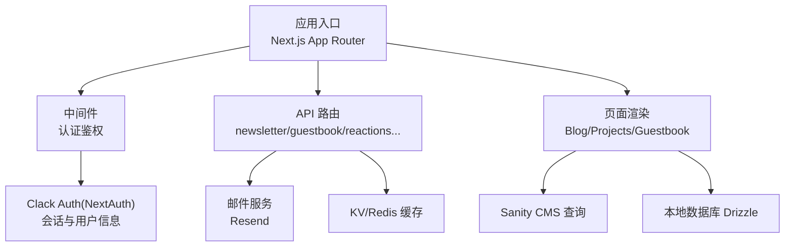
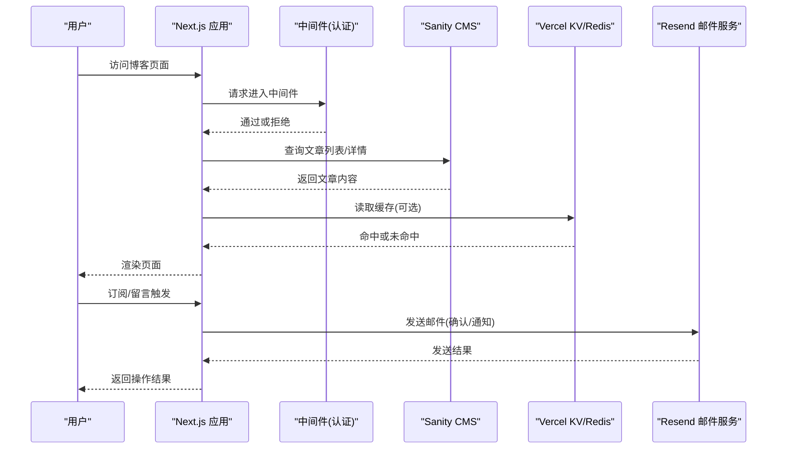
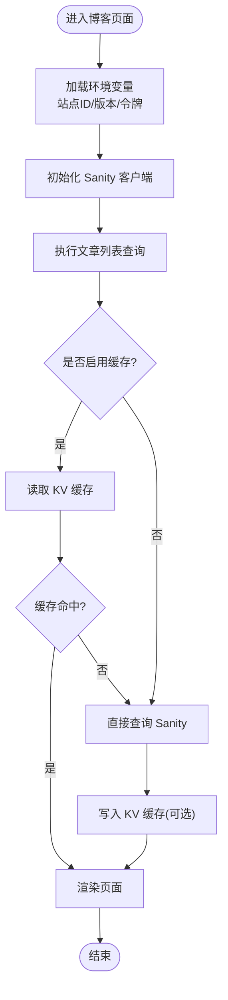
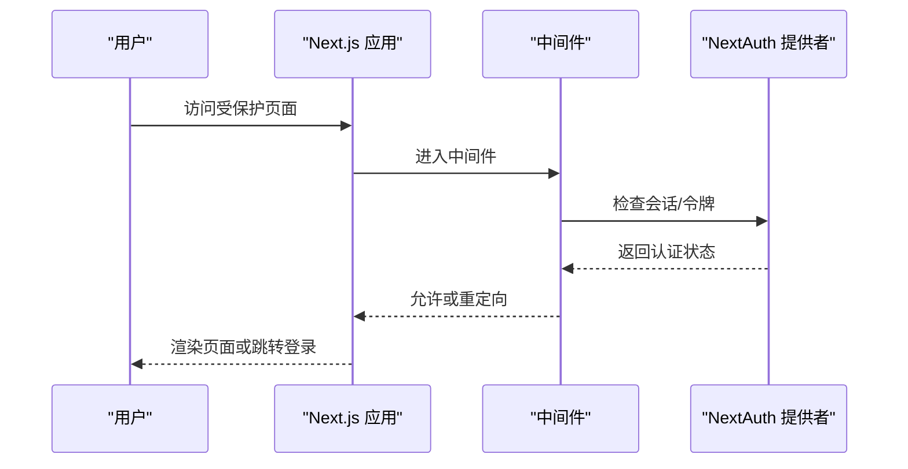
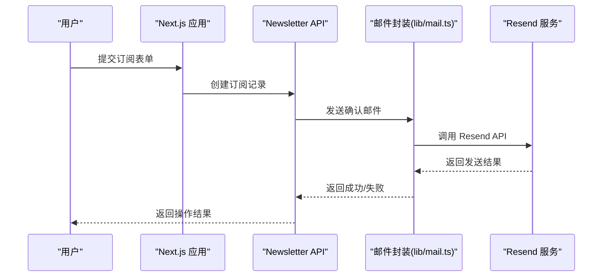
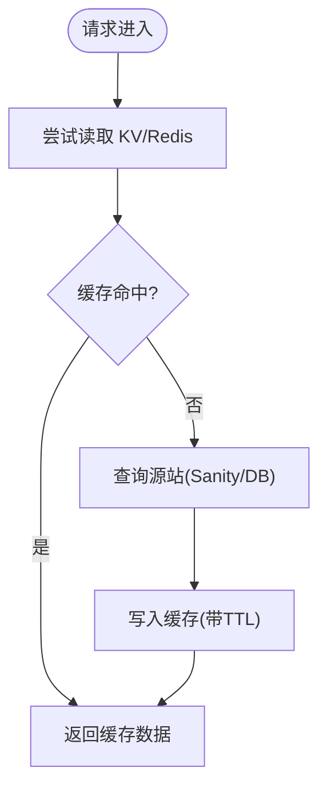
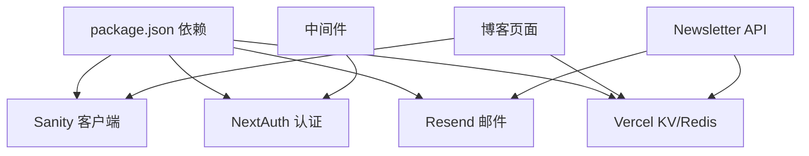

# 第三方服务集成

<cite>
**本文引用的文件**   
- [env.mjs](file://env.mjs)
- [sanity/env.ts](file://sanity/env.ts)
- [sanity/lib/client.ts](file://sanity/lib/client.ts)
- [sanity/queries.ts](file://sanity/queries.ts)
- [config/kv.ts](file://config/kv.ts)
- [lib/redis.ts](file://lib/redis.ts)
- [emails/index.tsx](file://emails/index.tsx)
- [config/email.ts](file://config/email.ts)
- [lib/mail.ts](file://lib/mail.ts)
- [app/api/newsletter/route.ts](file://app/api/newsletter/route.ts)
- [app/(main)/blog/page.tsx](file://app/(main)/blog/page.tsx)
- [app/(main)/blog/[slug]/page.tsx](file://app/(main)/blog/[slug]/page.tsx)
- [middleware.ts](file://middleware.ts)
- [package.json](file://package.json)
</cite>

## 目录
1. [简介](#简介)
2. [项目结构](#项目结构)
3. [核心组件](#核心组件)
4. [架构总览](#架构总览)
5. [详细组件分析](#详细组件分析)
6. [依赖关系分析](#依赖关系分析)
7. [性能考虑](#性能考虑)
8. [故障排查指南](#故障排查指南)
9. [结论](#结论)
10. [附录](#附录)

## 简介
本文件面向 cali.so 项目的第三方服务集成，聚焦以下外部服务：
- Sanity CMS：内容建模、查询与图片处理
- Clack Auth（基于 NextAuth）：认证与会话管理
- Resend 邮件服务：订阅确认、评论回复通知等
- Vercel KV / Redis：缓存与轻量存储
- 其他辅助能力：Next.js API 路由、中间件、环境变量与构建配置

文档将覆盖各服务的配置方法、SDK 使用模式、错误处理策略、认证流程、数据同步、缓存策略与性能优化，并提供配置示例、环境变量说明、部署注意事项、服务间依赖关系、故障转移机制、监控告警建议以及切换与降级处理的实践指导。

## 项目结构
本项目采用 Next.js App Router 组织页面与 API 路由，第三方服务相关代码主要分布在如下位置：
- 环境变量与运行时校验：根目录 env.mjs
- Sanity 客户端与查询：sanity 目录
- 邮件模板与发送封装：emails 与 lib/mail.ts、config/email.ts
- KV/Redis 配置与客户端：config/kv.ts、lib/redis.ts
- 认证中间件：middleware.ts
- 业务 API 路由：app/api/*
- 博客页面与服务端渲染：app/(main)/blog/*

图表来源
- [middleware.ts](file://middleware.ts)
- [app/api/newsletter/route.ts](file://app/api/newsletter/route.ts)
- [app/(main)/blog/page.tsx](file://app/(main)/blog/page.tsx)
- [sanity/lib/client.ts](file://sanity/lib/client.ts)
- [config/kv.ts](file://config/kv.ts)
- [lib/redis.ts](file://lib/redis.ts)
- [lib/mail.ts](file://lib/mail.ts)

章节来源
- [env.mjs](file://env.mjs)
- [package.json](file://package.json)

## 核心组件
本节概述各第三方服务的职责与在系统中的角色：
- Sanity CMS：提供博客文章、项目、分类等结构化内容的建模与查询；通过客户端 SDK 在服务端渲染时拉取数据。
- Clack Auth（NextAuth）：负责用户登录注册、会话管理与权限控制；通过中间件保护受保护路由。
- Resend 邮件服务：用于订阅确认、新留言通知、评论回复提醒等场景的邮件发送。
- Vercel KV / Redis：作为缓存层，加速热点数据读取，降低后端压力；也可用于轻量键值存储。
- 邮件模板：基于 React 组件的模板系统，统一样式与布局。

章节来源
- [sanity/lib/client.ts](file://sanity/lib/client.ts)
- [sanity/queries.ts](file://sanity/queries.ts)
- [emails/index.tsx](file://emails/index.tsx)
- [config/email.ts](file://config/email.ts)
- [lib/mail.ts](file://lib/mail.ts)
- [config/kv.ts](file://config/kv.ts)
- [lib/redis.ts](file://lib/redis.ts)
- [middleware.ts](file://middleware.ts)

## 架构总览
下图展示了从浏览器到各第三方服务的关键调用路径与数据流向。

图表来源
- [app/(main)/blog/page.tsx](file://app/(main)/blog/page.tsx)
- [app/(main)/blog/[slug]/page.tsx](file://app/(main)/blog/[slug]/page.tsx)
- [sanity/lib/client.ts](file://sanity/lib/client.ts)
- [config/kv.ts](file://config/kv.ts)
- [lib/mail.ts](file://lib/mail.ts)
- [middleware.ts](file://middleware.ts)

## 详细组件分析

### Sanity CMS 集成
- 配置与环境变量
  - 站点 ID、API 版本、令牌等通常由环境变量注入，并在 sanity/env.ts 中集中暴露给客户端初始化。
  - 客户端初始化在 sanity/lib/client.ts 中完成，对外提供 getServerSideProps 风格的查询接口。
- 查询与数据模型
  - sanity/queries.ts 定义常用查询（如文章列表、详情、分类），便于复用与一致性维护。
  - 博客页面在 app/(main)/blog 下通过服务端渲染调用这些查询获取数据。
- 图片处理
  - 使用 @sanity/image-url 进行图片 URL 生成与尺寸裁剪，提升加载性能。
- 错误处理与降级
  - 对网络异常、权限不足、查询失败等情况进行捕获并返回友好提示或空数据兜底。
  - 可结合 KV 缓存热点内容，减少重复请求。

图表来源
- [sanity/env.ts](file://sanity/env.ts)
- [sanity/lib/client.ts](file://sanity/lib/client.ts)
- [sanity/queries.ts](file://sanity/queries.ts)
- [app/(main)/blog/page.tsx](file://app/(main)/blog/page.tsx)
- [config/kv.ts](file://config/kv.ts)

章节来源
- [sanity/env.ts](file://sanity/env.ts)
- [sanity/lib/client.ts](file://sanity/lib/client.ts)
- [sanity/queries.ts](file://sanity/queries.ts)
- [app/(main)/blog/page.tsx](file://app/(main)/blog/page.tsx)
- [app/(main)/blog/[slug]/page.tsx](file://app/(main)/blog/[slug]/page.tsx)

### Clack Auth（NextAuth）认证集成
- 认证流程
  - 通过中间件 middleware.ts 对受保护路由进行鉴权，未登录用户重定向至登录页。
  - 登录/注册页面位于 app/(main)/(auth)/sign-in 与 sign-up，使用 NextAuth 提供的路由与回调。
- 会话与用户信息
  - 会话信息在中间件中解析，供页面或服务端逻辑使用。
- 错误处理与降级
  - 对 OAuth 回调失败、令牌过期、签名验证失败等进行捕获与日志记录。
  - 对于非关键功能，可在鉴权失败时提供只读模式或降级体验。

图表来源
- [middleware.ts](file://middleware.ts)
- [app/(main)/(auth)/sign-in/[[...sign-in]]/page.tsx](file://app/(main)/(auth)/sign-in/[[...sign-in]]/page.tsx)
- [app/(main)/(auth)/sign-up/[[...sign-up]]/page.tsx](file://app/(main)/(auth)/sign-up/[[...sign-up]]/page.tsx)

章节来源
- [middleware.ts](file://middleware.ts)
- [app/(main)/(auth)/sign-in/[[...sign-in]]/page.tsx](file://app/(main)/(auth)/sign-in/[[...sign-in]]/page.tsx)
- [app/(main)/(auth)/sign-up/[[...sign-up]]/page.tsx](file://app/(main)/(auth)/sign-up/[[...sign-up]]/page.tsx)

### Resend 邮件服务集成
- 配置与环境变量
  - 邮件服务凭据与发件人地址通常在环境变量中配置，并通过 config/email.ts 暴露。
- 模板与发送
  - 邮件模板位于 emails 目录，使用 React 组件渲染；lib/mail.ts 封装发送逻辑，统一错误处理与重试策略。
- 使用场景
  - 订阅确认：用户在 newsletter 订阅后发送确认链接。
  - 通知：新留言、评论回复等事件触发邮件通知。
- 错误处理与降级
  - 对发送失败进行捕获与日志记录；必要时异步队列重试或延迟重试。
  - 在邮件服务不可用时，可降级为仅记录日志或本地队列。

图表来源
- [config/email.ts](file://config/email.ts)
- [emails/index.tsx](file://emails/index.tsx)
- [lib/mail.ts](file://lib/mail.ts)
- [app/api/newsletter/route.ts](file://app/api/newsletter/route.ts)

章节来源
- [config/email.ts](file://config/email.ts)
- [emails/index.tsx](file://emails/index.tsx)
- [lib/mail.ts](file://lib/mail.ts)
- [app/api/newsletter/route.ts](file://app/api/newsletter/route.ts)

### Vercel KV / Redis 缓存集成
- 配置与环境变量
  - KV 连接字符串或 Redis 地址通过环境变量注入，config/kv.ts 与 lib/redis.ts 分别封装不同后端。
- 使用模式
  - 在博客列表、热门帖子、活动信息等热点数据处使用 KV/Redis 缓存，减少重复查询。
  - 设置合理的 TTL 与失效策略，确保数据一致性与时效性平衡。
- 错误处理与降级
  - 对连接失败、超时、限流等异常进行捕获；在缓存不可用时回退到直连源站。
  - 记录关键指标以便监控与告警。

图表来源
- [config/kv.ts](file://config/kv.ts)
- [lib/redis.ts](file://lib/redis.ts)
- [sanity/lib/client.ts](file://sanity/lib/client.ts)

章节来源
- [config/kv.ts](file://config/kv.ts)
- [lib/redis.ts](file://lib/redis.ts)

### 环境变量与运行时校验
- 集中式环境变量
  - env.mjs 负责导入与校验关键环境变量，确保运行期缺失或非法值时快速失败。
- 安全与部署
  - 敏感信息（如邮件凭据、CMS 令牌、KV 连接串）必须通过平台环境变量注入，避免硬编码。
  - 在 CI/CD 中校验必要变量存在性，防止部署后运行时崩溃。

章节来源
- [env.mjs](file://env.mjs)

## 依赖关系分析
- 模块耦合
  - 页面与 API 路由依赖中间件进行鉴权。
  - 博客页面依赖 Sanity 客户端与查询；可结合 KV 缓存。
  - Newsletter API 依赖邮件封装与 Resend 服务。
- 外部依赖
  - package.json 中声明了 Sanity、Resend、NextAuth、Drizzle 等依赖库。
- 潜在循环依赖
  - 保持配置与客户端初始化分离，避免页面与工具模块相互引用造成循环。

图表来源
- [package.json](file://package.json)
- [app/(main)/blog/page.tsx](file://app/(main)/blog/page.tsx)
- [app/api/newsletter/route.ts](file://app/api/newsletter/route.ts)
- [middleware.ts](file://middleware.ts)

章节来源
- [package.json](file://package.json)

## 性能考虑
- 缓存策略
  - 对高频读取的数据（文章列表、热门内容）使用 KV/Redis 缓存，合理设置 TTL。
  - 使用 Sanity 的图片处理参数进行按需裁剪与压缩，减少带宽消耗。
- 并发与限流
  - 对邮件发送与外部 API 调用增加重试与退避策略，避免雪崩。
  - 在 API 路由中加入基础限流与速率限制，防止滥用。
- 资源优化
  - 服务端渲染时尽量合并查询，减少往返次数。
  - 静态资源与字体预加载，提升首屏性能。

[本节为通用性能建议，不直接分析具体文件]

## 故障排查指南
- 常见问题定位
  - 环境变量缺失：检查 env.mjs 的校验输出与平台环境变量配置。
  - 认证失败：查看中间件日志与 NextAuth 回调错误，确认密钥与域名配置。
  - 邮件发送失败：核对 Resend 凭据、发件人域名与 SPF/DKIM 配置，查看 lib/mail.ts 的错误日志。
  - 缓存不可用：检查 KV/Redis 连接字符串与网络连通性，确认降级逻辑生效。
- 监控与告警
  - 对关键外部调用（Sanity、Resend、KV/Redis）添加成功率与耗时指标。
  - 设置阈值告警，当错误率或延迟异常升高时及时通知。
- 调试技巧
  - 在开发环境开启详细日志；在生产环境保留关键上下文（如请求 ID、用户标识）。
  - 使用沙箱或测试账号模拟异常场景，验证降级与恢复流程。

章节来源
- [env.mjs](file://env.mjs)
- [middleware.ts](file://middleware.ts)
- [lib/mail.ts](file://lib/mail.ts)
- [config/kv.ts](file://config/kv.ts)
- [lib/redis.ts](file://lib/redis.ts)

## 结论
通过对 Sanity CMS、Clack Auth（NextAuth）、Resend 邮件服务与 Vercel KV/Redis 的系统化集成，cali.so 实现了稳定的内容管理、安全的认证流程、可靠的邮件通知与高效的缓存策略。建议在部署前完善环境变量校验与监控告警，持续优化缓存命中率与错误恢复机制，以提升整体用户体验与系统韧性。

[本节为总结性内容，不直接分析具体文件]

## 附录
- 配置清单与环境变量
  - Sanity：站点 ID、API 版本、令牌
  - Resend：API Key、发件人邮箱与域名
  - KV/Redis：连接字符串或地址、密码
  - NextAuth：密钥、回调 URL、提供商配置
- 部署注意事项
  - 在平台环境中注入所有敏感变量
  - 校验必要变量存在性后再启动服务
  - 灰度发布与回滚策略，确保外部服务变更不影响主流程

[本节为补充信息，不直接分析具体文件]