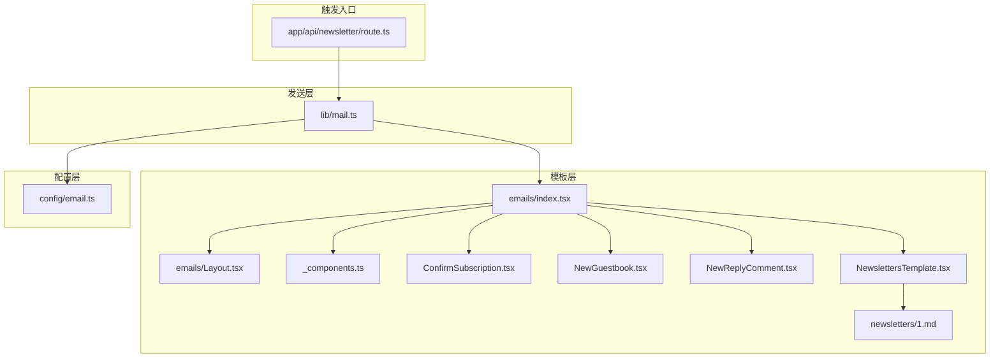
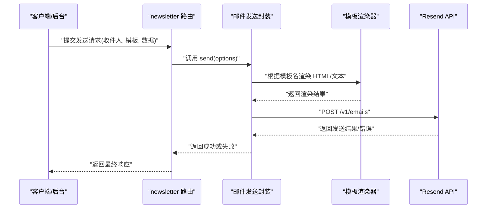
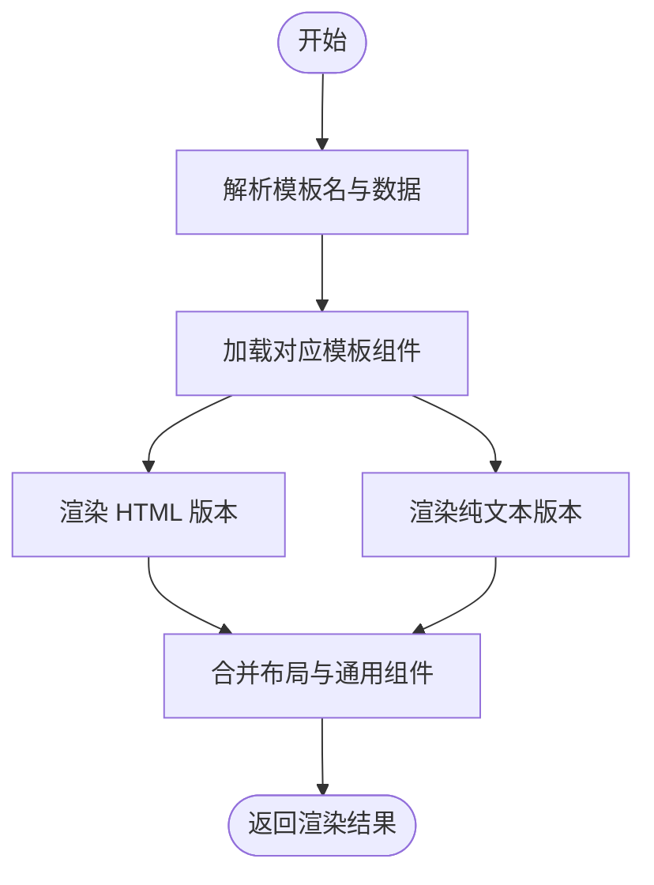
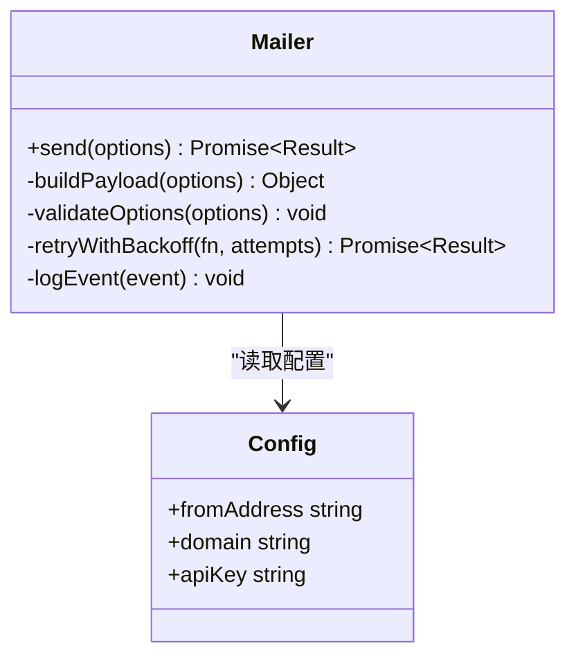
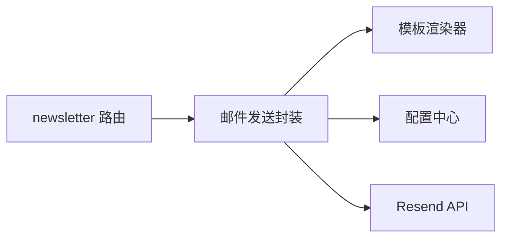

# 邮件服务集成

<cite>
**本文引用的文件**   
- [emails/index.tsx](file://emails/index.tsx)
- [emails/Layout.tsx](file://emails/Layout.tsx)
- [emails/ConfirmSubscription.tsx](file://emails/ConfirmSubscription.tsx)
- [emails/NewGuestbook.tsx](file://emails/NewGuestbook.tsx)
- [emails/NewReplyComment.tsx](file://emails/NewReplyComment.tsx)
- [emails/NewslettersTemplate.tsx](file://emails/NewslettersTemplate.tsx)
- [emails/_components.ts](file://emails/_components.ts)
- [emails/newsletters/1.md](file://emails/newsletters/1.md)
- [lib/mail.ts](file://lib/mail.ts)
- [config/email.ts](file://config/email.ts)
- [app/api/newsletter/route.ts](file://app/api/newsletter/route.ts)
</cite>

## 目录
1. [简介](#简介)
2. [项目结构](#项目结构)
3. [核心组件](#核心组件)
4. [架构总览](#架构总览)
5. [详细组件分析](#详细组件分析)
6. [依赖关系分析](#依赖关系分析)
7. [性能与可靠性](#性能与可靠性)
8. [故障排查指南](#故障排查指南)
9. [结论](#结论)
10. [附录：模板语法与变量](#附录模板语法与变量)

## 简介
本文件面向 cali.so 项目的邮件服务集成，聚焦于基于 Resend API 的邮件发送能力。文档覆盖以下主题：
- 邮件模板设计与动态内容渲染（含条件渲染、列表渲染）
- 批量发送与队列管理
- 订阅确认、新留言通知、新闻通讯等典型场景
- 样式定制与响应式策略
- 附件处理与错误重试机制
- 模板测试与预览建议
- 发送状态跟踪与失败处理策略

## 项目结构
邮件相关代码主要分布在三个区域：
- 模板层：位于 emails 目录，包含布局、通用组件与各业务模板
- 发送层：位于 lib/mail.ts，封装 Resend 客户端调用、参数校验与错误处理
- 配置层：位于 config/email.ts，集中管理域名、发件人、API Key 等环境变量

图表来源
- [emails/index.tsx](file://emails/index.tsx)
- [emails/Layout.tsx](file://emails/Layout.tsx)
- [emails/_components.ts](file://emails/_components.ts)
- [emails/ConfirmSubscription.tsx](file://emails/ConfirmSubscription.tsx)
- [emails/NewGuestbook.tsx](file://emails/NewGuestbook.tsx)
- [emails/NewReplyComment.tsx](file://emails/NewReplyComment.tsx)
- [emails/NewslettersTemplate.tsx](file://emails/NewslettersTemplate.tsx)
- [emails/newsletters/1.md](file://emails/newsletters/1.md)
- [lib/mail.ts](file://lib/mail.ts)
- [config/email.ts](file://config/email.ts)
- [app/api/newsletter/route.ts](file://app/api/newsletter/route.ts)

章节来源
- [emails/index.tsx](file://emails/index.tsx)
- [emails/Layout.tsx](file://emails/Layout.tsx)
- [emails/_components.ts](file://emails/_components.ts)
- [emails/ConfirmSubscription.tsx](file://emails/ConfirmSubscription.tsx)
- [emails/NewGuestbook.tsx](file://emails/NewGuestbook.tsx)
- [emails/NewReplyComment.tsx](file://emails/NewReplyComment.tsx)
- [emails/NewslettersTemplate.tsx](file://emails/NewslettersTemplate.tsx)
- [emails/newsletters/1.md](file://emails/newsletters/1.md)
- [lib/mail.ts](file://lib/mail.ts)
- [config/email.ts](file://config/email.ts)
- [app/api/newsletter/route.ts](file://app/api/newsletter/route.ts)

## 核心组件
- 模板索引与路由选择：通过统一入口根据模板名解析并渲染对应模板，支持传入数据对象进行变量替换与条件渲染。
- 布局组件：提供统一的头部、尾部、基础样式与响应式容器，确保各模板一致体验。
- 通用 UI 组件：按钮、卡片、分隔线、图片等可复用元素，便于在模板中组合使用。
- 业务模板：
  - 订阅确认：用于用户订阅后的确认链接点击验证流程。
  - 新留言通知：当访客在留言板留下新评论时通知管理员或作者。
  - 回复评论通知：当有人回复某条评论时通知原评论者。
  - 新闻通讯：支持 Markdown 内容与富文本混合排版，适合周期性推送。
- 发送封装：对 Resend 客户端进行封装，负责构建请求体、设置默认发件人与域名、处理错误与重试。
- 配置中心：集中读取环境变量，如发件人地址、域名、Resend API Key 等。

章节来源
- [emails/index.tsx](file://emails/index.tsx)
- [emails/Layout.tsx](file://emails/Layout.tsx)
- [emails/_components.ts](file://emails/_components.ts)
- [emails/ConfirmSubscription.tsx](file://emails/ConfirmSubscription.tsx)
- [emails/NewGuestbook.tsx](file://emails/NewGuestbook.tsx)
- [emails/NewReplyComment.tsx](file://emails/NewReplyComment.tsx)
- [emails/NewslettersTemplate.tsx](file://emails/NewslettersTemplate.tsx)
- [lib/mail.ts](file://lib/mail.ts)
- [config/email.ts](file://config/email.ts)

## 架构总览
整体流程由业务入口触发，经发送封装调用 Resend API，模板层负责将数据渲染为 HTML 或纯文本。

图表来源
- [app/api/newsletter/route.ts](file://app/api/newsletter/route.ts)
- [lib/mail.ts](file://lib/mail.ts)
- [emails/index.tsx](file://emails/index.tsx)

## 详细组件分析

### 模板渲染与分发
- 功能要点
  - 按模板名动态加载对应组件
  - 将数据对象注入到模板上下文，实现变量替换与条件渲染
  - 支持同时生成 HTML 与纯文本版本，提升兼容性
- 关键路径
  - 模板入口：[emails/index.tsx](file://emails/index.tsx)
  - 布局与通用组件：[emails/Layout.tsx](file://emails/Layout.tsx)、[emails/_components.ts](file://emails/_components.ts)

图表来源
- [emails/index.tsx](file://emails/index.tsx)
- [emails/Layout.tsx](file://emails/Layout.tsx)
- [emails/_components.ts](file://emails/_components.ts)

章节来源
- [emails/index.tsx](file://emails/index.tsx)
- [emails/Layout.tsx](file://emails/Layout.tsx)
- [emails/_components.ts](file://emails/_components.ts)

### 订阅确认模板 ConfirmSubscription
- 用途：用户完成订阅后，通过邮件中的确认链接完成二次确认，防止误订阅与垃圾注册。
- 设计要点
  - 包含唯一令牌与过期时间提示
  - 明确的操作引导与回退说明
  - 适配移动端阅读习惯
- 关键路径
  - 模板文件：[emails/ConfirmSubscription.tsx](file://emails/ConfirmSubscription.tsx)

章节来源
- [emails/ConfirmSubscription.tsx](file://emails/ConfirmSubscription.tsx)

### 新留言通知 NewGuestbook
- 用途：当访客在留言板发布新留言时，向管理员或作者发送邮件提醒。
- 设计要点
  - 高亮显示留言内容与来源信息
  - 提供快速查看链接
  - 避免过长内容导致邮件体积过大
- 关键路径
  - 模板文件：[emails/NewGuestbook.tsx](file://emails/NewGuestbook.tsx)

章节来源
- [emails/NewGuestbook.tsx](file://emails/NewGuestbook.tsx)

### 回复评论通知 NewReplyComment
- 用途：当有人回复某条评论时，通知原评论者参与讨论。
- 设计要点
  - 展示被回复的原文片段与最新回复
  - 提供直达对话页的链接
  - 控制通知频率，避免打扰
- 关键路径
  - 模板文件：[emails/NewReplyComment.tsx](file://emails/NewReplyComment.tsx)

章节来源
- [emails/NewReplyComment.tsx](file://emails/NewReplyComment.tsx)

### 新闻通讯 NewslettersTemplate
- 用途：周期性推送文章摘要、更新日志或专题内容。
- 设计要点
  - 支持 Markdown 内容渲染，便于编辑与维护
  - 提供封面图、目录与内链跳转
  - 兼容不同邮箱客户端的样式差异
- 关键路径
  - 模板文件：[emails/NewslettersTemplate.tsx](file://emails/NewslettersTemplate.tsx)
  - 示例内容：[emails/newsletters/1.md](file://emails/newsletters/1.md)

章节来源
- [emails/NewslettersTemplate.tsx](file://emails/NewslettersTemplate.tsx)
- [emails/newsletters/1.md](file://emails/newsletters/1.md)

### 邮件发送封装 lib/mail.ts
- 功能要点
  - 封装 Resend 客户端初始化与调用
  - 构建标准请求体：发件人、收件人、主题、HTML/文本正文、可选附件
  - 错误分类与重试策略（网络超时、速率限制、认证失败等）
  - 日志记录与指标上报（可选）
- 关键路径
  - 发送封装：[lib/mail.ts](file://lib/mail.ts)
  - 配置中心：[config/email.ts](file://config/email.ts)

图表来源
- [lib/mail.ts](file://lib/mail.ts)
- [config/email.ts](file://config/email.ts)

章节来源
- [lib/mail.ts](file://lib/mail.ts)
- [config/email.ts](file://config/email.ts)

### 触发入口 app/api/newsletter/route.ts
- 功能要点
  - 接收前端或后台的发送请求
  - 校验输入参数（收件人列表、模板名、数据对象）
  - 调用发送封装执行批量发送
  - 返回发送结果与错误信息
- 关键路径
  - 路由文件：[app/api/newsletter/route.ts](file://app/api/newsletter/route.ts)

章节来源
- [app/api/newsletter/route.ts](file://app/api/newsletter/route.ts)

## 依赖关系分析
- 模块耦合
  - 模板层与发送层解耦：模板仅负责渲染，发送层负责协议与网络
  - 配置集中化：所有敏感信息与域名策略集中在配置层
- 外部依赖
  - Resend API：作为唯一的外部邮件通道
- 潜在风险
  - 模板渲染异常导致发送失败
  - 第三方 API 限流或不可用
  - 大附件或超长正文影响送达率

图表来源
- [app/api/newsletter/route.ts](file://app/api/newsletter/route.ts)
- [lib/mail.ts](file://lib/mail.ts)
- [emails/index.tsx](file://emails/index.tsx)
- [config/email.ts](file://config/email.ts)

章节来源
- [app/api/newsletter/route.ts](file://app/api/newsletter/route.ts)
- [lib/mail.ts](file://lib/mail.ts)
- [emails/index.tsx](file://emails/index.tsx)
- [config/email.ts](file://config/email.ts)

## 性能与可靠性
- 批量发送
  - 分批投递：将大批量收件人拆分为若干批次，降低单次请求体积与失败面
  - 并发控制：限制并发度，避免触发第三方限流
  - 去重策略：对重复收件人或相同内容进行去重，减少冗余发送
- 队列管理
  - 任务入队：将发送任务持久化到队列存储，保证幂等与可恢复
  - 消费重试：结合指数退避与最大重试次数，自动重试瞬时错误
  - 死信队列：对多次失败的邮件进入死信队列，人工介入处理
- 状态跟踪
  - 事件回调：监听已投递、打开、点击、退订等事件，更新数据库状态
  - 审计日志：记录每次发送的请求与响应摘要，便于问题定位
- 错误重试机制
  - 网络错误：立即重试一次，随后指数退避
  - 速率限制：等待一段时间后重试，遵循服务端返回的重试间隔
  - 认证失败：不重试，直接告警并停止后续发送
- 模板优化
  - 控制图片大小与数量，优先使用外链与压缩
  - 精简 HTML 与 CSS，避免复杂布局
  - 提供纯文本降级版本，提高可达性

[本节为通用指导，无需具体文件引用]

## 故障排查指南
- 常见问题
  - 模板渲染失败：检查模板名称与数据结构是否匹配，确认必要字段存在
  - 发送失败：核对发件人域名与 API Key 配置，查看 Resend 控制台错误码
  - 附件过大：拆分附件或改用外链，避免超过服务商限制
  - 送达率低：检查主题行与正文是否包含敏感词，优化标题与预览文案
- 调试建议
  - 启用详细日志：记录请求体、响应体与异常堆栈
  - 沙箱模式：使用测试域名与模拟收件人，避免真实发送
  - 灰度发布：先对小范围用户发送，观察送达与交互指标
- 监控与告警
  - 成功率与失败率阈值告警
  - 平均发送耗时与 P95/P99 延迟告警
  - 第三方 API 可用性监控

[本节为通用指导，无需具体文件引用]

## 结论
通过将模板渲染与发送逻辑解耦，并结合配置集中化与错误重试策略，本项目实现了稳定、可扩展的邮件服务集成。建议在后续迭代中完善队列与状态跟踪，持续优化模板性能与送达率，以提升用户体验与运营效率。

[本节为总结，无需具体文件引用]

## 附录：模板语法与变量
- 变量替换
  - 在模板中使用占位符表示变量，例如用户名、链接、日期等
  - 推荐在发送前进行空值与类型校验，避免渲染异常
- 条件渲染
  - 根据数据字段决定是否显示某段内容，例如“若存在附件则显示下载提示”
- 列表渲染
  - 遍历数组生成条目，适用于评论列表、文章摘要等
- 示例参考
  - 订阅确认模板：[emails/ConfirmSubscription.tsx](file://emails/ConfirmSubscription.tsx)
  - 新留言通知模板：[emails/NewGuestbook.tsx](file://emails/NewGuestbook.tsx)
  - 回复评论通知模板：[emails/NewReplyComment.tsx](file://emails/NewReplyComment.tsx)
  - 新闻通讯模板与示例内容：[emails/NewslettersTemplate.tsx](file://emails/NewslettersTemplate.tsx)、[emails/newsletters/1.md](file://emails/newsletters/1.md)

章节来源
- [emails/ConfirmSubscription.tsx](file://emails/ConfirmSubscription.tsx)
- [emails/NewGuestbook.tsx](file://emails/NewGuestbook.tsx)
- [emails/NewReplyComment.tsx](file://emails/NewReplyComment.tsx)
- [emails/NewslettersTemplate.tsx](file://emails/NewslettersTemplate.tsx)
- [emails/newsletters/1.md](file://emails/newsletters/1.md)