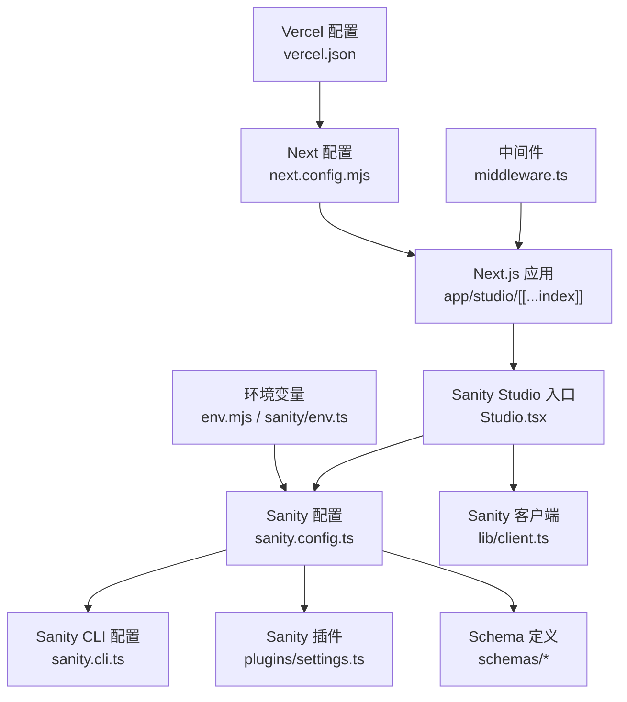
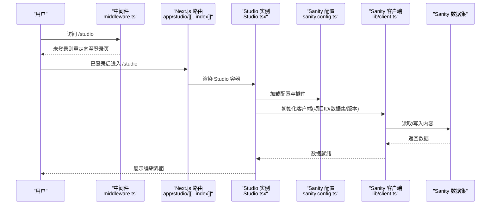
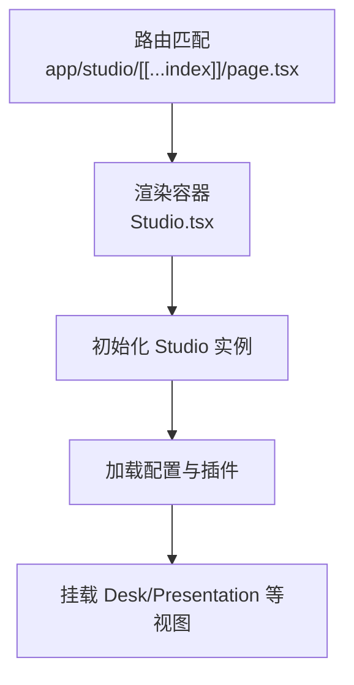
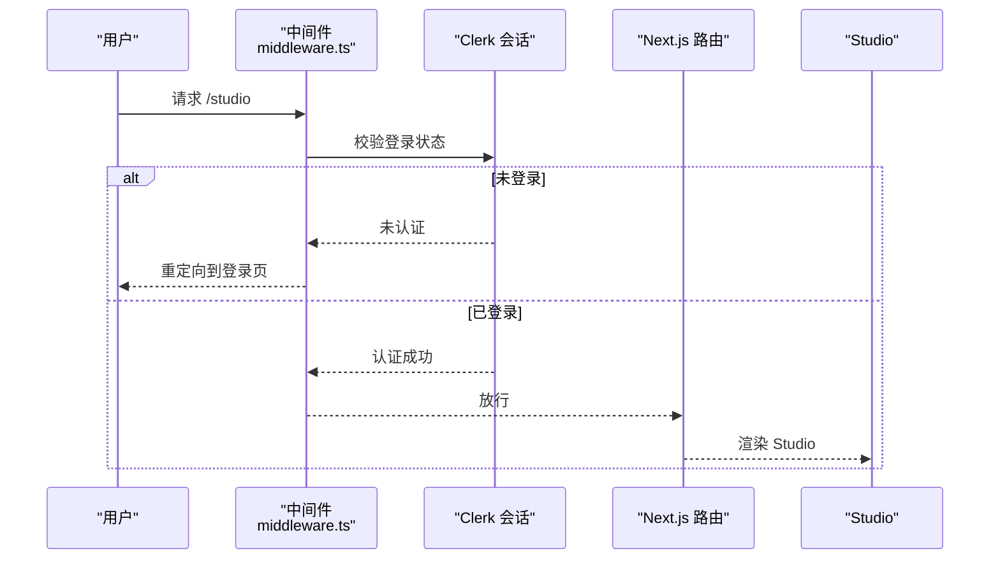
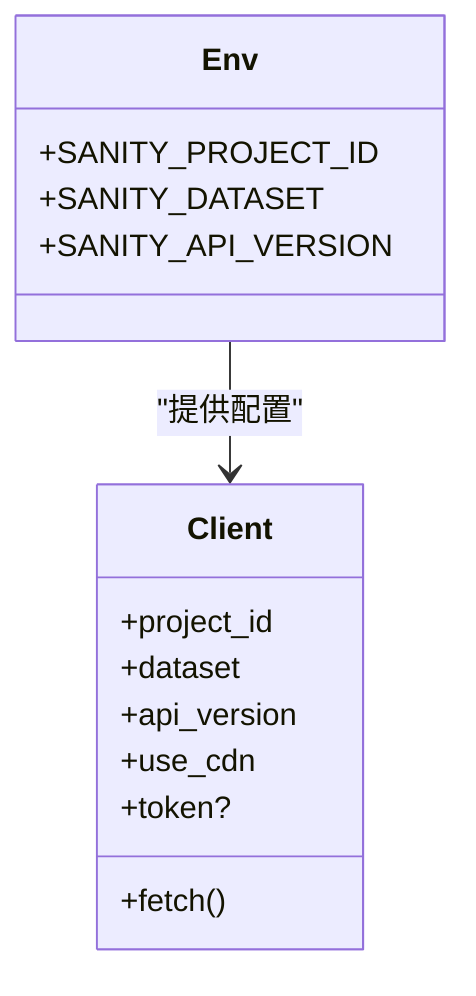
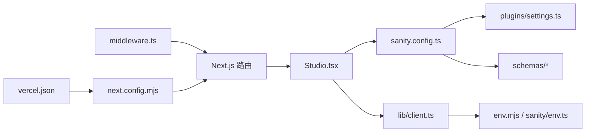

# Sanity CMS 配置

<cite>
**本文引用的文件**
- [sanity.config.ts](file://sanity.config.ts)
- [sanity.cli.ts](file://sanity.cli.ts)
- [app/studio/[[...index]]/page.tsx](file://app/studio/[[...index]]/page.tsx)
- [app/studio/[[...index]]/Studio.tsx](file://app/studio/[[...index]]/Studio.tsx)
- [middleware.ts](file://middleware.ts)
- [next.config.mjs](file://next.config.mjs)
- [vercel.json](file://vercel.json)
- [env.mjs](file://env.mjs)
- [sanity/env.ts](file://sanity/env.ts)
- [sanity/lib/client.ts](file://sanity/lib/client.ts)
- [sanity/plugins/settings.ts](file://sanity/plugins/settings.ts)
- [sanity/schemas/post.ts](file://sanity/schemas/post.ts)
- [sanity/schemas/blockContent.ts](file://sanity/schemas/blockContent.ts)
</cite>

## 目录
1. [简介](#简介)
2. [项目结构](#项目结构)
3. [核心组件](#核心组件)
4. [架构总览](#架构总览)
5. [详细组件分析](#详细组件分析)
6. [依赖关系分析](#依赖关系分析)
7. [性能与部署优化](#性能与部署优化)
8. [故障排除指南](#故障排除指南)
9. [结论](#结论)
10. [附录](#附录)

## 简介
本文件面向 cali.so 项目中基于 Next.js App Router 的 Sanity Studio 集成，系统性梳理并解释以下方面：
- sanity.config.ts 的核心配置项（项目设置、插件、部署参数）
- Next.js App Router 中 Studio 的路由与中间件处理
- 认证集成策略（以 Clerk 为例）
- 开发环境配置、生产部署与 CDN 优化
- 多语言支持、权限管理与自定义主题的配置思路
- 与 Vercel 集成的最佳实践与环境变量管理
- 常见问题排查与性能调优建议

## 项目结构
Sanity 相关代码主要分布在以下位置：
- 根级配置：sanity.config.ts、sanity.cli.ts
- Next.js App Router 路由：app/studio/[[...index]]/page.tsx、app/studio/[[...index]]/Studio.tsx
- 中间件：middleware.ts
- Next.js 构建与部署：next.config.mjs、vercel.json
- 环境变量：env.mjs、sanity/env.ts
- Sanity 客户端与工具：sanity/lib/client.ts
- 插件与 Schema：sanity/plugins/settings.ts、sanity/schemas/*

图表来源
- [sanity.config.ts](file://sanity.config.ts)
- [sanity.cli.ts](file://sanity.cli.ts)
- [app/studio/[[...index]]/page.tsx](file://app/studio/[[...index]]/page.tsx)
- [app/studio/[[...index]]/Studio.tsx](file://app/studio/[[...index]]/Studio.tsx)
- [sanity/plugins/settings.ts](file://sanity/plugins/settings.ts)
- [sanity/schemas/post.ts](file://sanity/schemas/post.ts)
- [sanity/schemas/blockContent.ts](file://sanity/schemas/blockContent.ts)
- [sanity/lib/client.ts](file://sanity/lib/client.ts)
- [middleware.ts](file://middleware.ts)
- [next.config.mjs](file://next.config.mjs)
- [vercel.json](file://vercel.json)
- [env.mjs](file://env.mjs)
- [sanity/env.ts](file://sanity/env.ts)

章节来源
- [sanity.config.ts](file://sanity.config.ts)
- [sanity.cli.ts](file://sanity.cli.ts)
- [app/studio/[[...index]]/page.tsx](file://app/studio/[[...index]]/page.tsx)
- [app/studio/[[...index]]/Studio.tsx](file://app/studio/[[...index]]/Studio.tsx)
- [sanity/plugins/settings.ts](file://sanity/plugins/settings.ts)
- [sanity/schemas/post.ts](file://sanity/schemas/post.ts)
- [sanity/schemas/blockContent.ts](file://sanity/schemas/blockContent.ts)
- [sanity/lib/client.ts](file://sanity/lib/client.ts)
- [middleware.ts](file://middleware.ts)
- [next.config.mjs](file://next.config.mjs)
- [vercel.json](file://vercel.json)
- [env.mjs](file://env.mjs)
- [sanity/env.ts](file://sanity/env.ts)

## 核心组件
本节聚焦于 Sanity 在 Next.js 中的关键集成点与配置职责。

- 全局配置与插件注册
  - 负责声明项目名称、数据集、插件列表、Schema 集合等
  - 可在此处注入自定义插件（如 settings 面板）、主题与国际化资源
  - 参考路径：[sanity.config.ts](file://sanity.config.ts)、[sanity/plugins/settings.ts](file://sanity/plugins/settings.ts)

- CLI 配置
  - 提供本地开发命令、预览模式、模板等 CLI 行为
  - 参考路径：[sanity.cli.ts](file://sanity.cli.ts)

- App Router 路由与渲染
  - 使用 catch-all 路由 [[...index]] 承载 Studio 页面
  - 通过 page.tsx 渲染 Studio 容器，并在 Studio.tsx 中初始化 Studio 实例
  - 参考路径：[app/studio/[[...index]]/page.tsx](file://app/studio/[[...index]]/page.tsx)、[app/studio/[[...index]]/Studio.tsx](file://app/studio/[[...index]]/Studio.tsx)

- 客户端与查询
  - 封装 @sanity/client 或 @sanity/data-store 的客户端实例，统一读取 API 版本、CDN 域名、鉴权头等
  - 参考路径：[sanity/lib/client.ts](file://sanity/lib/client.ts)

- 环境变量
  - 集中管理 SANITY_PROJECT_ID、SANITY_DATASET、SANITY_API_VERSION 等
  - 参考路径：[env.mjs](file://env.mjs)、[sanity/env.ts](file://sanity/env.ts)

- 中间件与认证
  - 在 middleware.ts 中对 /studio 路径进行访问控制（例如要求登录）
  - 参考路径：[middleware.ts](file://middleware.ts)

- Next.js 与 Vercel 配置
  - next.config.mjs 用于构建期优化（如图片、字体、外部模块白名单等）
  - vercel.json 用于部署时的重写、环境变量注入、缓存策略等
  - 参考路径：[next.config.mjs](file://next.config.mjs)、[vercel.json](file://vercel.json)

章节来源
- [sanity.config.ts](file://sanity.config.ts)
- [sanity.cli.ts](file://sanity.cli.ts)
- [app/studio/[[...index]]/page.tsx](file://app/studio/[[...index]]/page.tsx)
- [app/studio/[[...index]]/Studio.tsx](file://app/studio/[[...index]]/Studio.tsx)
- [sanity/lib/client.ts](file://sanity/lib/client.ts)
- [env.mjs](file://env.mjs)
- [sanity/env.ts](file://sanity/env.ts)
- [middleware.ts](file://middleware.ts)
- [next.config.mjs](file://next.config.mjs)
- [vercel.json](file://vercel.json)

## 架构总览
下图展示了从浏览器到 Sanity 数据层的整体交互流程，包括 Next.js 路由、中间件、Studio 初始化、客户端请求以及后端服务。

图表来源
- [middleware.ts](file://middleware.ts)
- [app/studio/[[...index]]/page.tsx](file://app/studio/[[...index]]/page.tsx)
- [app/studio/[[...index]]/Studio.tsx](file://app/studio/[[...index]]/Studio.tsx)
- [sanity.config.ts](file://sanity.config.ts)
- [sanity/lib/client.ts](file://sanity/lib/client.ts)

## 详细组件分析

### 1) sanity.config.ts 核心配置解析
- 项目与数据集
  - 指定项目名称与数据集名称，决定 Studio 连接的后端资源
  - 通常来源于环境变量，便于不同环境切换
- 插件与 Schema
  - 注册内置与自定义插件（如 settings 面板）
  - 聚合 schemas 目录下的所有类型定义
- 主题与国际化
  - 可在此处引入自定义主题包与 i18n 资源
- 预览与部署
  - 配置预览 URL、部署目标等（若使用官方部署方案）

章节来源
- [sanity.config.ts](file://sanity.config.ts)
- [sanity/plugins/settings.ts](file://sanity/plugins/settings.ts)
- [sanity/schemas/post.ts](file://sanity/schemas/post.ts)
- [sanity/schemas/blockContent.ts](file://sanity/schemas/blockContent.ts)

### 2) App Router 中 Studio 的集成方式
- 路由设计
  - 使用 catch-all 路由 [[...index]] 将任意子路径映射到 Studio
  - 该设计兼容 Studio 内部路由（如 /studio/presentation、/studio/desk 等）
- 页面与容器
  - page.tsx 作为路由入口，渲染 Studio 容器
  - Studio.tsx 负责创建并挂载 Studio 实例，传入配置与插件
- 服务端/客户端边界
  - Studio 为客户端应用，注意避免在服务端执行仅客户端可用的逻辑

图表来源
- [app/studio/[[...index]]/page.tsx](file://app/studio/[[...index]]/page.tsx)
- [app/studio/[[...index]]/Studio.tsx](file://app/studio/[[...index]]/Studio.tsx)

章节来源
- [app/studio/[[...index]]/page.tsx](file://app/studio/[[...index]]/page.tsx)
- [app/studio/[[...index]]/Studio.tsx](file://app/studio/[[...index]]/Studio.tsx)

### 3) 中间件处理与认证集成
- 访问控制
  - 对 /studio 路径进行保护，未登录用户重定向至登录页
  - 已登录用户放行，继续进入 Studio
- 与 Clerk 集成
  - 利用 Clerk 提供的会话校验能力，结合 Next.js 中间件实现统一鉴权
  - 可在中间件中根据环境变量区分开发与生产行为

图表来源
- [middleware.ts](file://middleware.ts)

章节来源
- [middleware.ts](file://middleware.ts)

### 4) 环境变量与客户端配置
- 环境变量
  - 集中管理 SANITY_PROJECT_ID、SANITY_DATASET、SANITY_API_VERSION 等
  - 推荐在 env.mjs 中统一导出，供 sanity/config 与 lib/client 使用
- 客户端
  - 在 lib/client.ts 中封装 @sanity/client 实例，统一设置 project id、dataset、apiVersion、useCdn、fetch 等
  - 可在此处注入鉴权头（如 token），或在需要时按角色动态切换

图表来源
- [env.mjs](file://env.mjs)
- [sanity/env.ts](file://sanity/env.ts)
- [sanity/lib/client.ts](file://sanity/lib/client.ts)

章节来源
- [env.mjs](file://env.mjs)
- [sanity/env.ts](file://sanity/env.ts)
- [sanity/lib/client.ts](file://sanity/lib/client.ts)

### 5) 多语言支持（i18n）
- 在 Studio 中启用多语言
  - 通过插件机制注册语言包与翻译资源
  - 在 schema 字段中使用 localized 标记，使字段具备多语言值
- 示例要点
  - 在配置中引入 i18n 插件与语言资源
  - 在 post 等文档类型中为标题、正文等字段开启 localization
  - 在 Studio UI 中切换语言并编辑对应语言的内容

章节来源
- [sanity.config.ts](file://sanity.config.ts)
- [sanity/schemas/post.ts](file://sanity/schemas/post.ts)
- [sanity/schemas/blockContent.ts](file://sanity/schemas/blockContent.ts)

### 6) 权限管理
- 基于角色的访问控制
  - 在 Sanity 后台配置 Roles 与 Permissions，限制不同用户对特定类型的读写
  - 在 Next.js 中间件层做前置校验，确保只有授权用户可访问 /studio
- 细粒度控制
  - 针对敏感类型（如订阅者、评论）限制只读或禁止删除
  - 在生产环境禁用匿名写入，强制使用带 token 的客户端

章节来源
- [middleware.ts](file://middleware.ts)
- [sanity.config.ts](file://sanity.config.ts)

### 7) 自定义主题
- 主题包
  - 引入第三方或自研主题包，在配置中注册
- 样式覆盖
  - 通过 CSS 变量或 Tailwind 扩展调整颜色、字体、间距
- 组件定制
  - 替换默认输入组件或预览组件，提升编辑体验

章节来源
- [sanity.config.ts](file://sanity.config.ts)

### 8) 与 Vercel 集成与环境变量管理
- 环境变量
  - 在 Vercel 项目设置中注入 SANITY_* 与 Clerk 相关变量
  - 在 env.mjs 中统一读取并暴露给应用
- 构建与部署
  - next.config.mjs 中配置必要的构建选项（如图片优化、外部模块白名单）
  - vercel.json 中配置静态资源缓存、API 重写等
- 预览部署
  - 为每个分支生成预览站点，便于团队评审

章节来源
- [env.mjs](file://env.mjs)
- [next.config.mjs](file://next.config.mjs)
- [vercel.json](file://vercel.json)

## 依赖关系分析
Sanity 相关模块之间的依赖关系如下：

图表来源
- [sanity.config.ts](file://sanity.config.ts)
- [sanity/plugins/settings.ts](file://sanity/plugins/settings.ts)
- [sanity/schemas/post.ts](file://sanity/schemas/post.ts)
- [sanity/schemas/blockContent.ts](file://sanity/schemas/blockContent.ts)
- [app/studio/[[...index]]/Studio.tsx](file://app/studio/[[...index]]/Studio.tsx)
- [sanity/lib/client.ts](file://sanity/lib/client.ts)
- [env.mjs](file://env.mjs)
- [sanity/env.ts](file://sanity/env.ts)
- [middleware.ts](file://middleware.ts)
- [app/studio/[[...index]]/page.tsx](file://app/studio/[[...index]]/page.tsx)
- [next.config.mjs](file://next.config.mjs)
- [vercel.json](file://vercel.json)

章节来源
- [sanity.config.ts](file://sanity.config.ts)
- [sanity/plugins/settings.ts](file://sanity/plugins/settings.ts)
- [sanity/schemas/post.ts](file://sanity/schemas/post.ts)
- [sanity/schemas/blockContent.ts](file://sanity/schemas/blockContent.ts)
- [app/studio/[[...index]]/Studio.tsx](file://app/studio/[[...index]]/Studio.tsx)
- [sanity/lib/client.ts](file://sanity/lib/client.ts)
- [env.mjs](file://env.mjs)
- [sanity/env.ts](file://sanity/env.ts)
- [middleware.ts](file://middleware.ts)
- [app/studio/[[...index]]/page.tsx](file://app/studio/[[...index]]/page.tsx)
- [next.config.mjs](file://next.config.mjs)
- [vercel.json](file://vercel.json)

## 性能与部署优化
- 客户端与 CDN
  - 在客户端配置中启用 useCdn，减少首屏请求延迟
  - 合理设置 apiVersion，避免不必要的回退与重建索引
- 图片与媒体
  - 使用 Sanity Image CDN 与 Next.js 图片优化协同工作
  - 在 next.config.mjs 中配置远程图片源与尺寸策略
- 构建优化
  - 按需引入插件与 Schema，减少打包体积
  - 关闭不必要的调试日志与热重载功能（生产环境）
- 缓存策略
  - 在 vercel.json 中为静态资源设置合适的缓存头
  - 对频繁读取的数据考虑在应用层增加短期缓存

章节来源
- [sanity/lib/client.ts](file://sanity/lib/client.ts)
- [next.config.mjs](file://next.config.mjs)
- [vercel.json](file://vercel.json)

## 故障排除指南
- 无法访问 /studio
  - 检查中间件是否拦截了未登录用户
  - 确认 Clerk 环境变量与 Next.js 中间件生效
- 连接失败或无数据
  - 核对 SANITY_PROJECT_ID、SANITY_DATASET、SANITY_API_VERSION
  - 检查客户端 useCdn 与 fetch 配置是否正确
- 构建报错
  - 检查 next.config.mjs 的外部模块白名单与图片域
  - 确认 Vercel 环境变量已正确注入
- 多语言不生效
  - 确认 schema 字段已启用 localization
  - 检查 i18n 插件与语言资源是否被正确注册

章节来源
- [middleware.ts](file://middleware.ts)
- [env.mjs](file://env.mjs)
- [sanity/env.ts](file://sanity/env.ts)
- [sanity/lib/client.ts](file://sanity/lib/client.ts)
- [next.config.mjs](file://next.config.mjs)
- [sanity/schemas/post.ts](file://sanity/schemas/post.ts)

## 结论
通过将 Sanity Studio 深度集成到 Next.js App Router，并结合中间件与 Clerk 完成认证、通过环境变量与客户端配置实现灵活的环境切换与 CDN 优化，cali.so 项目在内容创作与发布效率上获得了显著提升。建议在后续迭代中持续完善权限模型、多语言内容与主题定制，并通过监控与缓存策略进一步优化用户体验。

## 附录
- 常用环境变量清单
  - SANITY_PROJECT_ID：Sanity 项目标识
  - SANITY_DATASET：数据集名称
  - SANITY_API_VERSION：API 版本
  - NEXT_PUBLIC_SANITY_*：前端公开变量（谨慎使用）
- 关键路径速查
  - 配置：[sanity.config.ts](file://sanity.config.ts)
  - CLI：[sanity.cli.ts](file://sanity.cli.ts)
  - 路由与容器：[app/studio/[[...index]]/page.tsx](file://app/studio/[[...index]]/page.tsx)、[app/studio/[[...index]]/Studio.tsx](file://app/studio/[[...index]]/Studio.tsx)
  - 客户端：[sanity/lib/client.ts](file://sanity/lib/client.ts)
  - 环境变量：[env.mjs](file://env.mjs)、[sanity/env.ts](file://sanity/env.ts)
  - 中间件：[middleware.ts](file://middleware.ts)
  - 构建与部署：[next.config.mjs](file://next.config.mjs)、[vercel.json](file://vercel.json)