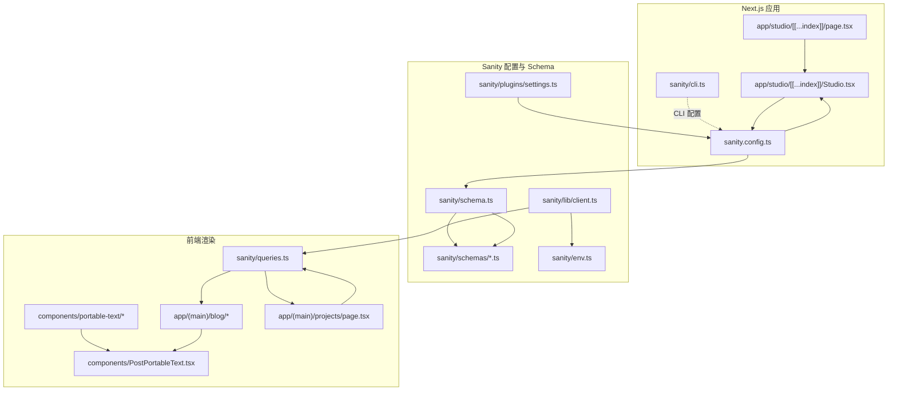
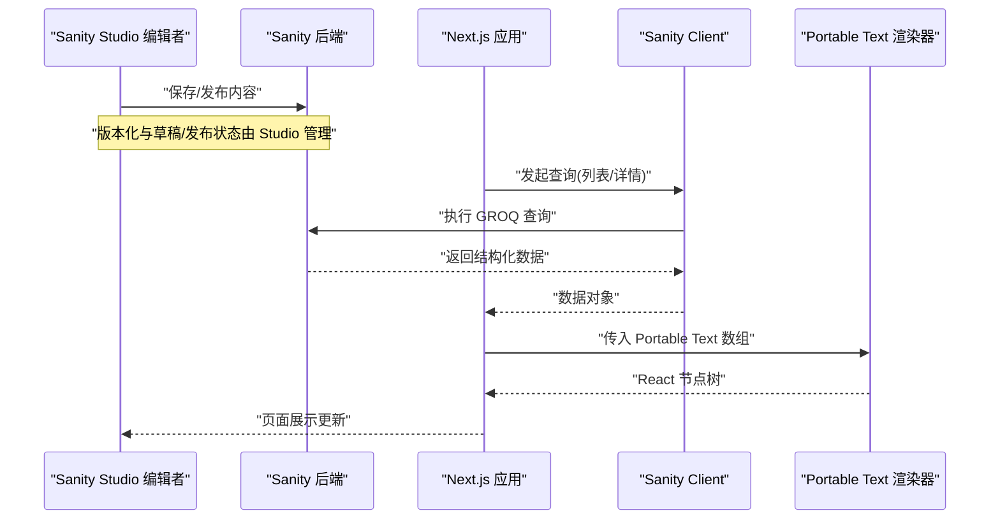
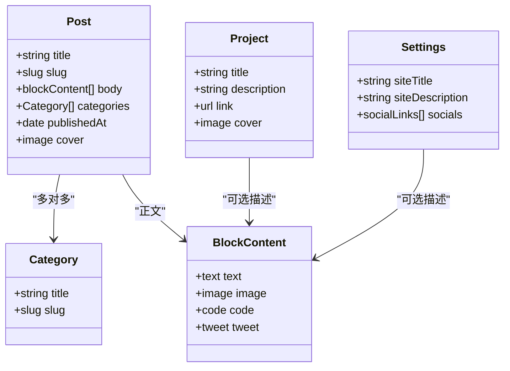
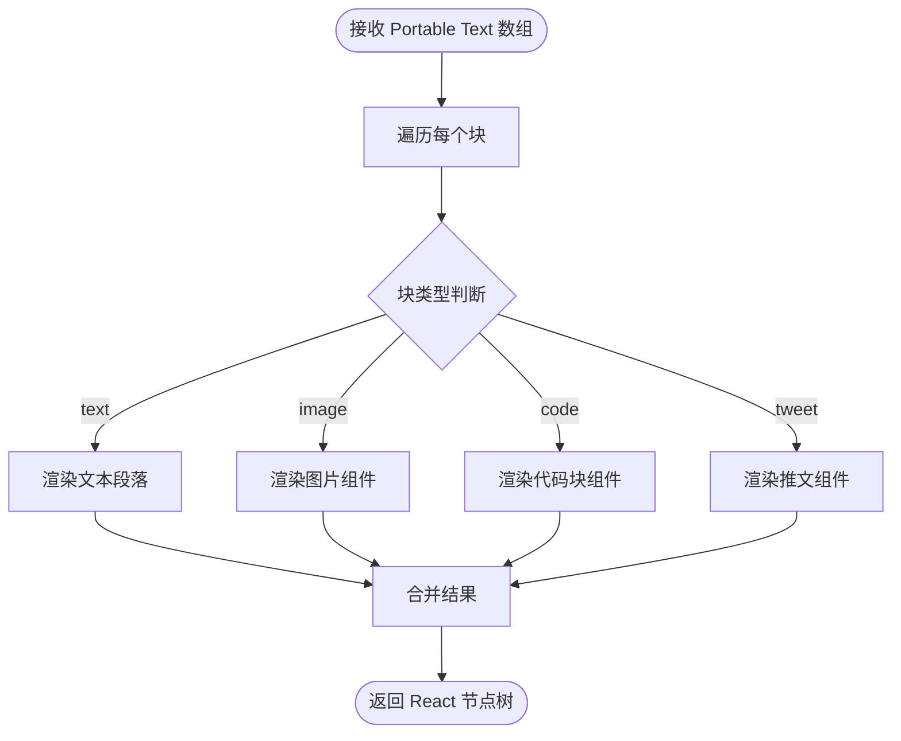
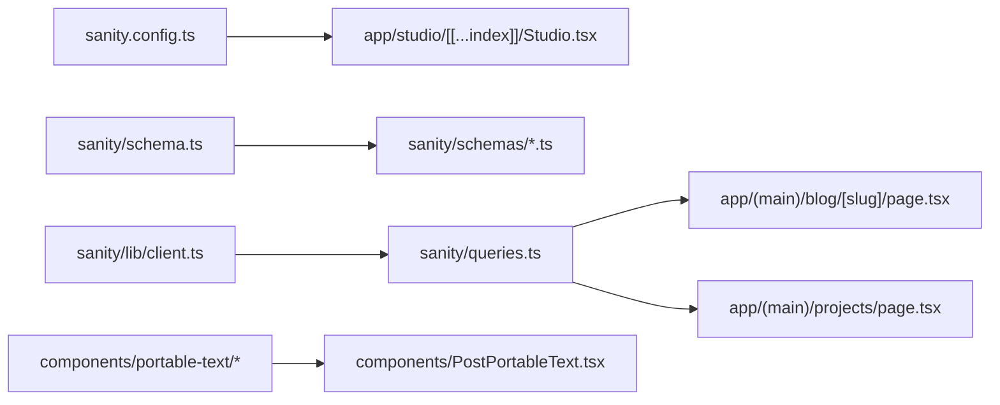

# Sanity Studio 集成

<cite>
**本文引用的文件**   
- [sanity.config.ts](file://sanity.config.ts)
- [sanity.cli.ts](file://sanity.cli.ts)
- [app/studio/[[...index]]/page.tsx](file://app/studio/[[...index]]/page.tsx)
- [app/studio/[[...index]]/Studio.tsx](file://app/studio/[[...index]]/Studio.tsx)
- [sanity/schema.ts](file://sanity/schema.ts)
- [sanity/schemas/post.ts](file://sanity/schemas/post.ts)
- [sanity/schemas/blockContent.ts](file://sanity/schemas/blockContent.ts)
- [sanity/schemas/category.ts](file://sanity/schemas/category.ts)
- [sanity/schemas/project.ts](file://sanity/schemas/project.ts)
- [sanity/schemas/settings.ts](file://sanity/schemas/settings.ts)
- [sanity/schemas/types/readingTime.ts](file://sanity/schemas/types/readingTime.ts)
- [sanity/components/ReadingTimeInput.tsx](file://sanity/components/ReadingTimeInput.tsx)
- [sanity/plugins/settings.ts](file://sanity/plugins/settings.ts)
- [sanity/lib/client.ts](file://sanity/lib/client.ts)
- [sanity/lib/image.ts](file://sanity/lib/image.ts)
- [sanity/env.ts](file://sanity/env.ts)
- [sanity/queries.ts](file://sanity/queries.ts)
- [components/portable-text/PortableTextBlocks.tsx](file://components/portable-text/PortableTextBlocks.tsx)
- [components/portable-text/PortableTextImage.tsx](file://components/portable-text/PortableTextImage.tsx)
- [components/portable-text/PortableTextCodeBlock.tsx](file://components/portable-text/PortableTextCodeBlock.tsx)
- [components/portable-text/PortableTextTweet.tsx](file://components/portable-text/PortableTextTweet.tsx)
- [components/PostPortableText.tsx](file://components/PostPortableText.tsx)
- [app/(main)/blog/page.tsx](file://app/(main)/blog/page.tsx)
- [app/(main)/blog/[slug]/page.tsx](file://app/(main)/blog/[slug]/page.tsx)
- [app/(main)/projects/page.tsx](file://app/(main)/projects/page.tsx)
- [package.json](file://package.json)
</cite>

## 目录
1. [简介](#简介)
2. [项目结构](#项目结构)
3. [核心组件](#核心组件)
4. [架构总览](#架构总览)
5. [详细组件分析](#详细组件分析)
6. [依赖关系分析](#依赖关系分析)
7. [性能考虑](#性能考虑)
8. [故障排查指南](#故障排查指南)
9. [结论](#结论)
10. [附录](#附录)

## 简介
本文件面向 cali.so 管理后台的 Sanity Studio 集成，系统性说明无头 CMS 的配置、内容模型定义与编辑器定制，涵盖 Schema 设计模式、自定义字段类型与插件开发、发布工作流与版本控制、团队协作能力，以及与 Next.js 应用的数据同步、实时预览和部署策略。文档同时提供内容迁移、备份恢复与性能优化的最佳实践，帮助团队高效维护内容与前端展示的一致性。

## 项目结构
Sanity 相关代码集中在 sanity 目录与 app/studio 路由中，Next.js 通过 App Router 内嵌 Studio，并在前端页面使用 Sanity Client 拉取数据渲染。

图表来源
- [app/studio/[[...index]]/page.tsx](file://app/studio/[[...index]]/page.tsx)
- [app/studio/[[...index]]/Studio.tsx](file://app/studio/[[...index]]/Studio.tsx)
- [sanity.config.ts](file://sanity.config.ts)
- [sanity/cli.ts](file://sanity/cli.ts)
- [sanity/schema.ts](file://sanity/schema.ts)
- [sanity/schemas/post.ts](file://sanity/schemas/post.ts)
- [sanity/schemas/blockContent.ts](file://sanity/schemas/blockContent.ts)
- [sanity/schemas/category.ts](file://sanity/schemas/category.ts)
- [sanity/schemas/project.ts](file://sanity/schemas/project.ts)
- [sanity/schemas/settings.ts](file://sanity/schemas/settings.ts)
- [sanity/plugins/settings.ts](file://sanity/plugins/settings.ts)
- [sanity/lib/client.ts](file://sanity/lib/client.ts)
- [sanity/env.ts](file://sanity/env.ts)
- [sanity/queries.ts](file://sanity/queries.ts)
- [components/portable-text/PortableTextBlocks.tsx](file://components/portable-text/PortableTextBlocks.tsx)
- [components/portable-text/PortableTextImage.tsx](file://components/portable-text/PortableTextImage.tsx)
- [components/portable-text/PortableTextCodeBlock.tsx](file://components/portable-text/PortableTextCodeBlock.tsx)
- [components/portable-text/PortableTextTweet.tsx](file://components/portable-text/PortableTextTweet.tsx)
- [components/PostPortableText.tsx](file://components/PostPortableText.tsx)
- [app/(main)/blog/page.tsx](file://app/(main)/blog/page.tsx)
- [app/(main)/blog/[slug]/page.tsx](file://app/(main)/blog/[slug]/page.tsx)
- [app/(main)/projects/page.tsx](file://app/(main)/projects/page.tsx)

章节来源
- [sanity.config.ts](file://sanity.config.ts)
- [sanity/cli.ts](file://sanity/cli.ts)
- [app/studio/[[...index]]/page.tsx](file://app/studio/[[...index]]/page.tsx)
- [app/studio/[[...index]]/Studio.tsx](file://app/studio/[[...index]]/Studio.tsx)
- [sanity/schema.ts](file://sanity/schema.ts)
- [sanity/schemas/post.ts](file://sanity/schemas/post.ts)
- [sanity/schemas/blockContent.ts](file://sanity/schemas/blockContent.ts)
- [sanity/schemas/category.ts](file://sanity/schemas/category.ts)
- [sanity/schemas/project.ts](file://sanity/schemas/project.ts)
- [sanity/schemas/settings.ts](file://sanity/schemas/settings.ts)
- [sanity/plugins/settings.ts](file://sanity/plugins/settings.ts)
- [sanity/lib/client.ts](file://sanity/lib/client.ts)
- [sanity/env.ts](file://sanity/env.ts)
- [sanity/queries.ts](file://sanity/queries.ts)
- [components/portable-text/PortableTextBlocks.tsx](file://components/portable-text/PortableTextBlocks.tsx)
- [components/portable-text/PortableTextImage.tsx](file://components/portable-text/PortableTextImage.tsx)
- [components/portable-text/PortableTextCodeBlock.tsx](file://components/portable-text/PortableTextCodeBlock.tsx)
- [components/portable-text/PortableTextTweet.tsx](file://components/portable-text/PortableTextTweet.tsx)
- [components/PostPortableText.tsx](file://components/PostPortableText.tsx)
- [app/(main)/blog/page.tsx](file://app/(main)/blog/page.tsx)
- [app/(main)/blog/[slug]/page.tsx](file://app/(main)/blog/[slug]/page.tsx)
- [app/(main)/projects/page.tsx](file://app/(main)/projects/page.tsx)

## 核心组件
- Studio 入口与路由
  - 通过 Next.js App Router 的 catch-all 路由挂载 Studio，便于在站点内访问管理后台。
  - Studio 初始化加载配置与 Schema，并注册插件（如 Settings）。
- 配置与 CLI
  - 集中式配置包含数据集、插件、Schema 聚合等；CLI 用于本地开发与构建期校验。
- Schema 体系
  - 以模块化的方式定义文章、分类、项目、设置等文档类型，以及块级内容与自定义类型。
- 客户端与查询
  - 提供带环境变量的 Sanity Client，配合预置查询封装，供前端渲染使用。
- 前端渲染
  - 使用 Portable Text 组件将富文本渲染为 React 节点，支持图片、代码块、推文等扩展。

章节来源
- [app/studio/[[...index]]/page.tsx](file://app/studio/[[...index]]/page.tsx)
- [app/studio/[[...index]]/Studio.tsx](file://app/studio/[[...index]]/Studio.tsx)
- [sanity.config.ts](file://sanity.config.ts)
- [sanity/cli.ts](file://sanity/cli.ts)
- [sanity/schema.ts](file://sanity/schema.ts)
- [sanity/schemas/post.ts](file://sanity/schemas/post.ts)
- [sanity/schemas/blockContent.ts](file://sanity/schemas/blockContent.ts)
- [sanity/schemas/category.ts](file://sanity/schemas/category.ts)
- [sanity/schemas/project.ts](file://sanity/schemas/project.ts)
- [sanity/schemas/settings.ts](file://sanity/schemas/settings.ts)
- [sanity/plugins/settings.ts](file://sanity/plugins/settings.ts)
- [sanity/lib/client.ts](file://sanity/lib/client.ts)
- [sanity/queries.ts](file://sanity/queries.ts)
- [components/portable-text/PortableTextBlocks.tsx](file://components/portable-text/PortableTextBlocks.tsx)
- [components/portable-text/PortableTextImage.tsx](file://components/portable-text/PortableTextImage.tsx)
- [components/portable-text/PortableTextCodeBlock.tsx](file://components/portable-text/PortableTextCodeBlock.tsx)
- [components/portable-text/PortableTextTweet.tsx](file://components/portable-text/PortableTextTweet.tsx)
- [components/PostPortableText.tsx](file://components/PostPortableText.tsx)

## 架构总览
下图展示了从 Studio 编辑到 Next.js 渲染的整体流程：编辑者在 Studio 中维护内容，前端通过 Sanity Client 拉取数据，并使用 Portable Text 组件进行渲染。

图表来源
- [sanity/config.ts](file://sanity.config.ts)
- [sanity/lib/client.ts](file://sanity/lib/client.ts)
- [sanity/queries.ts](file://sanity/queries.ts)
- [components/portable-text/PortableTextBlocks.tsx](file://components/portable-text/PortableTextBlocks.tsx)
- [components/portable-text/PortableTextImage.tsx](file://components/portable-text/PortableTextImage.tsx)
- [components/portable-text/PortableTextCodeBlock.tsx](file://components/portable-text/PortableTextCodeBlock.tsx)
- [components/portable-text/PortableTextTweet.tsx](file://components/portable-text/PortableTextTweet.tsx)
- [components/PostPortableText.tsx](file://components/PostPortableText.tsx)
- [app/(main)/blog/[slug]/page.tsx](file://app/(main)/blog/[slug]/page.tsx)
- [app/(main)/projects/page.tsx](file://app/(main)/projects/page.tsx)

## 详细组件分析

### Studio 集成与路由
- 路由挂载
  - 使用 catch-all 路由将 Studio 嵌入站点路径下，便于统一域名访问。
- Studio 初始化
  - 加载配置、注册插件、装配 Schema，并提供鉴权与预览所需的上下文。
- 关键实现位置
  - 路由页与 Studio 容器组件分别负责挂载与初始化。

章节来源
- [app/studio/[[...index]]/page.tsx](file://app/studio/[[...index]]/page.tsx)
- [app/studio/[[...index]]/Studio.tsx](file://app/studio/[[...index]]/Studio.tsx)
- [sanity.config.ts](file://sanity.config.ts)

### 配置与 CLI
- 配置项
  - 数据集名称、插件集合、Schema 聚合、预览与部署相关选项。
- CLI
  - 本地开发、构建时校验、生成类型等命令。
- 环境变量
  - 通过 env 模块注入数据集、令牌等敏感信息。

章节来源
- [sanity.config.ts](file://sanity.config.ts)
- [sanity/cli.ts](file://sanity/cli.ts)
- [sanity/env.ts](file://sanity/env.ts)

### Schema 设计与类型系统
- 文档类型
  - 文章、分类、项目、站点设置等，均通过模块化 schema 定义。
- 块级内容
  - 基于 Portable Text 的 blockContent 类型，组合段落、图片、代码块、引用等。
- 自定义类型
  - 例如阅读时长类型，结合输入组件实现计算或格式化。
- 推荐模式
  - 使用 slug、标题、摘要、封面图、发布时间、作者等通用字段；对复杂内容采用嵌套块与引用类型。

图表来源
- [sanity/schemas/post.ts](file://sanity/schemas/post.ts)
- [sanity/schemas/category.ts](file://sanity/schemas/category.ts)
- [sanity/schemas/project.ts](file://sanity/schemas/project.ts)
- [sanity/schemas/settings.ts](file://sanity/schemas/settings.ts)
- [sanity/schemas/blockContent.ts](file://sanity/schemas/blockContent.ts)

章节来源
- [sanity/schema.ts](file://sanity/schema.ts)
- [sanity/schemas/post.ts](file://sanity/schemas/post.ts)
- [sanity/schemas/blockContent.ts](file://sanity/schemas/blockContent.ts)
- [sanity/schemas/category.ts](file://sanity/schemas/category.ts)
- [sanity/schemas/project.ts](file://sanity/schemas/project.ts)
- [sanity/schemas/settings.ts](file://sanity/schemas/settings.ts)
- [sanity/schemas/types/readingTime.ts](file://sanity/schemas/types/readingTime.ts)

### 自定义字段与编辑器插件
- 自定义输入组件
  - 阅读时长输入组件作为示例，演示如何与 Schema 类型对接。
- 插件
  - Settings 插件用于站点全局配置，可在 Studio 侧边栏或面板中呈现。
- 扩展点
  - 可新增自定义类型、文档布局、预览窗口、表单验证规则等。

章节来源
- [sanity/components/ReadingTimeInput.tsx](file://sanity/components/ReadingTimeInput.tsx)
- [sanity/schemas/types/readingTime.ts](file://sanity/schemas/types/readingTime.ts)
- [sanity/plugins/settings.ts](file://sanity/plugins/settings.ts)

### 客户端与查询封装
- 客户端
  - 基于环境变量创建只读/读写客户端，支持预览模式与生产模式切换。
- 查询
  - 预置常用查询（如文章列表、详情、项目列表），提高复用性与一致性。
- 图片处理
  - 提供图片 URL 生成工具，适配不同尺寸与格式。

章节来源
- [sanity/lib/client.ts](file://sanity/lib/client.ts)
- [sanity/env.ts](file://sanity/env.ts)
- [sanity/queries.ts](file://sanity/queries.ts)
- [sanity/lib/image.ts](file://sanity/lib/image.ts)

### 前端渲染与 Portable Text
- 渲染管线
  - 将 Portable Text 数组映射为 React 组件，支持图片、代码块、推文等扩展。
- 组件拆分
  - 按块类型拆分为独立组件，便于维护与扩展。
- 页面集成
  - 博客与项目页面通过查询获取数据后交由渲染器输出。

图表来源
- [components/portable-text/PortableTextBlocks.tsx](file://components/portable-text/PortableTextBlocks.tsx)
- [components/portable-text/PortableTextImage.tsx](file://components/portable-text/PortableTextImage.tsx)
- [components/portable-text/PortableTextCodeBlock.tsx](file://components/portable-text/PortableTextCodeBlock.tsx)
- [components/portable-text/PortableTextTweet.tsx](file://components/portable-text/PortableTextTweet.tsx)
- [components/PostPortableText.tsx](file://components/PostPortableText.tsx)

章节来源
- [components/portable-text/PortableTextBlocks.tsx](file://components/portable-text/PortableTextBlocks.tsx)
- [components/portable-text/PortableTextImage.tsx](file://components/portable-text/PortableTextImage.tsx)
- [components/portable-text/PortableTextCodeBlock.tsx](file://components/portable-text/PortableTextCodeBlock.tsx)
- [components/portable-text/PortableTextTweet.tsx](file://components/portable-text/PortableTextTweet.tsx)
- [components/PostPortableText.tsx](file://components/PostPortableText.tsx)
- [app/(main)/blog/page.tsx](file://app/(main)/blog/page.tsx)
- [app/(main)/blog/[slug]/page.tsx](file://app/(main)/blog/[slug]/page.tsx)
- [app/(main)/projects/page.tsx](file://app/(main)/projects/page.tsx)

### 内容发布工作流、版本控制与团队协作
- 版本控制
  - Studio 默认启用版本历史，支持查看与回滚至任意快照。
- 草稿与发布
  - 通过文档状态字段与 Studio 视图过滤，区分草稿与已发布内容。
- 团队协作
  - 使用角色与权限控制编辑、预览与发布操作；结合 Next.js 鉴权中间件限制管理后台访问。

章节来源
- [sanity.config.ts](file://sanity.config.ts)
- [app/studio/[[...index]]/page.tsx](file://app/studio/[[...index]]/page.tsx)
- [app/studio/[[...index]]/Studio.tsx](file://app/studio/[[...index]]/Studio.tsx)

### 与 Next.js 的数据同步、实时预览与部署
- 数据同步
  - 服务端渲染或静态生成阶段调用 Sanity Client 拉取数据，确保首屏一致性与 SEO 友好。
- 实时预览
  - 在 Studio 中开启预览模式，指向 Next.js 预览端点，实现即时可视化。
- 部署策略
  - 将 Studio 与站点同域部署，利用平台缓存与 CDN 加速资源；构建期校验 Schema 与查询。

章节来源
- [sanity/lib/client.ts](file://sanity/lib/client.ts)
- [sanity/queries.ts](file://sanity/queries.ts)
- [app/(main)/blog/[slug]/page.tsx](file://app/(main)/blog/[slug]/page.tsx)
- [app/(main)/projects/page.tsx](file://app/(main)/projects/page.tsx)
- [package.json](file://package.json)

## 依赖关系分析
- 模块耦合
  - Studio 入口依赖配置与 Schema；前端渲染依赖客户端与查询封装；Portable Text 组件与 Schema 块类型一一对应。
- 外部依赖
  - Sanity SDK、Portable Text 渲染库、图片优化库等。
- 潜在风险
  - 避免循环导入；保持查询与渲染逻辑解耦；对敏感信息使用环境变量隔离。

图表来源
- [sanity.config.ts](file://sanity.config.ts)
- [app/studio/[[...index]]/Studio.tsx](file://app/studio/[[...index]]/Studio.tsx)
- [sanity/schema.ts](file://sanity/schema.ts)
- [sanity/schemas/post.ts](file://sanity/schemas/post.ts)
- [sanity/schemas/blockContent.ts](file://sanity/schemas/blockContent.ts)
- [sanity/schemas/category.ts](file://sanity/schemas/category.ts)
- [sanity/schemas/project.ts](file://sanity/schemas/project.ts)
- [sanity/schemas/settings.ts](file://sanity/schemas/settings.ts)
- [sanity/lib/client.ts](file://sanity/lib/client.ts)
- [sanity/queries.ts](file://sanity/queries.ts)
- [components/portable-text/PortableTextBlocks.tsx](file://components/portable-text/PortableTextBlocks.tsx)
- [components/portable-text/PortableTextImage.tsx](file://components/portable-text/PortableTextImage.tsx)
- [components/portable-text/PortableTextCodeBlock.tsx](file://components/portable-text/PortableTextCodeBlock.tsx)
- [components/portable-text/PortableTextTweet.tsx](file://components/portable-text/PortableTextTweet.tsx)
- [components/PostPortableText.tsx](file://components/PostPortableText.tsx)
- [app/(main)/blog/[slug]/page.tsx](file://app/(main)/blog/[slug]/page.tsx)
- [app/(main)/projects/page.tsx](file://app/(main)/projects/page.tsx)

章节来源
- [sanity.config.ts](file://sanity.config.ts)
- [sanity/schema.ts](file://sanity/schema.ts)
- [sanity/lib/client.ts](file://sanity/lib/client.ts)
- [sanity/queries.ts](file://sanity/queries.ts)
- [components/portable-text/PortableTextBlocks.tsx](file://components/portable-text/PortableTextBlocks.tsx)
- [components/PostPortableText.tsx](file://components/PostPortableText.tsx)
- [app/(main)/blog/[slug]/page.tsx](file://app/(main)/blog/[slug]/page.tsx)
- [app/(main)/projects/page.tsx](file://app/(main)/projects/page.tsx)

## 性能考虑
- 查询优化
  - 仅选择必要字段，使用 GROQ 投影减少传输体积；对列表分页与缓存策略进行优化。
- 图片优化
  - 使用图片工具生成合适尺寸与格式，结合 CDN 缓存与懒加载。
- 渲染优化
  - 将重型组件按需加载；对长列表使用虚拟滚动或分页。
- 构建期校验
  - 在 CI 中运行 Schema 与查询校验，提前发现错误。

[本节为通用指导，不直接分析具体文件]

## 故障排查指南
- 常见问题
  - 无法访问 Studio：检查路由与鉴权中间件配置。
  - 查询失败：核对数据集名称、令牌与网络连通性。
  - 图片不显示：确认图片 URL 生成逻辑与跨域策略。
  - 富文本渲染异常：检查 Portable Text 块类型与对应组件映射。
- 定位方法
  - 打开浏览器控制台与网络面板，观察请求与响应；在 Studio 中查看错误日志与版本历史。

章节来源
- [sanity/lib/client.ts](file://sanity/lib/client.ts)
- [sanity/env.ts](file://sanity/env.ts)
- [components/portable-text/PortableTextBlocks.tsx](file://components/portable-text/PortableTextBlocks.tsx)
- [components/portable-text/PortableTextImage.tsx](file://components/portable-text/PortableTextImage.tsx)
- [components/portable-text/PortableTextCodeBlock.tsx](file://components/portable-text/PortableTextCodeBlock.tsx)
- [components/portable-text/PortableTextTweet.tsx](file://components/portable-text/PortableTextTweet.tsx)

## 结论
通过将 Sanity Studio 嵌入 Next.js 应用，本项目实现了内容管理与前端渲染的高效协作。合理的 Schema 设计、清晰的客户端与查询封装、以及可扩展的 Portable Text 渲染管线，为后续功能迭代与团队协作奠定了坚实基础。建议持续完善预览与权限控制，结合缓存与构建期校验提升稳定性与性能。

[本节为总结性内容，不直接分析具体文件]

## 附录
- 快速上手
  - 安装依赖、配置环境变量、启动本地开发服务器、访问 /studio 进入管理后台。
- 扩展清单
  - 新增内容类型：在 schemas 目录下添加新文件并在 schema.ts 中注册。
  - 自定义字段：新建输入组件并在类型中使用。
  - 第三方服务集成：在查询或客户端层接入外部 API，注意缓存与错误重试。
- 参考路径
  - 博客页面：[app/(main)/blog/page.tsx](file://app/(main)/blog/page.tsx)、[app/(main)/blog/[slug]/page.tsx](file://app/(main)/blog/[slug]/page.tsx)
  - 项目页面：[app/(main)/projects/page.tsx](file://app/(main)/projects/page.tsx)
  - 查询与客户端：[sanity/queries.ts](file://sanity/queries.ts)、[sanity/lib/client.ts](file://sanity/lib/client.ts)
  - 配置与 CLI：[sanity.config.ts](file://sanity.config.ts)、[sanity/cli.ts](file://sanity/cli.ts)