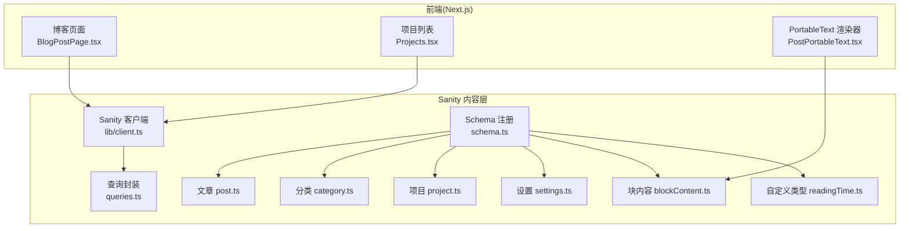
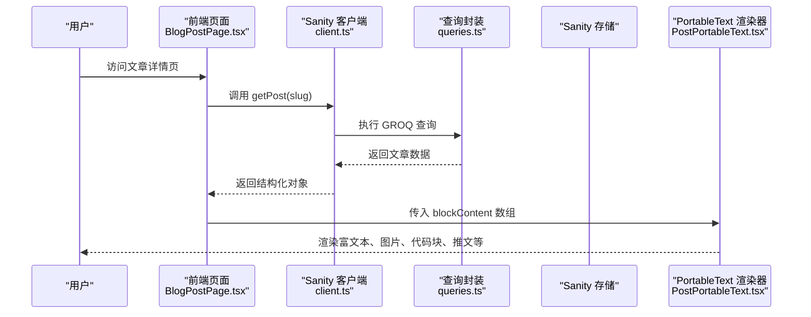
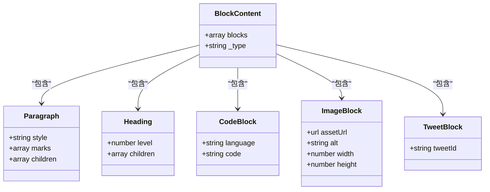
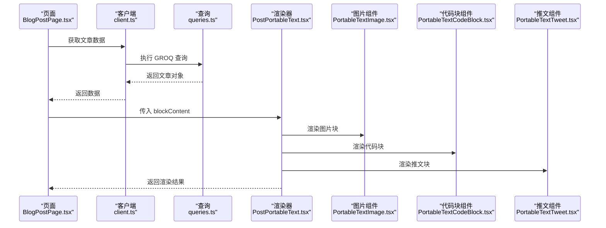
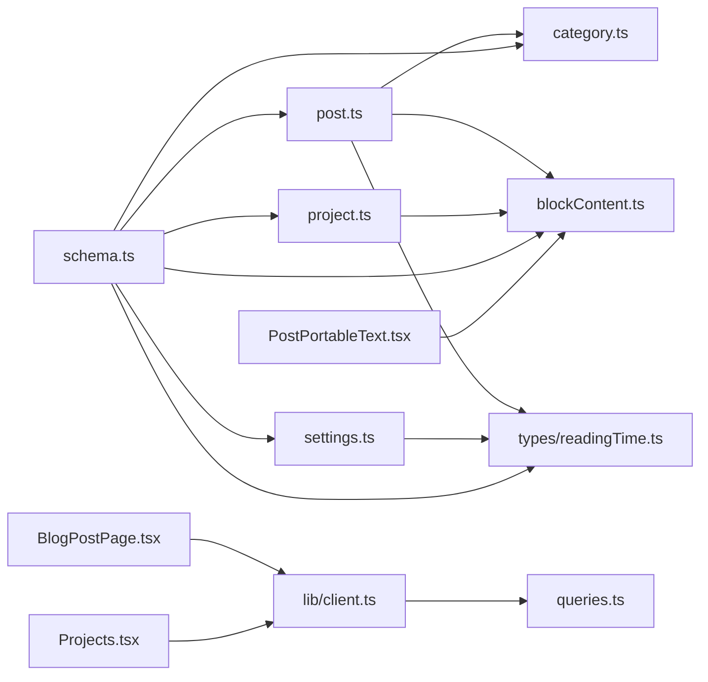

# 内容模型设计

<cite>
**本文引用的文件**   
- [sanity/schemas/post.ts](file://sanity/schemas/post.ts)
- [sanity/schemas/category.ts](file://sanity/schemas/category.ts)
- [sanity/schemas/project.ts](file://sanity/schemas/project.ts)
- [sanity/schemas/settings.ts](file://sanity/schemas/settings.ts)
- [sanity/schemas/blockContent.ts](file://sanity/schemas/blockContent.ts)
- [sanity/schemas/types/readingTime.ts](file://sanity/schemas/types/readingTime.ts)
- [sanity/schema.ts](file://sanity/schema.ts)
- [sanity/plugins/settings.ts](file://sanity/plugins/settings.ts)
- [sanity/lib/client.ts](file://sanity/lib/client.ts)
- [sanity/queries.ts](file://sanity/queries.ts)
- [components/portable-text/PortableTextBlocks.tsx](file://components/portable-text/PortableTextBlocks.tsx)
- [components/portable-text/PortableTextCodeBlock.tsx](file://components/portable-text/PortableTextCodeBlock.tsx)
- [components/portable-text/PortableTextImage.tsx](file://components/portable-text/PortableTextImage.tsx)
- [components/portable-text/PortableTextTweet.tsx](file://components/portable-text/PortableTextTweet.tsx)
- [components/PostPortableText.tsx](file://components/PostPortableText.tsx)
- [app/(main)/blog/BlogPostPage.tsx](file://app/(main)/blog/BlogPostPage.tsx)
- [app/(main)/projects/Projects.tsx](file://app/(main)/projects/Projects.tsx)
- [db/schema.ts](file://db/schema.ts)
</cite>

## 目录
1. [简介](#简介)
2. [项目结构](#项目结构)
3. [核心组件](#核心组件)
4. [架构总览](#架构总览)
5. [详细组件分析](#详细组件分析)
6. [依赖分析](#依赖分析)
7. [性能考虑](#性能考虑)
8. [故障排查指南](#故障排查指南)
9. [结论](#结论)
10. [附录](#附录)

## 简介
本文件面向 cali.so 的内容模型设计与实现，聚焦于 Sanity CMS 的 Schema 定义、块级内容编辑器（blockContent）与渲染管线、字段验证与默认值、关联关系设计、版本控制与草稿发布工作流、数据迁移策略与向后兼容性保证。文档以“从概念到代码”的方式组织，既提供高层架构图，也给出与源码文件一一对应的图示与来源标注，便于读者快速定位实现细节。

## 项目结构
本项目采用 Next.js + Sanity 的组合：前端页面通过 API 或客户端库读取 Sanity 中的内容；Sanity 侧通过 schema 定义文章、分类、项目、设置等核心类型，并配置块级内容编辑器与自定义类型。

图表来源
- [sanity/lib/client.ts](file://sanity/lib/client.ts)
- [sanity/queries.ts](file://sanity/queries.ts)
- [sanity/schema.ts](file://sanity/schema.ts)
- [sanity/schemas/post.ts](file://sanity/schemas/post.ts)
- [sanity/schemas/category.ts](file://sanity/schemas/category.ts)
- [sanity/schemas/project.ts](file://sanity/schemas/project.ts)
- [sanity/schemas/settings.ts](file://sanity/schemas/settings.ts)
- [sanity/schemas/blockContent.ts](file://sanity/schemas/blockContent.ts)
- [sanity/schemas/types/readingTime.ts](file://sanity/schemas/types/readingTime.ts)
- [components/PostPortableText.tsx](file://components/PostPortableText.tsx)
- [app/(main)/blog/BlogPostPage.tsx](file://app/(main)/blog/BlogPostPage.tsx)
- [app/(main)/projects/Projects.tsx](file://app/(main)/projects/Projects.tsx)

章节来源
- [sanity/schema.ts](file://sanity/schema.ts)
- [sanity/lib/client.ts](file://sanity/lib/client.ts)
- [sanity/queries.ts](file://sanity/queries.ts)
- [sanity/schemas/post.ts](file://sanity/schemas/post.ts)
- [sanity/schemas/category.ts](file://sanity/schemas/category.ts)
- [sanity/schemas/project.ts](file://sanity/schemas/project.ts)
- [sanity/schemas/settings.ts](file://sanity/schemas/settings.ts)
- [sanity/schemas/blockContent.ts](file://sanity/schemas/blockContent.ts)
- [sanity/schemas/types/readingTime.ts](file://sanity/schemas/types/readingTime.ts)
- [components/PostPortableText.tsx](file://components/PostPortableText.tsx)
- [app/(main)/blog/BlogPostPage.tsx](file://app/(main)/blog/BlogPostPage.tsx)
- [app/(main)/projects/Projects.tsx](file://app/(main)/projects/Projects.tsx)

## 核心组件
本节概述内容模型的核心类型及其职责：
- 文章（post）：承载正文、元信息、分类关联、阅读时长等。
- 分类（category）：用于对文章进行归类。
- 项目（project）：展示项目信息，可能包含富文本描述。
- 设置（settings）：站点级全局配置。
- 块内容（blockContent）：基于 Portable Text 的块级编辑器与数据结构。
- 自定义类型（readingTime）：为文章提供阅读时长计算与校验。

章节来源
- [sanity/schemas/post.ts](file://sanity/schemas/post.ts)
- [sanity/schemas/category.ts](file://sanity/schemas/category.ts)
- [sanity/schemas/project.ts](file://sanity/schemas/project.ts)
- [sanity/schemas/settings.ts](file://sanity/schemas/settings.ts)
- [sanity/schemas/blockContent.ts](file://sanity/schemas/blockContent.ts)
- [sanity/schemas/types/readingTime.ts](file://sanity/schemas/types/readingTime.ts)

## 架构总览
下图展示了从前端请求到 Sanity 内容获取与渲染的关键路径，以及块级内容的编辑与渲染流程。

图表来源
- [app/(main)/blog/BlogPostPage.tsx](file://app/(main)/blog/BlogPostPage.tsx)
- [sanity/lib/client.ts](file://sanity/lib/client.ts)
- [sanity/queries.ts](file://sanity/queries.ts)
- [components/PostPortableText.tsx](file://components/PostPortableText.tsx)

## 详细组件分析

### 文章（post）
- 设计要点
  - 标题、slug、摘要、封面图、发布时间、状态（草稿/已发布）、作者、分类关联、阅读时长等。
  - 正文使用 blockContent 类型，支持段落、标题、列表、代码块、图片、链接、内联样式等。
  - 字段验证：必填项、长度限制、唯一性（slug）、枚举（状态）。
  - 默认值：如状态默认为草稿、时间戳自动填充等。
  - 关联关系：多对一关联分类（category），可多标签扩展。
- 典型字段与约束
  - slug：唯一且用于路由。
  - status：枚举值，驱动发布工作流。
  - categories：引用分类集合。
  - readingTime：自定义类型，带校验与默认值。
- 示例参考路径
  - [文章 Schema 定义](file://sanity/schemas/post.ts)
  - [阅读时长自定义类型](file://sanity/schemas/types/readingTime.ts)

章节来源
- [sanity/schemas/post.ts](file://sanity/schemas/post.ts)
- [sanity/schemas/types/readingTime.ts](file://sanity/schemas/types/readingTime.ts)

### 分类（category）
- 设计要点
  - 名称、slug、描述、图标等。
  - 与文章的多对一关系（一篇文章属于一个或多个分类）。
- 示例参考路径
  - [分类 Schema 定义](file://sanity/schemas/category.ts)

章节来源
- [sanity/schemas/category.ts](file://sanity/schemas/category.ts)

### 项目（project）
- 设计要点
  - 项目名称、描述（可使用 blockContent）、链接、封面图、技术栈、状态等。
  - 可选关联分类或标签。
- 示例参考路径
  - [项目 Schema 定义](file://sanity/schemas/project.ts)
  - [项目列表页面](file://app/(main)/projects/Projects.tsx)

章节来源
- [sanity/schemas/project.ts](file://sanity/schemas/project.ts)
- [app/(main)/projects/Projects.tsx](file://app/(main)/projects/Projects.tsx)

### 设置（settings）
- 设计要点
  - 站点级全局配置，如站点名、SEO 信息、社交链接、主题开关等。
  - 通常单实例，通过插件在 Studio 中便捷编辑。
- 示例参考路径
  - [设置 Schema 定义](file://sanity/schemas/settings.ts)
  - [Settings 插件入口](file://sanity/plugins/settings.ts)

章节来源
- [sanity/schemas/settings.ts](file://sanity/schemas/settings.ts)
- [sanity/plugins/settings.ts](file://sanity/plugins/settings.ts)

### 块级内容编辑器（blockContent）
- 设计要点
  - 基于 Portable Text 的块结构，支持多种块类型（段落、标题、列表、代码块、图片、引用、自定义块等）。
  - 内联样式：加粗、斜体、删除线、高亮等。
  - 媒体嵌入：图片、视频、外链卡片、推文等。
  - 自定义块：例如代码块、图片、推文等，通过 type 区分并在渲染端分别处理。
- 渲染管线
  - 前端通过 PostPortableText 将 Portable Text 数组渲染为 React 组件树。
  - 各子组件负责具体块的渲染：图片、代码块、推文等。
- 示例参考路径
  - [块内容 Schema 定义](file://sanity/schemas/blockContent.ts)
  - [PortableText 根渲染器](file://components/PostPortableText.tsx)
  - [图片块渲染](file://components/portable-text/PortableTextImage.tsx)
  - [代码块渲染](file://components/portable-text/PortableTextCodeBlock.tsx)
  - [推文块渲染](file://components/portable-text/PortableTextTweet.tsx)
  - [通用块容器](file://components/portable-text/PortableTextBlocks.tsx)

图表来源
- [sanity/schemas/blockContent.ts](file://sanity/schemas/blockContent.ts)
- [components/portable-text/PortableTextBlocks.tsx](file://components/portable-text/PortableTextBlocks.tsx)
- [components/portable-text/PortableTextCodeBlock.tsx](file://components/portable-text/PortableTextCodeBlock.tsx)
- [components/portable-text/PortableTextImage.tsx](file://components/portable-text/PortableTextImage.tsx)
- [components/portable-text/PortableTextTweet.tsx](file://components/portable-text/PortableTextTweet.tsx)

章节来源
- [sanity/schemas/blockContent.ts](file://sanity/schemas/blockContent.ts)
- [components/PostPortableText.tsx](file://components/PostPortableText.tsx)
- [components/portable-text/PortableTextBlocks.tsx](file://components/portable-text/PortableTextBlocks.tsx)
- [components/portable-text/PortableTextCodeBlock.tsx](file://components/portable-text/PortableTextCodeBlock.tsx)
- [components/portable-text/PortableTextImage.tsx](file://components/portable-text/PortableTextImage.tsx)
- [components/portable-text/PortableTextTweet.tsx](file://components/portable-text/PortableTextTweet.tsx)

### 自定义类型（readingTime）
- 设计要点
  - 计算并校验阅读时长，确保合理范围。
  - 可作为文章的只读或可编辑字段，结合后端或客户端逻辑更新。
- 示例参考路径
  - [自定义类型定义](file://sanity/schemas/types/readingTime.ts)

章节来源
- [sanity/schemas/types/readingTime.ts](file://sanity/schemas/types/readingTime.ts)

### 博客详情渲染流程（序列图）

图表来源
- [app/(main)/blog/BlogPostPage.tsx](file://app/(main)/blog/BlogPostPage.tsx)
- [sanity/lib/client.ts](file://sanity/lib/client.ts)
- [sanity/queries.ts](file://sanity/queries.ts)
- [components/PostPortableText.tsx](file://components/PostPortableText.tsx)
- [components/portable-text/PortableTextImage.tsx](file://components/portable-text/PortableTextImage.tsx)
- [components/portable-text/PortableTextCodeBlock.tsx](file://components/portable-text/PortableTextCodeBlock.tsx)
- [components/portable-text/PortableTextTweet.tsx](file://components/portable-text/PortableTextTweet.tsx)

## 依赖分析
- 模块耦合
  - 前端页面依赖 Sanity 客户端与查询封装。
  - 渲染器依赖块内容 Schema 定义的块类型。
  - 自定义类型被文章类型引用。
- 外部依赖
  - Sanity 客户端与服务端 SDK。
  - Portable Text 渲染生态。
- 潜在循环依赖
  - 当前结构清晰，未见循环导入风险。

图表来源
- [sanity/schemas/post.ts](file://sanity/schemas/post.ts)
- [sanity/schemas/category.ts](file://sanity/schemas/category.ts)
- [sanity/schemas/project.ts](file://sanity/schemas/project.ts)
- [sanity/schemas/settings.ts](file://sanity/schemas/settings.ts)
- [sanity/schemas/blockContent.ts](file://sanity/schemas/blockContent.ts)
- [sanity/schemas/types/readingTime.ts](file://sanity/schemas/types/readingTime.ts)
- [sanity/schema.ts](file://sanity/schema.ts)
- [sanity/lib/client.ts](file://sanity/lib/client.ts)
- [sanity/queries.ts](file://sanity/queries.ts)
- [components/PostPortableText.tsx](file://components/PostPortableText.tsx)
- [app/(main)/blog/BlogPostPage.tsx](file://app/(main)/blog/BlogPostPage.tsx)
- [app/(main)/projects/Projects.tsx](file://app/(main)/projects/Projects.tsx)

章节来源
- [sanity/schema.ts](file://sanity/schema.ts)
- [sanity/lib/client.ts](file://sanity/lib/client.ts)
- [sanity/queries.ts](file://sanity/queries.ts)
- [sanity/schemas/post.ts](file://sanity/schemas/post.ts)
- [sanity/schemas/category.ts](file://sanity/schemas/category.ts)
- [sanity/schemas/project.ts](file://sanity/schemas/project.ts)
- [sanity/schemas/settings.ts](file://sanity/schemas/settings.ts)
- [sanity/schemas/blockContent.ts](file://sanity/schemas/blockContent.ts)
- [sanity/schemas/types/readingTime.ts](file://sanity/schemas/types/readingTime.ts)
- [components/PostPortableText.tsx](file://components/PostPortableText.tsx)
- [app/(main)/blog/BlogPostPage.tsx](file://app/(main)/blog/BlogPostPage.tsx)
- [app/(main)/projects/Projects.tsx](file://app/(main)/projects/Projects.tsx)

## 性能考虑
- 查询优化
  - 使用 GROQ 选择必要字段，避免冗余数据传输。
  - 分页与缓存：对列表页启用合理的分页与缓存策略。
- 渲染优化
  - 懒加载图片与第三方嵌入（如推文）。
  - 代码块按需语法高亮。
- 资源管理
  - 图片尺寸裁剪与 CDN 加速。
  - 静态资源预取与关键 CSS 注入。

[本节为通用指导，不直接分析具体文件]

## 故障排查指南
- 常见问题
  - 字段校验失败：检查必填项、长度、枚举值与唯一性约束。
  - 块类型缺失：确认 blockContent 中定义了相应块类型，且渲染器有对应组件。
  - 引用失效：检查分类或外部资源的 ID 是否存在。
  - 权限问题：确认 Studio 与 API 的读写权限配置。
- 调试建议
  - 在 Studio 预览模式下查看块结构与样式。
  - 在前端控制台打印返回的数据结构，核对字段命名与类型。
  - 使用 Sanity CLI 检查 schema 编译错误。

章节来源
- [sanity/schemas/blockContent.ts](file://sanity/schemas/blockContent.ts)
- [components/PostPortableText.tsx](file://components/PostPortableText.tsx)
- [sanity/schemas/post.ts](file://sanity/schemas/post.ts)

## 结论
本设计通过清晰的 Schema 分层与 Portable Text 的块级内容模型，实现了灵活可扩展的内容体系。文章、分类、项目与设置各司其职，并通过关联关系形成完整的内容网络。块级编辑器与渲染器解耦，便于新增块类型与样式定制。配合字段验证、默认值与工作流字段，保障了数据质量与发布流程的可控性。

[本节为总结，不直接分析具体文件]

## 附录

### 创建新内容类型的步骤
- 定义 Schema
  - 新建类型文件，声明字段、验证规则与默认值。
  - 在 schema.ts 中注册该类型。
- 建立关联
  - 使用引用字段关联已有类型（如分类、作者）。
- 前端接入
  - 在查询中引入新类型字段。
  - 在渲染器中添加对应的块或组件。
- 示例参考路径
  - [Schema 注册入口](file://sanity/schema.ts)
  - [文章 Schema 示例](file://sanity/schemas/post.ts)
  - [项目 Schema 示例](file://sanity/schemas/project.ts)
  - [块内容 Schema 示例](file://sanity/schemas/blockContent.ts)

章节来源
- [sanity/schema.ts](file://sanity/schema.ts)
- [sanity/schemas/post.ts](file://sanity/schemas/post.ts)
- [sanity/schemas/project.ts](file://sanity/schemas/project.ts)
- [sanity/schemas/blockContent.ts](file://sanity/schemas/blockContent.ts)

### 复杂嵌套结构与数据约束
- 嵌套结构
  - 在块内容中使用嵌套块（如列表项中包含子列表）。
  - 在项目中嵌套多个描述块或媒体块。
- 数据约束
  - 使用 minLength、maxLength、required、unique、custom validator 等。
  - 对枚举字段限定合法值。
- 示例参考路径
  - [块内容 Schema 定义](file://sanity/schemas/blockContent.ts)
  - [文章 Schema 定义](file://sanity/schemas/post.ts)

章节来源
- [sanity/schemas/blockContent.ts](file://sanity/schemas/blockContent.ts)
- [sanity/schemas/post.ts](file://sanity/schemas/post.ts)

### 内容版本控制、草稿管理与发布工作流
- 版本控制
  - Sanity 原生支持文档版本历史，可在 Studio 中查看与恢复。
- 草稿管理
  - 使用状态字段（如 status）标记草稿与已发布。
  - 前端根据状态过滤显示。
- 发布工作流
  - 在 Studio 中配置工作流插件（可选），实现审批与流转。
- 示例参考路径
  - [文章 Schema 状态字段](file://sanity/schemas/post.ts)
  - [博客页面状态过滤](file://app/(main)/blog/BlogPostPage.tsx)

章节来源
- [sanity/schemas/post.ts](file://sanity/schemas/post.ts)
- [app/(main)/blog/BlogPostPage.tsx](file://app/(main)/blog/BlogPostPage.tsx)

### 数据迁移策略与向后兼容性保证
- 迁移策略
  - 增量变更：优先添加新字段而非修改现有字段。
  - 默认值：为新字段提供合理默认值，避免空值。
  - 兼容查询：在 GROQ 查询中使用条件判断，兼容旧数据。
- 向后兼容
  - 保留旧字段一段时间，逐步废弃。
  - 在渲染器中对缺失字段提供降级展示。
- 示例参考路径
  - [查询封装](file://sanity/queries.ts)
  - [博客页面渲染](file://app/(main)/blog/BlogPostPage.tsx)

章节来源
- [sanity/queries.ts](file://sanity/queries.ts)
- [app/(main)/blog/BlogPostPage.tsx](file://app/(main)/blog/BlogPostPage.tsx)

### 本地数据库与内容模型的映射（补充）
- 说明
  - 若存在本地数据库（如 Drizzle），需与 Sanity 内容模型保持同步或仅作为缓存。
  - 建议在写入 Sanity 后异步更新本地表，保证一致性。
- 示例参考路径
  - [本地数据库 Schema](file://db/schema.ts)

章节来源
- [db/schema.ts](file://db/schema.ts)