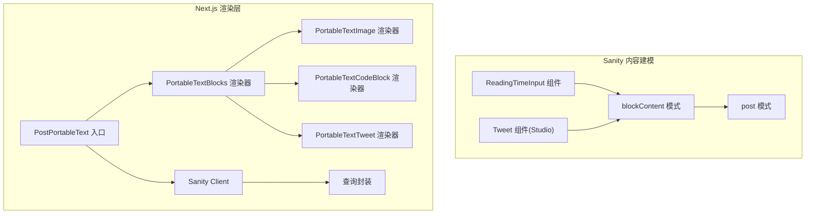
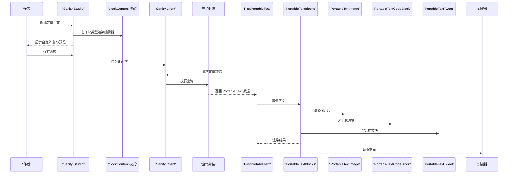
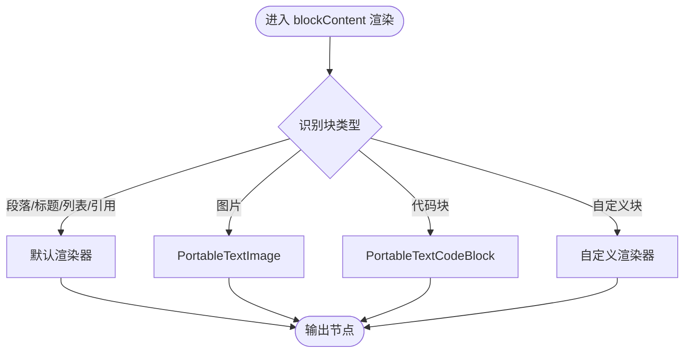
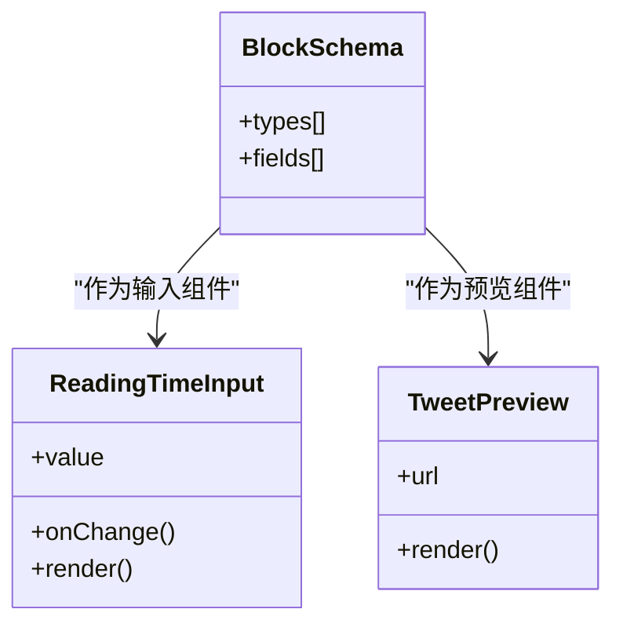
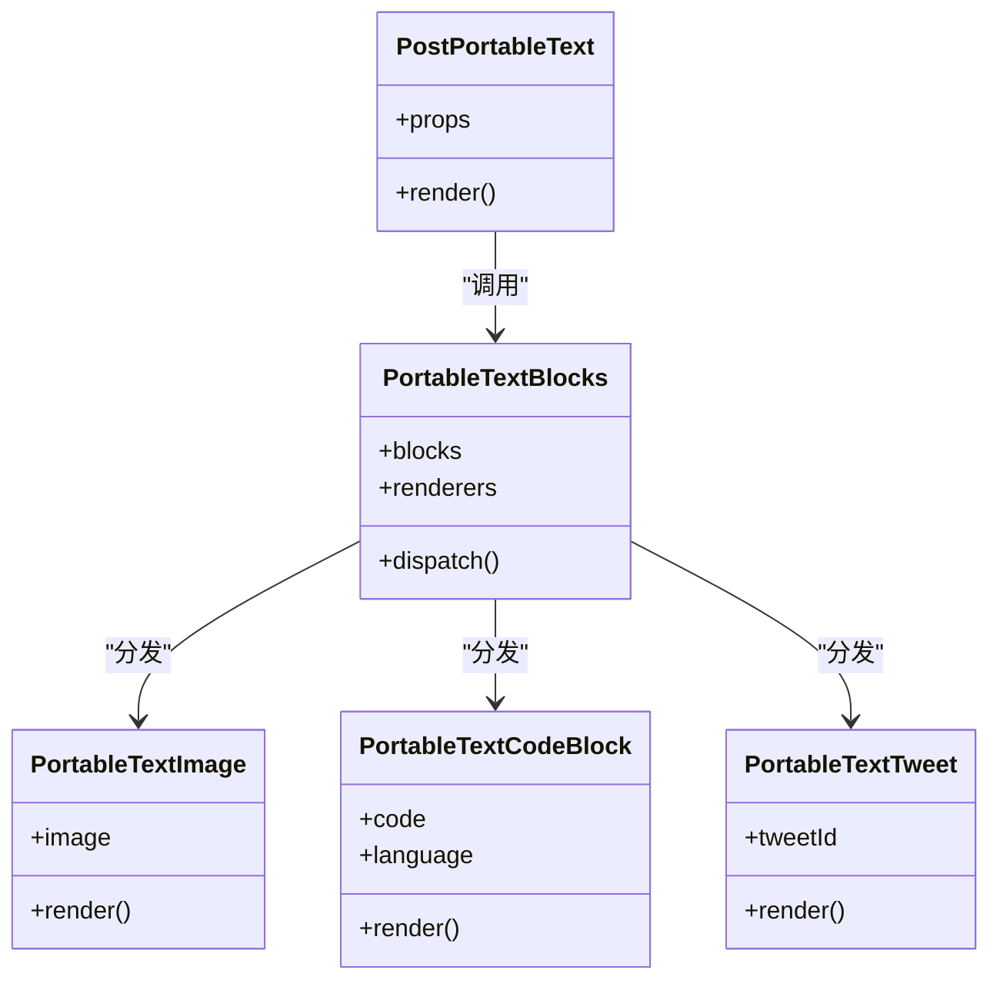
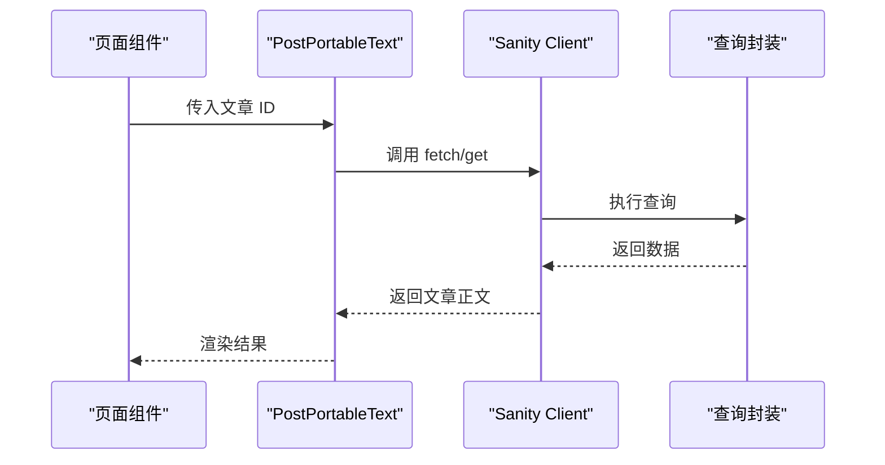
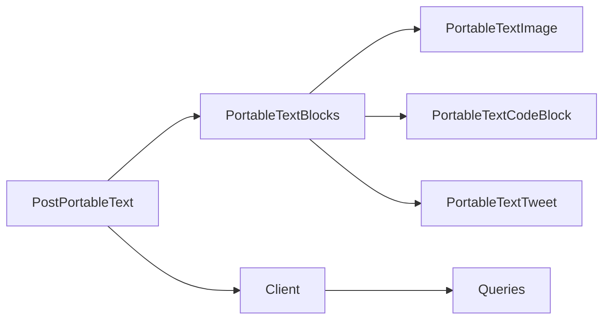

# 块编辑器系统

<cite>
**本文引用的文件**   
- [blockContent.ts](file://sanity/schemas/blockContent.ts)
- [post.ts](file://sanity/schemas/post.ts)
- [ReadingTimeInput.tsx](file://sanity/components/ReadingTimeInput.tsx)
- [Tweet.tsx](file://sanity/components/Tweet.tsx)
- [PortableTextBlocks.tsx](file://components/portable-text/PortableTextBlocks.tsx)
- [PortableTextCodeBlock.tsx](file://components/portable-text/PortableTextCodeBlock.tsx)
- [PortableTextImage.tsx](file://components/portable-text/PortableTextImage.tsx)
- [PortableTextTweet.tsx](file://components/portable-text/PortableTextTweet.tsx)
- [PostPortableText.tsx](file://components/PostPortableText.tsx)
- [client.ts](file://sanity/lib/client.ts)
- [queries.ts](file://sanity/queries.ts)
</cite>

## 目录
1. [简介](#简介)
2. [项目结构](#项目结构)
3. [核心组件](#核心组件)
4. [架构总览](#架构总览)
5. [详细组件分析](#详细组件分析)
6. [依赖关系分析](#依赖关系分析)
7. [性能考虑](#性能考虑)
8. [故障排查指南](#故障排查指南)
9. [结论](#结论)
10. [附录](#附录)

## 简介
本文件面向 cali.so 的块编辑器系统，聚焦于 Sanity Portable Text 的数据模型与前端渲染链路。文档将深入解释 blockContent 的实现机制，包括自定义块类型、内联样式和媒体嵌入；并详细说明 Tweet 组件与阅读时间输入等自定义组件的开发与集成方式。同时覆盖块的渲染逻辑、样式定制、交互行为、复杂内容处理、块间数据传递与状态管理策略，并提供可操作的扩展指南（以代码片段路径形式给出）。

## 项目结构
本项目使用 Sanity Studio 作为内容建模与编辑入口，通过 Portable Text 描述富文本内容；Next.js 应用负责读取与渲染这些内容。关键目录与职责如下：
- sanity/schemas: 定义内容模型，包括 blockContent 字段、文章 post 等
- sanity/components: 为 Sanity Studio 提供自定义输入与预览组件（如阅读时间输入、推文预览）
- components/portable-text: 在 Next.js 中实现 Portable Text 的渲染器（块、图片、代码块、推文等）
- components/PostPortableText.tsx: 聚合渲染入口，统一处理文章正文
- sanity/lib/client.ts 与 sanity/queries.ts: 客户端与查询封装，用于获取文章内容

图表来源
- [blockContent.ts](file://sanity/schemas/blockContent.ts)
- [post.ts](file://sanity/schemas/post.ts)
- [ReadingTimeInput.tsx](file://sanity/components/ReadingTimeInput.tsx)
- [Tweet.tsx](file://sanity/components/Tweet.tsx)
- [PostPortableText.tsx](file://components/PostPortableText.tsx)
- [PortableTextBlocks.tsx](file://components/portable-text/PortableTextBlocks.tsx)
- [PortableTextImage.tsx](file://components/portable-text/PortableTextImage.tsx)
- [PortableTextCodeBlock.tsx](file://components/portable-text/PortableTextCodeBlock.tsx)
- [PortableTextTweet.tsx](file://components/portable-text/PortableTextTweet.tsx)
- [client.ts](file://sanity/lib/client.ts)
- [queries.ts](file://sanity/queries.ts)

章节来源
- [blockContent.ts](file://sanity/schemas/blockContent.ts)
- [post.ts](file://sanity/schemas/post.ts)
- [ReadingTimeInput.tsx](file://sanity/components/ReadingTimeInput.tsx)
- [Tweet.tsx](file://sanity/components/Tweet.tsx)
- [PostPortableText.tsx](file://components/PostPortableText.tsx)
- [PortableTextBlocks.tsx](file://components/portable-text/PortableTextBlocks.tsx)
- [PortableTextImage.tsx](file://components/portable-text/PortableTextImage.tsx)
- [PortableTextCodeBlock.tsx](file://components/portable-text/PortableTextCodeBlock.tsx)
- [PortableTextTweet.tsx](file://components/portable-text/PortableTextTweet.tsx)
- [client.ts](file://sanity/lib/client.ts)
- [queries.ts](file://sanity/queries.ts)

## 核心组件
- blockContent 模式：定义文章正文的块集合，支持段落、标题、列表、引用、代码块、图片、自定义块等。通过 types 数组注册多种块类型，并通过 listTitle/markdown 等配置提升编辑体验。
- 自定义输入组件 ReadingTimeInput：在 Studio 中提供“阅读时间”字段的可视化输入，便于作者快速估算或设置阅读时长。
- 自定义预览组件 Tweet：在 Studio 中为推文链接提供预览卡片，辅助编辑者确认内容。
- 渲染器集合：
  - PortableTextBlocks：根据块类型分发到具体渲染器
  - PortableTextImage：渲染图片块
  - PortableTextCodeBlock：渲染代码块
  - PortableTextTweet：渲染推文嵌入
  - PostPortableText：聚合入口，统一处理文章正文渲染

章节来源
- [blockContent.ts](file://sanity/schemas/blockContent.ts)
- [ReadingTimeInput.tsx](file://sanity/components/ReadingTimeInput.tsx)
- [Tweet.tsx](file://sanity/components/Tweet.tsx)
- [PortableTextBlocks.tsx](file://components/portable-text/PortableTextBlocks.tsx)
- [PortableTextImage.tsx](file://components/portable-text/PortableTextImage.tsx)
- [PortableTextCodeBlock.tsx](file://components/portable-text/PortableTextCodeBlock.tsx)
- [PortableTextTweet.tsx](file://components/portable-text/PortableTextTweet.tsx)
- [PostPortableText.tsx](file://components/PostPortableText.tsx)

## 架构总览
从内容建模到页面渲染的整体流程如下：
- 作者在 Sanity Studio 中使用 blockContent 进行富文本编辑，期间可通过自定义组件（如阅读时间输入、推文预览）增强体验
- 内容保存后，Next.js 通过 Sanity Client 与查询封装拉取文章数据
- 渲染阶段，PostPortableText 调用 PortableTextBlocks，按块类型分发给对应渲染器（图片、代码块、推文等），最终输出 HTML/React 节点

图表来源
- [blockContent.ts](file://sanity/schemas/blockContent.ts)
- [ReadingTimeInput.tsx](file://sanity/components/ReadingTimeInput.tsx)
- [Tweet.tsx](file://sanity/components/Tweet.tsx)
- [PostPortableText.tsx](file://components/PostPortableText.tsx)
- [PortableTextBlocks.tsx](file://components/portable-text/PortableTextBlocks.tsx)
- [PortableTextImage.tsx](file://components/portable-text/PortableTextImage.tsx)
- [PortableTextCodeBlock.tsx](file://components/portable-text/PortableTextCodeBlock.tsx)
- [PortableTextTweet.tsx](file://components/portable-text/PortableTextTweet.tsx)
- [client.ts](file://sanity/lib/client.ts)
- [queries.ts](file://sanity/queries.ts)

## 详细组件分析

### blockContent 实现机制
- 块类型注册：通过 types 数组声明支持的块类型，例如段落、标题、列表、引用、代码块、图片、以及自定义块
- 内联样式：在 text 级别支持粗体、斜体、删除线等样式标记，由渲染器映射为相应 HTML 标签
- 媒体嵌入：图片块通过 PortableTextImage 渲染，支持尺寸与替代文本；其他媒体可通过自定义块类型扩展
- 自定义块：新增块类型时，需在 schema 中定义其数据结构，并在渲染器中实现对应组件

图表来源
- [blockContent.ts](file://sanity/schemas/blockContent.ts)
- [PortableTextBlocks.tsx](file://components/portable-text/PortableTextBlocks.tsx)
- [PortableTextImage.tsx](file://components/portable-text/PortableTextImage.tsx)
- [PortableTextCodeBlock.tsx](file://components/portable-text/PortableTextCodeBlock.tsx)

章节来源
- [blockContent.ts](file://sanity/schemas/blockContent.ts)
- [PortableTextBlocks.tsx](file://components/portable-text/PortableTextBlocks.tsx)
- [PortableTextImage.tsx](file://components/portable-text/PortableTextImage.tsx)
- [PortableTextCodeBlock.tsx](file://components/portable-text/PortableTextCodeBlock.tsx)

### Tweet 组件与阅读时间输入
- Tweet 组件（Studio）：在编辑器中为推文链接提供预览卡片，帮助作者确认内容格式与外观
- 阅读时间输入（Studio）：提供可视化的阅读时长输入控件，便于作者快速估算或手动设置
- 集成方式：在相关 schema 中引入自定义组件作为 input 或 preview，使 Studio 具备更好的编辑体验

图表来源
- [ReadingTimeInput.tsx](file://sanity/components/ReadingTimeInput.tsx)
- [Tweet.tsx](file://sanity/components/Tweet.tsx)
- [blockContent.ts](file://sanity/schemas/blockContent.ts)

章节来源
- [ReadingTimeInput.tsx](file://sanity/components/ReadingTimeInput.tsx)
- [Tweet.tsx](file://sanity/components/Tweet.tsx)
- [blockContent.ts](file://sanity/schemas/blockContent.ts)

### 渲染器与入口
- PortableTextBlocks：根据块类型分发到具体渲染器，是渲染的核心调度器
- PortableTextImage：处理图片块的尺寸、占位与加载策略
- PortableTextCodeBlock：处理代码高亮与复制等功能
- PortableTextTweet：处理推文嵌入，可能涉及外部 API 或缓存
- PostPortableText：聚合入口，统一处理文章正文渲染，并可注入上下文（如主题、语言）

图表来源
- [PostPortableText.tsx](file://components/PostPortableText.tsx)
- [PortableTextBlocks.tsx](file://components/portable-text/PortableTextBlocks.tsx)
- [PortableTextImage.tsx](file://components/portable-text/PortableTextImage.tsx)
- [PortableTextCodeBlock.tsx](file://components/portable-text/PortableTextCodeBlock.tsx)
- [PortableTextTweet.tsx](file://components/portable-text/PortableTextTweet.tsx)

章节来源
- [PostPortableText.tsx](file://components/PostPortableText.tsx)
- [PortableTextBlocks.tsx](file://components/portable-text/PortableTextBlocks.tsx)
- [PortableTextImage.tsx](file://components/portable-text/PortableTextImage.tsx)
- [PortableTextCodeBlock.tsx](file://components/portable-text/PortableTextCodeBlock.tsx)
- [PortableTextTweet.tsx](file://components/portable-text/PortableTextTweet.tsx)

### 数据获取与查询
- Sanity Client：封装连接与鉴权信息，提供 get、fetch 等方法
- 查询封装：集中管理常用查询，如获取文章正文、元数据等
- 渲染入口：PostPortableText 通过 Client 与查询获取数据，再交由渲染器处理

图表来源
- [client.ts](file://sanity/lib/client.ts)
- [queries.ts](file://sanity/queries.ts)
- [PostPortableText.tsx](file://components/PostPortableText.tsx)

章节来源
- [client.ts](file://sanity/lib/client.ts)
- [queries.ts](file://sanity/queries.ts)
- [PostPortableText.tsx](file://components/PostPortableText.tsx)

## 依赖关系分析
- 模块耦合：
  - PostPortableText 依赖 PortableTextBlocks 及各类渲染器
  - PortableTextBlocks 依赖各具体渲染器（图片、代码、推文）
  - 渲染器依赖外部资源（如图片 CDN、Twitter 嵌入脚本）
- 外部依赖：
  - Sanity Client 与查询封装用于数据获取
  - 第三方服务（如 Twitter）用于嵌入展示

图表来源
- [PostPortableText.tsx](file://components/PostPortableText.tsx)
- [PortableTextBlocks.tsx](file://components/portable-text/PortableTextBlocks.tsx)
- [PortableTextImage.tsx](file://components/portable-text/PortableTextImage.tsx)
- [PortableTextCodeBlock.tsx](file://components/portable-text/PortableTextCodeBlock.tsx)
- [PortableTextTweet.tsx](file://components/portable-text/PortableTextTweet.tsx)
- [client.ts](file://sanity/lib/client.ts)
- [queries.ts](file://sanity/queries.ts)

章节来源
- [PostPortableText.tsx](file://components/PostPortableText.tsx)
- [PortableTextBlocks.tsx](file://components/portable-text/PortableTextBlocks.tsx)
- [PortableTextImage.tsx](file://components/portable-text/PortableTextImage.tsx)
- [PortableTextCodeBlock.tsx](file://components/portable-text/PortableTextCodeBlock.tsx)
- [PortableTextTweet.tsx](file://components/portable-text/PortableTextTweet.tsx)
- [client.ts](file://sanity/lib/client.ts)
- [queries.ts](file://sanity/queries.ts)

## 性能考虑
- 图片优化：使用合适的尺寸与懒加载策略，减少首屏负载
- 代码块渲染：按需启用语法高亮库，避免不必要的初始化开销
- 推文嵌入：对第三方嵌入进行缓存与降级处理，确保网络异常时的用户体验
- 查询优化：在查询中仅选择必要字段，减少数据传输量

[本节为通用指导，不直接分析具体文件]

## 故障排查指南
- 渲染异常：检查 PortableTextBlocks 的分发逻辑是否正确匹配块类型
- 图片无法加载：确认图片 URL 与 CDN 配置，检查替代文本是否缺失
- 代码块无高亮：验证语言标识与高亮库版本兼容性
- 推文嵌入失败：检查 tweetId 有效性、网络连通性与第三方服务状态
- 数据获取错误：核对 Sanity Client 配置与查询语句，查看控制台日志定位问题

章节来源
- [PortableTextBlocks.tsx](file://components/portable-text/PortableTextBlocks.tsx)
- [PortableTextImage.tsx](file://components/portable-text/PortableTextImage.tsx)
- [PortableTextCodeBlock.tsx](file://components/portable-text/PortableTextCodeBlock.tsx)
- [PortableTextTweet.tsx](file://components/portable-text/PortableTextTweet.tsx)
- [client.ts](file://sanity/lib/client.ts)
- [queries.ts](file://sanity/queries.ts)

## 结论
本系统通过 Sanity 的 Portable Text 实现了灵活的块编辑器能力，结合自定义输入与预览组件提升了编辑体验；在渲染端通过模块化渲染器与统一入口，保证了可扩展性与可维护性。遵循本文档的扩展指南与最佳实践，可高效地新增块类型、处理复杂内容与实现富文本编辑功能。

[本节为总结，不直接分析具体文件]

## 附录

### 如何创建新的块类型（步骤指引）
- 在 blockContent 模式中新增块类型定义，包含必要的字段与校验规则
- 在渲染器集合中实现对应的渲染组件，处理数据结构与样式
- 在 PortableTextBlocks 中注册新类型的分发逻辑
- 在 Studio 中测试编辑与预览效果，必要时添加自定义输入或预览组件

章节来源
- [blockContent.ts](file://sanity/schemas/blockContent.ts)
- [PortableTextBlocks.tsx](file://components/portable-text/PortableTextBlocks.tsx)

### 如何处理复杂内容与富文本编辑
- 利用内联样式标记实现粗体、斜体、删除线等基础富文本能力
- 通过自定义块类型承载复杂结构（如表格、流程图、交互式卡片）
- 在渲染器中组合多个子组件，形成复合内容单元

章节来源
- [blockContent.ts](file://sanity/schemas/blockContent.ts)
- [PortableTextBlocks.tsx](file://components/portable-text/PortableTextBlocks.tsx)

### 块之间的数据传递与状态管理策略
- 块之间通过 Portable Text 的结构化数据进行传递，避免隐式状态
- 对于需要交互的状态，建议在渲染器内部使用 React 状态管理，保持组件自包含
- 跨块共享状态可通过父级入口（PostPortableText）注入上下文或回调函数

章节来源
- [PostPortableText.tsx](file://components/PostPortableText.tsx)
- [PortableTextBlocks.tsx](file://components/portable-text/PortableTextBlocks.tsx)