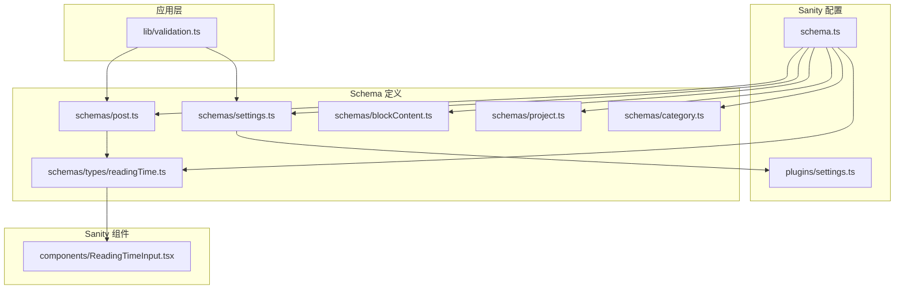
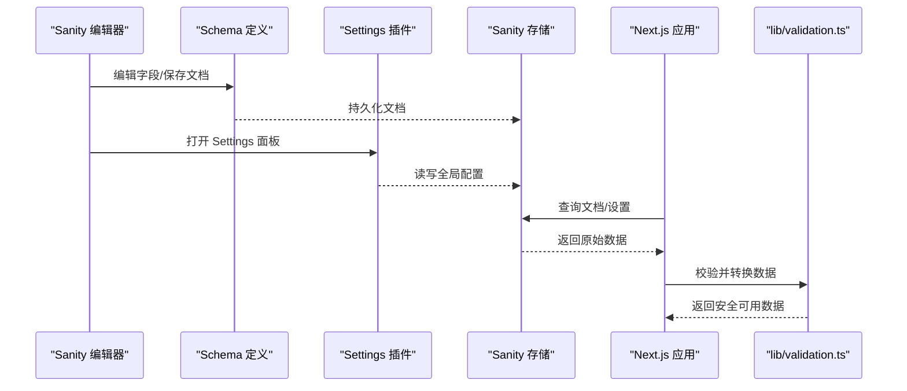
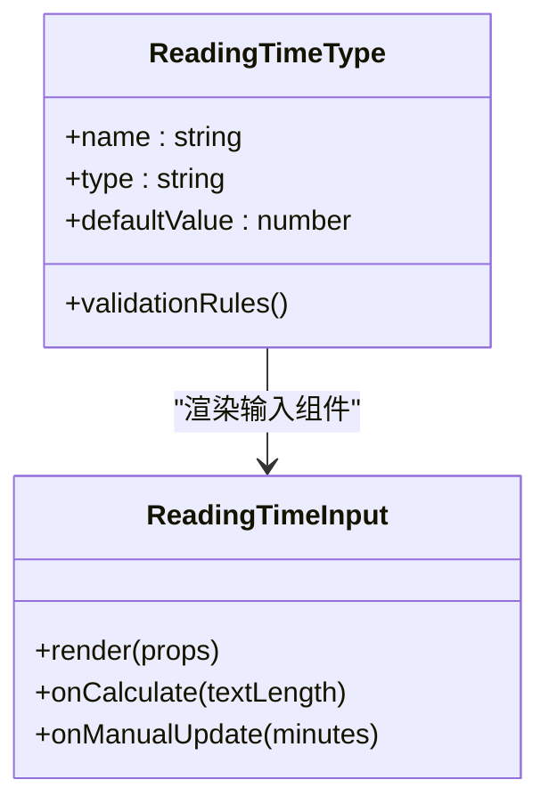
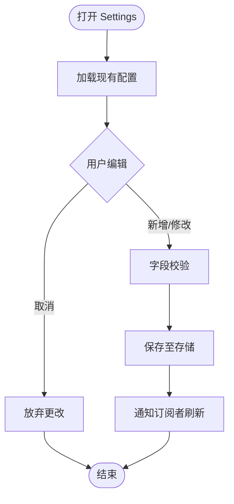
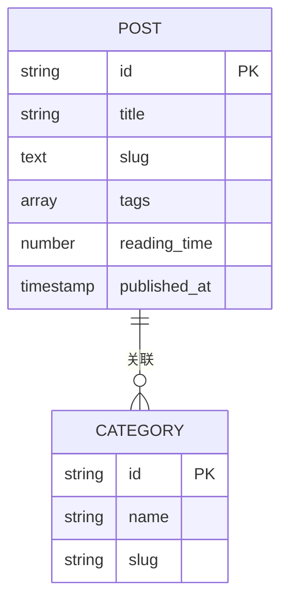
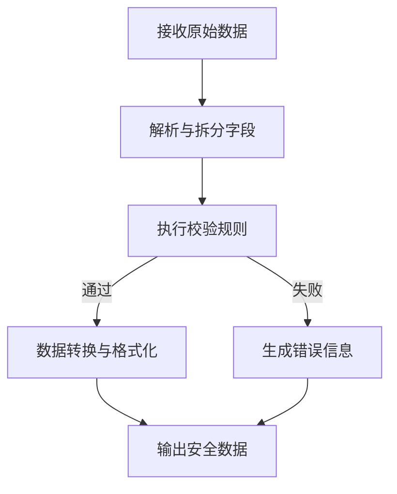
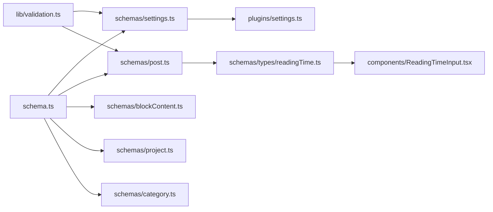

# 字段设计模式

<cite>
**本文引用的文件**
- [sanity/schemas/settings.ts](file://sanity/schemas/settings.ts)
- [sanity/plugins/settings.ts](file://sanity/plugins/settings.ts)
- [sanity/schemas/types/readingTime.ts](file://sanity/schemas/types/readingTime.ts)
- [sanity/components/ReadingTimeInput.tsx](file://sanity/components/ReadingTimeInput.tsx)
- [sanity/schemas/post.ts](file://sanity/schemas/post.ts)
- [sanity/schemas/blockContent.ts](file://sanity/schemas/blockContent.ts)
- [sanity/schemas/project.ts](file://sanity/schemas/project.ts)
- [sanity/schemas/category.ts](file://sanity/schemas/category.ts)
- [sanity/schema.ts](file://sanity/schema.ts)
- [lib/validation.ts](file://lib/validation.ts)
</cite>

## 目录
1. [简介](#简介)
2. [项目结构](#项目结构)
3. [核心组件](#核心组件)
4. [架构总览](#架构总览)
5. [详细组件分析](#详细组件分析)
6. [依赖关系分析](#依赖关系分析)
7. [性能考虑](#性能考虑)
8. [故障排查指南](#故障排查指南)
9. [结论](#结论)
10. [附录](#附录)

## 简介
本文件围绕 cali.so 的 Sanity Schema 与前端验证体系，系统化梳理“字段设计模式”。重点覆盖：
- 自定义字段类型（如 readingTime）的设计与实现
- 复杂嵌套结构与数据转换、格式化逻辑
- 设置（settings）Schema 的配置管理与全局参数设计
- 字段依赖关系、条件显示与动态验证的实现方法
- 可复用字段组件、数据转换与格式化的最佳实践
- 性能优化与可扩展性指导

## 项目结构
Sanity 相关代码集中在 sanity 目录，包含 schemas、components、plugins 等。应用层在 lib 中提供通用校验工具。整体组织方式以“领域模型”为维度划分 schema，并通过 schema.ts 聚合注册。

图表来源
- [sanity/schema.ts](file://sanity/schema.ts)
- [sanity/schemas/settings.ts](file://sanity/schemas/settings.ts)
- [sanity/plugins/settings.ts](file://sanity/plugins/settings.ts)
- [sanity/schemas/post.ts](file://sanity/schemas/post.ts)
- [sanity/schemas/blockContent.ts](file://sanity/schemas/blockContent.ts)
- [sanity/schemas/project.ts](file://sanity/schemas/project.ts)
- [sanity/schemas/category.ts](file://sanity/schemas/category.ts)
- [sanity/schemas/types/readingTime.ts](file://sanity/schemas/types/readingTime.ts)
- [sanity/components/ReadingTimeInput.tsx](file://sanity/components/ReadingTimeInput.tsx)
- [lib/validation.ts](file://lib/validation.ts)

章节来源
- [sanity/schema.ts](file://sanity/schema.ts)
- [sanity/schemas/settings.ts](file://sanity/schemas/settings.ts)
- [sanity/plugins/settings.ts](file://sanity/plugins/settings.ts)
- [sanity/schemas/post.ts](file://sanity/schemas/post.ts)
- [sanity/schemas/blockContent.ts](file://sanity/schemas/blockContent.ts)
- [sanity/schemas/project.ts](file://sanity/schemas/project.ts)
- [sanity/schemas/category.ts](file://sanity/schemas/category.ts)
- [sanity/schemas/types/readingTime.ts](file://sanity/schemas/types/readingTime.ts)
- [sanity/components/ReadingTimeInput.tsx](file://sanity/components/ReadingTimeInput.tsx)
- [lib/validation.ts](file://lib/validation.ts)

## 核心组件
- 自定义字段类型 readingTime
  - 目标：将阅读时长作为独立字段类型，统一计算与展示，避免业务层重复实现。
  - 关键点：类型定义、输入组件、默认值与校验规则。
- 设置（Settings）Schema
  - 目标：集中管理站点级全局参数，如主题、SEO、社交链接等。
  - 关键点：分组布局、国际化键、条件显示、权限控制。
- 内容文档 Schema（post、project、category 等）
  - 目标：描述内容模型的字段组合、嵌套结构、引用关系。
  - 关键点：块内容（blockContent）、富文本扩展、关联引用。
- 应用层校验（lib/validation.ts）
  - 目标：在 API 或表单提交前进行二次校验与数据清洗。
  - 关键点：结构化校验、错误信息映射、兼容多端。

章节来源
- [sanity/schemas/types/readingTime.ts](file://sanity/schemas/types/readingTime.ts)
- [sanity/components/ReadingTimeInput.tsx](file://sanity/components/ReadingTimeInput.tsx)
- [sanity/schemas/settings.ts](file://sanity/schemas/settings.ts)
- [sanity/plugins/settings.ts](file://sanity/plugins/settings.ts)
- [sanity/schemas/post.ts](file://sanity/schemas/post.ts)
- [sanity/schemas/blockContent.ts](file://sanity/schemas/blockContent.ts)
- [sanity/schemas/project.ts](file://sanity/schemas/project.ts)
- [sanity/schemas/category.ts](file://sanity/schemas/category.ts)
- [lib/validation.ts](file://lib/validation.ts)

## 架构总览
下图展示了从 Schema 到运行时数据的端到端路径：Sanity Studio 通过 schema 定义字段，插件增强 Settings 体验；应用侧读取数据后，使用 lib/validation.ts 做最终校验与转换。

图表来源
- [sanity/schema.ts](file://sanity/schema.ts)
- [sanity/schemas/settings.ts](file://sanity/schemas/settings.ts)
- [sanity/plugins/settings.ts](file://sanity/plugins/settings.ts)
- [lib/validation.ts](file://lib/validation.ts)

## 详细组件分析

### 自定义字段类型：readingTime
- 设计目标
  - 将“阅读时长”抽象为可复用的字段类型，支持自动计算与展示。
- 关键实现要点
  - 类型定义：声明字段名称、类型、默认值、校验规则。
  - 输入组件：提供友好的 UI，支持手动调整与自动估算。
  - 数据流：内容写入时触发计算，输出标准化单位（如分钟）。
- 推荐最佳实践
  - 将计算逻辑与 UI 解耦，便于测试与替换。
  - 对边界情况（空内容、超长文本）给出合理默认值与提示。
  - 暴露可选的“锁定/解锁”开关，允许作者覆盖自动结果。

图表来源
- [sanity/schemas/types/readingTime.ts](file://sanity/schemas/types/readingTime.ts)
- [sanity/components/ReadingTimeInput.tsx](file://sanity/components/ReadingTimeInput.tsx)

章节来源
- [sanity/schemas/types/readingTime.ts](file://sanity/schemas/types/readingTime.ts)
- [sanity/components/ReadingTimeInput.tsx](file://sanity/components/ReadingTimeInput.tsx)

### 设置（Settings）Schema 与插件
- 设计目标
  - 统一管理站点级全局参数，如 SEO、主题、社交账号、功能开关等。
- 关键实现要点
  - 分组与布局：按模块分组，提升可维护性与可读性。
  - 条件显示：根据其他字段值动态显示/隐藏子项。
  - 权限控制：限制敏感字段的可见性与可编辑性。
  - 插件增强：通过 settings 插件定制面板行为与交互。
- 典型流程
  - 编辑器打开 Settings 面板 → 加载当前配置 → 修改并保存 → 应用侧拉取最新配置。

图表来源
- [sanity/schemas/settings.ts](file://sanity/schemas/settings.ts)
- [sanity/plugins/settings.ts](file://sanity/plugins/settings.ts)

章节来源
- [sanity/schemas/settings.ts](file://sanity/schemas/settings.ts)
- [sanity/plugins/settings.ts](file://sanity/plugins/settings.ts)

### 内容文档 Schema：post、blockContent、project、category
- 设计目标
  - 描述文章、项目、分类等内容的字段组合与嵌套结构。
- 关键实现要点
  - blockContent：基于块的富文本结构，支持图片、代码块、引用等扩展。
  - 引用关系：post 与 category 的多对多或一对多关系。
  - 条件显示：根据 post 的状态或类型显示不同字段组。
  - 数据转换：在入库前规范化 URL、标签、时间戳等。
- 建议
  - 将公共字段抽取为共享类型或片段，减少重复。
  - 对富文本节点进行严格校验，防止注入风险。

图表来源
- [sanity/schemas/post.ts](file://sanity/schemas/post.ts)
- [sanity/schemas/category.ts](file://sanity/schemas/category.ts)
- [sanity/schemas/blockContent.ts](file://sanity/schemas/blockContent.ts)

章节来源
- [sanity/schemas/post.ts](file://sanity/schemas/post.ts)
- [sanity/schemas/category.ts](file://sanity/schemas/category.ts)
- [sanity/schemas/blockContent.ts](file://sanity/schemas/blockContent.ts)

### 应用层数据校验与转换（lib/validation.ts）
- 设计目标
  - 在 API 或页面渲染前，对来自 Sanity 的数据进行二次校验与清洗。
- 关键实现要点
  - 结构化校验：确保必填字段存在、类型正确、范围合理。
  - 数据转换：将字符串日期转为标准格式、URL 规范化、标签去重。
  - 错误映射：将底层错误转换为前端友好的消息。
- 建议
  - 与 Schema 保持一致的校验策略，避免前后端不一致。
  - 对第三方数据源增加白名单与长度限制。

图表来源
- [lib/validation.ts](file://lib/validation.ts)

章节来源
- [lib/validation.ts](file://lib/validation.ts)

## 依赖关系分析
- 聚合入口
  - schema.ts 负责聚合所有 schema 类型，是 Sanity 配置的单一入口。
- 类型与组件耦合
  - readingTime 类型与其输入组件强耦合，但可通过接口隔离以便替换。
- 插件与配置
  - settings 插件与 settings schema 协作，增强全局配置的管理体验。
- 应用层与后端
  - lib/validation.ts 与 Sanity 数据模型保持契约一致，承担最终防线职责。

图表来源
- [sanity/schema.ts](file://sanity/schema.ts)
- [sanity/schemas/settings.ts](file://sanity/schemas/settings.ts)
- [sanity/plugins/settings.ts](file://sanity/plugins/settings.ts)
- [sanity/schemas/post.ts](file://sanity/schemas/post.ts)
- [sanity/schemas/blockContent.ts](file://sanity/schemas/blockContent.ts)
- [sanity/schemas/project.ts](file://sanity/schemas/project.ts)
- [sanity/schemas/category.ts](file://sanity/schemas/category.ts)
- [sanity/schemas/types/readingTime.ts](file://sanity/schemas/types/readingTime.ts)
- [sanity/components/ReadingTimeInput.tsx](file://sanity/components/ReadingTimeInput.tsx)
- [lib/validation.ts](file://lib/validation.ts)

章节来源
- [sanity/schema.ts](file://sanity/schema.ts)
- [sanity/schemas/settings.ts](file://sanity/schemas/settings.ts)
- [sanity/plugins/settings.ts](file://sanity/plugins/settings.ts)
- [sanity/schemas/post.ts](file://sanity/schemas/post.ts)
- [sanity/schemas/blockContent.ts](file://sanity/schemas/blockContent.ts)
- [sanity/schemas/project.ts](file://sanity/schemas/project.ts)
- [sanity/schemas/category.ts](file://sanity/schemas/category.ts)
- [sanity/schemas/types/readingTime.ts](file://sanity/schemas/types/readingTime.ts)
- [sanity/components/ReadingTimeInput.tsx](file://sanity/components/ReadingTimeInput.tsx)
- [lib/validation.ts](file://lib/validation.ts)

## 性能考虑
- 懒加载与按需渲染
  - 对大型富文本或图片节点采用懒加载，减少首屏压力。
- 缓存策略
  - 对 Settings 与静态配置进行缓存，降低频繁请求开销。
- 计算优化
  - readingTime 的计算应尽可能轻量，必要时引入增量更新或缓存中间结果。
- 批量操作
  - 在导入/迁移场景下，尽量批量写入，减少网络往返。
- 前端渲染
  - 对长列表分页与虚拟滚动，避免一次性渲染过多 DOM。

[本节为通用性能建议，不直接分析具体文件]

## 故障排查指南
- 常见问题定位
  - 字段未显示：检查条件显示规则与权限配置。
  - 校验失败：对比 Schema 与 lib/validation.ts 的规则一致性。
  - 数据异常：确认数据转换逻辑是否处理了边界值与非法字符。
- 调试技巧
  - 在 Sanity 编辑器中启用预览与日志，观察字段变化。
  - 在应用层打印校验前后的数据快照，快速定位差异。
- 恢复与回滚
  - 对 Settings 变更保留版本历史，必要时回滚到稳定版本。

章节来源
- [sanity/schemas/settings.ts](file://sanity/schemas/settings.ts)
- [lib/validation.ts](file://lib/validation.ts)

## 结论
通过将字段类型抽象为可复用组件、将全局配置集中管理、并在应用层实施严格的校验与转换，cali.so 实现了高内聚、低耦合的字段设计模式。该模式具备良好的可扩展性与可维护性，能够支撑未来更多复杂业务需求。

[本节为总结性内容，不直接分析具体文件]

## 附录
- 术语说明
  - Schema：用于描述数据结构与约束的定义集合。
  - 插件：扩展 Sanity Studio 行为的模块化能力。
  - 条件显示：根据上下文动态控制字段可见性的机制。
- 参考路径
  - 自定义类型与组件：见 readingTime 相关文件
  - 设置管理：见 settings schema 与插件
  - 内容模型：见 post、blockContent、project、category
  - 应用校验：见 lib/validation.ts

[本节为概念性说明，不直接分析具体文件]