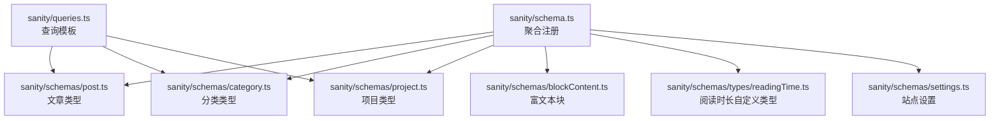
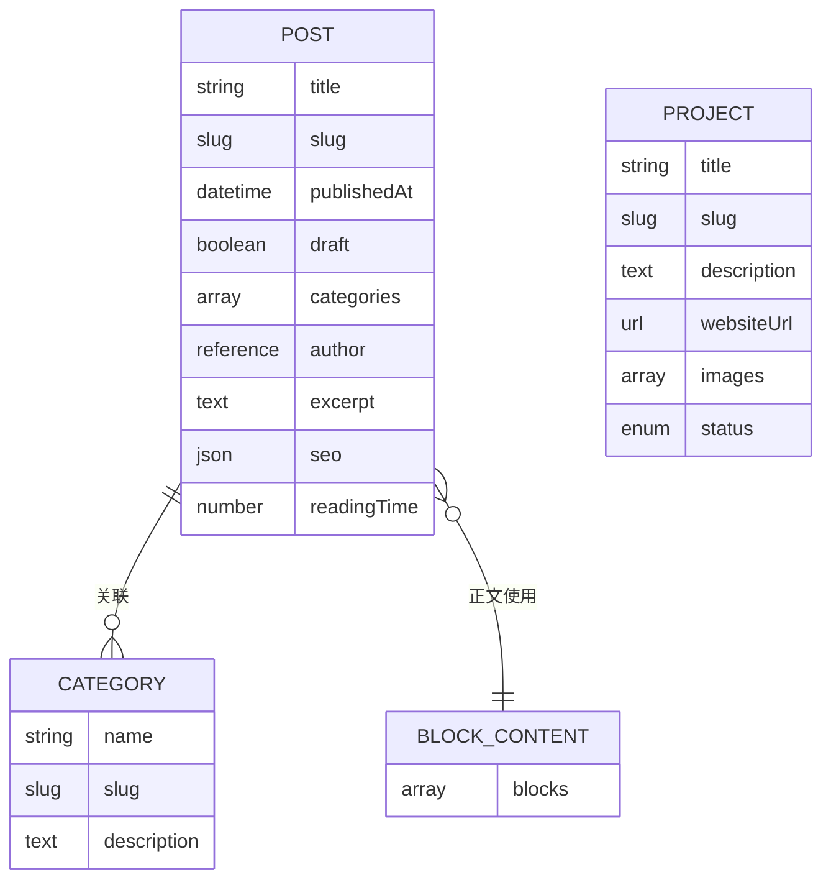
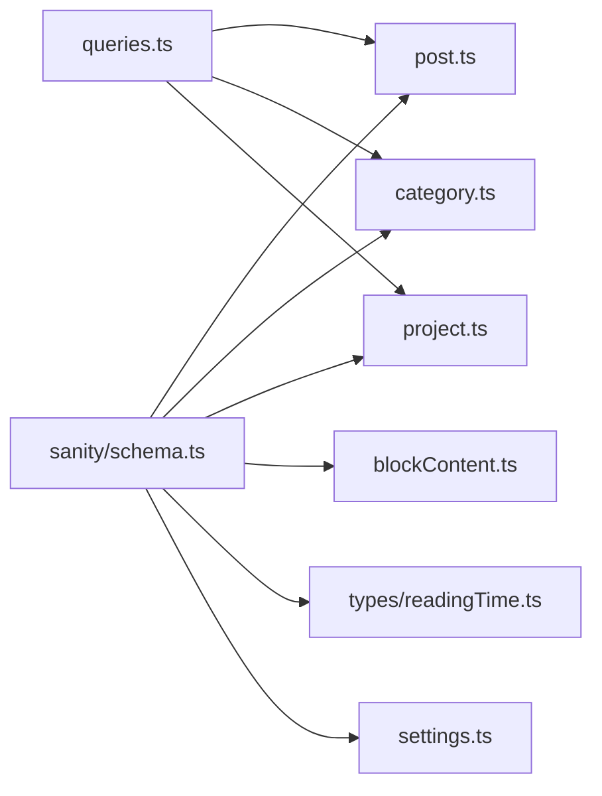

# 核心内容类型

<cite>
**本文引用的文件**
- [sanity/schemas/post.ts](file://sanity/schemas/post.ts)
- [sanity/schemas/category.ts](file://sanity/schemas/category.ts)
- [sanity/schemas/project.ts](file://sanity/schemas/project.ts)
- [sanity/schemas/blockContent.ts](file://sanity/schemas/blockContent.ts)
- [sanity/schemas/types/readingTime.ts](file://sanity/schemas/types/readingTime.ts)
- [sanity/schemas/settings.ts](file://sanity/schemas/settings.ts)
- [sanity/schema.ts](file://sanity/schema.ts)
- [sanity/queries.ts](file://sanity/queries.ts)
</cite>

## 目录
1. [简介](#简介)
2. [项目结构](#项目结构)
3. [核心组件](#核心组件)
4. [架构总览](#架构总览)
5. [详细组件分析](#详细组件分析)
6. [依赖关系分析](#依赖关系分析)
7. [性能考量](#性能考量)
8. [故障排查指南](#故障排查指南)
9. [结论](#结论)
10. [附录](#附录)

## 简介
本文件聚焦 cali.so 的核心内容类型，围绕文章（post）、分类（category）与项目（project）三大 Schema 的设计模式、字段定义、验证规则、默认值与关联关系进行深入解析。文档同时覆盖复杂字段类型、嵌套结构与数据约束的示例路径，解释内容类型的继承与多态设计，并提供字段组合的最佳实践与性能优化建议，帮助读者在 Sanity Studio 中高效构建与维护高质量内容模型。

## 项目结构
Sanity 相关内容类型集中在 sanity/schemas 目录下，顶层 schema 聚合器负责注册所有类型。关键文件包括：
- 类型定义：post.ts、category.ts、project.ts、blockContent.ts、types/readingTime.ts、settings.ts
- 聚合注册：schema.ts
- 查询模板：queries.ts（用于前端或 API 层的数据获取）

图表来源
- [sanity/schema.ts](file://sanity/schema.ts)
- [sanity/schemas/post.ts](file://sanity/schemas/post.ts)
- [sanity/schemas/category.ts](file://sanity/schemas/category.ts)
- [sanity/schemas/project.ts](file://sanity/schemas/project.ts)
- [sanity/schemas/blockContent.ts](file://sanity/schemas/blockContent.ts)
- [sanity/schemas/types/readingTime.ts](file://sanity/schemas/types/readingTime.ts)
- [sanity/schemas/settings.ts](file://sanity/schemas/settings.ts)
- [sanity/queries.ts](file://sanity/queries.ts)

章节来源
- [sanity/schema.ts](file://sanity/schema.ts)
- [sanity/schemas/post.ts](file://sanity/schemas/post.ts)
- [sanity/schemas/category.ts](file://sanity/schemas/category.ts)
- [sanity/schemas/project.ts](file://sanity/schemas/project.ts)
- [sanity/schemas/blockContent.ts](file://sanity/schemas/blockContent.ts)
- [sanity/schemas/types/readingTime.ts](file://sanity/schemas/types/readingTime.ts)
- [sanity/schemas/settings.ts](file://sanity/schemas/settings.ts)
- [sanity/queries.ts](file://sanity/queries.ts)

## 核心组件
本节概述三类核心内容类型的职责与交互：
- 文章（post）：承载正文内容、元数据、分类关联、封面图、SEO 信息、阅读时长等
- 分类（category）：为文章提供标签化组织，支持名称、描述、slug 等
- 项目（project）：展示作品或产品，包含标题、描述、链接、图片、状态等

这些类型通过引用（reference）建立关联，并通过富文本块（blockContent）实现结构化内容渲染。

章节来源
- [sanity/schemas/post.ts](file://sanity/schemas/post.ts)
- [sanity/schemas/category.ts](file://sanity/schemas/category.ts)
- [sanity/schemas/project.ts](file://sanity/schemas/project.ts)
- [sanity/schemas/blockContent.ts](file://sanity/schemas/blockContent.ts)

## 架构总览
下图展示了核心内容类型之间的关联关系与依赖：

图表来源
- [sanity/schemas/post.ts](file://sanity/schemas/post.ts)
- [sanity/schemas/category.ts](file://sanity/schemas/category.ts)
- [sanity/schemas/project.ts](file://sanity/schemas/project.ts)
- [sanity/schemas/blockContent.ts](file://sanity/schemas/blockContent.ts)

## 详细组件分析

### 文章（post）类型
- 设计要点
  - 标题与 slug：确保唯一性与可读性；slug 常由标题派生并做校验
  - 发布时间与草稿：publishedAt 控制发布状态，draft 标记未发布
  - 分类关联：categories 为 category 引用数组，支持多对多
  - 作者引用：author 指向用户或其他实体（若存在）
  - 摘要与 SEO：excerpt 提供简短摘要；seo 对象包含 meta 信息
  - 正文内容：body 使用 blockContent 富文本结构
  - 阅读时长：readingTime 可基于正文计算或手动输入
- 字段类型与验证
  - 字符串类字段通常具备 minLength/maxLength 与 pattern 校验
  - slug 需符合 URL 安全字符集且唯一
  - 日期时间字段限制范围（如不能晚于当前时间）
  - 布尔字段用于开关行为（如是否公开）
  - JSON 字段用于扩展元数据，配合表单预览与校验
- 默认值
  - draft 默认 true，publishedAt 可为空
  - 某些 SEO 字段可设默认占位
- 关联关系
  - 与 category 的多对多
  - 与 author 的一对一（可选）
  - 与 blockContent 的组合关系
- 复杂字段与嵌套结构
  - seo 对象可嵌套多个键值，便于搜索引擎优化
  - body 的 blocks 数组包含多种块类型（段落、代码、图片等）
- 最佳实践
  - 使用 slugify 工具生成稳定 slug
  - 在保存钩子中自动计算 readingTime
  - 对敏感字段进行权限控制

章节来源
- [sanity/schemas/post.ts](file://sanity/schemas/post.ts)
- [sanity/schemas/blockContent.ts](file://sanity/schemas/blockContent.ts)
- [sanity/schemas/types/readingTime.ts](file://sanity/schemas/types/readingTime.ts)

### 分类（category）类型
- 设计要点
  - 名称与 slug：name 用于显示，slug 用于路由与过滤
  - 描述：description 提供分类说明
- 字段类型与验证
  - name 必填且长度受限
  - slug 唯一且符合 URL 规范
- 默认值
  - 无特殊默认值
- 关联关系
  - 被 post.categories 引用，形成一对多关系
- 复杂字段与嵌套结构
  - 可扩展 tags 或 metadata 以支持更细粒度分类
- 最佳实践
  - 使用预置分类集合，避免重复创建
  - 在列表页按 slug 进行缓存

章节来源
- [sanity/schemas/category.ts](file://sanity/schemas/category.ts)

### 项目（project）类型
- 设计要点
  - 标题与 slug：title 与 slug 用于展示与路由
  - 描述：description 提供项目简介
  - 网站链接：websiteUrl 指向外部资源
  - 图片：images 数组用于画廊或封面
  - 状态：status 枚举（如进行中、已完成、归档）
- 字段类型与验证
  - websiteUrl 需符合 URL 格式
  - images 数组元素为图片引用或对象，含 alt 与尺寸
  - status 限定为枚举值
- 默认值
  - status 可设默认“进行中”
- 关联关系
  - 独立实体，可与 post 通过标签或主题间接关联
- 复杂字段与嵌套结构
  - images 可嵌套 src、alt、caption、width、height 等
- 最佳实践
  - 使用图片压缩与 CDN 加速
  - 对长列表分页加载

章节来源
- [sanity/schemas/project.ts](file://sanity/schemas/project.ts)

### 富文本块（blockContent）类型
- 设计要点
  - blocks 数组包含多种块类型：段落、标题、列表、代码块、图片、引用等
  - 每个块类型有独立的字段定义与校验规则
- 字段类型与验证
  - 文本块支持样式标记（粗体、斜体、链接）
  - 图片块要求 alt 文本与尺寸
  - 代码块指定语言与高亮
- 默认值
  - 新条目默认一个空段落
- 复杂字段与嵌套结构
  - 支持内联对象（如链接、脚注）
- 最佳实践
  - 在编辑器中启用实时预览
  - 对输出内容进行 XSS 防护

章节来源
- [sanity/schemas/blockContent.ts](file://sanity/schemas/blockContent.ts)

### 自定义类型（readingTime）
- 设计要点
  - 数值型字段，表示文章预计阅读时长（分钟）
  - 可在保存时根据正文长度自动计算
- 字段类型与验证
  - 非负数，上限合理（如不超过 120 分钟）
- 默认值
  - 可设为 0 或空
- 最佳实践
  - 结合正文字数与平均阅读速度估算
  - 提供手动覆盖能力

章节来源
- [sanity/schemas/types/readingTime.ts](file://sanity/schemas/types/readingTime.ts)

### 站点设置（settings）
- 设计要点
  - 全局配置项，如站点标题、描述、社交链接、SEO 默认值
- 字段类型与验证
  - 各字段按用途定义，必要时添加正则校验
- 默认值
  - 提供合理的初始值
- 最佳实践
  - 将敏感配置放入环境变量，不在 Schema 中硬编码

章节来源
- [sanity/schemas/settings.ts](file://sanity/schemas/settings.ts)

## 依赖关系分析
Sanity 的 Schema 聚合器将所有类型注册到单一入口，便于统一管理与查询。

图表来源
- [sanity/schema.ts](file://sanity/schema.ts)
- [sanity/schemas/post.ts](file://sanity/schemas/post.ts)
- [sanity/schemas/category.ts](file://sanity/schemas/category.ts)
- [sanity/schemas/project.ts](file://sanity/schemas/project.ts)
- [sanity/schemas/blockContent.ts](file://sanity/schemas/blockContent.ts)
- [sanity/schemas/types/readingTime.ts](file://sanity/schemas/types/readingTime.ts)
- [sanity/schemas/settings.ts](file://sanity/schemas/settings.ts)
- [sanity/queries.ts](file://sanity/queries.ts)

章节来源
- [sanity/schema.ts](file://sanity/schema.ts)
- [sanity/queries.ts](file://sanity/queries.ts)

## 性能考量
- 查询优化
  - 按需选择字段，避免返回冗余数据
  - 使用索引字段（如 slug、status）提升筛选效率
- 缓存策略
  - 对静态页面与列表页启用边缘缓存
  - 对富文本内容采用增量更新
- 图片与媒体
  - 使用响应式图片与懒加载
  - 对大图进行压缩与转码
- 计算开销
  - 将耗时计算（如阅读时长）移至后台任务或保存钩子
- 并发与限流
  - 在高流量场景下对热点内容做缓存预热

[本节为通用指导，不直接分析具体文件]

## 故障排查指南
- 常见错误
  - slug 冲突：检查唯一性约束与生成逻辑
  - 富文本块缺失必填字段：在编辑器中启用必填提示
  - 图片 alt 为空：在上传流程中强制填写
  - 链接格式错误：使用 URL 校验与自动补全
- 调试技巧
  - 查看 Sanity Studio 的校验反馈
  - 使用查询模板逐步缩小问题范围
  - 对复杂对象字段开启预览与日志

章节来源
- [sanity/queries.ts](file://sanity/queries.ts)

## 结论
通过对文章、分类与项目三大核心内容类型的深入分析，可以看到其设计遵循清晰的职责分离、强约束与良好关联。借助富文本块与自定义类型，系统实现了灵活而可控的内容建模。结合查询优化、缓存策略与计算卸载，可以在保证用户体验的同时提升整体性能。建议在后续迭代中持续完善校验规则、扩展元数据模型，并引入自动化测试保障数据质量。

[本节为总结性内容，不直接分析具体文件]

## 附录
- 字段组合最佳实践
  - 将易变与稳定字段分层管理，减少不必要更新
  - 使用枚举与选项列表替代自由文本，降低歧义
  - 对复杂对象字段提供默认模板与示例
- 多态与继承模式
  - 通过共用基础字段（如 title、slug、createdAt）实现类型间一致性
  - 使用引用与联合类型表达多态关系，保持查询简洁
- 示例路径参考
  - 复杂字段定义与嵌套结构：参见 [sanity/schemas/post.ts](file://sanity/schemas/post.ts)、[sanity/schemas/blockContent.ts](file://sanity/schemas/blockContent.ts)
  - 自定义类型与计算字段：参见 [sanity/schemas/types/readingTime.ts](file://sanity/schemas/types/readingTime.ts)
  - 查询模板与数据获取：参见 [sanity/queries.ts](file://sanity/queries.ts)

[本节为补充说明，不直接分析具体文件]