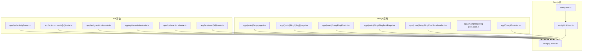
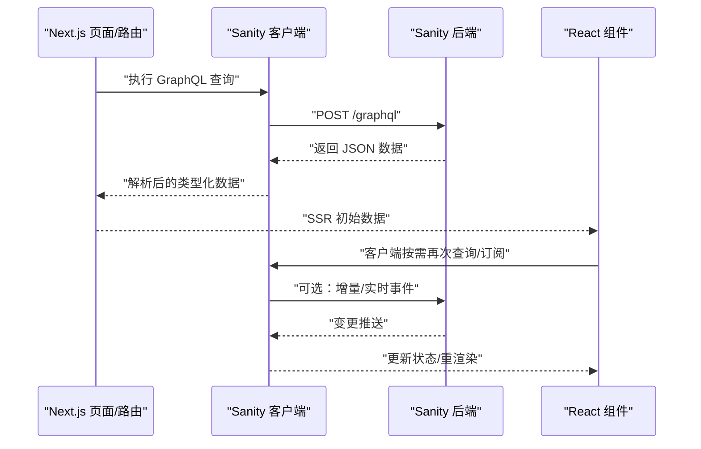
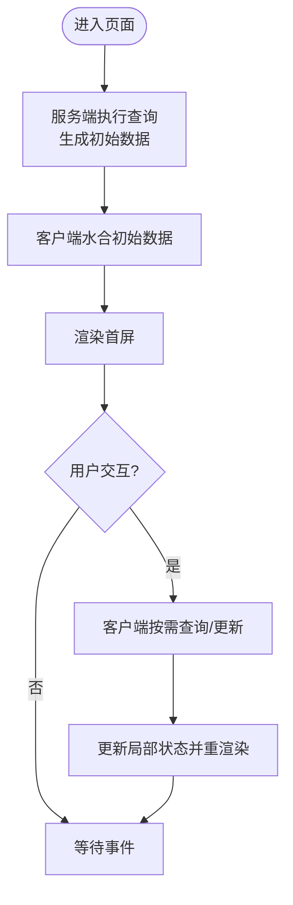
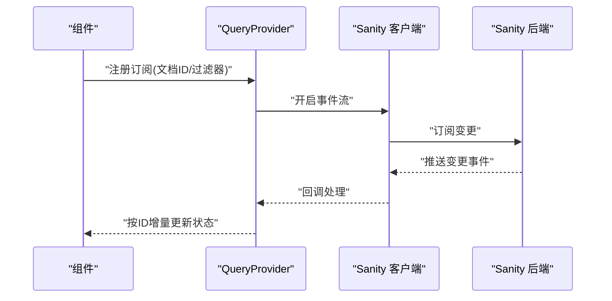
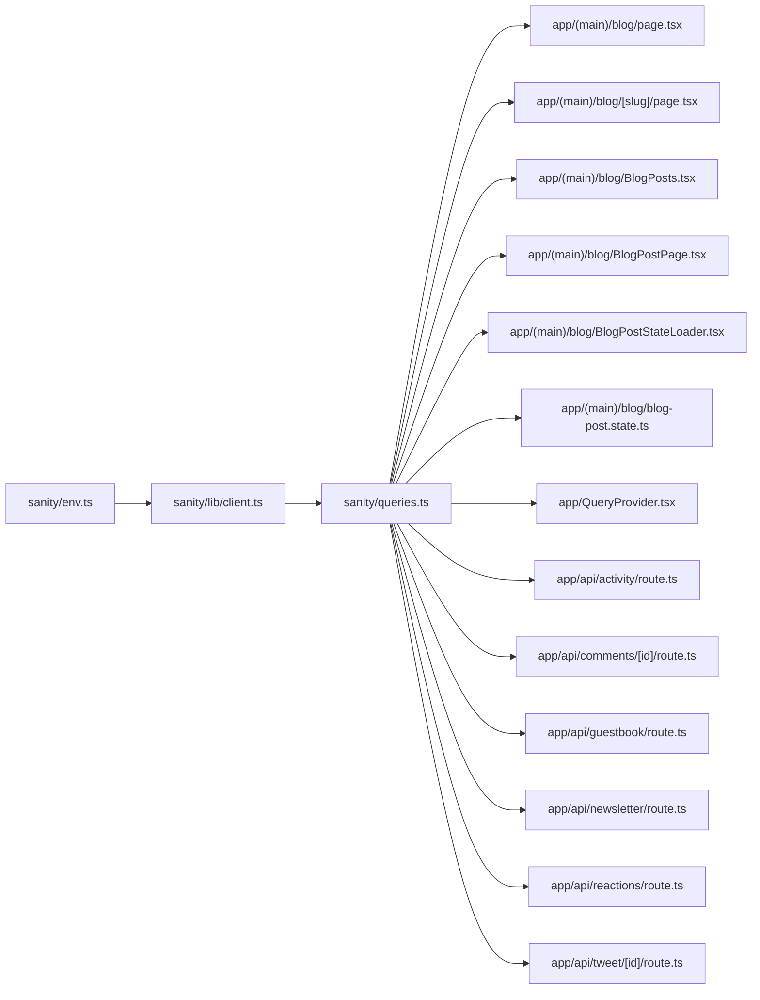

# 数据同步机制

<cite>
**本文引用的文件**
- [sanity/lib/client.ts](file://sanity/lib/client.ts)
- [sanity/queries.ts](file://sanity/queries.ts)
- [sanity/env.ts](file://sanity/env.ts)
- [app/QueryProvider.tsx](file://app/QueryProvider.tsx)
- [app/(main)/blog/page.tsx](file://app/(main)/blog/page.tsx)
- [app/(main)/blog/[slug]/page.tsx](file://app/(main)/blog/[slug]/page.tsx)
- [app/(main)/blog/BlogPosts.tsx](file://app/(main)/blog/BlogPosts.tsx)
- [app/(main)/blog/BlogPostPage.tsx](file://app/(main)/blog/BlogPostPage.tsx)
- [app/(main)/blog/BlogPostStateLoader.tsx](file://app/(main)/blog/BlogPostStateLoader.tsx)
- [app/(main)/blog/blog-post.state.ts](file://app/(main)/blog/blog-post.state.ts)
- [app/api/activity/route.ts](file://app/api/activity/route.ts)
- [app/api/comments/[id]/route.ts](file://app/api/comments/[id]/route.ts)
- [app/api/guestbook/route.ts](file://app/api/guestbook/route.ts)
- [app/api/newsletter/route.ts](file://app/api/newsletter/route.ts)
- [app/api/reactions/route.ts](file://app/api/reactions/route.ts)
- [app/api/tweet/[id]/route.ts](file://app/api/tweet/[id]/route.ts)
</cite>

## 目录
1. [简介](#简介)
2. [项目结构](#项目结构)
3. [核心组件](#核心组件)
4. [架构总览](#架构总览)
5. [详细组件分析](#详细组件分析)
6. [依赖分析](#依赖分析)
7. [性能考虑](#性能考虑)
8. [故障排查指南](#故障排查指南)
9. [结论](#结论)
10. [附录](#附录)

## 简介
本文件面向 cali.so 的 Sanity 数据同步机制，聚焦于客户端配置、查询构建与类型安全的数据获取；阐述 GraphQL 查询的编写与优化策略（预取、缓存、增量更新）；说明实时订阅、变更监听与冲突解决思路；并结合 Next.js 的服务端渲染与客户端水合实践，给出错误处理、重试与离线支持的方案建议；最后提供性能监控与查询优化的最佳实践。

## 项目结构
Sanity 相关代码主要位于 sanity 目录，Next.js 页面与 API 路由中通过该模块进行数据读取与交互。关键路径如下：
- 客户端与环境：sanity/lib/client.ts、sanity/env.ts
- 查询定义：sanity/queries.ts
- 页面与服务端渲染：app/(main)/blog/*
- 全局查询上下文：app/QueryProvider.tsx
- API 路由：app/api/*

图表来源
- [sanity/lib/client.ts](file://sanity/lib/client.ts)
- [sanity/queries.ts](file://sanity/queries.ts)
- [sanity/env.ts](file://sanity/env.ts)
- [app/(main)/blog/page.tsx](file://app/(main)/blog/page.tsx)
- [app/(main)/blog/[slug]/page.tsx](file://app/(main)/blog/[slug]/page.tsx)
- [app/(main)/blog/BlogPosts.tsx](file://app/(main)/blog/BlogPosts.tsx)
- [app/(main)/blog/BlogPostPage.tsx](file://app/(main)/blog/BlogPostPage.tsx)
- [app/(main)/blog/BlogPostStateLoader.tsx](file://app/(main)/blog/BlogPostStateLoader.tsx)
- [app/(main)/blog/blog-post.state.ts](file://app/(main)/blog/blog-post.state.ts)
- [app/QueryProvider.tsx](file://app/QueryProvider.tsx)
- [app/api/activity/route.ts](file://app/api/activity/route.ts)
- [app/api/comments/[id]/route.ts](file://app/api/comments/[id]/route.ts)
- [app/api/guestbook/route.ts](file://app/api/guestbook/route.ts)
- [app/api/newsletter/route.ts](file://app/api/newsletter/route.ts)
- [app/api/reactions/route.ts](file://app/api/reactions/route.ts)
- [app/api/tweet/[id]/route.ts](file://app/api/tweet/[id]/route.ts)

章节来源
- [sanity/lib/client.ts](file://sanity/lib/client.ts)
- [sanity/queries.ts](file://sanity/queries.ts)
- [sanity/env.ts](file://sanity/env.ts)
- [app/(main)/blog/page.tsx](file://app/(main)/blog/page.tsx)
- [app/(main)/blog/[slug]/page.tsx](file://app/(main)/blog/[slug]/page.tsx)
- [app/(main)/blog/BlogPosts.tsx](file://app/(main)/blog/BlogPosts.tsx)
- [app/(main)/blog/BlogPostPage.tsx](file://app/(main)/blog/BlogPostPage.tsx)
- [app/(main)/blog/BlogPostStateLoader.tsx](file://app/(main)/blog/BlogPostStateLoader.tsx)
- [app/(main)/blog/blog-post.state.ts](file://app/(main)/blog/blog-post.state.ts)
- [app/QueryProvider.tsx](file://app/QueryProvider.tsx)
- [app/api/activity/route.ts](file://app/api/activity/route.ts)
- [app/api/comments/[id]/route.ts](file://app/api/comments/[id]/route.ts)
- [app/api/guestbook/route.ts](file://app/api/guestbook/route.ts)
- [app/api/newsletter/route.ts](file://app/api/newsletter/route.ts)
- [app/api/reactions/route.ts](file://app/api/reactions/route.ts)
- [app/api/tweet/[id]/route.ts](file://app/api/tweet/[id]/route.ts)

## 核心组件
- 客户端与环境
  - 客户端初始化：在 sanity/lib/client.ts 中创建并导出 Sanity 客户端实例，统一封装请求参数、版本、预览模式等。
  - 环境变量：sanity/env.ts 集中管理 projectId、dataset、token 等敏感或环境相关配置，避免硬编码。
- 查询定义
  - sanity/queries.ts 集中维护所有 GraphQL 查询字符串，便于复用、审查与优化。
- 页面与服务端渲染
  - app/(main)/blog/page.tsx 与 [slug]/page.tsx 在服务端调用查询，生成初始数据，供客户端水合使用。
  - BlogPosts.tsx、BlogPostPage.tsx 负责展示与交互，必要时触发客户端查询。
- 状态加载器与本地状态
  - BlogPostStateLoader.tsx 与 blog-post.state.ts 用于客户端侧的状态管理与局部刷新。
- 全局查询上下文
  - app/QueryProvider.tsx 提供跨组件共享的查询上下文（如缓存、重试策略等）。
- API 路由
  - app/api/* 作为服务端中间层，可转发到 Sanity 或聚合多源数据，保证权限控制与速率限制。

章节来源
- [sanity/lib/client.ts](file://sanity/lib/client.ts)
- [sanity/env.ts](file://sanity/env.ts)
- [sanity/queries.ts](file://sanity/queries.ts)
- [app/(main)/blog/page.tsx](file://app/(main)/blog/page.tsx)
- [app/(main)/blog/[slug]/page.tsx](file://app/(main)/blog/[slug]/page.tsx)
- [app/(main)/blog/BlogPosts.tsx](file://app/(main)/blog/BlogPosts.tsx)
- [app/(main)/blog/BlogPostPage.tsx](file://app/(main)/blog/BlogPostPage.tsx)
- [app/(main)/blog/BlogPostStateLoader.tsx](file://app/(main)/blog/BlogPostStateLoader.tsx)
- [app/(main)/blog/blog-post.state.ts](file://app/(main)/blog/blog-post.state.ts)
- [app/QueryProvider.tsx](file://app/QueryProvider.tsx)
- [app/api/activity/route.ts](file://app/api/activity/route.ts)
- [app/api/comments/[id]/route.ts](file://app/api/comments/[id]/route.ts)
- [app/api/guestbook/route.ts](file://app/api/guestbook/route.ts)
- [app/api/newsletter/route.ts](file://app/api/newsletter/route.ts)
- [app/api/reactions/route.ts](file://app/api/reactions/route.ts)
- [app/api/tweet/[id]/route.ts](file://app/api/tweet/[id]/route.ts)

## 架构总览
整体数据流从 Next.js 页面或服务端 API 发起，经 Sanity 客户端向 Sanity 后端发送 GraphQL 查询，返回结构化数据后由页面渲染或组件消费。

图表来源
- [sanity/lib/client.ts](file://sanity/lib/client.ts)
- [sanity/queries.ts](file://sanity/queries.ts)
- [app/(main)/blog/page.tsx](file://app/(main)/blog/page.tsx)
- [app/(main)/blog/[slug]/page.tsx](file://app/(main)/blog/[slug]/page.tsx)
- [app/(main)/blog/BlogPosts.tsx](file://app/(main)/blog/BlogPosts.tsx)
- [app/(main)/blog/BlogPostPage.tsx](file://app/(main)/blog/BlogPostPage.tsx)
- [app/(main)/blog/BlogPostStateLoader.tsx](file://app/(main)/blog/BlogPostStateLoader.tsx)
- [app/(main)/blog/blog-post.state.ts](file://app/(main)/blog/blog-post.state.ts)
- [app/QueryProvider.tsx](file://app/QueryProvider.tsx)

## 详细组件分析

### 客户端配置与环境变量
- 职责
  - 统一创建与导出 Sanity 客户端实例，设置默认查询参数（如 dataset、apiVersion、previewMode）。
  - 暴露带鉴权的客户端（如需写入或访问私有数据集）。
- 关键点
  - 将敏感信息集中于 env.ts，避免泄露。
  - 区分只读与读写客户端，减少权限面。
- 典型用法
  - 在服务端渲染时直接调用客户端执行查询。
  - 在客户端组件中按需拉取或订阅数据。

章节来源
- [sanity/lib/client.ts](file://sanity/lib/client.ts)
- [sanity/env.ts](file://sanity/env.ts)

### 查询构建与类型安全
- 职责
  - 在 queries.ts 中集中定义 GraphQL 查询，确保字段最小化与一致性。
  - 结合 TypeScript 类型约束，实现端到端类型安全。
- 优化要点
  - 仅选择必要字段，减少网络体积。
  - 使用过滤、排序、分页参数，降低服务端压力。
  - 对热点查询建立命名规范与注释，便于审计。
- 示例路径
  - 列表页与服务端预取：[app/(main)/blog/page.tsx](file://app/(main)/blog/page.tsx)
  - 详情页与服务端预取：[app/(main)/blog/[slug]/page.tsx](file://app/(main)/blog/[slug]/page.tsx)
  - 查询定义位置：[sanity/queries.ts](file://sanity/queries.ts)

章节来源
- [sanity/queries.ts](file://sanity/queries.ts)
- [app/(main)/blog/page.tsx](file://app/(main)/blog/page.tsx)
- [app/(main)/blog/[slug]/page.tsx](file://app/(main)/blog/[slug]/page.tsx)

### 服务端渲染与客户端水合
- 流程
  - 页面在服务端执行查询，得到初始数据并注入到页面上下文。
  - 客户端启动后“水合”已有数据，避免重复请求。
  - 用户交互触发客户端查询，实现局部刷新。
- 关键文件
  - 列表页：[app/(main)/blog/page.tsx](file://app/(main)/blog/page.tsx)
  - 详情页：[app/(main)/blog/[slug]/page.tsx](file://app/(main)/blog/[slug]/page.tsx)
  - 展示组件：[app/(main)/blog/BlogPosts.tsx](file://app/(main)/blog/BlogPosts.tsx)、[app/(main)/blog/BlogPostPage.tsx](file://app/(main)/blog/BlogPostPage.tsx)
  - 状态加载器：[app/(main)/blog/BlogPostStateLoader.tsx](file://app/(main)/blog/BlogPostStateLoader.tsx)
  - 本地状态：[app/(main)/blog/blog-post.state.ts](file://app/(main)/blog/blog-post.state.ts)

图表来源
- [app/(main)/blog/page.tsx](file://app/(main)/blog/page.tsx)
- [app/(main)/blog/[slug]/page.tsx](file://app/(main)/blog/[slug]/page.tsx)
- [app/(main)/blog/BlogPosts.tsx](file://app/(main)/blog/BlogPosts.tsx)
- [app/(main)/blog/BlogPostPage.tsx](file://app/(main)/blog/BlogPostPage.tsx)
- [app/(main)/blog/BlogPostStateLoader.tsx](file://app/(main)/blog/BlogPostStateLoader.tsx)
- [app/(main)/blog/blog-post.state.ts](file://app/(main)/blog/blog-post.state.ts)

章节来源
- [app/(main)/blog/page.tsx](file://app/(main)/blog/page.tsx)
- [app/(main)/blog/[slug]/page.tsx](file://app/(main)/blog/[slug]/page.tsx)
- [app/(main)/blog/BlogPosts.tsx](file://app/(main)/blog/BlogPosts.tsx)
- [app/(main)/blog/BlogPostPage.tsx](file://app/(main)/blog/BlogPostPage.tsx)
- [app/(main)/blog/BlogPostStateLoader.tsx](file://app/(main)/blog/BlogPostStateLoader.tsx)
- [app/(main)/blog/blog-post.state.ts](file://app/(main)/blog/blog-post.state.ts)

### 实时订阅与变更监听
- 目标
  - 在内容变更后即时更新前端视图，提升用户体验。
- 实现思路
  - 在客户端组件中建立 Sanity 事件订阅，监听文档变更。
  - 根据变更 ID 精准更新本地缓存或状态，避免全量刷新。
  - 在 QueryProvider 中统一管理订阅生命周期与错误恢复。
- 参考位置
  - 全局上下文：[app/QueryProvider.tsx](file://app/QueryProvider.tsx)
  - 状态加载器：[app/(main)/blog/BlogPostStateLoader.tsx](file://app/(main)/blog/BlogPostStateLoader.tsx)
  - 本地状态：[app/(main)/blog/blog-post.state.ts](file://app/(main)/blog/blog-post.state.ts)

图表来源
- [app/QueryProvider.tsx](file://app/QueryProvider.tsx)
- [app/(main)/blog/BlogPostStateLoader.tsx](file://app/(main)/blog/BlogPostStateLoader.tsx)
- [app/(main)/blog/blog-post.state.ts](file://app/(main)/blog/blog-post.state.ts)
- [sanity/lib/client.ts](file://sanity/lib/client.ts)

章节来源
- [app/QueryProvider.tsx](file://app/QueryProvider.tsx)
- [app/(main)/blog/BlogPostStateLoader.tsx](file://app/(main)/blog/BlogPostStateLoader.tsx)
- [app/(main)/blog/blog-post.state.ts](file://app/(main)/blog/blog-post.state.ts)
- [sanity/lib/client.ts](file://sanity/lib/client.ts)

### 冲突解决与一致性
- 场景
  - 多人编辑同一文档、网络抖动导致部分更新失败。
- 策略
  - 基于文档版本号或时间戳的乐观更新与回滚。
  - 服务端合并策略：以最新写入为准或保留字段级差异。
  - 客户端幂等提交：使用唯一请求 ID，避免重复写入。
- 落地位置
  - 状态加载器与本地状态：[app/(main)/blog/BlogPostStateLoader.tsx](file://app/(main)/blog/BlogPostStateLoader.tsx)、[app/(main)/blog/blog-post.state.ts](file://app/(main)/blog/blog-post.state.ts)
  - API 路由（如需要中转写入）：[app/api/comments/[id]/route.ts](file://app/api/comments/[id]/route.ts)

章节来源
- [app/(main)/blog/BlogPostStateLoader.tsx](file://app/(main)/blog/BlogPostStateLoader.tsx)
- [app/(main)/blog/blog-post.state.ts](file://app/(main)/blog/blog-post.state.ts)
- [app/api/comments/[id]/route.ts](file://app/api/comments/[id]/route.ts)

### 错误处理、重试与离线支持
- 错误处理
  - 在网络异常或权限不足时降级显示，记录错误日志。
  - 在 QueryProvider 中集中捕获与上报。
- 重试机制
  - 指数退避重试，限制最大重试次数。
  - 针对瞬时错误自动重试，持久错误提示用户。
- 离线支持
  - 利用浏览器缓存或 Service Worker 缓存最近一次成功响应。
  - 在线后自动同步未完成的写操作。
- 参考位置
  - 全局上下文：[app/QueryProvider.tsx](file://app/QueryProvider.tsx)
  - 状态加载器：[app/(main)/blog/BlogPostStateLoader.tsx](file://app/(main)/blog/BlogPostStateLoader.tsx)
  - API 路由（统一错误出口）：[app/api/activity/route.ts](file://app/api/activity/route.ts)、[app/api/guestbook/route.ts](file://app/api/guestbook/route.ts)、[app/api/newsletter/route.ts](file://app/api/newsletter/route.ts)、[app/api/reactions/route.ts](file://app/api/reactions/route.ts)、[app/api/tweet/[id]/route.ts](file://app/api/tweet/[id]/route.ts)

章节来源
- [app/QueryProvider.tsx](file://app/QueryProvider.tsx)
- [app/(main)/blog/BlogPostStateLoader.tsx](file://app/(main)/blog/BlogPostStateLoader.tsx)
- [app/api/activity/route.ts](file://app/api/activity/route.ts)
- [app/api/guestbook/route.ts](file://app/api/guestbook/route.ts)
- [app/api/newsletter/route.ts](file://app/api/newsletter/route.ts)
- [app/api/reactions/route.ts](file://app/api/reactions/route.ts)
- [app/api/tweet/[id]/route.ts](file://app/api/tweet/[id]/route.ts)

### 查询优化与缓存策略
- 预取
  - 在页面入口（getServerSideProps 或同构函数）预取关键数据，缩短首屏时间。
- 缓存
  - 服务端：利用 Next.js 内置缓存与 CDN 缓存头。
  - 客户端：在 QueryProvider 中为相同查询键启用内存缓存。
- 增量更新
  - 基于事件流仅更新受影响文档，避免整页刷新。
- 参考位置
  - 列表页与服务端预取：[app/(main)/blog/page.tsx](file://app/(main)/blog/page.tsx)
  - 详情页与服务端预取：[app/(main)/blog/[slug]/page.tsx](file://app/(main)/blog/[slug]/page.tsx)
  - 全局上下文：[app/QueryProvider.tsx](file://app/QueryProvider.tsx)

章节来源
- [app/(main)/blog/page.tsx](file://app/(main)/blog/page.tsx)
- [app/(main)/blog/[slug]/page.tsx](file://app/(main)/blog/[slug]/page.tsx)
- [app/QueryProvider.tsx](file://app/QueryProvider.tsx)

## 依赖分析
Sanity 客户端与查询定义被多个页面与 API 路由复用，形成稳定的单向依赖关系。

图表来源
- [sanity/env.ts](file://sanity/env.ts)
- [sanity/lib/client.ts](file://sanity/lib/client.ts)
- [sanity/queries.ts](file://sanity/queries.ts)
- [app/(main)/blog/page.tsx](file://app/(main)/blog/page.tsx)
- [app/(main)/blog/[slug]/page.tsx](file://app/(main)/blog/[slug]/page.tsx)
- [app/(main)/blog/BlogPosts.tsx](file://app/(main)/blog/BlogPosts.tsx)
- [app/(main)/blog/BlogPostPage.tsx](file://app/(main)/blog/BlogPostPage.tsx)
- [app/(main)/blog/BlogPostStateLoader.tsx](file://app/(main)/blog/BlogPostStateLoader.tsx)
- [app/(main)/blog/blog-post.state.ts](file://app/(main)/blog/blog-post.state.ts)
- [app/QueryProvider.tsx](file://app/QueryProvider.tsx)
- [app/api/activity/route.ts](file://app/api/activity/route.ts)
- [app/api/comments/[id]/route.ts](file://app/api/comments/[id]/route.ts)
- [app/api/guestbook/route.ts](file://app/api/guestbook/route.ts)
- [app/api/newsletter/route.ts](file://app/api/newsletter/route.ts)
- [app/api/reactions/route.ts](file://app/api/reactions/route.ts)
- [app/api/tweet/[id]/route.ts](file://app/api/tweet/[id]/route.ts)

章节来源
- [sanity/env.ts](file://sanity/env.ts)
- [sanity/lib/client.ts](file://sanity/lib/client.ts)
- [sanity/queries.ts](file://sanity/queries.ts)
- [app/(main)/blog/page.tsx](file://app/(main)/blog/page.tsx)
- [app/(main)/blog/[slug]/page.tsx](file://app/(main)/blog/[slug]/page.tsx)
- [app/(main)/blog/BlogPosts.tsx](file://app/(main)/blog/BlogPosts.tsx)
- [app/(main)/blog/BlogPostPage.tsx](file://app/(main)/blog/BlogPostPage.tsx)
- [app/(main)/blog/BlogPostStateLoader.tsx](file://app/(main)/blog/BlogPostStateLoader.tsx)
- [app/(main)/blog/blog-post.state.ts](file://app/(main)/blog/blog-post.state.ts)
- [app/QueryProvider.tsx](file://app/QueryProvider.tsx)
- [app/api/activity/route.ts](file://app/api/activity/route.ts)
- [app/api/comments/[id]/route.ts](file://app/api/comments/[id]/route.ts)
- [app/api/guestbook/route.ts](file://app/api/guestbook/route.ts)
- [app/api/newsletter/route.ts](file://app/api/newsletter/route.ts)
- [app/api/reactions/route.ts](file://app/api/reactions/route.ts)
- [app/api/tweet/[id]/route.ts](file://app/api/tweet/[id]/route.ts)

## 性能考虑
- 查询瘦身
  - 仅选择必要字段，避免大对象嵌套。
  - 使用过滤与分页，减少单次返回体量。
- 预取与缓存
  - 服务端预取关键数据，客户端复用相同查询键的缓存结果。
- 增量更新
  - 基于事件流精准更新，避免整页刷新。
- 并发与节流
  - 对高频操作进行防抖/节流，避免频繁请求。
- 监控
  - 记录关键指标：首次内容绘制、查询耗时、错误率、重试次数。
  - 结合 Sentry 或类似工具进行错误追踪。

## 故障排查指南
- 常见问题
  - 权限不足：检查 token 与数据集权限。
  - 网络超时：增加重试与退避策略，检查 CDN/代理配置。
  - 数据不一致：核对版本号/时间戳，确认事件订阅是否生效。
- 定位步骤
  - 查看 QueryProvider 的错误上报与重试日志。
  - 检查页面与服务端预取是否正确注入初始数据。
  - 验证 API 路由的错误输出格式与状态码。
- 参考位置
  - 全局上下文：[app/QueryProvider.tsx](file://app/QueryProvider.tsx)
  - 状态加载器：[app/(main)/blog/BlogPostStateLoader.tsx](file://app/(main)/blog/BlogPostStateLoader.tsx)
  - API 路由：[app/api/activity/route.ts](file://app/api/activity/route.ts)、[app/api/comments/[id]/route.ts](file://app/api/comments/[id]/route.ts)、[app/api/guestbook/route.ts](file://app/api/guestbook/route.ts)、[app/api/newsletter/route.ts](file://app/api/newsletter/route.ts)、[app/api/reactions/route.ts](file://app/api/reactions/route.ts)、[app/api/tweet/[id]/route.ts](file://app/api/tweet/[id]/route.ts)

章节来源
- [app/QueryProvider.tsx](file://app/QueryProvider.tsx)
- [app/(main)/blog/BlogPostStateLoader.tsx](file://app/(main)/blog/BlogPostStateLoader.tsx)
- [app/api/activity/route.ts](file://app/api/activity/route.ts)
- [app/api/comments/[id]/route.ts](file://app/api/comments/[id]/route.ts)
- [app/api/guestbook/route.ts](file://app/api/guestbook/route.ts)
- [app/api/newsletter/route.ts](file://app/api/newsletter/route.ts)
- [app/api/reactions/route.ts](file://app/api/reactions/route.ts)
- [app/api/tweet/[id]/route.ts](file://app/api/tweet/[id]/route.ts)

## 结论
通过将客户端配置、查询定义与页面渲染解耦，并在 QueryProvider 中统一管理缓存、重试与订阅，cali.so 实现了高效、稳定且可扩展的 Sanity 数据同步机制。配合服务端预取与客户端增量更新，既保证了首屏性能，又提升了实时体验。建议在后续迭代中持续完善错误上报、监控指标与离线能力，进一步提升鲁棒性与可观测性。

## 附录
- 最佳实践清单
  - 将敏感配置集中在环境变量文件中。
  - 在查询定义处保持字段最小化与注释清晰。
  - 在服务端预取关键数据，客户端复用缓存。
  - 使用事件流实现增量更新，避免全量刷新。
  - 统一错误处理与重试策略，记录关键指标。
  - 对写操作进行幂等设计，防止重复提交。