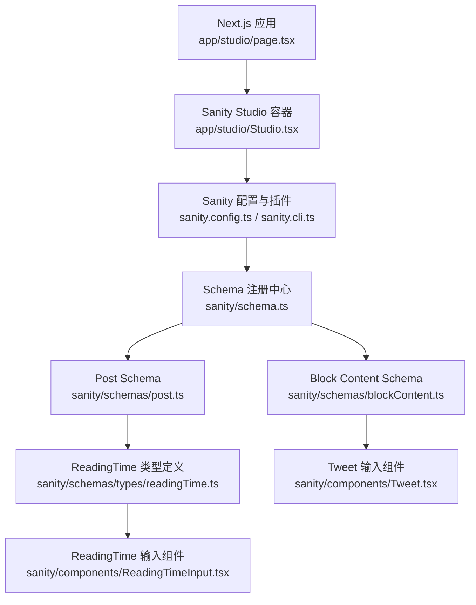
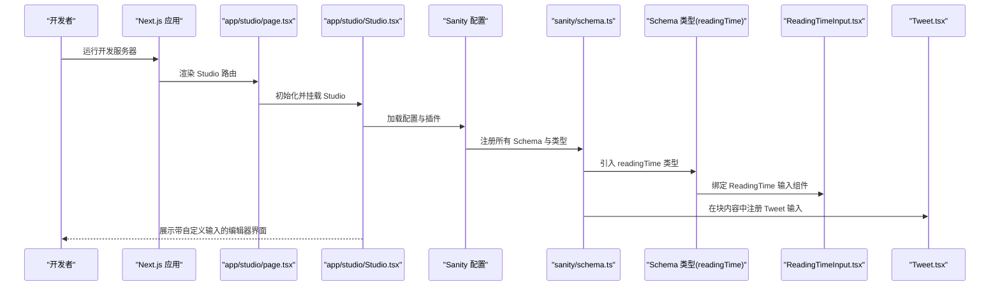
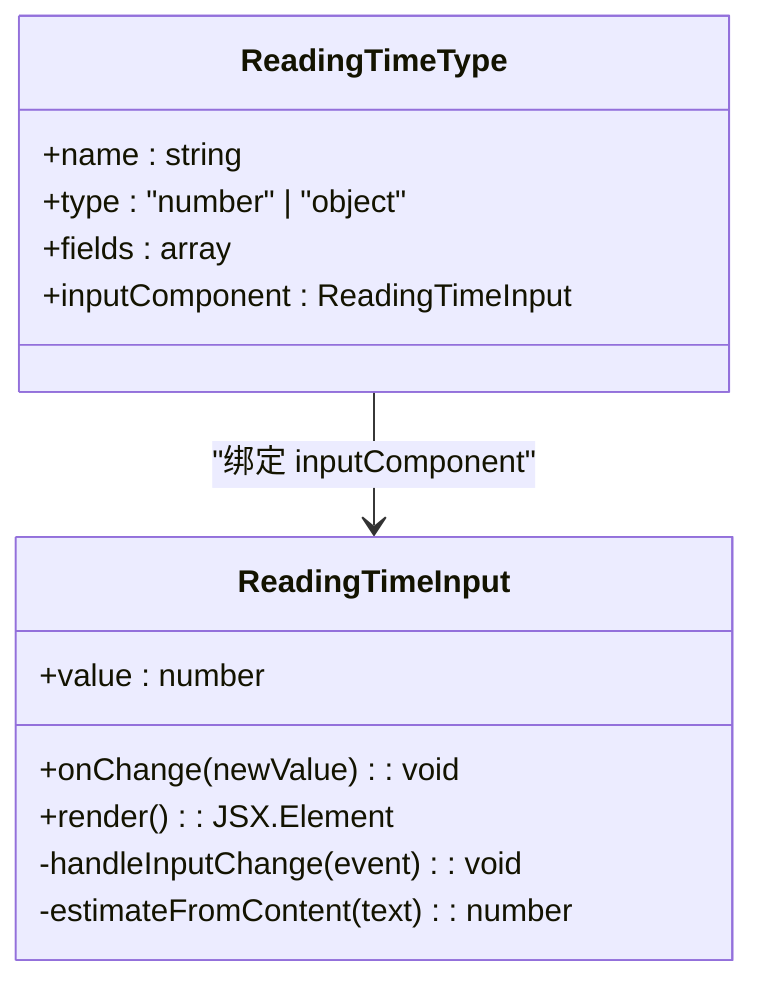
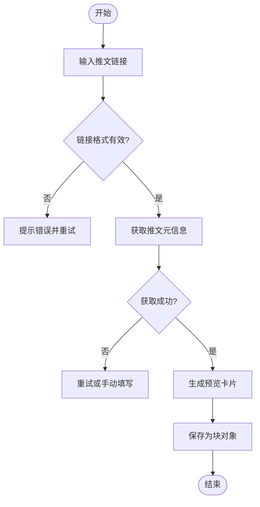
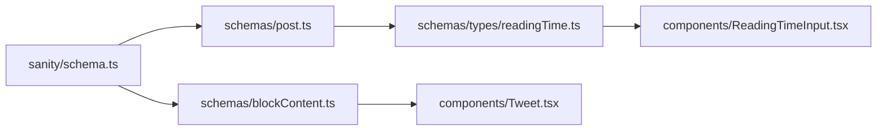

# 自定义编辑器组件

<cite>
**本文引用的文件**   
- [ReadingTimeInput.tsx](file://sanity/components/ReadingTimeInput.tsx)
- [Tweet.tsx](file://sanity/components/Tweet.tsx)
- [readingTime.ts](file://sanity/schemas/types/readingTime.ts)
- [post.ts](file://sanity/schemas/post.ts)
- [blockContent.ts](file://sanity/schemas/blockContent.ts)
- [Studio.tsx](file://app/studio/Studio.tsx)
- [page.tsx](file://app/studio/page.tsx)
- [schema.ts](file://sanity/schema.ts)
</cite>

## 目录
1. [简介](#简介)
2. [项目结构](#项目结构)
3. [核心组件](#核心组件)
4. [架构总览](#架构总览)
5. [详细组件分析](#详细组件分析)
6. [依赖关系分析](#依赖关系分析)
7. [性能与可维护性](#性能与可维护性)
8. [故障排查指南](#故障排查指南)
9. [结论](#结论)
10. [附录](#附录)

## 简介
本文件面向在 cali.so 项目中基于 Sanity Studio 构建的自定义编辑器组件，重点围绕 ReadingTimeInput 与 Tweet 两个输入组件的实现原理、使用方式与扩展方法。文档将解释：
- 如何创建可复用的编辑器组件（表单处理、状态管理、用户交互）
- 组件与 Sanity Studio 的集成方式（Schema 注册、字段类型定义、预览渲染）
- 事件处理与数据绑定模式
- 复杂编辑器能力（富文本编辑、实时预览、批量操作）
- 主题定制、国际化支持与无障碍访问
- 测试策略与调试技巧

## 项目结构
Sanity 相关代码主要位于 sanity 目录，其中：
- components 下存放自定义输入组件（如 ReadingTimeInput、Tweet）
- schemas 下定义 Schema 类型与字段，并在 schema.ts 中统一注册
- app/studio 为 Next.js 路由入口，承载 Sanity Studio 页面

图表来源
- [page.tsx](file://app/studio/page.tsx)
- [Studio.tsx](file://app/studio/Studio.tsx)
- [schema.ts](file://sanity/schema.ts)
- [post.ts](file://sanity/schemas/post.ts)
- [blockContent.ts](file://sanity/schemas/blockContent.ts)
- [readingTime.ts](file://sanity/schemas/types/readingTime.ts)
- [ReadingTimeInput.tsx](file://sanity/components/ReadingTimeInput.tsx)
- [Tweet.tsx](file://sanity/components/Tweet.tsx)

章节来源
- [page.tsx](file://app/studio/page.tsx)
- [Studio.tsx](file://app/studio/Studio.tsx)
- [schema.ts](file://sanity/schema.ts)

## 核心组件
本节聚焦两个关键自定义输入组件：
- ReadingTimeInput：用于输入或计算阅读时长，通常与 Post 模型关联
- Tweet：用于嵌入推文内容，支持链接解析与预览渲染

它们通过 Schema 类型与字段声明被注册到 Sanity Studio，并在编辑器界面中以自定义控件形式呈现。

章节来源
- [ReadingTimeInput.tsx](file://sanity/components/ReadingTimeInput.tsx)
- [Tweet.tsx](file://sanity/components/Tweet.tsx)
- [readingTime.ts](file://sanity/schemas/types/readingTime.ts)
- [post.ts](file://sanity/schemas/post.ts)
- [blockContent.ts](file://sanity/schemas/blockContent.ts)

## 架构总览
下图展示了从 Next.js 启动到 Sanity Studio 加载自定义组件的整体流程，以及组件与 Schema 的绑定关系。

图表来源
- [page.tsx](file://app/studio/page.tsx)
- [Studio.tsx](file://app/studio/Studio.tsx)
- [schema.ts](file://sanity/schema.ts)
- [readingTime.ts](file://sanity/schemas/types/readingTime.ts)
- [ReadingTimeInput.tsx](file://sanity/components/ReadingTimeInput.tsx)
- [Tweet.tsx](file://sanity/components/Tweet.tsx)

## 详细组件分析

### ReadingTimeInput 组件
ReadingTimeInput 作为自定义输入组件，负责在 Studio 中提供阅读时长的输入体验。其职责包括：
- 接收并显示当前值（受控组件）
- 处理用户输入变更，触发父级更新
- 可选：根据文章内容自动估算阅读时间并回填
- 与 readingTime 类型定义保持一致的数据契约

图表来源
- [ReadingTimeInput.tsx](file://sanity/components/ReadingTimeInput.tsx)
- [readingTime.ts](file://sanity/schemas/types/readingTime.ts)

章节来源
- [ReadingTimeInput.tsx](file://sanity/components/ReadingTimeInput.tsx)
- [readingTime.ts](file://sanity/schemas/types/readingTime.ts)

#### 使用示例路径
- 在 Post Schema 中使用 ReadingTime 字段：[post.ts](file://sanity/schemas/post.ts)

### Tweet 组件
Tweet 组件用于在块内容中插入推文，支持：
- 输入 Twitter/X 链接
- 解析并缓存元信息（标题、作者、缩略图等）
- 在编辑器内提供预览卡片
- 输出标准化的块对象供前端渲染

图表来源
- [Tweet.tsx](file://sanity/components/Tweet.tsx)
- [blockContent.ts](file://sanity/schemas/blockContent.ts)

章节来源
- [Tweet.tsx](file://sanity/components/Tweet.tsx)
- [blockContent.ts](file://sanity/schemas/blockContent.ts)

#### 使用示例路径
- 在 Block Content Schema 中注册 Tweet 块：[blockContent.ts](file://sanity/schemas/blockContent.ts)

### 复杂编辑器功能实践
- 富文本编辑：通过 Portable Text 与自定义块（如 Tweet）组合实现结构化内容编辑
- 实时预览：在输入组件中即时渲染预览卡片，提升编辑体验
- 批量操作：在 Studio 面板或自定义工具中遍历文档集合，对特定字段进行批量更新（例如统一修正推文链接格式）

章节来源
- [blockContent.ts](file://sanity/schemas/blockContent.ts)
- [Tweet.tsx](file://sanity/components/Tweet.tsx)

## 依赖关系分析
下图展示了 Schema 注册与组件绑定的依赖关系，帮助理解各模块间的耦合点。

图表来源
- [schema.ts](file://sanity/schema.ts)
- [post.ts](file://sanity/schemas/post.ts)
- [blockContent.ts](file://sanity/schemas/blockContent.ts)
- [readingTime.ts](file://sanity/schemas/types/readingTime.ts)
- [ReadingTimeInput.tsx](file://sanity/components/ReadingTimeInput.tsx)
- [Tweet.tsx](file://sanity/components/Tweet.tsx)

章节来源
- [schema.ts](file://sanity/schema.ts)
- [post.ts](file://sanity/schemas/post.ts)
- [blockContent.ts](file://sanity/schemas/blockContent.ts)
- [readingTime.ts](file://sanity/schemas/types/readingTime.ts)
- [ReadingTimeInput.tsx](file://sanity/components/ReadingTimeInput.tsx)
- [Tweet.tsx](file://sanity/components/Tweet.tsx)

## 性能与可维护性
- 输入组件应遵循受控模式，避免不必要的重渲染；必要时使用防抖优化高频输入
- 网络请求（如推文元信息抓取）需加入缓存与失败重试机制
- Schema 与组件解耦清晰，便于独立测试与复用
- 在 Studio 中启用必要的日志与断点，定位渲染与数据同步问题

## 故障排查指南
- 组件未显示：检查 Schema 是否正确注册 inputComponent，确认 Studio 已重新加载
- 数据不同步：验证 onChange 回调是否按预期触发，确保 value 与 state 一致
- 预览异常：检查链接校验逻辑与外部 API 可用性，增加错误边界与降级展示
- 国际化缺失：确认 i18n 键值是否存在，默认文案是否回退正常

章节来源
- [ReadingTimeInput.tsx](file://sanity/components/ReadingTimeInput.tsx)
- [Tweet.tsx](file://sanity/components/Tweet.tsx)

## 结论
通过 ReadingTimeInput 与 Tweet 两个自定义输入组件，Sanity Studio 能够提供更贴合业务场景的编辑体验。结合清晰的 Schema 定义、受控组件模式与合理的错误处理，可以在保持可维护性的同时快速扩展更多复杂编辑器能力。

## 附录
- 主题定制：通过 Studio 配置覆盖样式变量，统一输入框与预览卡片的视觉风格
- 国际化支持：为组件文案与错误消息提供多语言键值，并在 Studio 中动态切换
- 无障碍访问：为输入控件添加合适的 aria-* 属性与键盘导航支持，确保屏幕阅读器友好
- 测试策略：
  - 单元测试：针对输入组件的受控行为与边界条件进行测试
  - 集成测试：模拟 Studio 环境，验证 Schema 与组件的绑定效果
  - 端到端测试：在真实浏览器中执行编辑流程，确保预览与保存正确