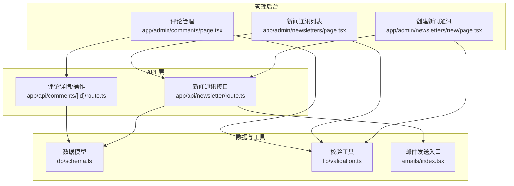
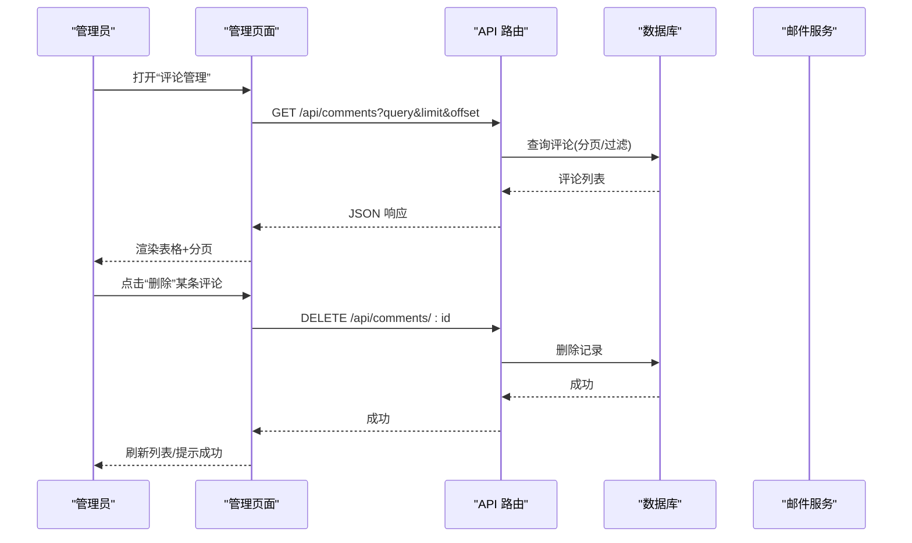
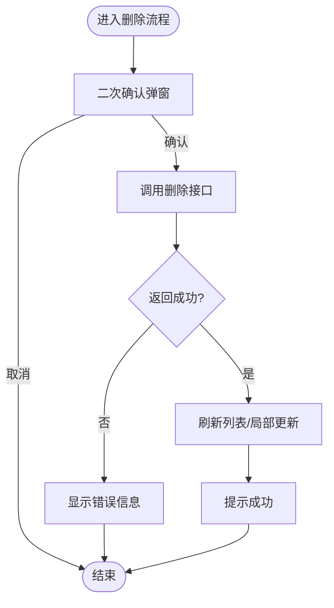
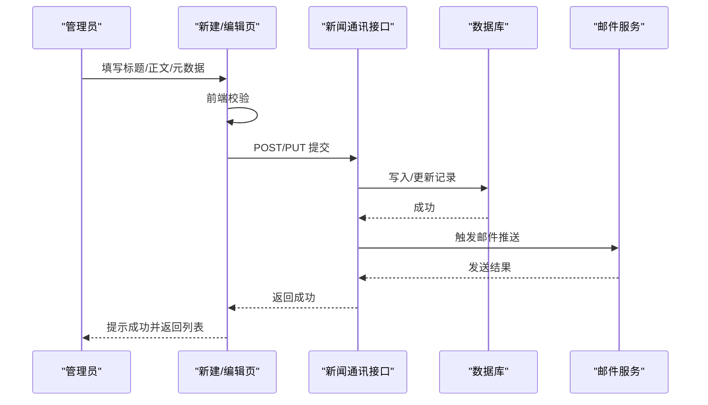
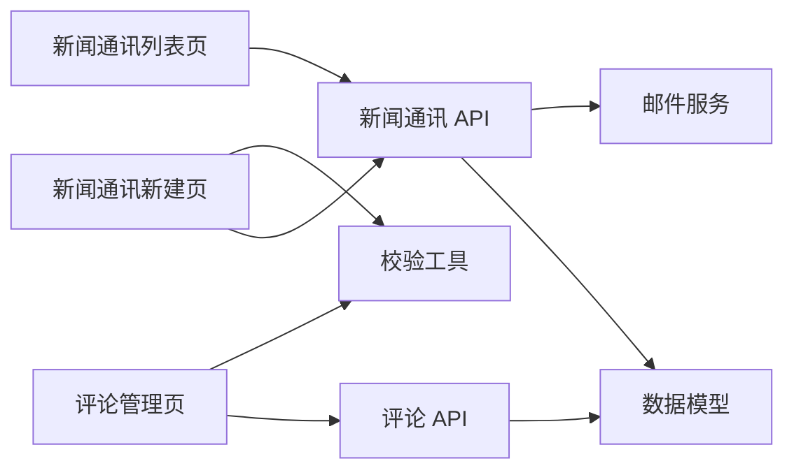

# 内容管理界面

<cite>
**本文引用的文件**   
- [app/admin/comments/page.tsx](file://app/admin/comments/page.tsx)
- [app/admin/newsletters/page.tsx](file://app/admin/newsletters/page.tsx)
- [app/admin/newsletters/new/page.tsx](file://app/admin/newsletters/new/page.tsx)
- [app/api/comments/[id]/route.ts](file://app/api/comments/[id]/route.ts)
- [app/api/newsletter/route.ts](file://app/api/newsletter/route.ts)
- [db/schema.ts](file://db/schema.ts)
- [lib/validation.ts](file://lib/validation.ts)
- [emails/index.tsx](file://emails/index.tsx)
</cite>

## 目录
1. [简介](#简介)
2. [项目结构](#项目结构)
3. [核心组件](#核心组件)
4. [架构总览](#架构总览)
5. [详细组件分析](#详细组件分析)
6. [依赖关系分析](#依赖关系分析)
7. [性能考虑](#性能考虑)
8. [故障排查指南](#故障排查指南)
9. [结论](#结论)
10. [附录](#附录)

## 简介
本文件面向 cali.so 管理后台的内容管理能力，聚焦评论管理与新闻通讯管理的增删改查（CRUD）实现。文档将系统阐述：
- 数据表格渲染、分页处理、搜索过滤与批量操作
- 表单验证、数据提交与错误反馈机制
- 新增内容管理页面的方法、自定义字段与操作按钮
- 与数据库的交互方式、实时数据更新与缓存策略
- 内容审核流程与工作流最佳实践

## 项目结构
管理后台位于 app/admin 下，包含评论、订阅者、新闻通讯等页面；API 路由位于 app/api 下，提供后端接口；数据模型定义在 db/schema.ts；通用校验逻辑在 lib/validation.ts；邮件模板与发送入口在 emails/index.tsx。

图表来源
- [app/admin/comments/page.tsx](file://app/admin/comments/page.tsx)
- [app/admin/newsletters/page.tsx](file://app/admin/newsletters/page.tsx)
- [app/admin/newsletters/new/page.tsx](file://app/admin/newsletters/new/page.tsx)
- [app/api/comments/[id]/route.ts](file://app/api/comments/[id]/route.ts)
- [app/api/newsletter/route.ts](file://app/api/newsletter/route.ts)
- [db/schema.ts](file://db/schema.ts)
- [lib/validation.ts](file://lib/validation.ts)
- [emails/index.tsx](file://emails/index.tsx)

章节来源
- [app/admin/comments/page.tsx](file://app/admin/comments/page.tsx)
- [app/admin/newsletters/page.tsx](file://app/admin/newsletters/page.tsx)
- [app/admin/newsletters/new/page.tsx](file://app/admin/newsletters/new/page.tsx)
- [app/api/comments/[id]/route.ts](file://app/api/comments/[id]/route.ts)
- [app/api/newsletter/route.ts](file://app/api/newsletter/route.ts)
- [db/schema.ts](file://db/schema.ts)
- [lib/validation.ts](file://lib/validation.ts)
- [emails/index.tsx](file://emails/index.tsx)

## 核心组件
- 评论管理页：负责展示评论列表、筛选、分页、批量删除、单条删除与状态变更等操作。
- 新闻通讯列表页：负责展示新闻通讯条目、分页、搜索、批量发布/归档等。
- 新闻通讯新建页：负责富文本编辑、预览、保存草稿与发布、表单校验与错误提示。
- API 路由：
  - 评论详情路由：根据 ID 执行查询、更新或删除等受控操作。
  - 新闻通讯路由：提供列表、详情、创建、更新、删除等能力，并触发邮件通知。
- 数据模型：使用 drizzle schema 定义表结构与字段约束。
- 校验工具：统一的前端/服务端校验函数，确保输入合法性。
- 邮件发送：通过统一入口发送订阅确认、新评论提醒、新闻通讯推送等。

章节来源
- [app/admin/comments/page.tsx](file://app/admin/comments/page.tsx)
- [app/admin/newsletters/page.tsx](file://app/admin/newsletters/page.tsx)
- [app/admin/newsletters/new/page.tsx](file://app/admin/newsletters/new/page.tsx)
- [app/api/comments/[id]/route.ts](file://app/api/comments/[id]/route.ts)
- [app/api/newsletter/route.ts](file://app/api/newsletter/route.ts)
- [db/schema.ts](file://db/schema.ts)
- [lib/validation.ts](file://lib/validation.ts)
- [emails/index.tsx](file://emails/index.tsx)

## 架构总览
管理后台采用 Next.js App Router 前后端一体化架构：前端页面通过客户端状态与请求驱动 UI 更新，调用同域 API 路由完成数据读写；API 路由访问数据库并返回结构化响应；必要时触发邮件或缓存刷新。

图表来源
- [app/admin/comments/page.tsx](file://app/admin/comments/page.tsx)
- [app/api/comments/[id]/route.ts](file://app/api/comments/[id]/route.ts)
- [db/schema.ts](file://db/schema.ts)

## 详细组件分析

### 评论管理模块
- 功能要点
  - 列表渲染：按时间倒序显示评论，支持关键字搜索、作者过滤、状态筛选。
  - 分页：基于 limit/offset 的分页参数，保持 URL 同步。
  - 批量操作：勾选多条后批量删除或批量修改状态。
  - 单条操作：查看详情、删除、标记为已读/未读、置顶/取消置顶。
  - 实时性：操作成功后局部刷新或全量刷新，避免整页跳转。
- 数据流
  - 页面发起请求携带查询参数 -> API 路由解析并校验 -> 数据库查询 -> 返回结果 -> 前端渲染。
- 错误处理
  - 网络异常、权限不足、记录不存在等错误统一提示，并提供重试或回退路径。
- 代码级流程图（以“删除评论”为例）

图表来源
- [app/admin/comments/page.tsx](file://app/admin/comments/page.tsx)
- [app/api/comments/[id]/route.ts](file://app/api/comments/[id]/route.ts)

章节来源
- [app/admin/comments/page.tsx](file://app/admin/comments/page.tsx)
- [app/api/comments/[id]/route.ts](file://app/api/comments/[id]/route.ts)

### 新闻通讯管理模块
- 列表页
  - 展示标题、发布时间、状态（草稿/已发布）、订阅人数等。
  - 支持按标题搜索、按状态筛选、分页加载。
  - 批量操作：批量发布、批量归档、批量删除。
- 新建/编辑页
  - 富文本编辑器用于正文内容，支持图片插入与链接预览。
  - 元数据：标题、摘要、封面图、标签、定时发布。
  - 表单校验：必填项、长度限制、格式校验，失败时即时反馈。
  - 保存策略：支持草稿保存与正式发布，发布后触发邮件推送。
- 数据流（以“发布新闻通讯”为例）

图表来源
- [app/admin/newsletters/new/page.tsx](file://app/admin/newsletters/new/page.tsx)
- [app/api/newsletter/route.ts](file://app/api/newsletter/route.ts)
- [emails/index.tsx](file://emails/index.tsx)

章节来源
- [app/admin/newsletters/page.tsx](file://app/admin/newsletters/page.tsx)
- [app/admin/newsletters/new/page.tsx](file://app/admin/newsletters/new/page.tsx)
- [app/api/newsletter/route.ts](file://app/api/newsletter/route.ts)
- [emails/index.tsx](file://emails/index.tsx)

### 数据表格、分页、搜索与批量操作
- 表格渲染
  - 列定义可配置，支持排序、固定列、行内操作按钮。
  - 行选择支持全选/反选，联动批量操作栏。
- 分页处理
  - 客户端维护当前页码、每页大小，URL 同步 query 参数。
  - 服务端返回 total 与 items，前端计算页数与边界条件。
- 搜索过滤
  - 多条件组合：关键词、日期范围、状态、标签等。
  - 防抖优化：输入延迟触发查询，减少频繁请求。
- 批量操作
  - 选中后启用批量按钮，二次确认后发起批量请求。
  - 分片处理：大批量时拆分为多次请求，避免超时。

章节来源
- [app/admin/comments/page.tsx](file://app/admin/comments/page.tsx)
- [app/admin/newsletters/page.tsx](file://app/admin/newsletters/page.tsx)

### 表单验证、提交与错误反馈
- 校验策略
  - 前端即时校验：必填、长度、格式、业务规则。
  - 服务端兜底校验：再次校验所有输入，防止绕过。
- 提交流程
  - 序列化表单数据 -> 校验 -> 提交 API -> 处理响应 -> 更新 UI。
- 错误反馈
  - 字段级错误：定位到具体输入框并高亮提示。
  - 全局错误：网络异常、服务器错误统一提示，支持重试。
- 参考实现位置
  - 校验工具：[lib/validation.ts](file://lib/validation.ts)
  - 评论管理页：[app/admin/comments/page.tsx](file://app/admin/comments/page.tsx)
  - 新闻通讯新建页：[app/admin/newsletters/new/page.tsx](file://app/admin/newsletters/new/page.tsx)

章节来源
- [lib/validation.ts](file://lib/validation.ts)
- [app/admin/comments/page.tsx](file://app/admin/comments/page.tsx)
- [app/admin/newsletters/new/page.tsx](file://app/admin/newsletters/new/page.tsx)

### 新增内容管理页面（步骤指南）
- 目标：新增一个“资源库”管理页面，包含列表、分页、搜索、批量操作与新建/编辑。
- 步骤
  1. 创建页面：在 app/admin/resources/page.tsx 添加页面组件。
  2. 定义数据模型：在 db/schema.ts 中新增资源表结构。
  3. 编写 API：在 app/api/resources/route.ts 实现 CRUD。
  4. 表单与校验：复用 lib/validation.ts 中的校验函数。
  5. 表格与分页：复用现有表格与分页模式，扩展列与操作。
  6. 批量操作：实现多选、批量删除/状态切换。
  7. 错误处理：统一错误提示与重试机制。
  8. 可选：接入缓存与实时更新（见下文）。
- 关键文件参考
  - 页面示例：[app/admin/comments/page.tsx](file://app/admin/comments/page.tsx)、[app/admin/newsletters/page.tsx](file://app/admin/newsletters/page.tsx)
  - 数据模型：[db/schema.ts](file://db/schema.ts)
  - API 示例：[app/api/newsletter/route.ts](file://app/api/newsletter/route.ts)
  - 校验工具：[lib/validation.ts](file://lib/validation.ts)

章节来源
- [app/admin/comments/page.tsx](file://app/admin/comments/page.tsx)
- [app/admin/newsletters/page.tsx](file://app/admin/newsletters/page.tsx)
- [db/schema.ts](file://db/schema.ts)
- [app/api/newsletter/route.ts](file://app/api/newsletter/route.ts)
- [lib/validation.ts](file://lib/validation.ts)

### 自定义数据字段与操作按钮
- 自定义字段
  - 在数据模型中添加字段，并在表格列定义中映射显示。
  - 在表单中增加对应输入控件，绑定校验规则。
- 自定义操作按钮
  - 在表格行内添加“导出”、“复制”、“迁移”等按钮。
  - 按钮事件调用相应 API，处理成功/失败反馈。
- 参考位置
  - 数据模型：[db/schema.ts](file://db/schema.ts)
  - 评论管理页（行内操作）：[app/admin/comments/page.tsx](file://app/admin/comments/page.tsx)
  - 新闻通讯列表（批量操作）：[app/admin/newsletters/page.tsx](file://app/admin/newsletters/page.tsx)

章节来源
- [db/schema.ts](file://db/schema.ts)
- [app/admin/comments/page.tsx](file://app/admin/comments/page.tsx)
- [app/admin/newsletters/page.tsx](file://app/admin/newsletters/page.tsx)

### 与数据库的交互方式
- 数据模型
  - 使用 drizzle schema 定义表结构、字段类型与约束。
  - 通过 ORM 生成查询构建器，保证类型安全与一致性。
- 查询与事务
  - 列表查询：分页、排序、过滤组合。
  - 写操作：插入、更新、删除，必要时使用事务保证一致性。
- 参考位置
  - 模型定义：[db/schema.ts](file://db/schema.ts)
  - API 路由（示例）：[app/api/newsletter/route.ts](file://app/api/newsletter/route.ts)

章节来源
- [db/schema.ts](file://db/schema.ts)
- [app/api/newsletter/route.ts](file://app/api/newsletter/route.ts)

### 实时数据更新与缓存策略
- 实时性
  - 短轮询：对热点数据（如评论数、订阅人数）进行周期性拉取。
  - 事件驱动：在写操作完成后触发前端局部刷新。
- 缓存
  - 列表缓存：对稳定列表设置合理过期时间，减少重复查询。
  - 键设计：按查询条件生成缓存键，避免脏读。
  - 失效策略：写操作后主动失效相关缓存键。
- 建议
  - 结合 Redis 或内存缓存，注意并发与一致性。
  - 对大数据集采用增量更新与懒加载。

[本节为通用指导，不直接分析具体文件]

### 内容审核流程与工作流最佳实践
- 审核状态机
  - 状态：待审、通过、拒绝、撤回。
  - 转换规则：仅允许合法状态转移，避免非法操作。
- 工作流
  - 提交审核：作者/管理员提交内容至审核队列。
  - 多级审核：初审、复审，支持驳回与修改。
  - 审计日志：记录每次状态变更的操作人、时间与原因。
- 自动化
  - 敏感词检测、垃圾评论识别、自动标记可疑内容。
- 参考位置
  - 评论管理页（状态操作）：[app/admin/comments/page.tsx](file://app/admin/comments/page.tsx)
  - 数据模型（状态字段）：[db/schema.ts](file://db/schema.ts)

章节来源
- [app/admin/comments/page.tsx](file://app/admin/comments/page.tsx)
- [db/schema.ts](file://db/schema.ts)

## 依赖关系分析
- 页面与 API 的耦合
  - 管理页面依赖 API 路由提供的数据与操作能力。
  - API 路由依赖数据模型与外部服务（如邮件）。
- 数据模型与 API
  - API 严格遵循数据模型定义，保证数据结构一致。
- 校验工具复用
  - 前端与服务端共用校验逻辑，降低不一致风险。

图表来源
- [app/admin/comments/page.tsx](file://app/admin/comments/page.tsx)
- [app/admin/newsletters/page.tsx](file://app/admin/newsletters/page.tsx)
- [app/admin/newsletters/new/page.tsx](file://app/admin/newsletters/new/page.tsx)
- [app/api/comments/[id]/route.ts](file://app/api/comments/[id]/route.ts)
- [app/api/newsletter/route.ts](file://app/api/newsletter/route.ts)
- [db/schema.ts](file://db/schema.ts)
- [emails/index.tsx](file://emails/index.tsx)
- [lib/validation.ts](file://lib/validation.ts)

章节来源
- [app/admin/comments/page.tsx](file://app/admin/comments/page.tsx)
- [app/admin/newsletters/page.tsx](file://app/admin/newsletters/page.tsx)
- [app/admin/newsletters/new/page.tsx](file://app/admin/newsletters/new/page.tsx)
- [app/api/comments/[id]/route.ts](file://app/api/comments/[id]/route.ts)
- [app/api/newsletter/route.ts](file://app/api/newsletter/route.ts)
- [db/schema.ts](file://db/schema.ts)
- [emails/index.tsx](file://emails/index.tsx)
- [lib/validation.ts](file://lib/validation.ts)

## 性能考虑
- 列表查询优化
  - 合理使用索引，避免全表扫描。
  - 分页参数限制最大页大小，防止大偏移导致性能下降。
- 前端渲染优化
  - 虚拟滚动：长列表按需渲染可见区域。
  - 防抖与节流：搜索与滚动事件优化。
- 缓存策略
  - 热点数据缓存，合理设置过期时间。
  - 写操作后主动失效相关缓存。
- 并发控制
  - 批量操作分片执行，避免一次性大量请求。
  - 幂等设计：重复提交不会产生副作用。

[本节为通用指导，不直接分析具体文件]

## 故障排查指南
- 常见问题
  - 列表为空：检查分页参数、过滤条件与数据库连接。
  - 提交失败：查看前端校验与服务端校验日志，确认字段完整性。
  - 邮件未发送：检查邮件服务配置与模板渲染。
- 定位方法
  - 浏览器开发者工具：查看网络请求与响应。
  - 服务端日志：记录关键步骤与异常堆栈。
  - 数据库慢查询：分析耗时 SQL 与索引使用情况。
- 参考位置
  - 评论 API：[app/api/comments/[id]/route.ts](file://app/api/comments/[id]/route.ts)
  - 新闻通讯 API：[app/api/newsletter/route.ts](file://app/api/newsletter/route.ts)
  - 邮件入口：[emails/index.tsx](file://emails/index.tsx)

章节来源
- [app/api/comments/[id]/route.ts](file://app/api/comments/[id]/route.ts)
- [app/api/newsletter/route.ts](file://app/api/newsletter/route.ts)
- [emails/index.tsx](file://emails/index.tsx)

## 结论
本文件系统化梳理了 cali.so 管理后台的内容管理能力，涵盖评论与新闻通讯的完整 CRUD 流程、数据表格与分页、搜索过滤与批量操作、表单验证与错误反馈、数据库交互、实时性与缓存策略，以及内容审核与工作流最佳实践。通过模块化设计与统一校验、错误处理与缓存策略，可在保障用户体验的同时提升系统的稳定性与可维护性。

## 附录
- 术语
  - 分页：基于 limit/offset 的数据切片技术。
  - 防抖：延迟执行，合并短时间内多次触发的事件。
  - 幂等：同一操作多次执行结果一致且无副作用。
- 参考文件清单
  - 管理页面：[app/admin/comments/page.tsx](file://app/admin/comments/page.tsx)、[app/admin/newsletters/page.tsx](file://app/admin/newsletters/page.tsx)、[app/admin/newsletters/new/page.tsx](file://app/admin/newsletters/new/page.tsx)
  - API 路由：[app/api/comments/[id]/route.ts](file://app/api/comments/[id]/route.ts)、[app/api/newsletter/route.ts](file://app/api/newsletter/route.ts)
  - 数据模型：[db/schema.ts](file://db/schema.ts)
  - 校验工具：[lib/validation.ts](file://lib/validation.ts)
  - 邮件服务：[emails/index.tsx](file://emails/index.tsx)