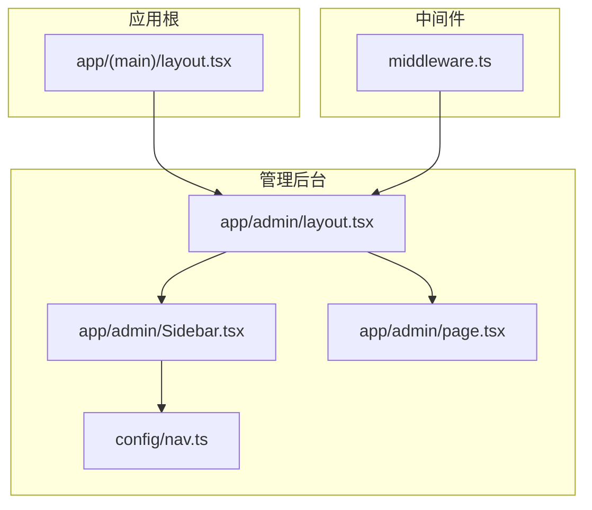
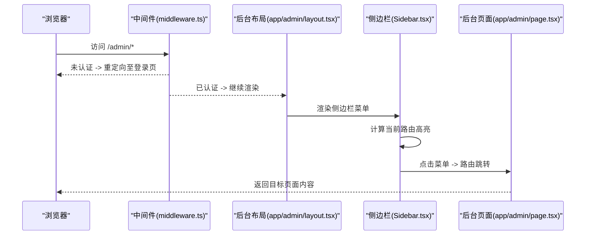
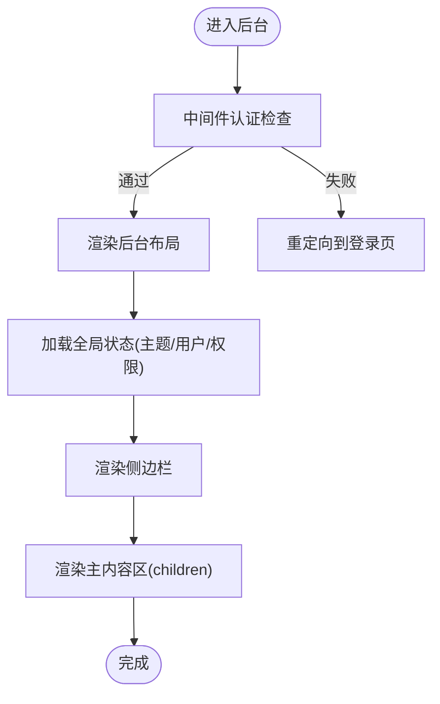
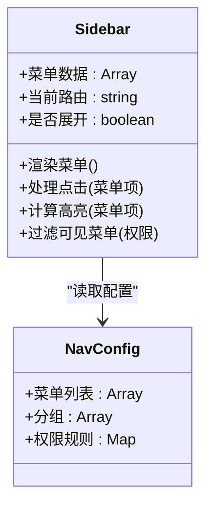
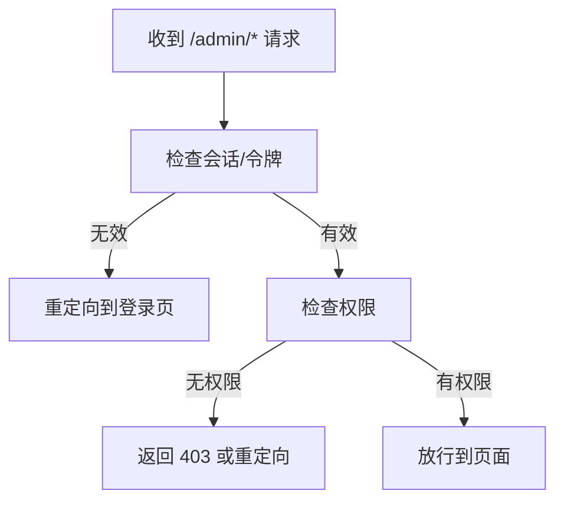
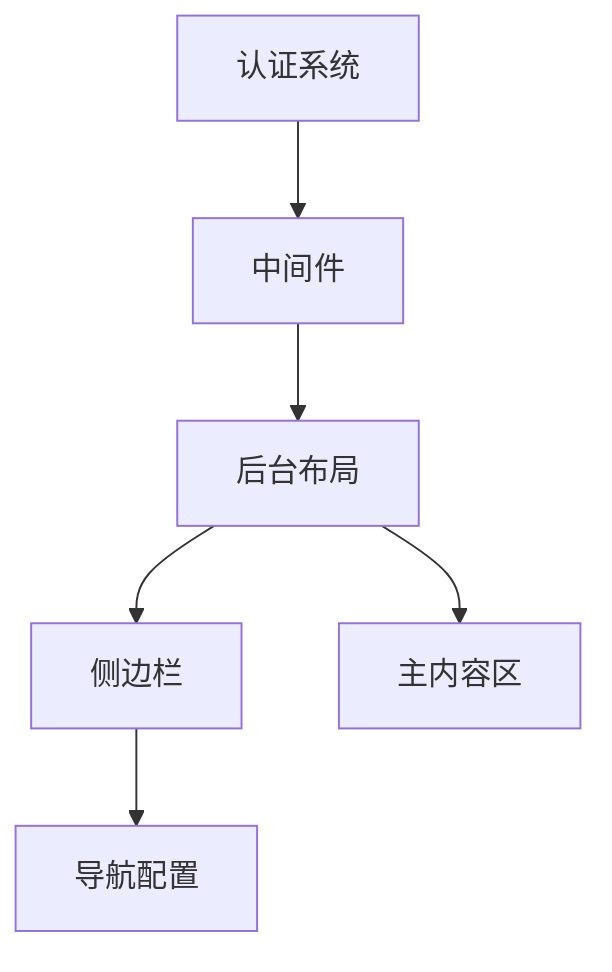

# 后台布局系统

<cite>
**本文引用的文件**   
- [app/admin/layout.tsx](file://app/admin/layout.tsx)
- [app/admin/Sidebar.tsx](file://app/admin/Sidebar.tsx)
- [app/admin/page.tsx](file://app/admin/page.tsx)
- [app/(main)/layout.tsx](file://app/(main)/layout.tsx)
- [middleware.ts](file://middleware.ts)
- [config/nav.ts](file://config/nav.ts)
</cite>

## 目录
1. [简介](#简介)
2. [项目结构](#项目结构)
3. [核心组件](#核心组件)
4. [架构总览](#架构总览)
5. [详细组件分析](#详细组件分析)
6. [依赖关系分析](#依赖关系分析)
7. [性能考虑](#性能考虑)
8. [故障排查指南](#故障排查指南)
9. [结论](#结论)
10. [附录](#附录)

## 简介
本文件面向 cali.so 管理后台的布局系统，聚焦于整体布局架构、侧边栏导航、主内容区域与全局状态管理的组合方式。文档将解释 Sidebar 组件的实现原理、路由导航逻辑与响应式设计策略，并说明如何扩展侧边栏菜单、新增导航项以及自定义布局样式。同时涵盖与认证系统的集成方式和用户权限的动态加载机制，帮助读者快速理解并安全地扩展后台布局能力。

## 项目结构
管理后台位于 app/admin 目录下，采用 Next.js App Router 的路由组织方式：
- layout.tsx：定义后台根布局，包含侧边栏与主内容区域的组合
- Sidebar.tsx：实现侧边栏 UI 与导航交互
- page.tsx：后台首页占位页面
- config/nav.ts：集中配置侧边栏菜单数据（建议）
- middleware.ts：用于认证守卫与访问控制（建议）

图表来源
- [app/(main)/layout.tsx](file://app/(main)/layout.tsx)
- [app/admin/layout.tsx](file://app/admin/layout.tsx)
- [app/admin/Sidebar.tsx](file://app/admin/Sidebar.tsx)
- [app/admin/page.tsx](file://app/admin/page.tsx)
- [config/nav.ts](file://config/nav.ts)
- [middleware.ts](file://middleware.ts)

章节来源
- [app/admin/layout.tsx](file://app/admin/layout.tsx)
- [app/admin/Sidebar.tsx](file://app/admin/Sidebar.tsx)
- [app/admin/page.tsx](file://app/admin/page.tsx)
- [app/(main)/layout.tsx](file://app/(main)/layout.tsx)
- [config/nav.ts](file://config/nav.ts)
- [middleware.ts](file://middleware.ts)

## 核心组件
- 后台根布局（app/admin/layout.tsx）
  - 职责：组合侧边栏与主内容区域；承载全局状态（如主题、用户信息）；提供响应式容器；可注入认证上下文或权限数据
  - 关键点：使用 Flex/Grid 布局；在移动端通过断点切换侧边栏显隐；渲染 children 作为主内容区
- 侧边栏（app/admin/Sidebar.tsx）
  - 职责：渲染菜单列表、处理选中态、响应式折叠/展开、跳转导航
  - 关键点：从配置中心读取菜单项；根据当前路由高亮；支持分组与图标；点击触发路由跳转
- 后台首页（app/admin/page.tsx）
  - 职责：展示后台概览或欢迎页；可作为默认仪表盘入口
- 导航配置（config/nav.ts）
  - 职责：集中维护侧边栏菜单数据结构（路径、标题、图标、权限标识等）
  - 关键点：便于统一管理与动态生成菜单；支持按角色/权限过滤
- 中间件（middleware.ts）
  - 职责：在请求到达页面之前进行认证校验与权限判断；未登录或未授权时重定向到登录页
  - 关键点：匹配 /admin/* 路径；读取会话/令牌；基于用户角色或权限决定放行或拒绝

章节来源
- [app/admin/layout.tsx](file://app/admin/layout.tsx)
- [app/admin/Sidebar.tsx](file://app/admin/Sidebar.tsx)
- [app/admin/page.tsx](file://app/admin/page.tsx)
- [config/nav.ts](file://config/nav.ts)
- [middleware.ts](file://middleware.ts)

## 架构总览
后台布局采用“根布局 + 子布局 + 组件”的组合模式：
- 前台根布局（app/(main)/layout.tsx）负责公共头部、主题、全局 Provider 等
- 后台子布局（app/admin/layout.tsx）在前台布局基础上叠加侧边栏与主内容区
- 侧边栏（app/admin/Sidebar.tsx）通过配置驱动渲染菜单，结合路由状态实现高亮与跳转
- 中间件（middleware.ts）在请求层拦截后台路径，完成认证与权限检查

图表来源
- [middleware.ts](file://middleware.ts)
- [app/admin/layout.tsx](file://app/admin/layout.tsx)
- [app/admin/Sidebar.tsx](file://app/admin/Sidebar.tsx)
- [app/admin/page.tsx](file://app/admin/page.tsx)

## 详细组件分析

### 后台根布局（app/admin/layout.tsx）
- 设计要点
  - 使用 Flex 布局：左侧固定宽度侧边栏，右侧自适应主内容区
  - 响应式：在小屏幕下隐藏侧边栏，提供汉堡按钮切换
  - 全局状态：可挂载主题、用户信息、权限等上下文
  - 错误边界：包裹主内容区以捕获渲染异常
- 关键流程
  - 接收 props.children 作为主内容区
  - 根据设备尺寸与用户交互更新侧边栏显示状态
  - 可选：在布局层加载用户信息与权限数据，供子组件消费

图表来源
- [app/admin/layout.tsx](file://app/admin/layout.tsx)
- [middleware.ts](file://middleware.ts)

章节来源
- [app/admin/layout.tsx](file://app/admin/layout.tsx)

### 侧边栏组件（app/admin/Sidebar.tsx）
- 设计要点
  - 数据驱动：从 config/nav.ts 读取菜单项，支持分组、图标、权限标识
  - 路由高亮：根据当前 URL 自动高亮对应菜单项
  - 响应式：移动端可折叠，提供遮罩层与关闭按钮
  - 交互：点击菜单项触发路由跳转，支持外链与内部路由
- 关键流程
  - 初始化菜单数据
  - 监听路由变化更新高亮
  - 处理点击事件执行导航
  - 根据权限过滤不可见菜单项

图表来源
- [app/admin/Sidebar.tsx](file://app/admin/Sidebar.tsx)
- [config/nav.ts](file://config/nav.ts)

章节来源
- [app/admin/Sidebar.tsx](file://app/admin/Sidebar.tsx)
- [config/nav.ts](file://config/nav.ts)

### 导航配置（config/nav.ts）
- 设计要点
  - 集中管理所有后台菜单项，包括路径、标题、图标、权限标识、分组等
  - 支持条件渲染：根据用户角色或权限动态显示/隐藏菜单
  - 易于扩展：新增菜单只需在配置中添加条目
- 数据结构示例（概念性）
  - 菜单项：{ id, title, path, icon, permission?, group? }
  - 权限规则：{ role: 'admin', permissions: ['read', 'write'] }

章节来源
- [config/nav.ts](file://config/nav.ts)

### 认证与权限集成（middleware.ts）
- 设计要点
  - 在请求到达页面之前进行认证检查
  - 未登录用户重定向到登录页
  - 根据用户角色或权限决定是否允许访问后台路径
- 关键流程
  - 匹配 /admin/* 路径
  - 读取会话/令牌
  - 验证用户身份与权限
  - 放行或重定向

图表来源
- [middleware.ts](file://middleware.ts)

章节来源
- [middleware.ts](file://middleware.ts)

### 后台首页（app/admin/page.tsx）
- 设计要点
  - 作为后台默认页面，展示概览信息或欢迎界面
  - 可集成统计卡片、最近活动、快捷操作等
- 扩展建议
  - 根据用户权限动态展示不同模块
  - 集成数据加载与错误处理

章节来源
- [app/admin/page.tsx](file://app/admin/page.tsx)

## 依赖关系分析
- 组件耦合
  - 后台布局依赖侧边栏与主内容区
  - 侧边栏依赖导航配置与路由状态
  - 中间件独立于组件，但在请求层影响布局渲染
- 外部依赖
  - 认证系统：通过中间件集成，提供用户会话与权限信息
  - 路由系统：Next.js App Router，用于页面跳转与高亮
  - 主题系统：可能通过全局 Provider 管理

图表来源
- [app/admin/layout.tsx](file://app/admin/layout.tsx)
- [app/admin/Sidebar.tsx](file://app/admin/Sidebar.tsx)
- [config/nav.ts](file://config/nav.ts)
- [middleware.ts](file://middleware.ts)

章节来源
- [app/admin/layout.tsx](file://app/admin/layout.tsx)
- [app/admin/Sidebar.tsx](file://app/admin/Sidebar.tsx)
- [config/nav.ts](file://config/nav.ts)
- [middleware.ts](file://middleware.ts)

## 性能考虑
- 懒加载：侧边栏菜单数据可按需加载，减少初始渲染时间
- 路由优化：使用 Next.js 内置的代码分割与预取机制
- 状态管理：避免在布局层频繁更新状态，使用稳定的上下文提供者
- 图片与图标：使用 SVG 图标与适当的缓存策略

## 故障排查指南
- 侧边栏不显示
  - 检查响应式断点设置是否正确
  - 确认菜单配置数据是否有效
  - 验证权限过滤逻辑是否过于严格
- 路由高亮异常
  - 检查当前路由与菜单路径匹配逻辑
  - 确认路由参数解析是否正确
- 认证失败
  - 检查中间件中的会话验证逻辑
  - 确认用户权限配置是否与后端一致
- 样式错乱
  - 检查 Tailwind CSS 配置与类名使用
  - 验证全局样式是否覆盖布局样式

## 结论
本布局系统通过清晰的组件分层与配置驱动的方式，实现了可扩展、易维护的管理后台界面。侧边栏与主内容区的解耦设计使得功能扩展更加灵活，中间件的认证与权限控制确保了安全性。遵循本文档的最佳实践，可以快速添加新菜单、自定义样式并集成新的认证机制。

## 附录

### 扩展侧边栏菜单步骤
1. 在导航配置文件中添加新菜单项
2. 确保菜单项包含必要字段（路径、标题、图标、权限）
3. 根据需要添加权限规则
4. 测试菜单显示与跳转功能

### 添加新导航项示例（概念性）
- 在导航配置中添加条目
- 指定路由路径与显示文本
- 设置权限标识以控制可见性
- 验证菜单在高亮与跳转时的行为

### 自定义布局样式
- 修改布局容器的 CSS 类名
- 调整侧边栏宽度与间距
- 优化响应式断点以适应不同设备
- 保持与主题系统的一致性

### 与认证系统集成
- 在中间件中实现会话验证
- 根据用户角色动态加载权限
- 在未认证时重定向到登录页
- 在侧边栏中根据权限过滤菜单项