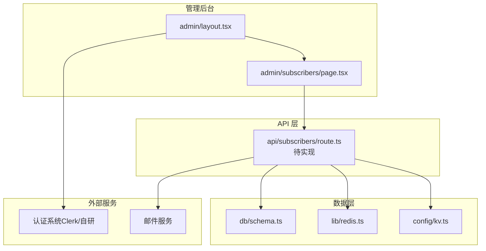
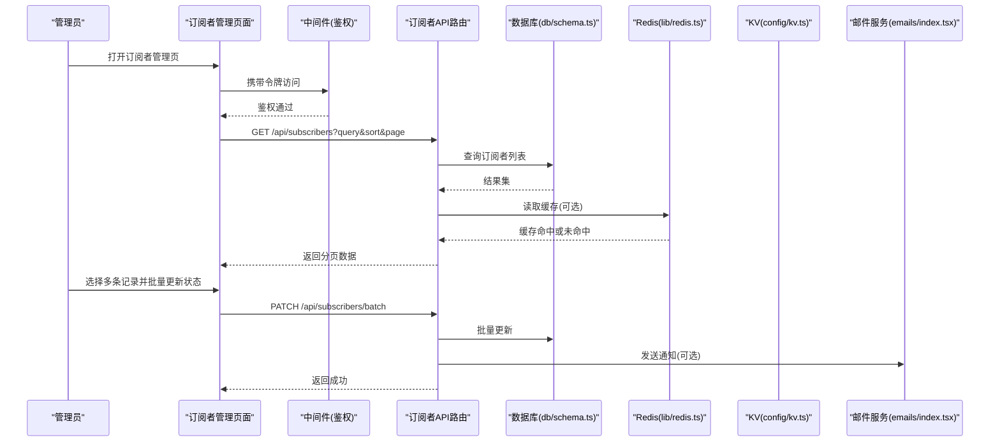
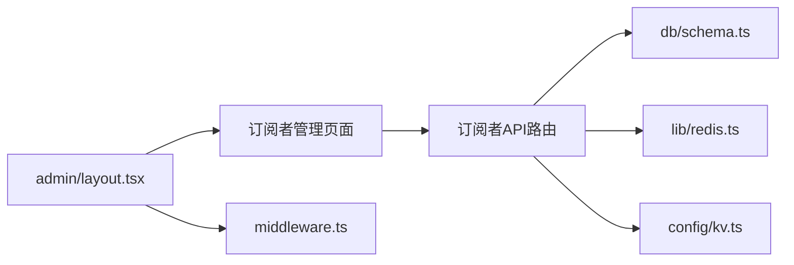

# 用户管理功能

<cite>
**本文引用的文件**   
- [app/admin/subscribers/page.tsx](file://app/admin/subscribers/page.tsx)
- [app/admin/layout.tsx](file://app/admin/layout.tsx)
- [middleware.ts](file://middleware.ts)
- [db/schema.ts](file://db/schema.ts)
- [lib/redis.ts](file://lib/redis.ts)
- [emails/index.tsx](file://emails/index.tsx)
- [config/kv.ts](file://config/kv.ts)
</cite>

## 目录
1. [简介](#简介)
2. [项目结构](#项目结构)
3. [核心组件](#核心组件)
4. [架构总览](#架构总览)
5. [详细组件分析](#详细组件分析)
6. [依赖分析](#依赖分析)
7. [性能考虑](#性能考虑)
8. [故障排查指南](#故障排查指南)
9. [结论](#结论)
10. [附录](#附录)

## 简介
本文件面向 cali.so 管理后台的“订阅者管理”功能，聚焦以下目标：
- 订阅者列表展示、详细信息查看、状态管理与批量操作
- 用户数据的获取、筛选、排序与分页处理
- 权限控制、访问日志记录与安全管理措施
- 扩展点说明：如何添加自定义字段与操作
- 与认证系统的集成方式、用户状态同步与数据一致性保证
- 数据分析与管理效率优化建议

## 项目结构
订阅者管理相关的前端页面位于管理后台路由下，后端能力通过 Next.js API Route 暴露。关键位置如下：
- 管理后台布局与侧边栏：app/admin/layout.tsx
- 订阅者管理页面：app/admin/subscribers/page.tsx
- 全局中间件（鉴权/路由守卫）：middleware.ts
- 数据库模式定义：db/schema.ts
- Redis 客户端封装：lib/redis.ts
- 邮件模板入口：emails/index.tsx
- KV 配置（如使用）：config/kv.ts

图表来源
- [app/admin/layout.tsx](file://app/admin/layout.tsx)
- [app/admin/subscribers/page.tsx](file://app/admin/subscribers/page.tsx)
- [db/schema.ts](file://db/schema.ts)
- [lib/redis.ts](file://lib/redis.ts)
- [config/kv.ts](file://config/kv.ts)
- [emails/index.tsx](file://emails/index.tsx)

章节来源
- [app/admin/layout.tsx](file://app/admin/layout.tsx)
- [app/admin/subscribers/page.tsx](file://app/admin/subscribers/page.tsx)
- [db/schema.ts](file://db/schema.ts)
- [lib/redis.ts](file://lib/redis.ts)
- [config/kv.ts](file://config/kv.ts)
- [emails/index.tsx](file://emails/index.tsx)

## 核心组件
- 订阅者管理页面：负责渲染订阅者列表、搜索与筛选表单、分页控件、批量操作按钮以及详情弹窗或抽屉。
- 管理后台布局：统一导航、侧边栏、登录态校验与管理员权限检查。
- API 路由（订阅者）：提供订阅者查询、更新、批量更新等接口，对接数据库与缓存。
- 数据模型：在 db/schema.ts 中定义订阅者实体及其字段、索引与约束。
- 缓存与 KV：使用 Redis 做热点数据缓存，KV 存储轻量配置或会话级标记。
- 邮件通知：订阅确认、退订提醒等模板入口。

章节来源
- [app/admin/subscribers/page.tsx](file://app/admin/subscribers/page.tsx)
- [app/admin/layout.tsx](file://app/admin/layout.tsx)
- [db/schema.ts](file://db/schema.ts)
- [lib/redis.ts](file://lib/redis.ts)
- [config/kv.ts](file://config/kv.ts)
- [emails/index.tsx](file://emails/index.tsx)

## 架构总览
订阅者管理的端到端流程：
- 前端页面发起请求到 API 路由
- API 路由进行鉴权与参数校验
- 读取数据库并应用筛选、排序与分页
- 可选地读写 Redis/KV 缓存
- 返回结构化数据给前端渲染
- 对敏感操作写入审计日志（可落库或写入消息队列）

图表来源
- [app/admin/subscribers/page.tsx](file://app/admin/subscribers/page.tsx)
- [middleware.ts](file://middleware.ts)
- [db/schema.ts](file://db/schema.ts)
- [lib/redis.ts](file://lib/redis.ts)
- [config/kv.ts](file://config/kv.ts)
- [emails/index.tsx](file://emails/index.tsx)

## 详细组件分析

### 订阅者管理页面（列表、详情、状态、批量）
- 列表展示
  - 支持按邮箱、昵称、注册时间区间、订阅状态等条件筛选
  - 支持按更新时间、注册时间的升/降序排序
  - 分页控件包含每页条数、当前页码与总页数
- 详情查看
  - 点击行或操作按钮进入详情视图，展示基础信息、订阅历史、最近活动
- 状态管理
  - 单个订阅者可切换启用/禁用、激活/未激活等状态
  - 批量操作支持对选中项统一设置状态、导出 CSV、批量发送邮件
- 交互与体验
  - 加载骨架屏、错误重试、空状态提示
  - 防抖搜索、键盘快捷键（全选、翻页）

章节来源
- [app/admin/subscribers/page.tsx](file://app/admin/subscribers/page.tsx)

### 管理后台布局与权限控制
- 统一布局
  - 侧边栏导航、面包屑、顶部工具栏
- 权限控制
  - 基于中间件的鉴权拦截，仅允许具备管理员角色的用户访问 /admin/*
  - 可在布局层二次校验角色或资源权限
- 访问日志
  - 在布局或中间件中记录管理员访问路径、IP、时间戳，便于审计

章节来源
- [app/admin/layout.tsx](file://app/admin/layout.tsx)
- [middleware.ts](file://middleware.ts)

### API 路由（订阅者）
- 接口设计建议
  - GET /api/subscribers：列表查询，支持 query、sort、order、page、pageSize
  - GET /api/subscribers/:id：详情
  - PATCH /api/subscribers/:id：更新单个字段（如 status）
  - PATCH /api/subscribers/batch：批量更新（ids + fields）
  - DELETE /api/subscribers/:id：删除（软删除更佳）
- 安全与校验
  - 鉴权：复用中间件或独立鉴权逻辑
  - 输入校验：白名单字段、范围限制、类型转换
  - 幂等性：批量更新需支持 idempotency-key
- 数据一致性
  - 事务：批量更新使用事务确保原子性
  - 并发：乐观锁或版本号字段避免覆盖更新
- 缓存策略
  - 读多写少场景：列表查询走 Redis 缓存，写后失效或短 TTL
  - 热点键：订阅者详情可按 id 缓存

章节来源
- [db/schema.ts](file://db/schema.ts)
- [lib/redis.ts](file://lib/redis.ts)
- [config/kv.ts](file://config/kv.ts)

### 数据模型与索引
- 订阅者表建议字段
  - id、email、nickname、status、created_at、updated_at、last_login_at、metadata(JSON)
- 索引建议
  - email 唯一索引
  - status、created_at、updated_at 复合索引以加速筛选与排序
- 审计字段
  - created_by、updated_by 用于追踪变更来源

章节来源
- [db/schema.ts](file://db/schema.ts)

### 缓存与 KV
- Redis
  - 列表缓存：key 由查询参数哈希生成，TTL 合理设置
  - 详情缓存：按 id 缓存，更新时主动失效
- KV
  - 临时标记：如“批量任务进行中”、“限流计数”

章节来源
- [lib/redis.ts](file://lib/redis.ts)
- [config/kv.ts](file://config/kv.ts)

### 邮件通知
- 订阅确认、退订提醒、批量通知等模板入口
- 异步发送：通过队列或延迟任务降低主流程耗时

章节来源
- [emails/index.tsx](file://emails/index.tsx)

## 依赖分析
- 模块耦合
  - 页面依赖 API 路由；API 路由依赖数据库与缓存；布局依赖中间件
- 外部依赖
  - 认证系统（鉴权）、邮件服务、对象存储（头像/附件）
- 潜在循环依赖
  - 保持页面与 API 单向依赖，避免反向引用

图表来源
- [app/admin/subscribers/page.tsx](file://app/admin/subscribers/page.tsx)
- [app/admin/layout.tsx](file://app/admin/layout.tsx)
- [middleware.ts](file://middleware.ts)
- [db/schema.ts](file://db/schema.ts)
- [lib/redis.ts](file://lib/redis.ts)
- [config/kv.ts](file://config/kv.ts)

章节来源
- [app/admin/subscribers/page.tsx](file://app/admin/subscribers/page.tsx)
- [app/admin/layout.tsx](file://app/admin/layout.tsx)
- [middleware.ts](file://middleware.ts)
- [db/schema.ts](file://db/schema.ts)
- [lib/redis.ts](file://lib/redis.ts)
- [config/kv.ts](file://config/kv.ts)

## 性能考虑
- 查询优化
  - 合理使用索引，避免全表扫描
  - 分页采用游标或基于索引的 keyset 分页提升稳定性
- 缓存策略
  - 列表缓存按查询条件分片，避免大对象缓存
  - 热点详情短 TTL，写后主动失效
- 批量操作
  - 分批提交，避免长事务与锁竞争
  - 进度反馈与失败重试机制
- 前端优化
  - 虚拟滚动、懒加载、去抖搜索
  - 预取下一页数据，减少等待感

[本节为通用指导，不直接分析具体文件]

## 故障排查指南
- 鉴权失败
  - 检查中间件是否放行 /admin/* 且具备管理员角色
  - 核对令牌有效期与作用域
- 列表为空或数据不一致
  - 检查缓存 key 是否与查询参数一致
  - 确认写操作后是否清理了相关缓存
- 批量更新失败
  - 检查事务是否回滚、是否有唯一约束冲突
  - 查看并发更新导致的版本冲突
- 邮件未送达
  - 检查模板渲染与队列消费日志
  - 验证第三方服务配额与密钥

章节来源
- [middleware.ts](file://middleware.ts)
- [lib/redis.ts](file://lib/redis.ts)
- [db/schema.ts](file://db/schema.ts)
- [emails/index.tsx](file://emails/index.tsx)

## 结论
订阅者管理功能围绕“列表—详情—状态—批量”的核心闭环构建，结合鉴权、缓存与审计日志形成完整的管理体验。通过合理的索引与分页策略、稳健的批量更新与缓存失效机制，可在大规模数据下保持稳定与高效。后续可扩展自定义字段、操作与报表分析，进一步提升运营效率。

[本节为总结性内容，不直接分析具体文件]

## 附录

### 扩展指南：添加自定义字段与操作
- 数据层
  - 在 db/schema.ts 新增字段与索引，执行迁移
- API 层
  - 在订阅者 API 路由中增加字段校验与写入逻辑
  - 批量更新接口支持新字段
- 前端
  - 在列表与详情视图中展示新字段
  - 在批量操作中纳入新字段
- 缓存
  - 更新后失效对应缓存 key
- 审计
  - 记录字段变更前后值

章节来源
- [db/schema.ts](file://db/schema.ts)
- [lib/redis.ts](file://lib/redis.ts)

### 与认证系统集成与状态同步
- 集成方式
  - 在中间件或 API 层解析认证令牌，提取用户角色与权限
- 状态同步
  - 订阅者状态变更时，触发事件同步至认证系统（如需）
  - 使用消息队列或 Webhook 保证最终一致性
- 数据一致性
  - 使用事务与幂等键，避免重复更新
  - 引入版本号或时间戳进行乐观锁

章节来源
- [middleware.ts](file://middleware.ts)
- [db/schema.ts](file://db/schema.ts)

### 访问日志与安全加固
- 访问日志
  - 记录管理员访问路径、IP、UA、时间戳
  - 敏感操作二次确认与审批流
- 安全加固
  - 最小权限原则、CSRF/XSS 防护
  - 速率限制与异常告警

章节来源
- [middleware.ts](file://middleware.ts)
- [app/admin/layout.tsx](file://app/admin/layout.tsx)