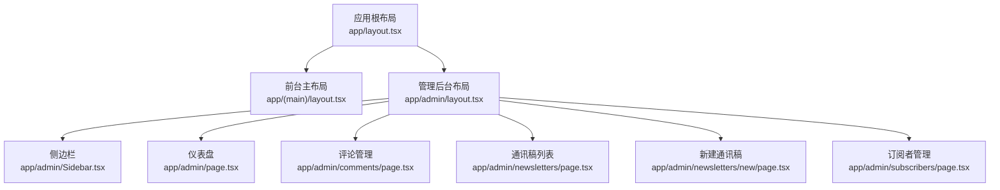
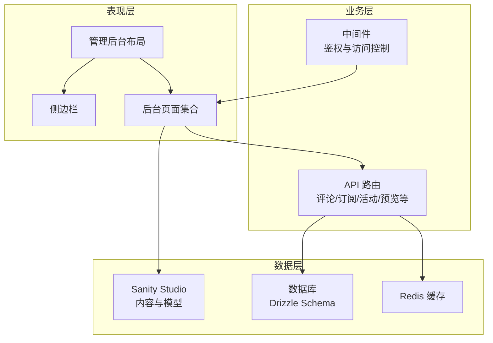
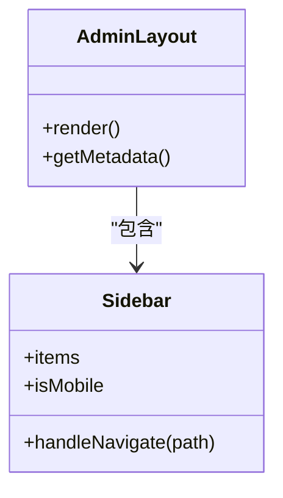
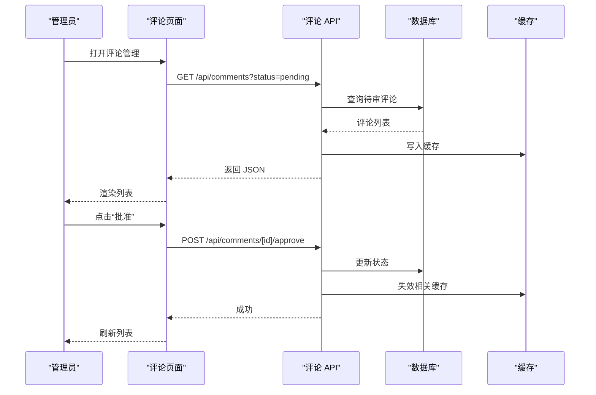
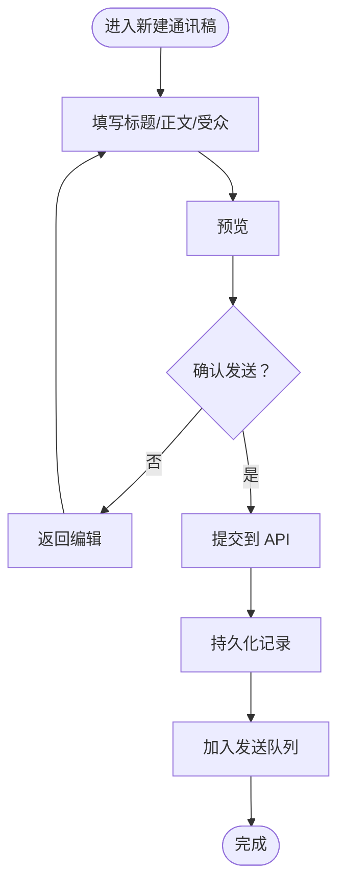
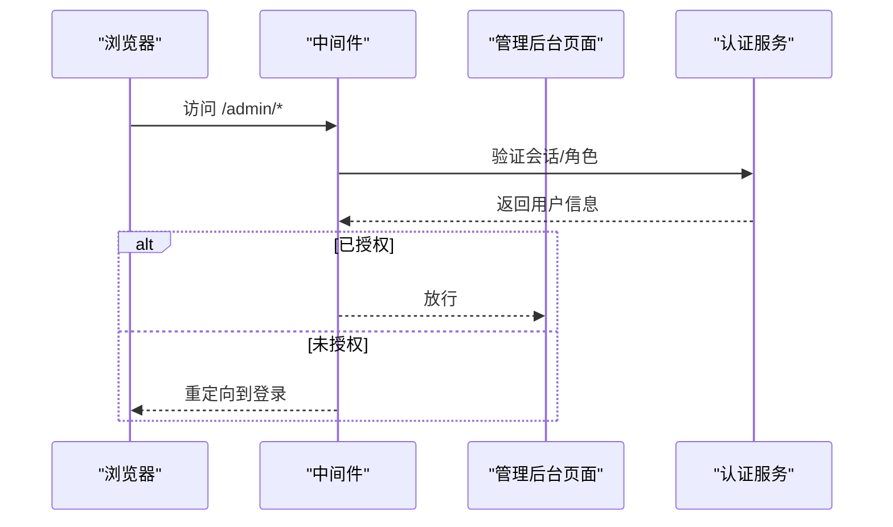
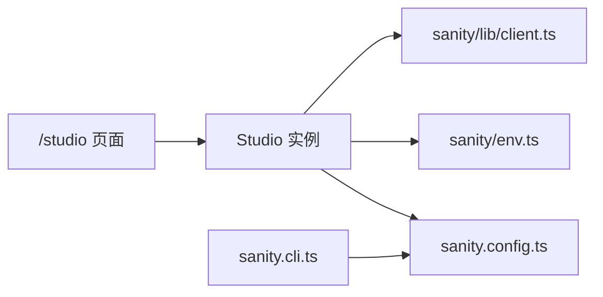
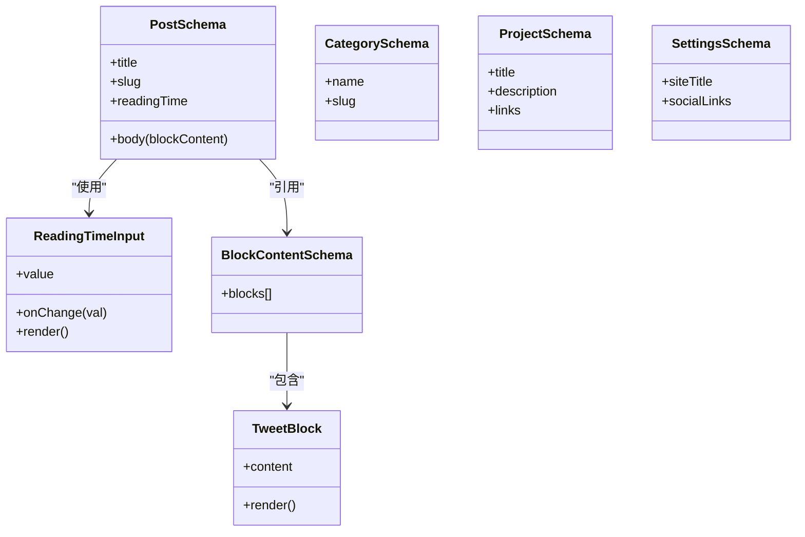
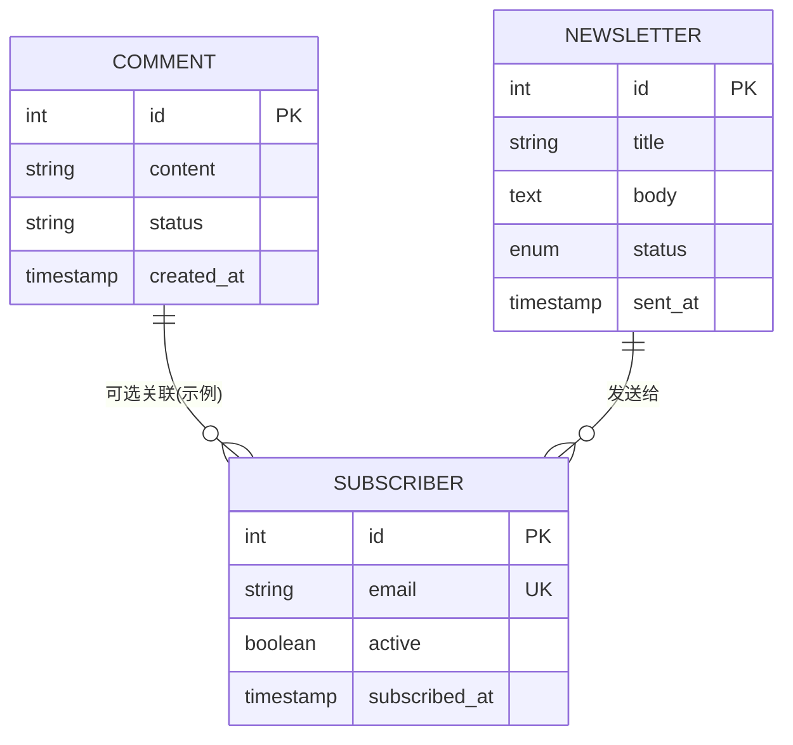
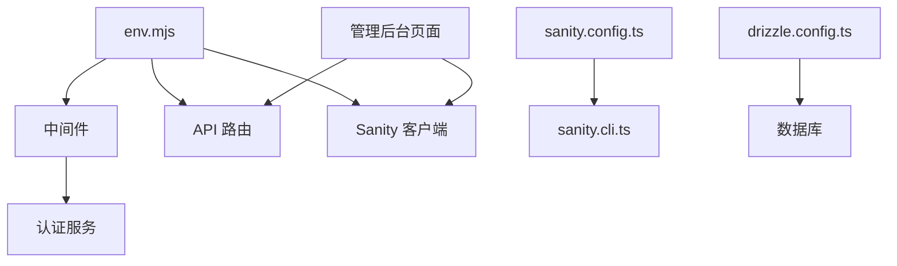

# 管理后台

<cite>
**本文引用的文件**   
- [app/admin/layout.tsx](file://app/admin/layout.tsx)
- [app/admin/page.tsx](file://app/admin/page.tsx)
- [app/admin/Sidebar.tsx](file://app/admin/Sidebar.tsx)
- [app/admin/comments/page.tsx](file://app/admin/comments/page.tsx)
- [app/admin/newsletters/page.tsx](file://app/admin/newsletters/page.tsx)
- [app/admin/newsletters/new/page.tsx](file://app/admin/newsletters/new/page.tsx)
- [app/admin/subscribers/page.tsx](file://app/admin/subscribers/page.tsx)
- [middleware.ts](file://middleware.ts)
- [app/studio/page.tsx](file://app/studio/page.tsx)
- [app/studio/Studio.tsx](file://app/studio/Studio.tsx)
- [sanity.config.ts](file://sanity.config.ts)
- [sanity.cli.ts](file://sanity.cli.ts)
- [sanity/env.ts](file://sanity/env.ts)
- [sanity/lib/client.ts](file://sanity/lib/client.ts)
- [sanity/schemas/post.ts](file://sanity/schemas/post.ts)
- [sanity/schemas/blockContent.ts](file://sanity/schemas/blockContent.ts)
- [sanity/schemas/category.ts](file://sanity/schemas/category.ts)
- [sanity/schemas/project.ts](file://sanity/schemas/project.ts)
- [sanity/schemas/settings.ts](file://sanity/schemas/settings.ts)
- [sanity/components/ReadingTimeInput.tsx](file://sanity/components/ReadingTimeInput.tsx)
- [sanity/components/Tweet.tsx](file://sanity/components/Tweet.tsx)
- [sanity/plugins/settings.ts](file://sanity/plugins/settings.ts)
- [lib/database.types.ts](file://lib/database.types.ts)
- [db/schema.ts](file://db/schema.ts)
- [drizzle.config.ts](file://drizzle.config.ts)
- [env.mjs](file://env.mjs)
</cite>

## 目录
1. [简介](#简介)
2. [项目结构](#项目结构)
3. [核心组件](#核心组件)
4. [架构总览](#架构总览)
5. [详细组件分析](#详细组件分析)
6. [依赖关系分析](#依赖关系分析)
7. [性能考虑](#性能考虑)
8. [故障排查指南](#故障排查指南)
9. [结论](#结论)
10. [附录](#附录)

## 简介
本文件为 cali.so 管理后台的权威功能与实现文档，覆盖以下方面：
- 管理界面组织与路由
- 内容管理（博客、项目、设置）
- 用户与订阅者管理
- 评论审核与管理
- 统计分析展示思路
- 批量操作工具与扩展点
- Sanity Studio 集成配置、自定义编辑器组件与字段类型
- 权限控制机制、数据可视化与响应式布局
- 与管理数据的交互方式、实时更新机制与错误处理策略
- 自定义主题、插件开发与功能扩展指导

## 项目结构
管理后台位于 app/admin 下，采用 Next.js App Router 的路由组织方式。主要模块包括：
- 根布局与侧边栏：统一导航与页面壳
- 仪表盘：概览入口
- 评论管理：列表与审核流程
- 通讯稿管理：列表与新建
- 订阅者管理：订阅者列表与状态维护

图表来源
- [app/admin/layout.tsx](file://app/admin/layout.tsx)
- [app/admin/Sidebar.tsx](file://app/admin/Sidebar.tsx)
- [app/admin/page.tsx](file://app/admin/page.tsx)
- [app/admin/comments/page.tsx](file://app/admin/comments/page.tsx)
- [app/admin/newsletters/page.tsx](file://app/admin/newsletters/page.tsx)
- [app/admin/newsletters/new/page.tsx](file://app/admin/newsletters/new/page.tsx)
- [app/admin/subscribers/page.tsx](file://app/admin/subscribers/page.tsx)

章节来源
- [app/admin/layout.tsx](file://app/admin/layout.tsx)
- [app/admin/Sidebar.tsx](file://app/admin/Sidebar.tsx)
- [app/admin/page.tsx](file://app/admin/page.tsx)
- [app/admin/comments/page.tsx](file://app/admin/comments/page.tsx)
- [app/admin/newsletters/page.tsx](file://app/admin/newsletters/page.tsx)
- [app/admin/newsletters/new/page.tsx](file://app/admin/newsletters/new/page.tsx)
- [app/admin/subscribers/page.tsx](file://app/admin/subscribers/page.tsx)

## 核心组件
- 管理后台布局：提供统一的头部、侧边栏与内容区，承载各子页面的渲染与全局样式。
- 侧边栏：定义后台导航项与路由跳转，支持图标与高亮当前路径。
- 仪表盘：聚合关键指标入口，如评论数、订阅者数量、近期动态等。
- 评论管理：列出评论、筛选与审核操作（通过 API 或数据库层）。
- 通讯稿管理：列表查看与新建编辑，对接邮件发送与模板渲染。
- 订阅者管理：订阅者列表、退订/激活状态管理与批量操作。

章节来源
- [app/admin/layout.tsx](file://app/admin/layout.tsx)
- [app/admin/Sidebar.tsx](file://app/admin/Sidebar.tsx)
- [app/admin/page.tsx](file://app/admin/page.tsx)
- [app/admin/comments/page.tsx](file://app/admin/comments/page.tsx)
- [app/admin/newsletters/page.tsx](file://app/admin/newsletters/page.tsx)
- [app/admin/newsletters/new/page.tsx](file://app/admin/newsletters/new/page.tsx)
- [app/admin/subscribers/page.tsx](file://app/admin/subscribers/page.tsx)

## 架构总览
管理后台整体架构分为三层：
- 表现层：Next.js 页面与组件，负责 UI 与交互
- 业务层：中间件与路由处理器，负责鉴权、校验与编排
- 数据层：Sanity（内容）、Drizzle + 数据库（结构化数据）、Redis（缓存）

图表来源
- [middleware.ts](file://middleware.ts)
- [app/admin/layout.tsx](file://app/admin/layout.tsx)
- [app/admin/Sidebar.tsx](file://app/admin/Sidebar.tsx)
- [app/studio/page.tsx](file://app/studio/page.tsx)
- [app/studio/Studio.tsx](file://app/studio/Studio.tsx)
- [sanity.config.ts](file://sanity.config.ts)
- [sanity/cli.ts](file://sanity.cli.ts)
- [sanity/lib/client.ts](file://sanity/lib/client.ts)
- [db/schema.ts](file://db/schema.ts)
- [drizzle.config.ts](file://drizzle.config.ts)
- [env.mjs](file://env.mjs)

## 详细组件分析

### 管理后台布局与侧边栏
- 布局职责：挂载侧边栏、面包屑、全局通知与错误边界；统一加载客户端脚本与样式。
- 侧边栏职责：根据权限渲染菜单项；支持移动端折叠；保持当前路由高亮。
- 响应式：在小屏设备自动收起侧边栏并提供抽屉式导航。

图表来源
- [app/admin/layout.tsx](file://app/admin/layout.tsx)
- [app/admin/Sidebar.tsx](file://app/admin/Sidebar.tsx)

章节来源
- [app/admin/layout.tsx](file://app/admin/layout.tsx)
- [app/admin/Sidebar.tsx](file://app/admin/Sidebar.tsx)

### 仪表盘
- 目标：展示关键运营指标与快捷入口。
- 数据来源：可组合来自 API 的数据与 Sanity 查询结果。
- 可扩展：新增卡片只需在页面中增加统计区块并接入对应数据源。

章节来源
- [app/admin/page.tsx](file://app/admin/page.tsx)

### 评论管理
- 功能：列表展示、搜索过滤、分页、审核（批准/删除）、批量操作。
- 数据流：页面请求 -> API 路由 -> 数据库/缓存 -> 返回 JSON -> 前端渲染。
- 实时性：可通过轮询或事件推送更新审核状态。

图表来源
- [app/admin/comments/page.tsx](file://app/admin/comments/page.tsx)

章节来源
- [app/admin/comments/page.tsx](file://app/admin/comments/page.tsx)

### 通讯稿管理
- 列表页：展示历史通讯稿、状态与发送时间。
- 新建页：选择模板、填写标题与正文、预览与发送。
- 数据流：前端表单 -> API 路由 -> 持久化与邮件队列。

图表来源
- [app/admin/newsletters/new/page.tsx](file://app/admin/newsletters/new/page.tsx)
- [app/admin/newsletters/page.tsx](file://app/admin/newsletters/page.tsx)

章节来源
- [app/admin/newsletters/page.tsx](file://app/admin/newsletters/page.tsx)
- [app/admin/newsletters/new/page.tsx](file://app/admin/newsletters/new/page.tsx)

### 订阅者管理
- 功能：订阅者列表、状态切换（激活/退订）、批量导入导出、按标签筛选。
- 数据流：页面 -> API -> 数据库 -> 返回结果。
- 批量操作：支持勾选多条记录进行批量启用/禁用。

章节来源
- [app/admin/subscribers/page.tsx](file://app/admin/subscribers/page.tsx)

### 权限控制与访问保护
- 中间件：对 /admin 与 /studio 路径进行鉴权拦截，未登录或未授权时重定向至登录页。
- 路由级保护：可在页面内二次校验角色与资源权限。
- 建议：结合 Clerk 的用户会话与角色信息，细化到资源维度（如仅允许特定角色访问订阅者管理）。

图表来源
- [middleware.ts](file://middleware.ts)

章节来源
- [middleware.ts](file://middleware.ts)

### Sanity Studio 集成与配置
- 入口：/studio 路由渲染 Studio 实例，使用 sanity.config.ts 中的配置。
- CLI：sanity.cli.ts 用于本地开发命令（如初始化、部署、构建）。
- 环境变量：sanity/env.ts 集中读取 SANITY_* 环境变量。
- 客户端：sanity/lib/client.ts 提供查询与监听接口。

图表来源
- [app/studio/page.tsx](file://app/studio/page.tsx)
- [app/studio/Studio.tsx](file://app/studio/Studio.tsx)
- [sanity.config.ts](file://sanity.config.ts)
- [sanity.cli.ts](file://sanity.cli.ts)
- [sanity/env.ts](file://sanity/env.ts)
- [sanity/lib/client.ts](file://sanity/lib/client.ts)

章节来源
- [app/studio/page.tsx](file://app/studio/page.tsx)
- [app/studio/Studio.tsx](file://app/studio/Studio.tsx)
- [sanity.config.ts](file://sanity.config.ts)
- [sanity.cli.ts](file://sanity.cli.ts)
- [sanity/env.ts](file://sanity/env.ts)
- [sanity/lib/client.ts](file://sanity/lib/client.ts)

### 自定义编辑器组件与字段类型
- 阅读时长输入：自定义输入组件，基于文章长度估算阅读时间。
- 推文嵌入：自定义块组件，支持从链接解析推文内容。
- 内容模型：post、blockContent、category、project、settings 等 schema 定义。
- 插件：settings 插件用于站点全局配置。

图表来源
- [sanity/components/ReadingTimeInput.tsx](file://sanity/components/ReadingTimeInput.tsx)
- [sanity/components/Tweet.tsx](file://sanity/components/Tweet.tsx)
- [sanity/schemas/post.ts](file://sanity/schemas/post.ts)
- [sanity/schemas/blockContent.ts](file://sanity/schemas/blockContent.ts)
- [sanity/schemas/category.ts](file://sanity/schemas/category.ts)
- [sanity/schemas/project.ts](file://sanity/schemas/project.ts)
- [sanity/schemas/settings.ts](file://sanity/schemas/settings.ts)
- [sanity/plugins/settings.ts](file://sanity/plugins/settings.ts)

章节来源
- [sanity/components/ReadingTimeInput.tsx](file://sanity/components/ReadingTimeInput.tsx)
- [sanity/components/Tweet.tsx](file://sanity/components/Tweet.tsx)
- [sanity/schemas/post.ts](file://sanity/schemas/post.ts)
- [sanity/schemas/blockContent.ts](file://sanity/schemas/blockContent.ts)
- [sanity/schemas/category.ts](file://sanity/schemas/category.ts)
- [sanity/schemas/project.ts](file://sanity/schemas/project.ts)
- [sanity/schemas/settings.ts](file://sanity/schemas/settings.ts)
- [sanity/plugins/settings.ts](file://sanity/plugins/settings.ts)

### 数据模型与后端存储
- Drizzle Schema：定义数据库表结构与关系，配合迁移脚本进行版本管理。
- 类型生成：lib/database.types.ts 提供 TypeScript 类型，确保前后端一致性。
- 配置：drizzle.config.ts 指定连接信息与迁移目录。

图表来源
- [db/schema.ts](file://db/schema.ts)
- [lib/database.types.ts](file://lib/database.types.ts)
- [drizzle.config.ts](file://drizzle.config.ts)

章节来源
- [db/schema.ts](file://db/schema.ts)
- [lib/database.types.ts](file://lib/database.types.ts)
- [drizzle.config.ts](file://drizzle.config.ts)

### 环境变量与运行时配置
- env.mjs：集中管理环境变量，供中间件、API 与客户端使用。
- 安全建议：敏感变量仅在服务端注入，避免暴露到客户端。

章节来源
- [env.mjs](file://env.mjs)

## 依赖关系分析
- 中间件依赖认证服务与路由规则，决定哪些路径需要鉴权。
- 管理后台页面依赖 API 路由获取数据，部分页面直接调用 Sanity 客户端。
- Sanity 配置与 CLI 相互依赖，保证本地开发与部署的一致性。
- Drizzle 与数据库驱动通过配置文件建立连接，schema 变更需执行迁移。

图表来源
- [middleware.ts](file://middleware.ts)
- [sanity.config.ts](file://sanity.config.ts)
- [sanity.cli.ts](file://sanity.cli.ts)
- [drizzle.config.ts](file://drizzle.config.ts)
- [env.mjs](file://env.mjs)

章节来源
- [middleware.ts](file://middleware.ts)
- [sanity.config.ts](file://sanity.config.ts)
- [sanity.cli.ts](file://sanity.cli.ts)
- [drizzle.config.ts](file://drizzle.config.ts)
- [env.mjs](file://env.mjs)

## 性能考虑
- 列表分页与增量加载：评论与订阅者列表应分页加载，避免一次性拉取大量数据。
- 缓存策略：对热点数据（如仪表盘指标）使用 Redis 缓存，缩短响应时间。
- 懒加载与代码分割：后台页面按需加载，减少首屏体积。
- 图片与媒体优化：Sanity 图片使用 CDN 与自适应尺寸，降低带宽消耗。
- 批处理：批量操作合并为单次 API 调用，减少网络往返。

## 故障排查指南
- 鉴权失败：检查中间件逻辑与用户会话是否有效，确认环境变量是否正确。
- Sanity 连接异常：核对 sanity.env.ts 中的项目 ID 与令牌，确认网络可达。
- 数据库连接失败：检查 drizzle.config.ts 与数据库凭证，确认迁移是否执行。
- API 报错：查看服务器日志与错误边界输出，定位具体路由与参数问题。
- 前端渲染异常：使用浏览器开发者工具检查网络与控制台错误，逐步缩小范围。

章节来源
- [middleware.ts](file://middleware.ts)
- [sanity/env.ts](file://sanity/env.ts)
- [drizzle.config.ts](file://drizzle.config.ts)

## 结论
本管理后台以 Next.js 为框架，结合 Sanity Studio 与 Drizzle ORM，形成清晰的前后端分层与可扩展的插件体系。通过中间件实现统一的权限控制，借助 API 与缓存提升性能，并通过自定义编辑器与字段类型增强内容创作体验。建议在后续迭代中完善权限粒度、引入更丰富的统计可视化与自动化测试，以提升系统的稳定性与可维护性。

## 附录

### 常用配置选项与扩展方法
- 自定义主题：在 Sanity 配置中注册主题包，或在 Next.js 中通过 Tailwind 与 CSS 变量定制后台外观。
- 插件开发：参考 settings 插件模式，封装独立功能并在 sanity.config.ts 中注册。
- 字段类型扩展：在 schemas/types 下定义新类型，并在相应 schema 中引用。
- 权限扩展：在中间件中增加角色判断与资源白名单，结合 Clerk 的用户属性进行细粒度控制。

[本节为概念性说明，不直接分析具体文件]