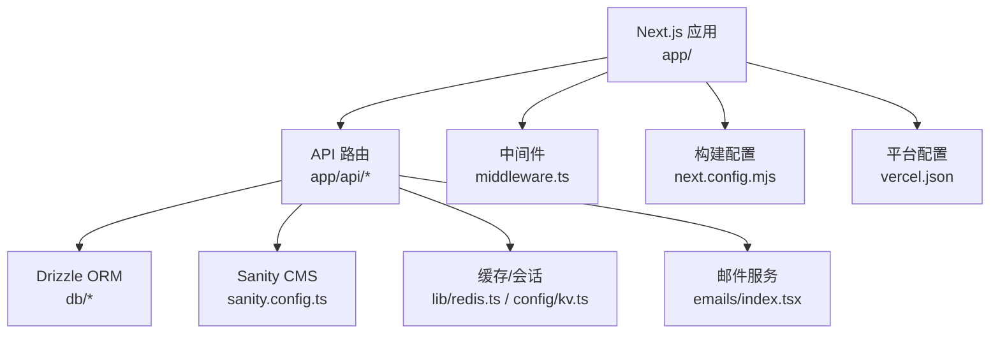
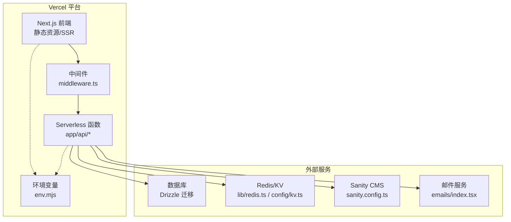
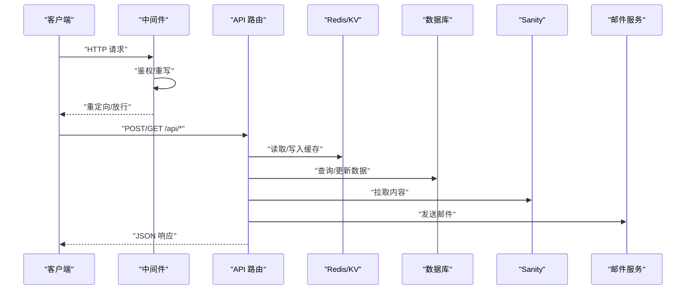
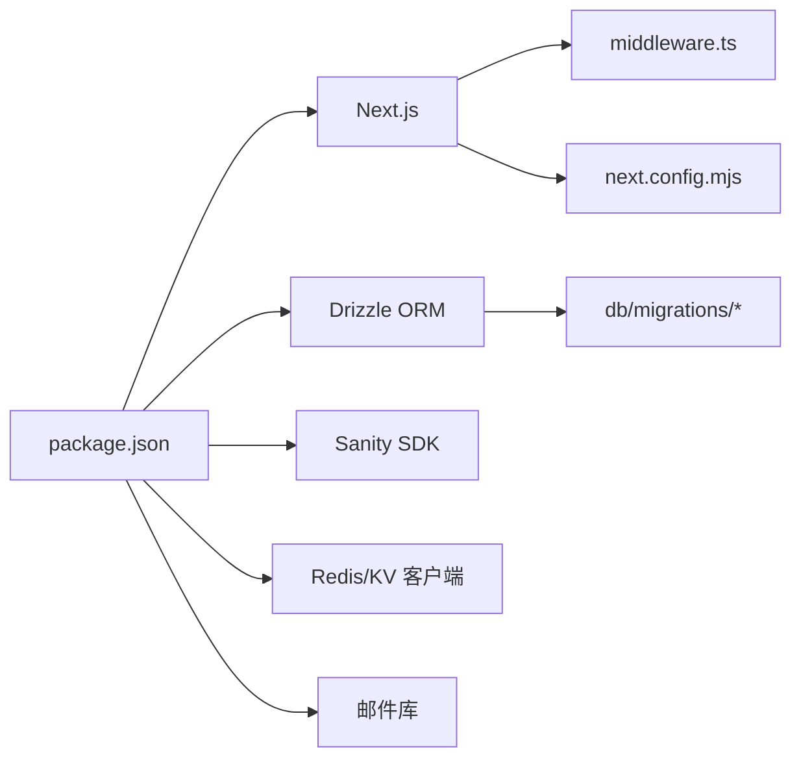

# 部署指南

<cite>
**本文引用的文件**   
- [README.md](file://README.md)
- [package.json](file://package.json)
- [next.config.mjs](file://next.config.mjs)
- [vercel.json](file://vercel.json)
- [env.mjs](file://env.mjs)
- [middleware.ts](file://middleware.ts)
- [drizzle.config.ts](file://drizzle.config.ts)
- [sanity.config.ts](file://sanity.config.ts)
- [lib/redis.ts](file://lib/redis.ts)
- [config/kv.ts](file://config/kv.ts)
- [emails/index.tsx](file://emails/index.tsx)
- [app/api/activity/route.ts](file://app/api/activity/route.ts)
- [app/api/guestbook/route.ts](file://app/api/guestbook/route.ts)
- [app/api/newsletter/route.ts](file://app/api/newsletter/route.ts)
- [app/api/reactions/route.ts](file://app/api/reactions/route.ts)
- [app/api/comments/[id]/route.ts](file://app/api/comments/[id]/route.ts)
- [app/api/tweet/[id]/route.ts](file://app/api/tweet/[id]/route.ts)
- [app/api/link-preview/route.tsx](file://app/api/link-preview/route.tsx)
- [app/api/favicon/route.tsx](file://app/api/favicon/route.tsx)
- [db/schema.ts](file://db/schema.ts)
- [db/migrations/0000_shallow_iron_fist.sql](file://db/migrations/0000_shallow_iron_fist.sql)
- [turbo.json](file://turbo.json)
</cite>

## 目录
1. [简介](#简介)
2. [项目结构](#项目结构)
3. [核心组件](#核心组件)
4. [架构总览](#架构总览)
5. [详细组件分析](#详细组件分析)
6. [依赖分析](#依赖分析)
7. [性能考虑](#性能考虑)
8. [故障排除指南](#故障排除指南)
9. [结论](#结论)
10. [附录](#附录)

## 简介
本指南面向生产环境，提供 cali.so 在 Vercel 平台的完整部署方案，涵盖：
- 环境变量与密钥管理
- 域名与 SSL 配置
- CI/CD 自动化流水线
- 版本发布策略与回滚机制
- 监控、日志与错误追踪
- 性能调优与扩容建议
- 常见问题排查

本项目基于 Next.js（App Router），使用 Drizzle ORM 进行数据库迁移，集成 Sanity CMS、Redis/KV、邮件发送等外部服务。

## 项目结构
从部署视角关注的关键目录与文件：
- 应用入口与构建配置：next.config.mjs、package.json、turbo.json
- 平台部署配置：vercel.json
- 运行时中间件：middleware.ts
- 环境变量定义与校验：env.mjs
- 数据层与迁移：drizzle.config.ts、db/schema.ts、db/migrations/*
- 第三方服务集成：sanity.config.ts、lib/redis.ts、config/kv.ts、emails/index.tsx
- API 路由：app/api/*

图表来源
- [next.config.mjs](file://next.config.mjs)
- [vercel.json](file://vercel.json)
- [middleware.ts](file://middleware.ts)
- [drizzle.config.ts](file://drizzle.config.ts)
- [sanity.config.ts](file://sanity.config.ts)
- [lib/redis.ts](file://lib/redis.ts)
- [config/kv.ts](file://config/kv.ts)
- [emails/index.tsx](file://emails/index.tsx)

章节来源
- [README.md](file://README.md)
- [package.json](file://package.json)
- [next.config.mjs](file://next.config.mjs)
- [vercel.json](file://vercel.json)
- [turbo.json](file://turbo.json)

## 核心组件
- 构建与运行
  - 构建命令与脚本由 package.json 定义；Next.js 默认支持 App Router 与 Server Components。
  - next.config.mjs 包含站点级配置（如重定向、代理、图片优化等）。
- 平台部署
  - vercel.json 指定框架为 Next.js，可配置构建产物、环境变量注入、函数超时与内存等。
- 中间件
  - middleware.ts 用于请求前置处理（鉴权、路由重写、访问控制等）。
- 环境变量
  - env.mjs 集中声明并校验环境变量，确保运行时安全。
- 数据层
  - drizzle.config.ts 管理数据库连接与迁移；db/schema.ts 定义表结构；db/migrations 存放 SQL 迁移。
- 外部服务
  - sanity.config.ts 配置 Sanity 客户端与令牌。
  - lib/redis.ts 与 config/kv.ts 分别对接 Redis 与 KV 存储。
  - emails/index.tsx 封装邮件模板与发送逻辑。

章节来源
- [package.json](file://package.json)
- [next.config.mjs](file://next.config.mjs)
- [vercel.json](file://vercel.json)
- [middleware.ts](file://middleware.ts)
- [env.mjs](file://env.mjs)
- [drizzle.config.ts](file://drizzle.config.ts)
- [db/schema.ts](file://db/schema.ts)
- [db/migrations/0000_shallow_iron_fist.sql](file://db/migrations/0000_shallow_iron_fist.sql)
- [sanity.config.ts](file://sanity.config.ts)
- [lib/redis.ts](file://lib/redis.ts)
- [config/kv.ts](file://config/kv.ts)
- [emails/index.tsx](file://emails/index.tsx)

## 架构总览
下图展示生产环境关键交互：浏览器通过 Vercel Edge/Serverless 执行 Next.js 应用，中间件处理鉴权与路由，API 路由访问数据库、缓存、CMS 与邮件服务。

图表来源
- [middleware.ts](file://middleware.ts)
- [app/api/activity/route.ts](file://app/api/activity/route.ts)
- [app/api/guestbook/route.ts](file://app/api/guestbook/route.ts)
- [app/api/newsletter/route.ts](file://app/api/newsletter/route.ts)
- [app/api/reactions/route.ts](file://app/api/reactions/route.ts)
- [app/api/comments/[id]/route.ts](file://app/api/comments/[id]/route.ts)
- [app/api/tweet/[id]/route.ts](file://app/api/tweet/[id]/route.ts)
- [app/api/link-preview/route.tsx](file://app/api/link-preview/route.tsx)
- [app/api/favicon/route.tsx](file://app/api/favicon/route.tsx)
- [drizzle.config.ts](file://drizzle.config.ts)
- [lib/redis.ts](file://lib/redis.ts)
- [config/kv.ts](file://config/kv.ts)
- [sanity.config.ts](file://sanity.config.ts)
- [emails/index.tsx](file://emails/index.tsx)

## 详细组件分析

### Vercel 平台部署与环境变量
- 框架识别与构建
  - vercel.json 中指定框架为 Next.js，确保 Vercel 自动识别并采用正确的构建流程。
  - 如需自定义构建或输出目录，可在 vercel.json 中配置 build 与 outputDirectory。
- 环境变量管理
  - 在 Vercel 项目的 Settings > Environment Variables 中添加所有必需变量（参考 env.mjs 中的键名）。
  - 区分 Production、Preview、Development 环境，避免敏感信息泄露。
  - 建议在代码中使用 env.mjs 统一读取与校验，缺失时给出明确错误提示。
- 域名与 SSL
  - 在 Vercel Domains 添加自定义域名，平台自动签发并续期 Let's Encrypt 证书。
  - 如需强制 HTTPS，可在 next.config.mjs 或 vercel.json 中配置重定向规则。
- 函数限制与扩展
  - 根据 API 负载调整函数超时、内存与并发（vercel.json 的 functions 字段）。
  - 对高延迟的外部调用（如邮件、CMS）增加超时与重试策略。

章节来源
- [vercel.json](file://vercel.json)
- [env.mjs](file://env.mjs)
- [next.config.mjs](file://next.config.mjs)

### 中间件与鉴权
- 中间件职责
  - 在请求到达页面或 API 前进行鉴权、路由重写、访问控制与速率限制。
- 典型流程
  - 解析 Cookie/Token -> 校验用户状态 -> 决定放行或重定向到登录页。
- 注意事项
  - 中间件在 Edge 运行时执行，避免阻塞型操作。
  - 将鉴权逻辑抽象为可复用函数，便于测试与维护。

章节来源
- [middleware.ts](file://middleware.ts)

### 数据层与迁移
- 数据库连接与迁移
  - drizzle.config.ts 配置数据库连接参数与迁移目录。
  - db/schema.ts 定义表结构与关系；db/migrations 存放 SQL 迁移文件。
- 生产迁移策略
  - 在 CI 阶段执行迁移，确保新部署与数据库结构一致。
  - 若使用 Vercel Postgres，可通过 CLI 或 GitHub Actions 触发迁移。
- 读写分离与缓存
  - 热点数据写入 Redis/KV，降低数据库压力。
  - 合理设置缓存过期时间与失效策略。

章节来源
- [drizzle.config.ts](file://drizzle.config.ts)
- [db/schema.ts](file://db/schema.ts)
- [db/migrations/0000_shallow_iron_fist.sql](file://db/migrations/0000_shallow_iron_fist.sql)

### 外部服务集成
- Sanity CMS
  - sanity.config.ts 配置客户端与令牌，用于获取博客、项目等内容。
  - 生产环境需启用预览模式与内容安全策略。
- Redis/KV
  - lib/redis.ts 与 config/kv.ts 分别对接 Redis 与 KV 存储，用于会话、限流与缓存。
- 邮件服务
  - emails/index.tsx 封装模板与发送逻辑，生产环境需配置 SMTP 或第三方服务凭据。

章节来源
- [sanity.config.ts](file://sanity.config.ts)
- [lib/redis.ts](file://lib/redis.ts)
- [config/kv.ts](file://config/kv.ts)
- [emails/index.tsx](file://emails/index.tsx)

### API 路由与数据处理
- 活动与互动
  - app/api/activity/route.ts、app/api/reactions/route.ts 处理用户活动与反应数据。
- 留言板与评论
  - app/api/guestbook/route.ts、app/api/comments/[id]/route.ts 实现留言与评论 CRUD。
- 订阅与通讯
  - app/api/newsletter/route.ts 处理订阅确认与退订。
- 媒体与链接
  - app/api/tweet/[id]/route.ts、app/api/link-preview/route.tsx、app/api/favicon/route.tsx 提供媒体与元数据。

图表来源
- [app/api/activity/route.ts](file://app/api/activity/route.ts)
- [app/api/guestbook/route.ts](file://app/api/guestbook/route.ts)
- [app/api/newsletter/route.ts](file://app/api/newsletter/route.ts)
- [app/api/reactions/route.ts](file://app/api/reactions/route.ts)
- [app/api/comments/[id]/route.ts](file://app/api/comments/[id]/route.ts)
- [app/api/tweet/[id]/route.ts](file://app/api/tweet/[id]/route.ts)
- [app/api/link-preview/route.tsx](file://app/api/link-preview/route.tsx)
- [app/api/favicon/route.tsx](file://app/api/favicon/route.tsx)
- [lib/redis.ts](file://lib/redis.ts)
- [config/kv.ts](file://config/kv.ts)
- [sanity.config.ts](file://sanity.config.ts)
- [emails/index.tsx](file://emails/index.tsx)

章节来源
- [app/api/activity/route.ts](file://app/api/activity/route.ts)
- [app/api/guestbook/route.ts](file://app/api/guestbook/route.ts)
- [app/api/newsletter/route.ts](file://app/api/newsletter/route.ts)
- [app/api/reactions/route.ts](file://app/api/reactions/route.ts)
- [app/api/comments/[id]/route.ts](file://app/api/comments/[id]/route.ts)
- [app/api/tweet/[id]/route.ts](file://app/api/tweet/[id]/route.ts)
- [app/api/link-preview/route.tsx](file://app/api/link-preview/route.tsx)
- [app/api/favicon/route.tsx](file://app/api/favicon/route.tsx)

### 构建与缓存优化
- 构建优化
  - 在 next.config.mjs 中启用增量静态再生成（ISR）、预渲染与按需加载。
  - 使用 Turborepo（turbo.json）加速多包构建与缓存命中。
- 资源缓存
  - 配置静态资源与 API 响应的缓存头，减少重复请求。
  - 对大体积资源启用 CDN 与压缩。

章节来源
- [next.config.mjs](file://next.config.mjs)
- [turbo.json](file://turbo.json)

## 依赖分析
- 直接依赖
  - Next.js、React、TailwindCSS、Drizzle ORM、Sanity SDK、Redis/KV 客户端、邮件库。
- 间接依赖
  - 构建工具链（Turborepo、ESLint、Prettier）、类型检查（TypeScript）。
- 外部服务依赖
  - 数据库（Postgres/SQLite）、Sanity CMS、Redis/KV、SMTP/邮件服务。

图表来源
- [package.json](file://package.json)
- [next.config.mjs](file://next.config.mjs)
- [middleware.ts](file://middleware.ts)
- [drizzle.config.ts](file://drizzle.config.ts)
- [db/migrations/0000_shallow_iron_fist.sql](file://db/migrations/0000_shallow_iron_fist.sql)

章节来源
- [package.json](file://package.json)
- [turbo.json](file://turbo.json)

## 性能考虑
- 前端
  - 启用 ISR 与预渲染，减少首屏时间。
  - 图片与字体优化，按需加载与懒加载。
- 后端
  - 对热点数据使用 Redis/KV 缓存，设置合理的 TTL。
  - 数据库查询优化，索引与分页。
- 平台
  - 调整函数内存与超时，避免冷启动影响。
  - 使用 Vercel Analytics 与 Sentry 监控性能与错误。

[本节为通用指导，不直接分析具体文件]

## 故障排除指南
- 环境变量缺失
  - 检查 Vercel 环境变量是否齐全，对照 env.mjs 的键名。
  - 本地开发使用 .env.local，确保与生产一致。
- 构建失败
  - 查看 Vercel 构建日志，定位依赖或类型错误。
  - 清理缓存并重新构建。
- 数据库迁移失败
  - 确认数据库连接字符串与权限。
  - 回滚迁移并修复 schema 后重试。
- 外部服务不可用
  - 检查 Sanity、Redis、邮件服务的凭据与网络连通性。
  - 增加重试与降级逻辑。

章节来源
- [env.mjs](file://env.mjs)
- [drizzle.config.ts](file://drizzle.config.ts)
- [sanity.config.ts](file://sanity.config.ts)
- [lib/redis.ts](file://lib/redis.ts)
- [emails/index.tsx](file://emails/index.tsx)

## 结论
通过本指南，您可以在 Vercel 上稳定部署 cali.so，并建立完善的 CI/CD、监控与运维体系。建议在生产环境中持续优化缓存与数据库查询，结合错误追踪与日志收集提升可观测性与稳定性。

[本节为总结，不直接分析具体文件]

## 附录

### 环境变量清单（示例）
- 应用与平台
  - NEXT_PUBLIC_*：前端公开变量
  - VERCEL_*：Vercel 平台变量
- 数据库
  - DATABASE_URL：数据库连接串
- 缓存与会话
  - REDIS_URL：Redis 连接串
  - KV_NAMESPACE：KV 命名空间
- 内容管理
  - SANITY_PROJECT_ID、SANITY_DATASET、SANITY_TOKEN
- 邮件
  - SMTP_HOST、SMTP_PORT、SMTP_USER、SMTP_PASS
- 鉴权
  - CLERK_SECRET_KEY、CLERK_PUBLISHABLE_KEY

章节来源
- [env.mjs](file://env.mjs)

### 构建与部署脚本（CI/CD）
- 安装依赖
  - pnpm install
- 类型检查与 Lint
  - pnpm lint
  - pnpm typecheck
- 构建
  - pnpm build
- 迁移
  - npx drizzle-kit migrate
- 部署
  - vercel deploy --prod

章节来源
- [package.json](file://package.json)
- [drizzle.config.ts](file://drizzle.config.ts)

### 版本发布与回滚策略
- 分支策略
  - main：生产分支
  - develop：集成分支
  - feature/*：功能分支
- 发布流程
  - PR 合并至 develop，CI 验证通过后合并至 main。
  - Vercel 自动部署 main 分支，生成生产 URL。
- 回滚机制
  - 在 Vercel Dashboard 选择历史部署进行回滚。
  - 数据库迁移失败时，回滚 schema 并修复后重新迁移。

章节来源
- [vercel.json](file://vercel.json)
- [turbo.json](file://turbo.json)

### 监控与告警
- 性能监控
  - Vercel Analytics：页面性能与用户行为
  - Sentry：前端与后端错误追踪
- 日志收集
  - Vercel Logs：Serverless 函数日志
  - 结构化日志输出，便于检索与分析
- 告警设置
  - 错误率阈值告警
  - 慢查询与超时告警
  - 外部服务可用性告警

章节来源
- [next.config.mjs](file://next.config.mjs)
- [middleware.ts](file://middleware.ts)