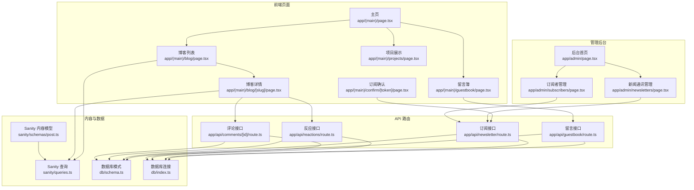
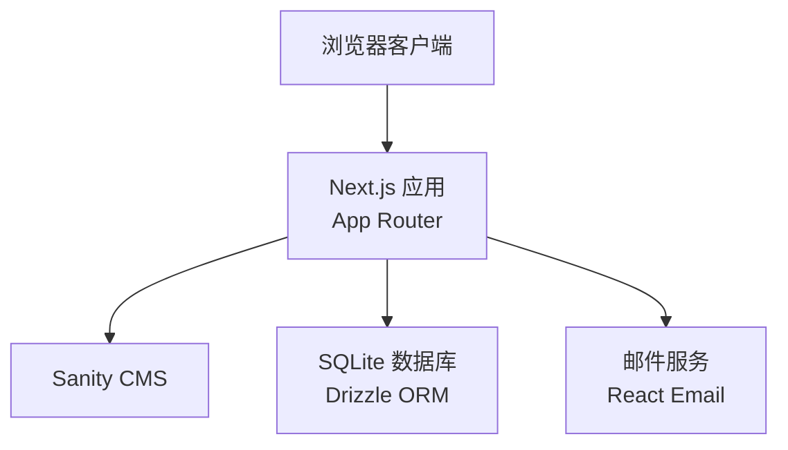
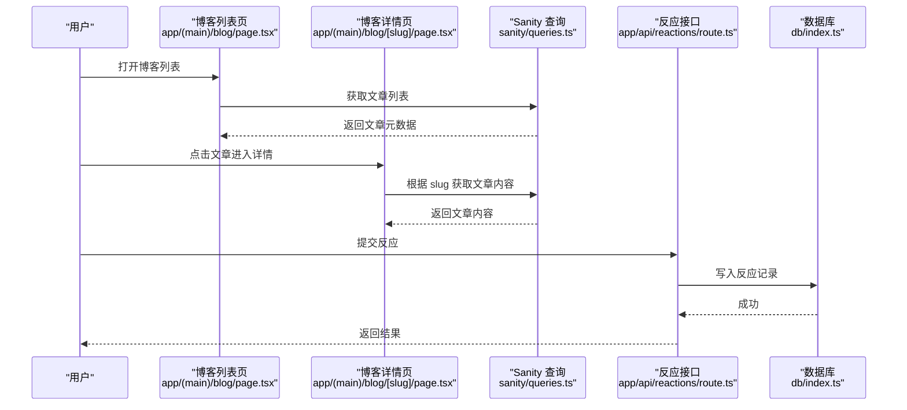
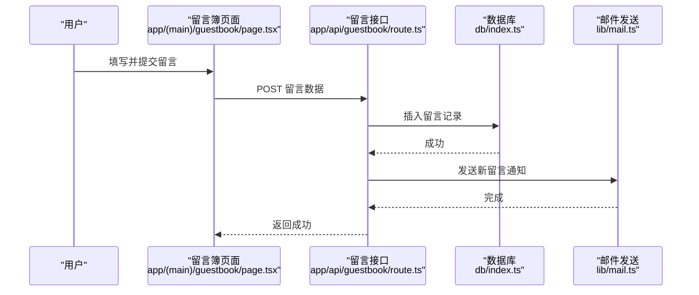
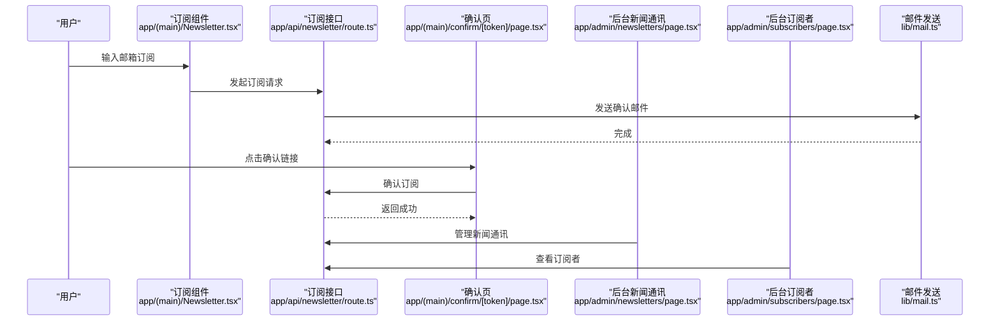
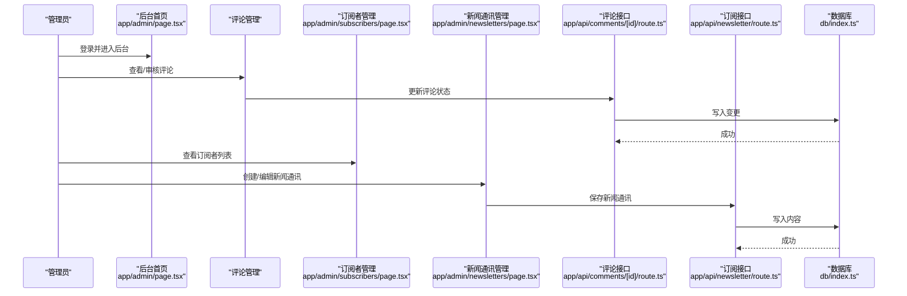
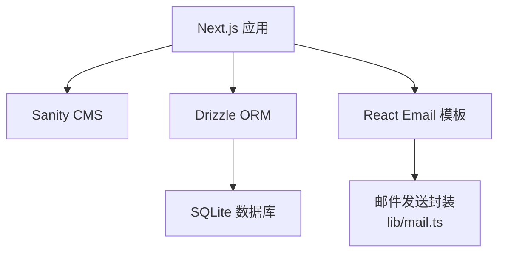

# 项目概述

<cite>
**本文引用的文件**   
- [README.md](file://README.md)
- [package.json](file://package.json)
- [next.config.mjs](file://next.config.mjs)
- [middleware.ts](file://middleware.ts)
- [app/layout.tsx](file://app/layout.tsx)
- [app/(main)/layout.tsx](file://app/(main)/layout.tsx)
- [app/(main)/page.tsx](file://app/(main)/page.tsx)
- [app/(main)/blog/page.tsx](file://app/(main)/blog/page.tsx)
- [app/(main)/blog/[slug]/page.tsx](file://app/(main)/blog/[slug]/page.tsx)
- [app/(main)/guestbook/page.tsx](file://app/(main)/guestbook/page.tsx)
- [app/(main)/projects/page.tsx](file://app/(main)/projects/page.tsx)
- [app/(main)/newsletter.tsx](file://app/(main)/Newsletter.tsx)
- [app/(main)/confirm/[token]/page.tsx](file://app/(main)/confirm/[token]/page.tsx)
- [app/admin/page.tsx](file://app/admin/page.tsx)
- [app/admin/newsletters/page.tsx](file://app/admin/newsletters/page.tsx)
- [app/admin/subscribers/page.tsx](file://app/admin/subscribers/page.tsx)
- [app/api/guestbook/route.ts](file://app/api/guestbook/route.ts)
- [app/api/newsletter/route.ts](file://app/api/newsletter/route.ts)
- [app/api/reactions/route.ts](file://app/api/reactions/route.ts)
- [app/api/comments/[id]/route.ts](file://app/api/comments/[id]/route.ts)
- [db/schema.ts](file://db/schema.ts)
- [db/index.ts](file://db/index.ts)
- [sanity/schemas/post.ts](file://sanity/schemas/post.ts)
- [sanity/queries.ts](file://sanity/queries.ts)
- [lib/mail.ts](file://lib/mail.ts)
- [emails/index.tsx](file://emails/index.tsx)
</cite>

## 目录
1. [简介](#简介)
2. [项目结构](#项目结构)
3. [核心组件](#核心组件)
4. [架构总览](#架构总览)
5. [详细组件分析](#详细组件分析)
6. [依赖关系分析](#依赖关系分析)
7. [性能考量](#性能考量)
8. [故障排查指南](#故障排查指南)
9. [结论](#结论)
10. [附录](#附录)

## 简介
本项目是 cali.so 个人博客与内容管理平台的现代化全栈应用，基于 Next.js 构建，提供以下核心能力：
- 博客系统：文章列表、详情渲染、目录导航、阅读时长统计、反应（点赞等）互动。
- 访客留言簿：留言发布、展示、邮件通知。
- 项目管理展示：项目卡片与页面聚合。
- 新闻通讯订阅：订阅确认、订阅者管理、后台编辑与发送。
- 管理后台：评论管理、订阅者管理、新闻通讯创建与管理。
- 站点基础能力：主题切换、SEO、Sitemap、RSS、静态资源与图标。

设计理念强调“以内容为中心”的现代化体验：前后端一体化开发、可组合的 UI 组件、通过 Sanity 进行结构化内容建模、使用 Drizzle ORM 管理用户态数据（如留言、订阅），并通过 API Routes 暴露必要的服务端能力。

技术选型理由：
- Next.js：提供 App Router、服务端渲染与静态生成、API Routes、中间件等现代 Web 能力。
- Sanity：作为无头 CMS，提供灵活的内容模型与可视化编辑器，适合博客与项目内容。
- Drizzle ORM + SQLite：轻量、类型安全的数据访问层，便于本地开发与部署。
- React Email：在 Node 环境中渲染邮件模板，支持订阅确认与通知邮件。
- Tailwind CSS：原子化样式方案，提升样式一致性与开发效率。

系统边界与外部集成：
- 内容源：Sanity（博客、项目、设置等）。
- 用户态数据：Drizzle + SQLite（留言、订阅、评论等）。
- 邮件服务：通过 lib/mail.ts 与 emails 模板驱动。
- 认证与会话：由中间件与路由组织控制（具体策略见中间件与路由实现）。

[本节为概念性介绍，不直接分析具体文件]

## 项目结构
整体采用 Next.js App Router 的结构化组织方式：
- app 目录：页面、布局、API 路由、管理后台与工作室入口。
- components：通用 UI 与业务组件（如 Markdown 渲染、头像、链接等）。
- sanity：CMS 内容模型、查询与插件配置。
- db：数据库模式定义、迁移与查询封装。
- emails：邮件模板与渲染入口。
- lib：工具函数与第三方库封装（SEO、日期、图片、验证等）。
- assets：图标与静态资源。

图表来源
- [app/(main)/page.tsx](file://app/(main)/page.tsx)
- [app/(main)/blog/page.tsx](file://app/(main)/blog/page.tsx)
- [app/(main)/blog/[slug]/page.tsx](file://app/(main)/blog/[slug]/page.tsx)
- [app/(main)/guestbook/page.tsx](file://app/(main)/guestbook/page.tsx)
- [app/(main)/projects/page.tsx](file://app/(main)/projects/page.tsx)
- [app/(main)/confirm/[token]/page.tsx](file://app/(main)/confirm/[token]/page.tsx)
- [app/admin/page.tsx](file://app/admin/page.tsx)
- [app/admin/newsletters/page.tsx](file://app/admin/newsletters/page.tsx)
- [app/admin/subscribers/page.tsx](file://app/admin/subscribers/page.tsx)
- [app/api/guestbook/route.ts](file://app/api/guestbook/route.ts)
- [app/api/newsletter/route.ts](file://app/api/newsletter/route.ts)
- [app/api/reactions/route.ts](file://app/api/reactions/route.ts)
- [app/api/comments/[id]/route.ts](file://app/api/comments/[id]/route.ts)
- [sanity/schemas/post.ts](file://sanity/schemas/post.ts)
- [sanity/queries.ts](file://sanity/queries.ts)
- [db/schema.ts](file://db/schema.ts)
- [db/index.ts](file://db/index.ts)

章节来源
- [README.md](file://README.md)
- [package.json](file://package.json)
- [next.config.mjs](file://next.config.mjs)
- [app/layout.tsx](file://app/layout.tsx)
- [app/(main)/layout.tsx](file://app/(main)/layout.tsx)

## 核心组件
- 博客模块
  - 功能：文章列表、分页、详情页渲染、目录导航、阅读时长、反应与评论。
  - 数据来源：Sanity 内容模型与查询；部分状态由客户端组件维护。
  - 关键路径：
    - 列表页：[app/(main)/blog/page.tsx](file://app/(main)/blog/page.tsx)
    - 详情页：[app/(main)/blog/[slug]/page.tsx](file://app/(main)/blog/[slug]/page.tsx)
    - 内容模型：[sanity/schemas/post.ts](file://sanity/schemas/post.ts)
    - 查询封装：[sanity/queries.ts](file://sanity/queries.ts)
- 访客留言簿
  - 功能：提交留言、展示留言、邮件通知。
  - 数据存储：Drizzle Schema 与 SQLite。
  - 关键路径：
    - 页面：[app/(main)/guestbook/page.tsx](file://app/(main)/guestbook/page.tsx)
    - API：[app/api/guestbook/route.ts](file://app/api/guestbook/route.ts)
    - 数据模式：[db/schema.ts](file://db/schema.ts)
    - 数据库连接：[db/index.ts](file://db/index.ts)
- 项目管理展示
  - 功能：项目卡片与页面聚合。
  - 关键路径：[app/(main)/projects/page.tsx](file://app/(main)/projects/page.tsx)
- 新闻通讯订阅
  - 功能：订阅入口、确认页、订阅者管理、后台编辑与发送。
  - 关键路径：
    - 订阅入口组件：[app/(main)/Newsletter.tsx](file://app/(main)/Newsletter.tsx)
    - 确认页：[app/(main)/confirm/[token]/page.tsx](file://app/(main)/confirm/[token]/page.tsx)
    - API：[app/api/newsletter/route.ts](file://app/api/newsletter/route.ts)
    - 邮件模板：[emails/index.tsx](file://emails/index.tsx)
    - 邮件发送封装：[lib/mail.ts](file://lib/mail.ts)
- 管理后台
  - 功能：评论管理、订阅者管理、新闻通讯创建与管理。
  - 关键路径：
    - 后台首页：[app/admin/page.tsx](file://app/admin/page.tsx)
    - 新闻通讯管理：[app/admin/newsletters/page.tsx](file://app/admin/newsletters/page.tsx)
    - 订阅者管理：[app/admin/subscribers/page.tsx](file://app/admin/subscribers/page.tsx)

章节来源
- [app/(main)/blog/page.tsx](file://app/(main)/blog/page.tsx)
- [app/(main)/blog/[slug]/page.tsx](file://app/(main)/blog/[slug]/page.tsx)
- [sanity/schemas/post.ts](file://sanity/schemas/post.ts)
- [sanity/queries.ts](file://sanity/queries.ts)
- [app/(main)/guestbook/page.tsx](file://app/(main)/guestbook/page.tsx)
- [app/api/guestbook/route.ts](file://app/api/guestbook/route.ts)
- [db/schema.ts](file://db/schema.ts)
- [db/index.ts](file://db/index.ts)
- [app/(main)/projects/page.tsx](file://app/(main)/projects/page.tsx)
- [app/(main)/Newsletter.tsx](file://app/(main)/Newsletter.tsx)
- [app/(main)/confirm/[token]/page.tsx](file://app/(main)/confirm/[token]/page.tsx)
- [app/api/newsletter/route.ts](file://app/api/newsletter/route.ts)
- [emails/index.tsx](file://emails/index.tsx)
- [lib/mail.ts](file://lib/mail.ts)
- [app/admin/page.tsx](file://app/admin/page.tsx)
- [app/admin/newsletters/page.tsx](file://app/admin/newsletters/page.tsx)
- [app/admin/subscribers/page.tsx](file://app/admin/subscribers/page.tsx)

## 架构总览
系统采用“前端页面 + API 路由 + 内容管理 + 数据持久化”的分层架构：
- 表现层：Next.js 页面与组件，负责渲染与交互。
- 服务层：API 路由处理业务逻辑（留言、订阅、反应、评论等）。
- 内容层：Sanity 提供结构化内容与可视化编辑。
- 数据层：Drizzle ORM 与 SQLite 存储用户态数据。
- 邮件层：React Email 模板与邮件发送封装。

图表来源
- [next.config.mjs](file://next.config.mjs)
- [sanity/schemas/post.ts](file://sanity/schemas/post.ts)
- [db/schema.ts](file://db/schema.ts)
- [emails/index.tsx](file://emails/index.tsx)

## 详细组件分析

### 博客模块
- 设计要点
  - 列表页与详情页分离，详情页支持目录导航与阅读时长。
  - 内容来自 Sanity，查询封装集中管理。
  - 反应与评论通过 API 路由与数据库交互。
- 关键流程（序列图）

图表来源
- [app/(main)/blog/page.tsx](file://app/(main)/blog/page.tsx)
- [app/(main)/blog/[slug]/page.tsx](file://app/(main)/blog/[slug]/page.tsx)
- [sanity/queries.ts](file://sanity/queries.ts)
- [app/api/reactions/route.ts](file://app/api/reactions/route.ts)
- [db/index.ts](file://db/index.ts)

章节来源
- [app/(main)/blog/page.tsx](file://app/(main)/blog/page.tsx)
- [app/(main)/blog/[slug]/page.tsx](file://app/(main)/blog/[slug]/page.tsx)
- [sanity/queries.ts](file://sanity/queries.ts)
- [app/api/reactions/route.ts](file://app/api/reactions/route.ts)
- [db/index.ts](file://db/index.ts)

### 访客留言簿
- 设计要点
  - 表单提交到 API 路由，落库后触发邮件通知。
  - 数据模型包含基本字段与时间戳。
- 关键流程（序列图）

图表来源
- [app/(main)/guestbook/page.tsx](file://app/(main)/guestbook/page.tsx)
- [app/api/guestbook/route.ts](file://app/api/guestbook/route.ts)
- [db/index.ts](file://db/index.ts)
- [lib/mail.ts](file://lib/mail.ts)

章节来源
- [app/(main)/guestbook/page.tsx](file://app/(main)/guestbook/page.tsx)
- [app/api/guestbook/route.ts](file://app/api/guestbook/route.ts)
- [db/index.ts](file://db/index.ts)
- [lib/mail.ts](file://lib/mail.ts)

### 新闻通讯订阅
- 设计要点
  - 订阅入口组件嵌入主页或侧边栏。
  - 确认页通过 token 完成订阅确认。
  - 后台提供订阅者管理与新闻通讯编辑。
- 关键流程（序列图）

图表来源
- [app/(main)/Newsletter.tsx](file://app/(main)/Newsletter.tsx)
- [app/api/newsletter/route.ts](file://app/api/newsletter/route.ts)
- [app/(main)/confirm/[token]/page.tsx](file://app/(main)/confirm/[token]/page.tsx)
- [app/admin/newsletters/page.tsx](file://app/admin/newsletters/page.tsx)
- [app/admin/subscribers/page.tsx](file://app/admin/subscribers/page.tsx)
- [lib/mail.ts](file://lib/mail.ts)

章节来源
- [app/(main)/Newsletter.tsx](file://app/(main)/Newsletter.tsx)
- [app/api/newsletter/route.ts](file://app/api/newsletter/route.ts)
- [app/(main)/confirm/[token]/page.tsx](file://app/(main)/confirm/[token]/page.tsx)
- [app/admin/newsletters/page.tsx](file://app/admin/newsletters/page.tsx)
- [app/admin/subscribers/page.tsx](file://app/admin/subscribers/page.tsx)
- [lib/mail.ts](file://lib/mail.ts)

### 管理后台
- 设计要点
  - 后台页面集中在 admin 路由下，提供评论、订阅者与新闻通讯的管理能力。
  - 与 API 路由协作完成数据操作。
- 关键流程（序列图）

图表来源
- [app/admin/page.tsx](file://app/admin/page.tsx)
- [app/admin/subscribers/page.tsx](file://app/admin/subscribers/page.tsx)
- [app/admin/newsletters/page.tsx](file://app/admin/newsletters/page.tsx)
- [app/api/comments/[id]/route.ts](file://app/api/comments/[id]/route.ts)
- [app/api/newsletter/route.ts](file://app/api/newsletter/route.ts)
- [db/index.ts](file://db/index.ts)

章节来源
- [app/admin/page.tsx](file://app/admin/page.tsx)
- [app/admin/subscribers/page.tsx](file://app/admin/subscribers/page.tsx)
- [app/admin/newsletters/page.tsx](file://app/admin/newsletters/page.tsx)
- [app/api/comments/[id]/route.ts](file://app/api/comments/[id]/route.ts)
- [app/api/newsletter/route.ts](file://app/api/newsletter/route.ts)
- [db/index.ts](file://db/index.ts)

## 依赖关系分析
- 框架与运行时
  - Next.js：应用骨架、路由、SSR/SSG、API Routes、中间件。
  - Tailwind CSS：样式体系。
- 内容管理
  - Sanity：内容模型与查询。
- 数据持久化
  - Drizzle ORM + SQLite：用户态数据表结构与连接。
- 邮件
  - React Email 模板与邮件发送封装。
- 其他
  - 工具库：SEO、日期、图片、验证等。

图表来源
- [next.config.mjs](file://next.config.mjs)
- [sanity/schemas/post.ts](file://sanity/schemas/post.ts)
- [db/schema.ts](file://db/schema.ts)
- [db/index.ts](file://db/index.ts)
- [emails/index.tsx](file://emails/index.tsx)
- [lib/mail.ts](file://lib/mail.ts)

章节来源
- [package.json](file://package.json)
- [next.config.mjs](file://next.config.mjs)
- [sanity/schemas/post.ts](file://sanity/schemas/post.ts)
- [db/schema.ts](file://db/schema.ts)
- [db/index.ts](file://db/index.ts)
- [emails/index.tsx](file://emails/index.tsx)
- [lib/mail.ts](file://lib/mail.ts)

## 性能考量
- 渲染策略
  - 博客列表与详情页可采用静态生成或服务端渲染，结合增量再生成减少首屏延迟。
- 缓存与预取
  - 对热点内容（如首页、热门博客）启用缓存与预取。
- 图片优化
  - 使用 Next.js 图片优化与 CDN 加速。
- 数据库访问
  - 合理索引与查询优化，避免 N+1 问题。
- 邮件发送
  - 异步队列或批处理，避免阻塞主请求链路。

[本节为通用指导，不直接分析具体文件]

## 故障排查指南
- 常见问题定位
  - 博客内容无法加载：检查 Sanity 查询与网络连通性。
  - 留言提交失败：检查 API 路由错误日志与数据库连接。
  - 订阅确认无效：检查 token 校验逻辑与邮件送达情况。
  - 后台数据不同步：核对 API 路由与数据库事务一致性。
- 建议步骤
  - 开启详细日志输出，定位异常堆栈。
  - 使用环境变量隔离测试与生产配置。
  - 对关键接口编写最小复现用例。

[本节为通用指导，不直接分析具体文件]

## 结论
本项目以 Next.js 为核心，结合 Sanity 与 Drizzle ORM，构建了覆盖博客、留言、项目展示、新闻通讯与管理后台的一体化平台。其模块化设计与清晰的职责划分，既满足初学者快速上手的需求，也为有经验的开发者提供了可扩展的技术深度。

[本节为总结性内容，不直接分析具体文件]

## 附录
- 术语对照
  - App Router：Next.js 的路由与页面组织方式。
  - API Routes：服务端接口实现位置。
  - 内容模型：Sanity 中用于描述内容的结构定义。
  - 数据模式：Drizzle 中用于描述数据库表结构的定义。
  - 邮件模板：React Email 定义的邮件渲染模板。

[本节为概念性说明，不直接分析具体文件]