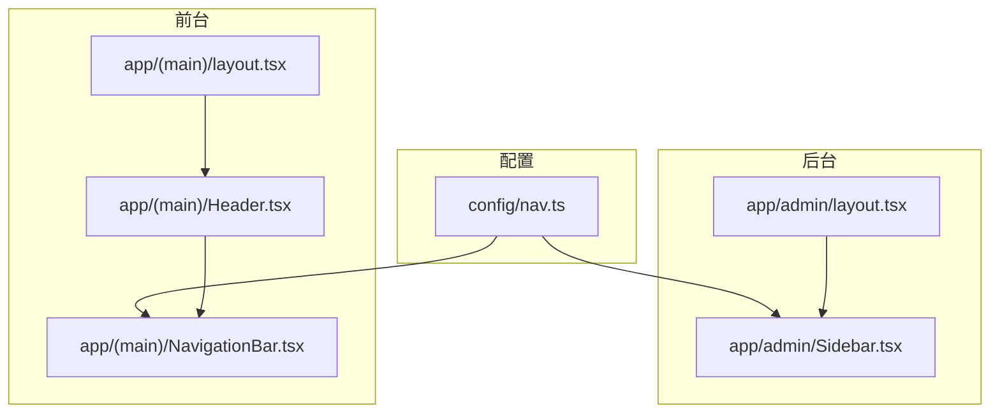
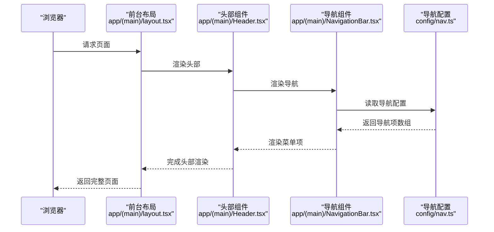
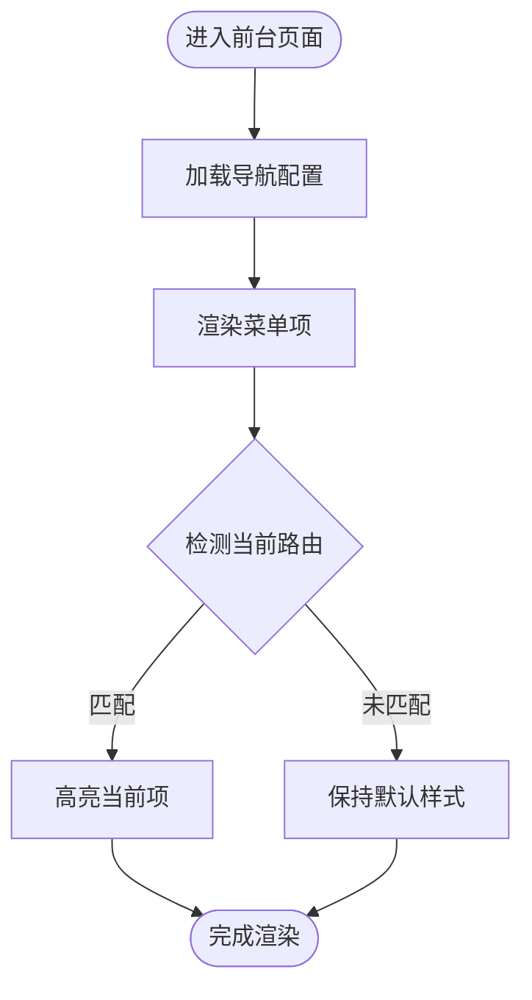
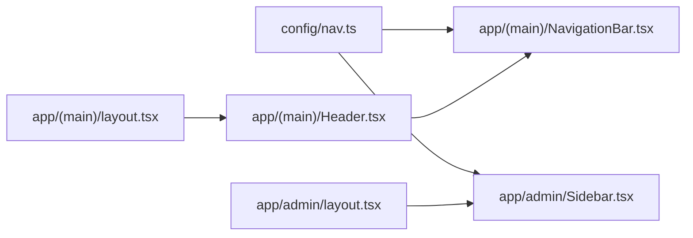

# 导航配置

<cite>
**本文引用的文件**   
- [config/nav.ts](file://config/nav.ts)
- [app/(main)/NavigationBar.tsx](file://app/(main)/NavigationBar.tsx)
- [app/(main)/layout.tsx](file://app/(main)/layout.tsx)
- [app/layout.tsx](file://app/layout.tsx)
- [app/(main)/Header.tsx](file://app/(main)/Header.tsx)
- [app/admin/Sidebar.tsx](file://app/admin/Sidebar.tsx)
- [app/admin/layout.tsx](file://app/admin/layout.tsx)
</cite>

## 目录
1. [简介](#简介)
2. [项目结构](#项目结构)
3. [核心组件](#核心组件)
4. [架构总览](#架构总览)
5. [详细组件分析](#详细组件分析)
6. [依赖分析](#依赖分析)
7. [性能考虑](#性能考虑)
8. [故障排查指南](#故障排查指南)
9. [结论](#结论)
10. [附录](#附录)

## 简介
本文件聚焦于“导航配置”的体系化说明，覆盖站点主导航与后台管理侧边栏的配置来源、渲染流程、数据流向与扩展方式。目标是帮助读者快速理解：
- 导航项的数据模型与来源
- 前端如何消费配置并渲染导航
- 不同布局（前台/后台）下的导航差异
- 常见问题定位与优化建议

## 项目结构
导航相关的关键位置如下：
- 配置层：集中定义导航数据结构与默认项
- 展示层：前台页面头部导航与后台侧边栏
- 布局层：将导航嵌入到对应布局中，确保全局可见

图示来源
- [config/nav.ts](file://config/nav.ts)
- [app/(main)/NavigationBar.tsx](file://app/(main)/NavigationBar.tsx)
- [app/(main)/layout.tsx](file://app/(main)/layout.tsx)
- [app/(main)/Header.tsx](file://app/(main)/Header.tsx)
- [app/admin/Sidebar.tsx](file://app/admin/Sidebar.tsx)
- [app/admin/layout.tsx](file://app/admin/layout.tsx)

章节来源
- [config/nav.ts](file://config/nav.ts)
- [app/(main)/NavigationBar.tsx](file://app/(main)/NavigationBar.tsx)
- [app/(main)/layout.tsx](file://app/(main)/layout.tsx)
- [app/(main)/Header.tsx](file://app/(main)/Header.tsx)
- [app/admin/Sidebar.tsx](file://app/admin/Sidebar.tsx)
- [app/admin/layout.tsx](file://app/admin/layout.tsx)

## 核心组件
- 导航配置中心：提供统一的导航项数据结构与默认值，供前台与后台共同消费
- 前台导航栏：读取配置并渲染为顶部导航菜单，支持当前路由高亮、外链跳转等
- 后台侧边栏：复用或独立维护一套导航配置，用于后台功能入口组织

章节来源
- [config/nav.ts](file://config/nav.ts)
- [app/(main)/NavigationBar.tsx](file://app/(main)/NavigationBar.tsx)
- [app/admin/Sidebar.tsx](file://app/admin/Sidebar.tsx)

## 架构总览
导航从配置到渲染的整体流程如下：

图示来源
- [app/(main)/layout.tsx](file://app/(main)/layout.tsx)
- [app/(main)/Header.tsx](file://app/(main)/Header.tsx)
- [app/(main)/NavigationBar.tsx](file://app/(main)/NavigationBar.tsx)
- [config/nav.ts](file://config/nav.ts)

## 详细组件分析

### 导航配置模块（config/nav.ts）
职责
- 定义导航项的数据结构（如标题、路径、是否外链、分组等）
- 提供默认导航集合，便于前台与后台统一消费
- 可导出过滤/排序/合并等工具函数，支撑多端差异化展示

设计要点
- 单一事实来源：所有导航项应来自该模块，避免分散维护
- 可扩展性：通过新增字段或分组实现复杂场景（如权限控制、角色可见性）
- 类型安全：使用 TypeScript 接口约束导航项结构

章节来源
- [config/nav.ts](file://config/nav.ts)

### 前台导航栏（app/(main)/NavigationBar.tsx）
职责
- 消费导航配置，渲染为顶部导航菜单
- 根据当前路由高亮当前项
- 处理外链与内部路由跳转

交互流程

图示来源
- [app/(main)/NavigationBar.tsx](file://app/(main)/NavigationBar.tsx)
- [config/nav.ts](file://config/nav.ts)

章节来源
- [app/(main)/NavigationBar.tsx](file://app/(main)/NavigationBar.tsx)
- [config/nav.ts](file://config/nav.ts)

### 前台布局与头部（app/(main)/layout.tsx 与 app/(main)/Header.tsx）
职责
- layout.tsx：作为前台根布局，注入通用上下文与导航容器
- Header.tsx：组合品牌标识、搜索、主题切换与导航栏

协作关系
- layout.tsx 引入 Header.tsx
- Header.tsx 引入 NavigationBar.tsx
- NavigationBar.tsx 读取 config/nav.ts

章节来源
- [app/(main)/layout.tsx](file://app/(main)/layout.tsx)
- [app/(main)/Header.tsx](file://app/(main)/Header.tsx)
- [app/(main)/NavigationBar.tsx](file://app/(main)/NavigationBar.tsx)
- [config/nav.ts](file://config/nav.ts)

### 后台侧边栏（app/admin/Sidebar.tsx 与 app/admin/layout.tsx）
职责
- Sidebar.tsx：渲染后台导航，通常基于独立的后台导航配置或复用公共配置
- admin/layout.tsx：作为后台根布局，包裹 Sidebar 与内容区域

注意事项
- 后台导航可能涉及权限控制与动态显示
- 若复用公共配置，需在前端进行过滤或映射

章节来源
- [app/admin/Sidebar.tsx](file://app/admin/Sidebar.tsx)
- [app/admin/layout.tsx](file://app/admin/layout.tsx)
- [config/nav.ts](file://config/nav.ts)

## 依赖分析
导航相关模块之间的依赖关系如下：

图示来源
- [config/nav.ts](file://config/nav.ts)
- [app/(main)/NavigationBar.tsx](file://app/(main)/NavigationBar.tsx)
- [app/(main)/layout.tsx](file://app/(main)/layout.tsx)
- [app/(main)/Header.tsx](file://app/(main)/Header.tsx)
- [app/admin/Sidebar.tsx](file://app/admin/Sidebar.tsx)
- [app/admin/layout.tsx](file://app/admin/layout.tsx)

章节来源
- [config/nav.ts](file://config/nav.ts)
- [app/(main)/NavigationBar.tsx](file://app/(main)/NavigationBar.tsx)
- [app/(main)/layout.tsx](file://app/(main)/layout.tsx)
- [app/(main)/Header.tsx](file://app/(main)/Header.tsx)
- [app/admin/Sidebar.tsx](file://app/admin/Sidebar.tsx)
- [app/admin/layout.tsx](file://app/admin/layout.tsx)

## 性能考虑
- 配置静态化：导航配置应为纯数据且可被静态导入，避免运行时计算造成首屏延迟
- 减少重渲染：导航项数量较大时，可使用列表虚拟化或按需渲染策略
- 路由高亮优化：在客户端路由变化时仅更新高亮状态，避免整棵导航树重新渲染
- 外链与内链区分：外链直接 a 标签，内链使用框架路由组件，避免不必要的刷新

## 故障排查指南
常见问题与定位步骤
- 导航不显示
  - 检查配置文件是否正确导出
  - 确认前台/后台布局是否引入了对应导航组件
  - 查看控制台是否有类型错误或导入失败
- 当前路由未高亮
  - 核对当前路径与配置项路径是否一致
  - 检查路由监听逻辑是否触发
- 外链无法打开
  - 确认外链字段与 target 属性设置
  - 检查是否存在跨域或安全策略限制
- 后台导航异常
  - 确认后台布局是否正确挂载侧边栏
  - 若有权限控制，检查用户状态与过滤逻辑

章节来源
- [app/(main)/NavigationBar.tsx](file://app/(main)/NavigationBar.tsx)
- [app/admin/Sidebar.tsx](file://app/admin/Sidebar.tsx)
- [config/nav.ts](file://config/nav.ts)

## 结论
通过将导航配置集中在单一模块，并在前台与后台分别消费，既能保证一致性，又便于扩展与维护。建议在后续迭代中：
- 完善导航项的类型定义与校验
- 增加后台权限控制与动态渲染能力
- 对大型导航进行性能优化与可访问性增强

## 附录
- 如需新增导航项，优先在配置模块中添加，再在前台/后台相应组件中自动生效
- 若需要按角色或环境展示不同导航，可在配置层增加字段并在消费层进行过滤