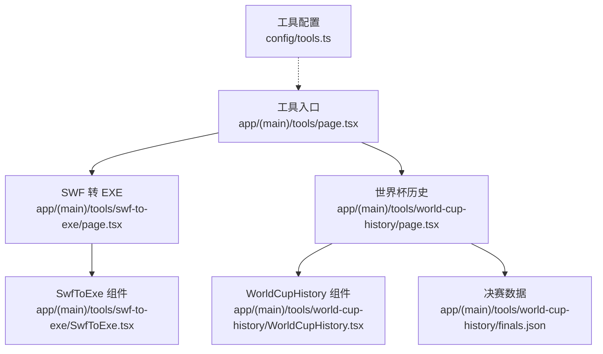
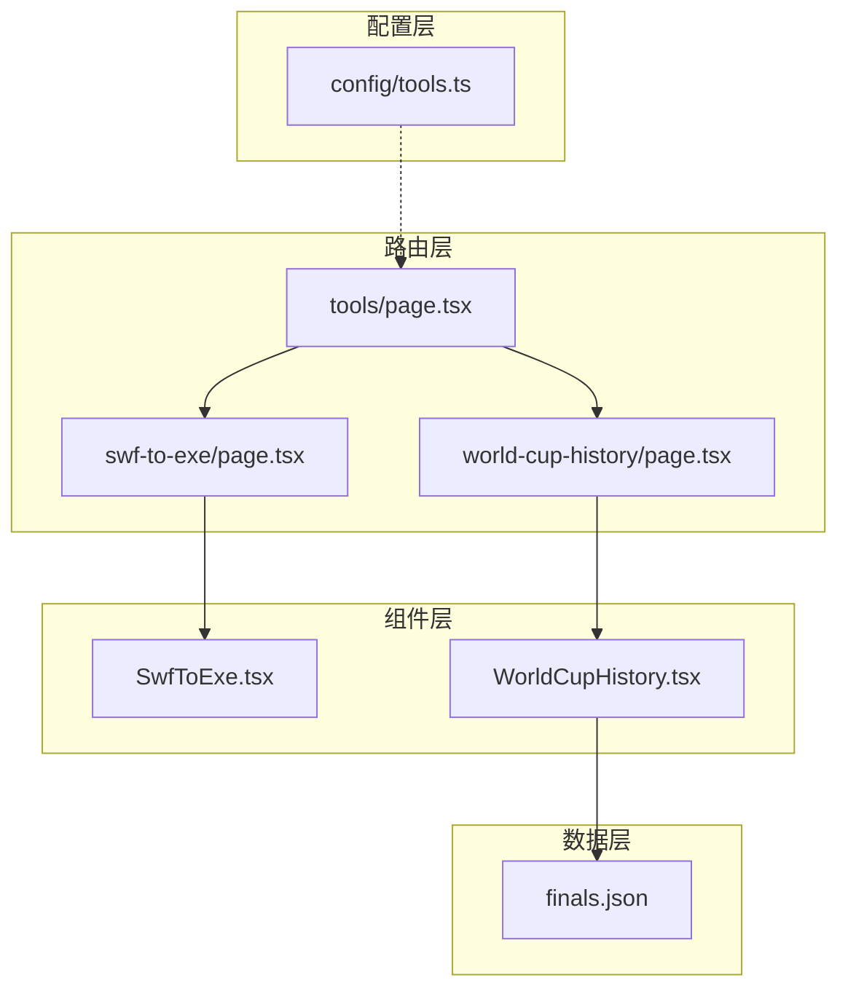
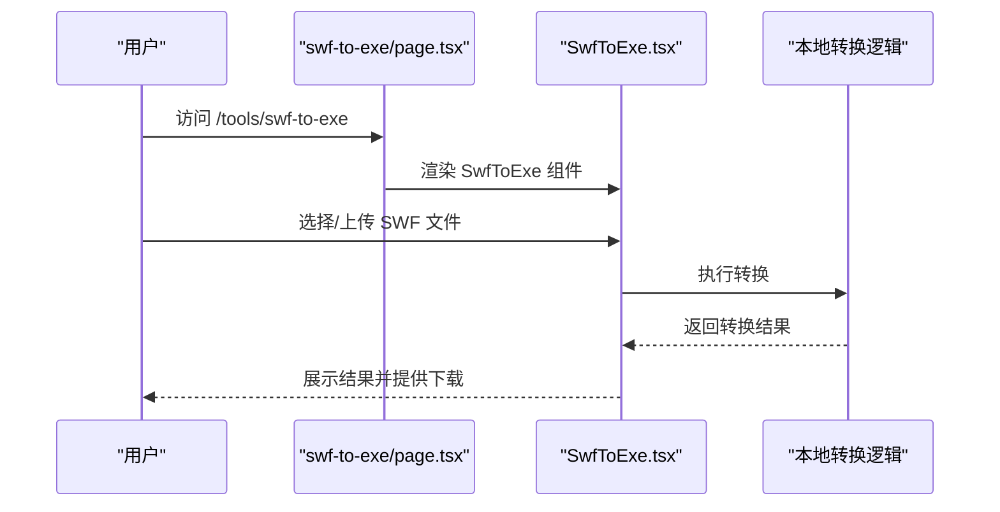
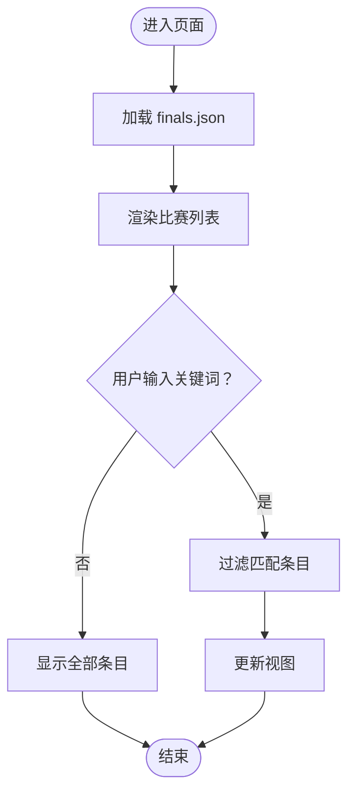
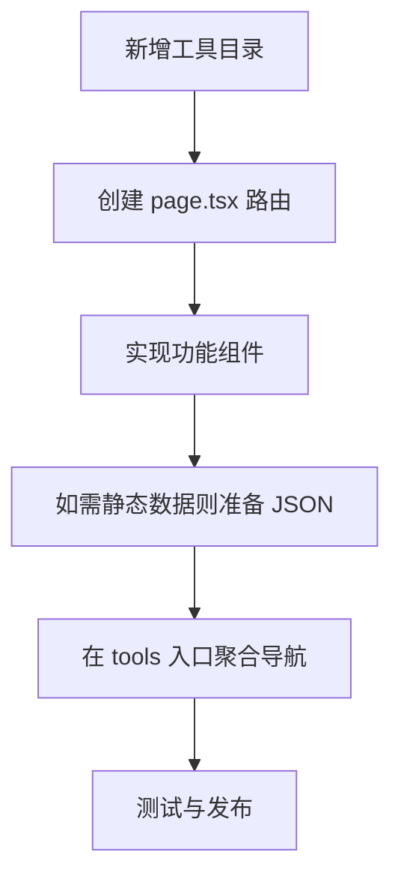
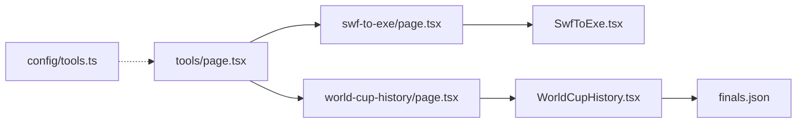

# 工具系统

<cite>
**本文引用的文件**   
- [app/(main)/tools/page.tsx](file://app/(main)/tools/page.tsx)
- [app/(main)/tools/swf-to-exe/page.tsx](file://app/(main)/tools/swf-to-exe/page.tsx)
- [app/(main)/tools/swf-to-exe/SwfToExe.tsx](file://app/(main)/tools/swf-to-exe/SwfToExe.tsx)
- [app/(main)/tools/world-cup-history/page.tsx](file://app/(main)/tools/world-cup-history/page.tsx)
- [app/(main)/tools/world-cup-history/WorldCupHistory.tsx](file://app/(main)/tools/world-cup-history/WorldCupHistory.tsx)
- [app/(main)/tools/world-cup-history/finals.json](file://app/(main)/tools/world-cup-history/finals.json)
- [config/tools.ts](file://config/tools.ts)
</cite>

## 目录
1. [简介](#简介)
2. [项目结构](#项目结构)
3. [核心组件](#核心组件)
4. [架构总览](#架构总览)
5. [详细组件分析](#详细组件分析)
6. [依赖关系分析](#依赖关系分析)
7. [性能考虑](#性能考虑)
8. [故障排查指南](#故障排查指南)
9. [结论](#结论)
10. [附录](#附录)

## 简介
本章节概述“工具系统”的目标与范围。该子应用位于站点导航的“工具”入口下，提供若干轻量级前端工具页面，包括：
- SWF 转 EXE 工具：用于将 SWF 资源转换为可执行格式（具体转换逻辑由对应页面实现）
- 世界杯历史查询：基于内置数据展示历届决赛信息

整体采用 Next.js App Router 组织路由与页面，UI 使用 React 组件，静态数据以 JSON 形式内嵌，便于快速加载与离线展示。

## 项目结构
工具系统的路由与页面集中在 app/(main)/tools 目录下，每个工具为一个独立子目录，包含页面路由与对应的 UI 组件。配置层通过 config/tools.ts 维护工具的元信息与导航项。

图表来源
- [app/(main)/tools/page.tsx](file://app/(main)/tools/page.tsx)
- [app/(main)/tools/swf-to-exe/page.tsx](file://app/(main)/tools/swf-to-exe/page.tsx)
- [app/(main)/tools/swf-to-exe/SwfToExe.tsx](file://app/(main)/tools/swf-to-exe/SwfToExe.tsx)
- [app/(main)/tools/world-cup-history/page.tsx](file://app/(main)/tools/world-cup-history/page.tsx)
- [app/(main)/tools/world-cup-history/WorldCupHistory.tsx](file://app/(main)/tools/world-cup-history/WorldCupHistory.tsx)
- [app/(main)/tools/world-cup-history/finals.json](file://app/(main)/tools/world-cup-history/finals.json)
- [config/tools.ts](file://config/tools.ts)

章节来源
- [app/(main)/tools/page.tsx](file://app/(main)/tools/page.tsx)
- [config/tools.ts](file://config/tools.ts)

## 核心组件
本节聚焦工具系统的两个关键页面及其组件：
- SWF 转 EXE 工具：负责上传或选择 SWF 文件并触发转换流程，渲染交互界面与结果反馈
- 世界杯历史查询：加载 finals.json 数据，提供搜索、筛选与列表展示能力

章节来源
- [app/(main)/tools/swf-to-exe/page.tsx](file://app/(main)/tools/swf-to-exe/page.tsx)
- [app/(main)/tools/swf-to-exe/SwfToExe.tsx](file://app/(main)/tools/swf-to-exe/SwfToExe.tsx)
- [app/(main)/tools/world-cup-history/page.tsx](file://app/(main)/tools/world-cup-history/page.tsx)
- [app/(main)/tools/world-cup-history/WorldCupHistory.tsx](file://app/(main)/tools/world-cup-history/WorldCupHistory.tsx)
- [app/(main)/tools/world-cup-history/finals.json](file://app/(main)/tools/world-cup-history/finals.json)

## 架构总览
工具系统遵循“页面路由 + 功能组件”的分层模式：
- 路由层：Next.js App Router 下的 page.tsx 作为页面入口，负责挂载对应功能组件
- 组件层：各工具的功能组件封装业务逻辑与 UI 状态
- 数据层：静态 JSON 数据直接导入，避免运行时网络请求
- 配置层：统一在 config/tools.ts 中维护工具清单与导航项

图表来源
- [app/(main)/tools/page.tsx](file://app/(main)/tools/page.tsx)
- [app/(main)/tools/swf-to-exe/page.tsx](file://app/(main)/tools/swf-to-exe/page.tsx)
- [app/(main)/tools/world-cup-history/page.tsx](file://app/(main)/tools/world-cup-history/page.tsx)
- [app/(main)/tools/swf-to-exe/SwfToExe.tsx](file://app/(main)/tools/swf-to-exe/SwfToExe.tsx)
- [app/(main)/tools/world-cup-history/WorldCupHistory.tsx](file://app/(main)/tools/world-cup-history/WorldCupHistory.tsx)
- [app/(main)/tools/world-cup-history/finals.json](file://app/(main)/tools/world-cup-history/finals.json)
- [config/tools.ts](file://config/tools.ts)

## 详细组件分析

### SWF 转 EXE 工具
该工具提供用户交互界面，支持选择或上传 SWF 文件，并在本地完成转换后输出结果。其职责边界清晰：
- 输入处理：校验文件格式与大小
- 转换流程：调用内部转换逻辑（可能为浏览器端库或 WebAssembly 模块）
- 结果展示：下载链接或预览区域
- 错误处理：捕获异常并提示用户

图表来源
- [app/(main)/tools/swf-to-exe/page.tsx](file://app/(main)/tools/swf-to-exe/page.tsx)
- [app/(main)/tools/swf-to-exe/SwfToExe.tsx](file://app/(main)/tools/swf-to-exe/SwfToExe.tsx)

章节来源
- [app/(main)/tools/swf-to-exe/page.tsx](file://app/(main)/tools/swf-to-exe/page.tsx)
- [app/(main)/tools/swf-to-exe/SwfToExe.tsx](file://app/(main)/tools/swf-to-exe/SwfToExe.tsx)

### 世界杯历史查询
该工具通过导入 finals.json 获取历届决赛数据，并提供搜索与筛选能力。典型流程如下：

图表来源
- [app/(main)/tools/world-cup-history/page.tsx](file://app/(main)/tools/world-cup-history/page.tsx)
- [app/(main)/tools/world-cup-history/WorldCupHistory.tsx](file://app/(main)/tools/world-cup-history/WorldCupHistory.tsx)
- [app/(main)/tools/world-cup-history/finals.json](file://app/(main)/tools/world-cup-history/finals.json)

章节来源
- [app/(main)/tools/world-cup-history/page.tsx](file://app/(main)/tools/world-cup-history/page.tsx)
- [app/(main)/tools/world-cup-history/WorldCupHistory.tsx](file://app/(main)/tools/world-cup-history/WorldCupHistory.tsx)
- [app/(main)/tools/world-cup-history/finals.json](file://app/(main)/tools/world-cup-history/finals.json)

### 概念性概览
下图展示了工具系统的通用工作流，适用于新增工具时的参考：

[此图为概念流程图，不映射到具体源码文件]

## 依赖关系分析
工具系统内部依赖关系较为简单，主要体现为路由到组件的单向依赖，以及组件对静态数据的读取。配置层提供统一的工具清单，便于在入口页生成导航。

图表来源
- [app/(main)/tools/page.tsx](file://app/(main)/tools/page.tsx)
- [app/(main)/tools/swf-to-exe/page.tsx](file://app/(main)/tools/swf-to-exe/page.tsx)
- [app/(main)/tools/world-cup-history/page.tsx](file://app/(main)/tools/world-cup-history/page.tsx)
- [app/(main)/tools/swf-to-exe/SwfToExe.tsx](file://app/(main)/tools/swf-to-exe/SwfToExe.tsx)
- [app/(main)/tools/world-cup-history/WorldCupHistory.tsx](file://app/(main)/tools/world-cup-history/WorldCupHistory.tsx)
- [app/(main)/tools/world-cup-history/finals.json](file://app/(main)/tools/world-cup-history/finals.json)
- [config/tools.ts](file://config/tools.ts)

章节来源
- [app/(main)/tools/page.tsx](file://app/(main)/tools/page.tsx)
- [config/tools.ts](file://config/tools.ts)

## 性能考虑
- 静态数据预取：世界杯历史数据以内置 JSON 方式加载，避免运行时网络开销，首屏渲染更快
- 组件拆分：每个工具独立目录与组件，利于按需加载与维护
- 大文件处理：SWF 转 EXE 涉及二进制数据处理时，建议关注内存占用与分块处理策略，避免主线程阻塞
- 缓存策略：对于频繁访问的工具页面，可利用浏览器缓存与静态资源优化提升体验

## 故障排查指南
- 页面无法加载
  - 检查路由文件是否存在且导出正确
  - 确认组件路径与命名是否一致
- 数据未显示
  - 核对 finals.json 路径是否正确
  - 验证 JSON 结构与字段名是否与组件期望一致
- 转换失败
  - 查看控制台错误日志
  - 确认输入文件格式与大小限制
  - 检查本地转换逻辑是否抛出异常

章节来源
- [app/(main)/tools/swf-to-exe/page.tsx](file://app/(main)/tools/swf-to-exe/page.tsx)
- [app/(main)/tools/swf-to-exe/SwfToExe.tsx](file://app/(main)/tools/swf-to-exe/SwfToExe.tsx)
- [app/(main)/tools/world-cup-history/page.tsx](file://app/(main)/tools/world-cup-history/page.tsx)
- [app/(main)/tools/world-cup-history/WorldCupHistory.tsx](file://app/(main)/tools/world-cup-history/WorldCupHistory.tsx)
- [app/(main)/tools/world-cup-history/finals.json](file://app/(main)/tools/world-cup-history/finals.json)

## 结论
工具系统以清晰的目录结构与组件化设计实现了多个独立的小工具。通过静态数据与页面路由的组合，既保证了良好的用户体验，也降低了运维复杂度。未来可在以下方面持续优化：
- 增加单元测试与集成测试覆盖
- 引入更完善的错误边界与用户提示
- 对大数据量场景进行分页与虚拟滚动优化

## 附录
- 新增工具步骤建议
  - 在 app/(main)/tools 下新建目录
  - 创建 page.tsx 作为路由入口
  - 实现功能组件并处理用户交互
  - 如有静态数据，准备 JSON 并导入
  - 在 tools 入口页添加导航项（如适用）