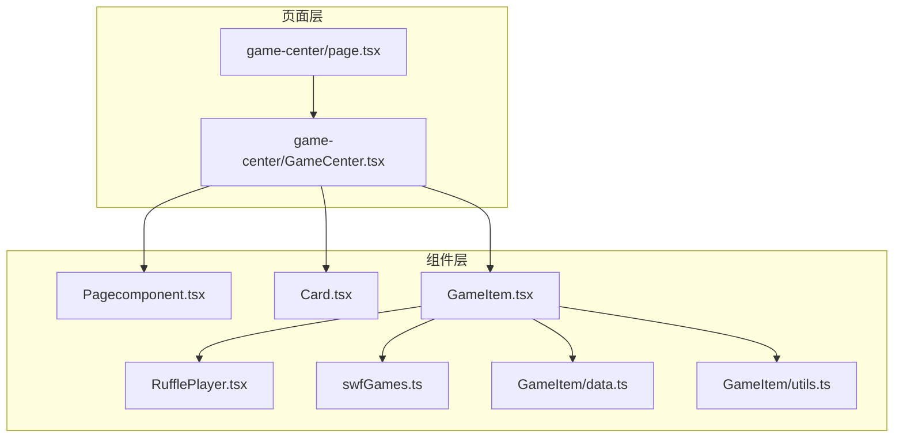
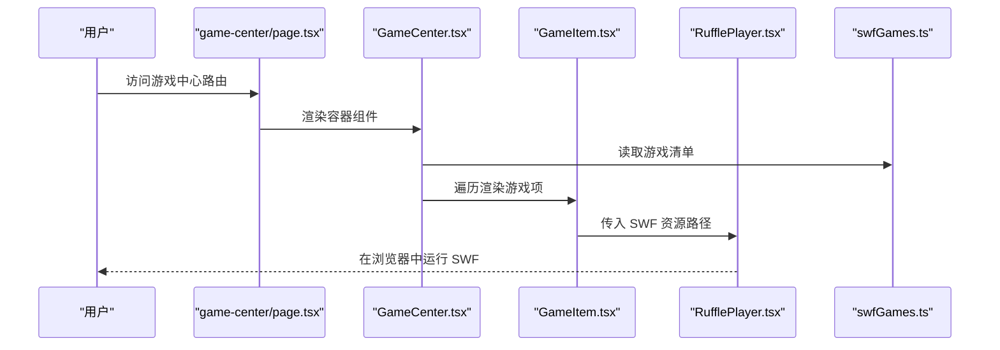
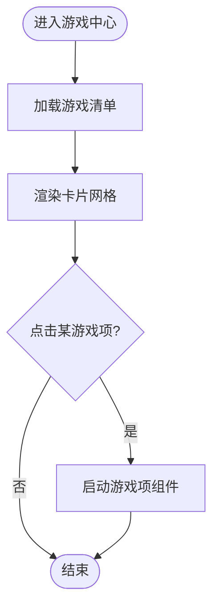
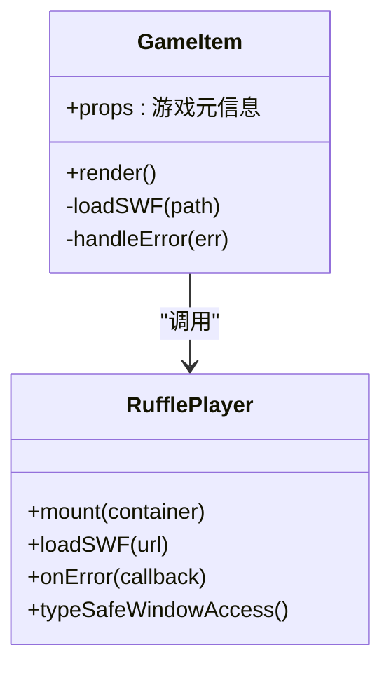
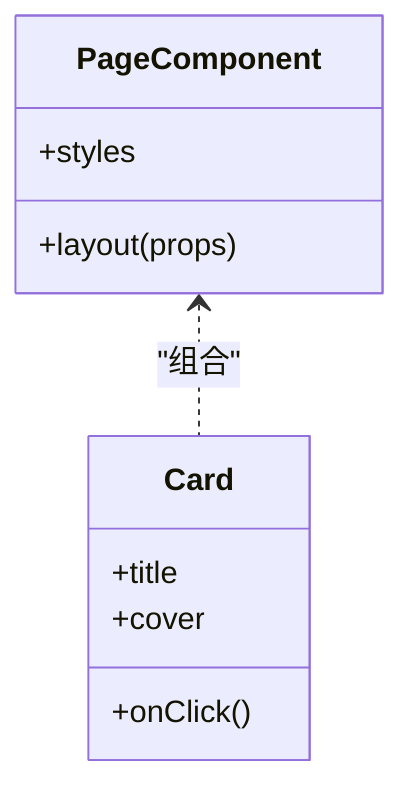
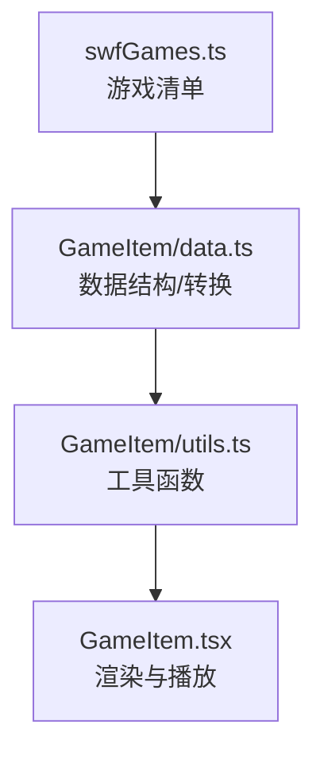
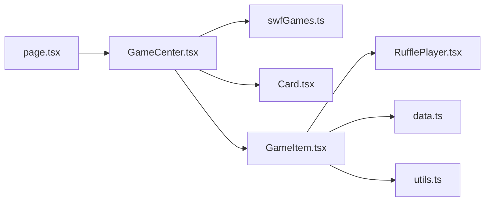

# 游戏中心功能

<cite>
**本文引用的文件**   
- [app/(main)/game-center/page.tsx](file://app/(main)/game-center/page.tsx)
- [app/(main)/game-center/GameCenter.tsx](file://app/(main)/game-center/GameCenter.tsx)
- [components/GameUi/swfGames.ts](file://components/GameUi/swfGames.ts)
- [components/GameUi/RufflePlayer.tsx](file://components/GameUi/RufflePlayer.tsx)
- [components/GameUi/Page/Pagecomponent.tsx](file://components/GameUi/Page/Pagecomponent.tsx)
- [components/GameUi/Card/Card.tsx](file://components/GameUi/Card/Card.tsx)
- [components/GameUi/GameItem/GameItem.tsx](file://components/GameUi/GameItem/GameItem.tsx)
- [components/GameUi/GameItem/data.ts](file://components/GameUi/GameItem/data.ts)
- [components/GameUi/GameItem/utils.ts](file://components/GameUi/GameItem/utils.ts)
</cite>

## 更新摘要
**变更内容**   
- 更新了RufflePlayer组件的类型安全改进说明，修复了window对象的非法类型转换问题
- 增强了TypeScript类型检查兼容性，使用已声明的Window.RufflePlayer类型替代直接类型断言
- 完善了错误处理和类型安全的最佳实践指导

## 目录
1. [简介](#简介)
2. [项目结构](#项目结构)
3. [核心组件](#核心组件)
4. [架构总览](#架构总览)
5. [详细组件分析](#详细组件分析)
6. [依赖关系分析](#依赖关系分析)
7. [性能考虑](#性能考虑)
8. [故障排查指南](#故障排查指南)
9. [结论](#结论)
10. [附录](#附录)

## 简介
本章节面向"游戏中心"功能，聚焦于基于 Next.js 的页面与可复用 UI 组件如何组织、渲染并运行 SWF 小游戏。该功能通过路由挂载页面，使用统一的游戏列表数据源，结合 Ruffle 播放器在浏览器中加载并运行 SWF 内容，同时提供卡片式展示与交互入口。

**更新** 近期对RufflePlayer组件进行了类型安全改进，修复了window对象的非法类型转换问题，确保与严格TypeScript检查的兼容性。

## 项目结构
游戏中心相关代码主要分布在以下位置：
- 页面层：位于应用主布局下的 game-center 路由，负责承载游戏中心页面与容器组件。
- 组件层：GameUi 子目录包含通用 UI 组件（页面壳、卡片、游戏项）以及 SWF 播放器和游戏清单。
- 资源层：SWF 资源与图片等静态资源存放于 public 目录对应路径下。

图表来源
- [app/(main)/game-center/page.tsx](file://app/(main)/game-center/page.tsx)
- [app/(main)/game-center/GameCenter.tsx](file://app/(main)/game-center/GameCenter.tsx)
- [components/GameUi/Page/Pagecomponent.tsx](file://components/GameUi/Page/Pagecomponent.tsx)
- [components/GameUi/Card/Card.tsx](file://components/GameUi/Card/Card.tsx)
- [components/GameUi/GameItem/GameItem.tsx](file://components/GameUi/GameItem/GameItem.tsx)
- [components/GameUi/RufflePlayer.tsx](file://components/GameUi/RufflePlayer.tsx)
- [components/GameUi/swfGames.ts](file://components/GameUi/swfGames.ts)
- [components/GameUi/GameItem/data.ts](file://components/GameUi/GameItem/data.ts)
- [components/GameUi/GameItem/utils.ts](file://components/GameUi/GameItem/utils.ts)

章节来源
- [app/(main)/game-center/page.tsx](file://app/(main)/game-center/page.tsx)
- [app/(main)/game-center/GameCenter.tsx](file://app/(main)/game-center/GameCenter.tsx)
- [components/GameUi/swfGames.ts](file://components/GameUi/swfGames.ts)
- [components/GameUi/RufflePlayer.tsx](file://components/GameUi/RufflePlayer.tsx)
- [components/GameUi/Page/Pagecomponent.tsx](file://components/GameUi/Page/Pagecomponent.tsx)
- [components/GameUi/Card/Card.tsx](file://components/GameUi/Card/Card.tsx)
- [components/GameUi/GameItem/GameItem.tsx](file://components/GameUi/GameItem/GameItem.tsx)
- [components/GameUi/GameItem/data.ts](file://components/GameUi/GameItem/data.ts)
- [components/GameUi/GameItem/utils.ts](file://components/GameUi/GameItem/utils.ts)

## 核心组件
- 游戏中心页面：作为路由入口，渲染游戏中心容器组件。
- 游戏中心容器：组合页面壳、游戏卡片网格与游戏项组件，管理游戏列表与交互状态。
- 页面壳组件：提供统一的页面布局与样式包裹。
- 卡片组件：用于展示单个游戏的封面、标题与跳转入口。
- 游戏项组件：封装具体游戏的播放逻辑，集成 Ruffle 播放器以运行 SWF。
- Ruffle 播放器：在客户端动态加载并运行 SWF 内容，现已增强类型安全性。
- 游戏清单：集中维护所有可玩游戏的元信息与资源路径。
- 游戏数据与工具：为游戏项提供数据解析与辅助函数。

**更新** Ruffle 播放器组件现在具备更好的类型安全性，使用已声明的Window.RufflePlayer类型替代直接类型断言，确保与严格TypeScript检查的兼容性。

章节来源
- [app/(main)/game-center/page.tsx](file://app/(main)/game-center/page.tsx)
- [app/(main)/game-center/GameCenter.tsx](file://app/(main)/game-center/GameCenter.tsx)
- [components/GameUi/Page/Pagecomponent.tsx](file://components/GameUi/Page/Pagecomponent.tsx)
- [components/GameUi/Card/Card.tsx](file://components/GameUi/Card/Card.tsx)
- [components/GameUi/GameItem/GameItem.tsx](file://components/GameUi/GameItem/GameItem.tsx)
- [components/GameUi/RufflePlayer.tsx](file://components/GameUi/RufflePlayer.tsx)
- [components/GameUi/swfGames.ts](file://components/GameUi/swfGames.ts)
- [components/GameUi/GameItem/data.ts](file://components/GameUi/GameItem/data.ts)
- [components/GameUi/GameItem/utils.ts](file://components/GameUi/GameItem/utils.ts)

## 架构总览
下图展示了从页面到播放器的调用链路与数据流向，体现"页面 -> 容器 -> 卡片/游戏项 -> 播放器"的分层职责。

图表来源
- [app/(main)/game-center/page.tsx](file://app/(main)/game-center/page.tsx)
- [app/(main)/game-center/GameCenter.tsx](file://app/(main)/game-center/GameCenter.tsx)
- [components/GameUi/GameItem/GameItem.tsx](file://components/GameUi/GameItem/GameItem.tsx)
- [components/GameUi/RufflePlayer.tsx](file://components/GameUi/RufflePlayer.tsx)
- [components/GameUi/swfGames.ts](file://components/GameUi/swfGames.ts)

## 详细组件分析

### 页面与容器
- 页面组件：作为路由入口，仅负责挂载容器组件，保持页面简洁。
- 容器组件：聚合页面壳、游戏卡片网格与游戏项；负责从游戏清单获取数据并驱动渲染。

图表来源
- [app/(main)/game-center/page.tsx](file://app/(main)/game-center/page.tsx)
- [app/(main)/game-center/GameCenter.tsx](file://app/(main)/game-center/GameCenter.tsx)
- [components/GameUi/swfGames.ts](file://components/GameUi/swfGames.ts)

章节来源
- [app/(main)/game-center/page.tsx](file://app/(main)/game-center/page.tsx)
- [app/(main)/game-center/GameCenter.tsx](file://app/(main)/game-center/GameCenter.tsx)

### 游戏项与播放器
- 游戏项组件：接收游戏元信息，负责将 SWF 资源路径传递给播放器，并处理加载与错误状态。
- Ruffle 播放器：在客户端按需加载 Ruffle 运行时，创建实例并载入指定 SWF 文件。**更新** 现已采用类型安全的window对象访问方式，避免非法类型转换。

图表来源
- [components/GameUi/GameItem/GameItem.tsx](file://components/GameUi/GameItem/GameItem.tsx)
- [components/GameUi/RufflePlayer.tsx](file://components/GameUi/RufflePlayer.tsx)

章节来源
- [components/GameUi/GameItem/GameItem.tsx](file://components/GameUi/GameItem/GameItem.tsx)
- [components/GameUi/RufflePlayer.tsx](file://components/GameUi/RufflePlayer.tsx)

### 卡片与页面壳
- 卡片组件：展示游戏封面、标题与跳转行为，通常由容器组件按网格排列。
- 页面壳组件：提供页面级布局与样式包裹，确保一致的视觉风格。

图表来源
- [components/GameUi/Page/Pagecomponent.tsx](file://components/GameUi/Page/Pagecomponent.tsx)
- [components/GameUi/Card/Card.tsx](file://components/GameUi/Card/Card.tsx)

章节来源
- [components/GameUi/Page/Pagecomponent.tsx](file://components/GameUi/Page/Pagecomponent.tsx)
- [components/GameUi/Card/Card.tsx](file://components/GameUi/Card/Card.tsx)

### 游戏清单与数据工具
- 游戏清单：集中定义所有游戏的标识、名称、封面与 SWF 资源路径，便于统一管理与扩展。
- 数据与工具：提供数据解析、路径拼接或过滤等辅助能力，提升游戏项渲染的可维护性。

图表来源
- [components/GameUi/swfGames.ts](file://components/GameUi/swfGames.ts)
- [components/GameUi/GameItem/data.ts](file://components/GameUi/GameItem/data.ts)
- [components/GameUi/GameItem/utils.ts](file://components/GameUi/GameItem/utils.ts)
- [components/GameUi/GameItem/GameItem.tsx](file://components/GameUi/GameItem/GameItem.tsx)

章节来源
- [components/GameUi/swfGames.ts](file://components/GameUi/swfGames.ts)
- [components/GameUi/GameItem/data.ts](file://components/GameUi/GameItem/data.ts)
- [components/GameUi/GameItem/utils.ts](file://components/GameUi/GameItem/utils.ts)
- [components/GameUi/GameItem/GameItem.tsx](file://components/GameUi/GameItem/GameItem.tsx)

## 依赖关系分析
- 页面与容器：页面组件依赖容器组件进行内容渲染。
- 容器与数据：容器组件依赖游戏清单获取数据，并驱动卡片与游戏项渲染。
- 游戏项与播放器：游戏项组件依赖 Ruffle 播放器完成 SWF 的运行，现具备更好的类型安全性。
- 工具与数据：游戏项的数据与工具模块被游戏项组件引用，增强数据处理能力。

图表来源
- [app/(main)/game-center/page.tsx](file://app/(main)/game-center/page.tsx)
- [app/(main)/game-center/GameCenter.tsx](file://app/(main)/game-center/GameCenter.tsx)
- [components/GameUi/swfGames.ts](file://components/GameUi/swfGames.ts)
- [components/GameUi/Card/Card.tsx](file://components/GameUi/Card/Card.tsx)
- [components/GameUi/GameItem/GameItem.tsx](file://components/GameUi/GameItem/GameItem.tsx)
- [components/GameUi/RufflePlayer.tsx](file://components/GameUi/RufflePlayer.tsx)
- [components/GameUi/GameItem/data.ts](file://components/GameUi/GameItem/data.ts)
- [components/GameUi/GameItem/utils.ts](file://components/GameUi/GameItem/utils.ts)

章节来源
- [app/(main)/game-center/page.tsx](file://app/(main)/game-center/page.tsx)
- [app/(main)/game-center/GameCenter.tsx](file://app/(main)/game-center/GameCenter.tsx)
- [components/GameUi/swfGames.ts](file://components/GameUi/swfGames.ts)
- [components/GameUi/Card/Card.tsx](file://components/GameUi/Card/Card.tsx)
- [components/GameUi/GameItem/GameItem.tsx](file://components/GameUi/GameItem/GameItem.tsx)
- [components/GameUi/RufflePlayer.tsx](file://components/GameUi/RufflePlayer.tsx)
- [components/GameUi/GameItem/data.ts](file://components/GameUi/GameItem/data.ts)
- [components/GameUi/GameItem/utils.ts](file://components/GameUi/GameItem/utils.ts)

## 性能考虑
- 懒加载播放器：Ruffle 播放器应在用户触发时再加载，避免首屏阻塞。
- 资源体积控制：SWF 文件较大时应考虑压缩与分片加载策略。
- 缓存策略：对静态 SWF 与封面图启用合适的缓存头，减少重复请求。
- 渲染优化：游戏项组件仅在可见区域渲染，必要时使用虚拟滚动或分页。
- 错误降级：当播放器初始化失败时，提供重试与友好提示，避免页面崩溃。
- **更新** 类型安全检查：利用TypeScript的严格模式提前发现潜在的类型安全问题，减少运行时错误。

## 故障排查指南
- 无法加载 SWF：检查资源路径是否正确、跨域限制是否允许、Ruffle 运行时是否成功加载。
- 黑屏或无响应：确认 SWF 版本兼容性，查看控制台是否有运行时错误。
- 内存占用过高：减少同时运行的游戏实例数量，及时销毁已关闭的播放器实例。
- 移动端适配问题：调整播放器容器尺寸与触摸事件处理，确保交互正常。
- **新增** TypeScript类型错误：如果遇到window对象的类型转换错误，确保使用已声明的Window.RufflePlayer类型，避免直接类型断言。
- **新增** 运行时类型错误：检查RufflePlayer组件是否正确处理window对象的类型安全访问。

## 结论
游戏中心通过清晰的分层结构与可复用的组件设计，实现了从页面到播放器的完整链路。借助集中化的游戏清单与工具函数，系统具备良好的可扩展性与可维护性。近期的类型安全改进进一步增强了代码的健壮性和开发体验。后续可在懒加载、缓存与错误处理方面进一步优化，以提升用户体验与稳定性。

## 附录
- 新增游戏步骤建议：
  - 在游戏清单中添加新条目，包含必要元信息与资源路径。
  - 如需自定义数据格式，更新数据与工具模块。
  - 验证卡片展示与游戏项播放是否正常。
- 常见问题定位：
  - 优先检查资源路径与网络请求。
  - 关注播放器初始化日志与错误回调。
  - 对比已有正常游戏的配置差异。
- **新增** 类型安全最佳实践：
  - 使用已声明的Window.RufflePlayer类型替代直接类型断言。
  - 在访问window对象属性前进行类型检查。
  - 利用TypeScript的严格模式捕获潜在的类型安全问题。